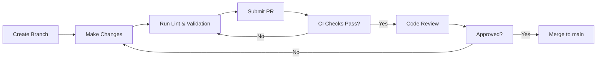

# Contributing to CSA-in-a-Box

> [!NOTE]
> **Quick Summary**: This guide covers development setup, repository rules, code style conventions (Bicep, PowerShell, Python), the PR process, branch naming, and how to report issues. Follow the checklist below for a smooth contribution experience.

Thank you for your interest in contributing to Cloud-Scale Analytics in-a-Box.

---

## 📑 Table of Contents

- [🚀 Development Setup](#-development-setup)
- [⚠️ Repository Rules](#️-repository-rules)
- [💡 Code Style](#-code-style)
- [🤝 Pull Request Process](#-pull-request-process)
- [🏷️ Branch Naming](#️-branch-naming)
- [🔧 Reporting Issues](#-reporting-issues)
- [🔗 Related Documentation](#-related-documentation)

---

## 🚀 Development Setup

### 📎 Prerequisites

- [ ] Azure CLI >= 2.50.0
- [ ] Bicep CLI >= 0.25
- [ ] PowerShell 7.3+ with Az module
- [ ] Python 3.10+
- [ ] Git 2.40+

### Development Commands

```bash
make test              # Run unit tests with pytest (80% coverage gate)
make test-e2e          # Run end-to-end tests (offline, DuckDB)
make lint              # Run ruff linter
make lint-fix          # Auto-fix lint issues
make typecheck         # Run mypy type checking
make security          # Run bandit security scan
make validate          # Validate Bicep templates
make clean             # Clean build artifacts
```

Coverage is enforced at 80% via `pytest --cov` with `fail_under=80`. Run `make test` locally before submitting PRs.

The project uses ruff with a line length of 120 characters (not PEP 8's default 79).

### 📦 Installation

1. Clone the repository:

    ```bash
    git clone <CLONE_URL>
    cd csa-inabox
    ```

2. Set up Python environment (for scripts/dbt):

    ```bash
    make setup            # Linux/Mac
    make setup-win        # Windows
    ```

    This creates a `.venv`, activates it, and installs all dev dependencies
    from `pyproject.toml`. To activate the venv manually afterwards:

    ```bash
    source .venv/bin/activate  # Linux/Mac
    .venv\Scripts\activate     # Windows
    ```

3. Install pre-commit hooks:
    ```bash
    pre-commit install
    ```
    This enables automatic linting, formatting, and secret detection on every commit.

---

## ⚠️ Repository Rules

### Never Commit

> [!CAUTION]
> The following must **never** be committed to the repository:

- Passwords, API keys, SAS tokens, or connection strings
- `local.settings.json` files
- Python virtual environments (`.venv/`, `venv/`, `dbt-env/`)
- `node_modules/` directories
- Binary artifacts (JARs, compiled binaries)
- IDE-specific secrets or user settings
- Azure subscription IDs in parameter files (use `params.template.json` instead)

### Always Do

> [!TIP]
> Follow these practices for every contribution:

- Use `params.template.json` with placeholder values for committed configs
- Run `bicep lint` before submitting Bicep changes
- Add `Try/Catch` error handling in PowerShell scripts
- Parameterize all environment-specific values
- Test deployments with `--what-if` before applying
- Strip notebook outputs before committing (`nbstripout`)

---

## 💡 Code Style

### Bicep

- Use camelCase for parameters and variables
- Use PascalCase for resource symbolic names
- Add `@description()` decorators to all parameters
- Add `@minLength()` / `@maxLength()` / `@allowed()` constraints where applicable
- Use modules for reusable components

### PowerShell

- Use `Set-StrictMode -Version Latest` at the top
- Use `$ErrorActionPreference = 'Stop'`
- Wrap operations in `Try/Catch` blocks
- Use `-WhatIf` support for destructive operations
- Use approved verbs (Get-, Set-, New-, Remove-)

### Python

- Follow PEP 8 with a line length of 120 characters (enforced by ruff)
- Use type hints
- Use `pathlib.Path` for file operations
- Add docstrings to all public functions

---

## 🤝 Pull Request Process



### Contribution Checklist

- [ ] Create a feature branch from `main`
- [ ] Make your changes following the code style guidelines
- [ ] Run linting and validation locally
- [ ] Submit a PR with a clear description of changes
- [ ] Ensure CI checks pass
- [ ] Get at least one approval before merging

### Required Status Checks and `--admin` Merge Override

The `main` branch has 11 required status checks (Python Lint, Python
Tests on 3.10/3.11/3.12, Bicep Lint, IaC Security Scan, Validate &
Scan, Vertical Conformance, Validate Data Contracts, dbt Compile, dbt
Integration, jest, Repo Hygiene, Secret Scan, PowerShell Lint,
Validate Cookiecutter Template, Trivy, CodeQL Analysis). All must be
green before a PR can be merged.

GitHub admins can technically bypass this with `gh pr merge --admin`.
**This is reserved for the following narrow scenarios** and every use
must be documented in the PR description:

1. **Pre-existing red checks unrelated to the PR** -- e.g., a brownfield
   bicep CVE that has been failing on `main` for weeks and is being
   tracked in a separate issue. Verify with
   `gh run list --branch main --workflow <name>` that the failure
   predates the PR.
2. **Self-approval blocks** -- GitHub forbids approving your own PR.
   For solo-maintainer hotfixes that are otherwise green, `--admin`
   may stand in for the second reviewer. Do NOT use this to bypass
   actual code review on substantive changes.
3. **CI infrastructure outages** -- e.g., GitHub Actions runners are
   down and you need to merge a documented hotfix. Re-run the checks
   on `main` once the outage clears.

**Do NOT use `--admin`** to bypass:

- A failing test that is actually caused by your changes
- A new lint violation introduced by your PR
- A security scan finding in code you added
- A reviewer's blocking change-request

If you find yourself reaching for `--admin` for any other reason, stop
and fix the underlying problem instead.

---

## 🏷️ Branch Naming

| Prefix     | Purpose                | Example                        |
| ---------- | ---------------------- | ------------------------------ |
| `feature/` | New features           | `feature/add-streaming-domain` |
| `fix/`     | Bug fixes              | `fix/inventory-turnover-sql`   |
| `infra/`   | Infrastructure changes | `infra/nsg-outbound-rules`     |
| `docs/`    | Documentation updates  | `docs/update-quickstart`       |

---

## 🔧 Reporting Issues

Use GitHub Issues with the appropriate template. Include:

- [ ] Environment details (subscription type, region)
- [ ] Steps to reproduce
- [ ] Expected vs actual behavior
- [ ] Relevant logs or error messages

---

## 🔗 Related Documentation

| Document                  | Description                        |
| ------------------------- | ---------------------------------- |
| [README](README.md)       | Project overview and quick start   |
| [Changelog](CHANGELOG.md) | All notable changes to the project |
