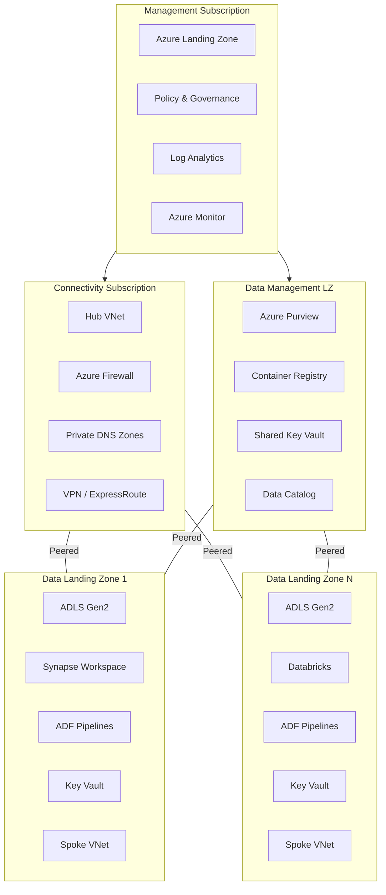

# CSA-in-a-Box: Cloud-Scale Analytics Platform


> CSA-in-a-Box is an Azure-native reference implementation of the Microsoft
> "Unify your data platform" guidance, built entirely on Azure PaaS services and
> open-source tooling. It delivers Data Mesh, Data Fabric, and Data Lakehouse
> capabilities today in Azure Government (where Microsoft Fabric is forecast,
> not yet GA) and in Azure Commercial when a composable, Bicep-deployable,
> FedRAMP-aligned stack is preferred. Components compose cleanly into a future
> Fabric migration.

> [!NOTE]
> **Quick Summary**: CSA-in-a-Box is a Fabric-parity reference stack on Azure PaaS — Delta Lake on ADLS Gen2 with medallion architecture, domain-oriented Data Mesh ownership, Purview-based governance, Spark/Databricks compute, ADF pipelines, real-time streaming, AI/ML, and full observability, deployed as IaC with Bicep across 4 subscriptions. Use it as the Gov gap-filler until Fabric is GA, as the Commercial reference for the "Unify your data platform" CAF guidance (post-deprecation of the old Cloud-Scale Analytics scenario), and as an incremental on-ramp to Microsoft Fabric.

---

## 📑 Table of Contents

- [📋 What Is This?](#-what-is-this)
- [🧭 Use Fabric if… Use this if…](#-use-fabric-if-use-this-if)
- [🏗️ Architecture](#️-architecture)
- [🏗️ Subscription Layout (4 Subscriptions)](#️-subscription-layout-4-subscriptions)
- [📁 Repository Structure](#-repository-structure)
- [📎 Prerequisites](#-prerequisites)
- [🚀 Quick Start](#-quick-start)
- [⚙️ Configuration](#️-configuration)
- [✨ Data Platform Components](#-data-platform-components)
- [🔒 Security](#-security)
- [🤝 Contributing](#-contributing)
- [📄 License](#-license)
- [🔗 Related Resources](#-related-resources)
- [🔗 Related Documentation](#-related-documentation)

---

## 📋 What Is This?

CSA-in-a-Box is a Bicep-deployable reference implementation of the Microsoft
"Unify your data platform" Cloud Adoption Framework guidance. It assembles
Azure PaaS primitives and open-source tooling into an opinionated, end-to-end
data platform that reaches Fabric-equivalent capability **today**, in the
clouds where Fabric is not yet GA, and composes cleanly into a future Fabric
migration for workloads that will eventually move.

It serves three roles in the 2026 Azure data-platform landscape:

1. **Azure Government gap-filler.** Microsoft Fabric is forecast — not GA — in
   Azure Government as of April 2026. This repo ships the Fabric-parity stack
   (lakehouse, mesh, streaming, AI/ML, governance) on Azure PaaS services that
   *are* available in Gov (IL4/IL5) today.
2. **CAF "Unify your data platform" reference.** The CAF Cloud-Scale Analytics
   scenario was deprecated in April 2026 in favor of Fabric-first guidance. For
   teams who still need an end-to-end Bicep reference that is not yet a Fabric
   workspace, CSA-in-a-Box fills that gap.
3. **Incremental on-ramp to Microsoft Fabric.** Every capability below maps to
   a Fabric equivalent. Teams that start here can migrate a workload at a time
   into Fabric as Gov availability lands or as Commercial procurement fits.

Capability coverage:

| Capability | Description | Microsoft Fabric equivalent |
|---|---|---|
| **Data Lakehouse** | Delta Lake on ADLS Gen2 with medallion architecture (Bronze/Silver/Gold) | OneLake + Lakehouse |
| **Data Mesh** | Domain-oriented data ownership with self-serve infrastructure | Workspaces + Domains |
| **Data Fabric** | Unified metadata layer with automated governance via Azure Purview | OneLake Catalog + Purview integration |
| **Data Engineering** | Apache Spark on Synapse/Databricks with dbt transformations | Fabric Data Engineering (Spark) |
| **Data Integration** | Azure Data Factory / Synapse Pipelines for ETL/ELT | Fabric Data Factory |
| **Data Warehousing** | Synapse Dedicated SQL Pools and Serverless SQL | Fabric Warehouse |
| **Real-Time Analytics** | Azure Data Explorer + Event Hubs streaming | Real-Time Intelligence (Eventhouse / KQL DB) |
| **AI/ML** | Azure Machine Learning + Azure OpenAI integration | Fabric Data Science + Copilot |
| **Data Governance** | Microsoft Purview for cataloging, classification, and lineage | OneLake Catalog (Purview-powered) |
| **Observability** | Log Analytics + Azure Monitor + custom KQL dashboards | Fabric Monitoring Hub |

---

## 🧭 Use Fabric if… Use this if…

CSA-in-a-Box is **not** a blanket substitute for Microsoft Fabric. For most
Azure Commercial greenfield workloads where Fabric is GA in the region,
Fabric is the right answer. Use this decision table to pick the right tool:

| Use Microsoft Fabric if… | Use CSA-in-a-Box if… |
|---|---|
| Workload is on Azure Commercial and Fabric is GA in your region | Workload is on Azure Government (IL4/IL5) — Fabric is forecast, not GA |
| Team prefers a unified SaaS control plane over composed Bicep modules | Team requires Bicep/Terraform IaC, controlled deployments, explicit Azure Policy enforcement |
| Simplicity and managed OneLake are higher priority than control | Composability and Azure PaaS primitives (ADLS Gen2, Databricks, Synapse, Purview, Power BI) are higher priority than a single pane of glass |
| Preview features are an asset (Data Activator, Fabric Copilot) | Production-stable services and a conservative roll-out pace are required |
| Commercial-only workloads OR you are starting greenfield with Fabric | Federal / regulated / tribal workloads subject to FedRAMP High, CMMC 2.0 L2, or HIPAA (see `csa_platform/csa_platform/governance/compliance/`) |
| F-SKU reserved capacity cost model fits your procurement | Consumption-based Azure metering + reserved instances fit your procurement |

For the detailed selection logic, see the
[`fabric-vs-databricks-vs-synapse` decision tree](decision-trees/fabric-vs-databricks-vs-synapse/),
[ADR-0010 (positioning)](docs/adr/ADR-0010-positioning.md), and the
Palantir migration playbook in [`docs/migrations/`](docs/migrations/).

---

## 🏗️ Architecture



---

## 🏗️ Subscription Layout (4 Subscriptions)

| Subscription | Purpose | Key Resources |
|---|---|---|
| **Management** | Platform governance, logging, monitoring | Log Analytics, Azure Monitor, Policy Assignments |
| **Connectivity** | Hub networking, DNS, firewall | Hub VNet, Azure Firewall, Private DNS Zones, VPN Gateway |
| **Data Management (DMLZ)** | Shared data services, governance | Purview, Container Registry, Shared Key Vault |
| **Data Landing Zone (DLZ)** | Domain data workloads | ADLS Gen2, Synapse, Databricks, ADF, Domain Key Vault |

---

## 📁 Repository Structure

```text
📁 csa-inabox/
├── 📁 deploy/bicep/               # Infrastructure-as-Code
│   ├── 📁 DLZ/                    # Data Landing Zone modules
│   ├── 📁 DMLZ/                   # Data Management Landing Zone
│   └── 📁 landing-zone-alz/       # Azure Landing Zone foundation
├── 📁 domains/                    # Domain-oriented data mesh
│   ├── 📁 finance/                # Finance domain (aging reports, revenue reconciliation)
│   ├── 📁 inventory/              # Inventory domain (turnover, reorder alerts, warehouses)
│   ├── 📁 sales/                  # Sales domain (sales metrics, order analytics)
│   ├── 📁 shared/                 # Shared domain (customers, orders, products, CLV)
│   ├── 📁 dlz/                    # Data Landing Zone examples
│   └── 📁 spark/                  # Spark configurations & libraries
├── 📁 scripts/                    # Operations & management scripts
├── 📁 csa_platform/               # Platform modules
│   ├── 📁 ai_integration/        # AI/ML integration services
│   ├── 📁 data_activator/        # Data activator triggers & actions
│   ├── 📁 data_marketplace/      # Data product marketplace
│   ├── 📁 metadata_framework/    # Metadata management framework
│   ├── 📁 purview_governance/    # Purview automation & governance
│   └── 📁 functions/             # Consolidated Azure Functions (validation, aiEnrichment, eventProcessing, secretRotation)
├── 📁 portal/                     # Web portal (FastAPI backend + 3 UI frontends: React, AKS/K8s, PowerApps)
├── 📁 cli/                        # Platform CLI (sibling of portal UIs; shares the portal/shared/api backend)
├── 📁 governance/                 # Data governance framework
│   ├── 📁 common/                 # Shared logging, validation utilities
│   ├── 📁 contracts/              # Data contracts & enforcement
│   ├── 📁 dataquality/            # Quality rules, Great Expectations runner
│   └── 📁 finops/                 # FinOps budget alerts (Bicep)
├── 📁 docs/                       # Platform documentation
│   └── 📁 runbooks/               # Incident response & DR runbooks
├── 📁 tests/                      # pytest test suite (80% coverage gate — see note below)
├── 📁 tools/                      # Development tools
│   └── 📁 dbt/                    # dbt for data transformations
└── 📁 .github/                    # CI/CD workflows
```

> [!NOTE]
> **Coverage gate scope (CSA-0088).** The `fail_under = 80` gate in
> `pyproject.toml` applies to `governance/` (common, dataquality, contracts)
> and the Azure Functions packages under `csa_platform/functions/`.
> `csa_platform/` (broad) and `portal/shared/api/` are **measured** in the
> coverage report so the true gap is visible, but they are **not** yet
> gated — their suites are still growing. Do not raise `fail_under` until
> those packages have real parity tests.

---

## 📎 Prerequisites

| Tool | Minimum Version |
|---|---|
| Azure CLI | >= 2.50.0 |
| Bicep CLI | >= 0.25 |
| PowerShell | >= 7.3 with Az module >= 11.0 |
| Python | >= 3.10 (for scripts and dbt) |
| Git | >= 2.40 |

> [!IMPORTANT]
> You will need **4 Azure subscriptions** with Owner or Contributor access, and a **Microsoft Entra ID** account with Global Admin or Privileged Role Administrator permissions for initial setup.

---

## 🚀 Quick Start

See [QUICKSTART.md](docs/QUICKSTART.md) for the complete setup guide, including
infrastructure deployment, sample data loading, dbt pipeline execution, and
expected row counts for every model.

> [!NOTE]
> **Cloning the repository**: throughout the documentation the placeholder `<CLONE_URL>`
> is used in `git clone` commands. Replace `<CLONE_URL>` with your appropriate
> internal-fork or upstream repository URL per Contoso policy (for example,
> `git clone https://github.com/<org>/csa-inabox.git`).

---

## ⚙️ Configuration

All environment-specific values are externalized to parameter files:

| Parameter File | Purpose |
|---|---|
| `params.template.json` | Template with placeholder values (committed) |
| `params.dev.json` | Development environment (not committed) |
| `params.test.json` | Test environment (not committed) |
| `params.prod.json` | Production environment (not committed) |

> [!CAUTION]
> **Never commit parameter files with real subscription IDs, secrets, or environment-specific values.**

---

## ✨ Data Platform Components

### 🗄️ Data Lakehouse (Delta Lake)
- ADLS Gen2 storage with hierarchical namespace
- Medallion architecture: Raw (Bronze) -> Curated (Silver) -> Enriched (Gold)
- Delta Lake format for ACID transactions and time travel

### 🏗️ Data Mesh Domains
- Self-serve data infrastructure per domain
- Domain-specific Synapse/Databricks workspaces
- Data products registered in Purview catalog
- Federated governance via Azure Policy

### 🔄 Data Integration
- Azure Data Factory for batch ETL/ELT pipelines
- Synapse Pipelines for integrated data flows
- Event Hubs for real-time data streaming
- Self-Hosted Integration Runtime for on-premises connectivity

### 🔒 Data Governance
- Microsoft Purview for data cataloging and classification
- Automated data lineage tracking
- Sensitivity labeling and access policies
- Data quality monitoring

### 📊 Observability
- Log Analytics workspace with custom KQL queries
- Diagnostic settings for all deployed resources
- Azure Monitor alerts and dashboards
- Spark/Databricks job monitoring

---

## 🔒 Security

| Control | Description |
|---|---|
| **Zero-trust networking** | Private endpoints for all data services |
| **Managed identities** | No passwords or keys in code |
| **RBAC** | Role-based access control with least privilege |
| **Encryption** | TLS 1.2 minimum, encryption at rest with platform keys |
| **Key Vault** | Centralized secret management per domain |
| **Azure Policy** | Compliance enforcement and drift detection |
| **Defender for Cloud** | Threat detection and security posture |

---

## 🤝 Contributing

See [CONTRIBUTING.md](CONTRIBUTING.md) for development guidelines, coding standards, and the pull request process.

---

## 📄 License

This project is licensed under the MIT License -- see the [LICENSE](LICENSE) file for details.

---

## 🔗 Related Resources

- [Azure Cloud-Scale Analytics](https://learn.microsoft.com/azure/cloud-adoption-framework/scenarios/cloud-scale-analytics/)
- [Azure Landing Zones](https://learn.microsoft.com/azure/cloud-adoption-framework/ready/landing-zone/)
- [Data Mesh Architecture](https://learn.microsoft.com/azure/cloud-adoption-framework/scenarios/cloud-scale-analytics/architectures/data-mesh-pattern)
- [Azure Well-Architected Framework](https://learn.microsoft.com/azure/well-architected/)

---

## 🔗 Related Documentation

| Document | Description |
|---|---|
| [Getting Started](docs/GETTING_STARTED.md) | Prerequisites and deployment walkthrough |
| [Quick Start](docs/QUICKSTART.md) | 60-minute hands-on tutorial |
| [Architecture](docs/ARCHITECTURE.md) | Comprehensive architecture reference |
| [Contributing](CONTRIBUTING.md) | Development guidelines and PR process |
| [Changelog](CHANGELOG.md) | All notable changes to the project |
