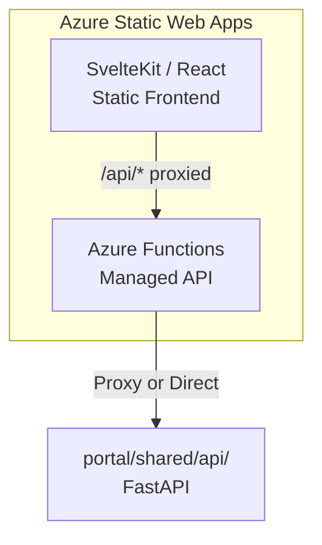

[← Portal Implementations](../README.md)

# Azure Static Web Apps + Functions Portal

> **Last Updated:** 2026-04-15 | **Status:** Active | **Audience:** Frontend Developers

> [!NOTE]
> **TL;DR:** The cheapest portal option — SvelteKit/React frontend on Azure Static Web Apps with Azure Functions API backend. Free tier available ($0/month), built-in Azure AD auth, global CDN, PR-based preview environments, and GitHub Actions CI/CD. Available in Azure Government.

A lightweight, cost-effective data onboarding portal using Azure Static Web Apps
for the frontend and Azure Functions for the API. This is the simplest
deployment option with built-in CI/CD from GitHub.

## Table of Contents

- [Architecture](#architecture)
- [Why Static Web Apps?](#why-static-web-apps)
- [Quick Start](#quick-start)
- [Project Structure](#project-structure)
- [SWA Configuration](#swa-configuration)
- [Deployment](#deployment)
- [Azure Government](#azure-government)
- [Cost Comparison](#cost-comparison)
- [Related Documentation](#related-documentation)

---

## 🏗️ Architecture



---

## ✨ Why Static Web Apps?

| Feature | Benefit |
|---|---|
| Free tier available | $0/month for hobby or testing |
| Global CDN | Fast load times worldwide |
| Built-in auth | Azure AD, GitHub, Twitter OOTB |
| CI/CD from GitHub | Auto-deploy on push |
| Custom domains + TLS | Free SSL certificates |
| API integration | Azure Functions co-deployed |
| Preview environments | PR-based staging deployments |
| Gov support | Available in Azure Government |

---

## 🚀 Quick Start

```bash
cd portal/static-webapp

# Install dependencies
npm install

# Start dev server (frontend + API)
npx swa start http://localhost:5173 --api-location api

# Or with the SvelteKit dev server
npm run dev
```

---

## 📁 Project Structure

```text
portal/static-webapp/
├── README.md
├── package.json
├── staticwebapp.config.json    # SWA routing and auth config
├── svelte.config.js            # SvelteKit configuration
├── vite.config.js              # Vite bundler config
├── src/
│   ├── app.html                # HTML shell
│   ├── app.css                 # Global styles (Tailwind)
│   ├── lib/
│   │   ├── api.ts              # API client
│   │   ├── auth.ts             # Azure AD auth helpers
│   │   └── types.ts            # TypeScript types
│   └── routes/
│       ├── +layout.svelte      # App shell with nav
│       ├── +page.svelte        # Dashboard
│       ├── sources/
│       │   ├── +page.svelte    # Source list
│       │   └── register/
│       │       └── +page.svelte # Registration wizard
│       ├── marketplace/
│       │   └── +page.svelte    # Data marketplace
│       └── access/
│           └── +page.svelte    # Access requests
├── api/                         # Azure Functions API
│   ├── host.json
│   ├── package.json
│   ├── health/
│   │   ├── function.json
│   │   └── index.ts
│   ├── sources/
│   │   ├── function.json
│   │   └── index.ts
│   └── marketplace/
│       ├── function.json
│       └── index.ts
└── deploy/
    └── swa-deploy.yml          # GitHub Actions workflow
```

---

## ⚙️ SWA Configuration

```json
{
  "routes": [
    {
      "route": "/api/*",
      "allowedRoles": ["authenticated"]
    },
    {
      "route": "/sources/register",
      "allowedRoles": ["data_steward", "admin"]
    },
    {
      "route": "/access/*/approve",
      "allowedRoles": ["data_owner", "admin"]
    }
  ],
  "auth": {
    "identityProviders": {
      "azureActiveDirectory": {
        "registration": {
          "openIdIssuer": "https://login.microsoftonline.com/<TENANT_ID>/v2.0",
          "clientIdSettingName": "AAD_CLIENT_ID",
          "clientSecretSettingName": "AAD_CLIENT_SECRET"
        }
      }
    }
  },
  "responseOverrides": {
    "401": {
      "redirect": "/.auth/login/aad",
      "statusCode": 302
    }
  },
  "navigationFallback": {
    "rewrite": "/index.html",
    "exclude": ["/api/*", "/_framework/*"]
  },
  "globalHeaders": {
    "X-Content-Type-Options": "nosniff",
    "X-Frame-Options": "DENY",
    "Content-Security-Policy": "default-src 'self'; script-src 'self' 'unsafe-inline'; style-src 'self' 'unsafe-inline'"
  }
}
```

---

## 📦 Deployment

### Via SWA CLI

```bash
# Build the frontend
npm run build

# Deploy
npx swa deploy \
  --app-location build \
  --api-location api \
  --deployment-token $SWA_DEPLOYMENT_TOKEN
```

### 🔄 Via GitHub Actions

```yaml
name: Deploy Static Web App
on:
  push:
    branches: [main]
    paths: ['portal/static-webapp/**']
  pull_request:
    paths: ['portal/static-webapp/**']

jobs:
  deploy:
    runs-on: ubuntu-latest
    steps:
      - uses: actions/checkout@v4
      - uses: Azure/static-web-apps-deploy@v1
        with:
          azure_static_web_apps_api_token: ${{ secrets.SWA_TOKEN }}
          repo_token: ${{ secrets.GITHUB_TOKEN }}
          action: upload
          app_location: portal/static-webapp
          api_location: portal/static-webapp/api
          output_location: build
```

---

## 🔒 Azure Government

Static Web Apps is available in Azure Government:

```bash
# Deploy to Gov
az staticwebapp create \
  --name csa-portal \
  --resource-group rg-csa-portal \
  --location usgovvirginia \
  --sku Standard

# Update auth for Gov
# Use login.microsoftonline.us as the OpenID issuer
```

---

## 💡 Cost Comparison

| Tier | Monthly Cost | Features |
|---|---|---|
| Free | $0 | 100 GB bandwidth, 2 custom domains, built-in auth |
| Standard | ~$9/month | 100 GB, custom auth, SLA 99.95% |

> [!TIP]
> This is the most cost-effective portal option for small to medium deployments.

---

## 🔗 Related Documentation

- [Portal Implementations](../README.md) — Portal implementation index
- [Shared Backend](../shared/README.md) — Shared backend API
- [Architecture](../../docs/ARCHITECTURE.md) — Overall system architecture
