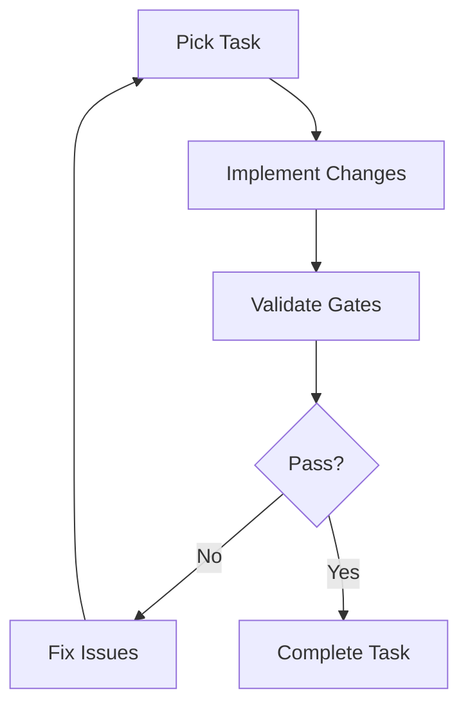

# CSA-in-a-Box Agent Harness — Ralph Loop

> **Last Updated:** 2026-04-15 | **Status:** Active | **Audience:** Developers

## Table of Contents

- [Overview](#-overview)
- [How It Works](#-how-it-works)
- [Task Lifecycle](#-task-lifecycle)
- [Validation Gates](#-validation-gates)
- [Integration Points](#-integration-points)
- [Configuration](#-configuration)
- [Archon Project](#-archon-project)
- [Related Documentation](#-related-documentation)

---

## 📋 Overview

The Ralph loop is an autonomous agent harness for iterative implementation, testing, and validation of the CSA-in-a-Box platform. It follows a task-driven development cycle where agents pick up Archon tasks, implement changes, validate them through automated gates, and iterate until validation passes.

---

## 🏗️ How It Works

---

## 🔄 Task Lifecycle

1. **Pick Task**: Query Archon for next `todo` task in the CSA project
2. **Mark Doing**: Update task status to `doing` in Archon
3. **Implement**: Make code changes following the task description
4. **Validate**: Run validation gates (see below)
5. **Fix/Iterate**: If validation fails, fix issues and re-validate (max 3 iterations)
6. **Complete**: Mark task as `done`, commit changes, pick next task
7. **Escalate**: If max iterations reached, mark for human review

---

## 🧪 Validation Gates

Located in `agent-harness/gates/`:

| Gate | Script | Runs When |
|------|--------|-----------|
| Bicep Lint | `validate-bicep.ps1` | Any `.bicep` file changed |
| Python Lint | `validate-python.ps1` | Any `.py` file changed |
| dbt Compile | `validate-dbt.ps1` | Any dbt model changed |
| Deployment | `validate-deployment.ps1` | Infrastructure changes |
| All Gates | `validate-all.ps1` | Always (orchestrator) |

---

## 🔌 Integration Points

- **Archon MCP**: Task management, project tracking, document storage
- **GitHub Actions**: CI/CD pipeline execution
- **Azure**: `az deployment what-if` for deployment validation
- **Bicep CLI**: Template compilation and linting
- **ruff**: Python linting
- **dbt**: Data model compilation and testing

---

## ⚙️ Configuration

See `agent-harness/config.yaml` for loop settings:
- Max iterations per task
- Validation gate mappings
- Human review triggers
- Escalation rules

---

## 📋 Archon Project

Project ID: `1bd59749-db0a-4009-82c7-f1a56d24a820`

Query tasks: `find_tasks(filter_by="project", filter_value="1bd59749-db0a-4009-82c7-f1a56d24a820")`

---

## 🔗 Related Documentation

- [Architecture Overview](../docs/ARCHITECTURE.md) — Platform architecture reference
- [Getting Started](../docs/GETTING_STARTED.md) — Platform setup and onboarding
- [Contributing](../CONTRIBUTING.md) — Development guidelines and PR process
