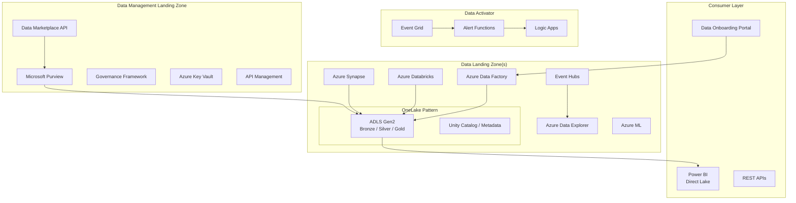

# Platform Components — Fabric-in-a-Box

> [!NOTE]
> **TL;DR:** This directory contains 10 core platform components that replicate Microsoft Fabric functionality using Azure PaaS services and open-source tooling, designed for Azure Government where Fabric is not yet available.

This directory contains the **core platform capabilities** that replicate Microsoft Fabric
functionality using Azure PaaS services and open-source tooling.

> **Why this exists:** Microsoft Fabric is not yet available in Azure Government (status:
> "Forecasted" as of April 2026). These components provide Fabric-equivalent capabilities
> using services that ARE available in Azure Government today — ADLS Gen2, Databricks,
> Synapse, ADF, Event Hubs, Purview, and Azure ML.

## Table of Contents

- [Components](#components)
- [Architecture](#architecture)
- [Quick Start](#quick-start)
- [Azure Government Compatibility](#azure-government-compatibility)
- [Related Documentation](#related-documentation)

---

## ✨ Components

| Component | Fabric Equivalent | Description |
|---|---|---|
| [unity-catalog-pattern](unity_catalog_pattern/) | OneLake (conceptual) | Unified data lake using ADLS Gen2 + Databricks Unity Catalog (renamed from `onelake_pattern/` in CSA-0132) |
| [data-activator](data_activator/) | Data Activator | Event-driven alerting with Logic Apps + Event Grid + Functions |
| [semantic-model](semantic_model/) | Direct Lake (conceptual) | Power BI semantic models over Databricks SQL warehouses (renamed from `direct_lake/` in CSA-0132) |
| [data_marketplace](data_marketplace/) | Data Sharing / Marketplace | Self-service data product discovery, access request, quality tracking |
| [governance](governance/) | Purview Integration | Automated classification, lineage, MDM, sensitivity labels |
| [multi-synapse](multi_synapse/) | Multi-workspace | Shared Synapse environment with per-org isolation (legacy / migration-only — see `csa_platform/multi_synapse/README.md`; CSA-0139) |
| [metadata-framework](metadata_framework/) | Data Factory (metadata-driven) | Auto-generate pipelines from source registration metadata |
| [ai_integration](ai_integration/) | Copilot / AI | RAG primitives (chunk/embed/retrieve/generate). Product surface in `apps/copilot/` — see capability matrix in [`ai_integration/README.md`](ai_integration/README.md#capability-matrix) (CSA-0114). |
| [functions](functions/) | Shared Functions | Consolidated Azure Functions (validation, aiEnrichment, eventProcessing, secretRotation) |
| [oss-alternatives](oss_alternatives/) | N/A (Gov gaps) | Open-source alternatives for Gov-unavailable services |

---

## 🏗️ Architecture

---

## 🚀 Quick Start

1. Deploy the base infrastructure using the main `deploy/` templates
2. Configure the OneLake pattern for your domain structure
3. Register data sources via the metadata framework
4. Set up governance rules and classifications
5. Deploy the data marketplace for self-service discovery

---

## 🔒 Azure Government Compatibility

All platform components are designed to work in both Azure Commercial and Azure Government.
See [deploy/bicep/gov/](../deploy/bicep/gov/) for Government-specific templates and
[oss_alternatives/](oss_alternatives/) for open-source replacements where needed.

---

## 🔗 Related Documentation

- [Platform Services](../docs/PLATFORM_SERVICES.md) — Detailed platform service descriptions
- [Architecture](../docs/ARCHITECTURE.md) — Overall system architecture
