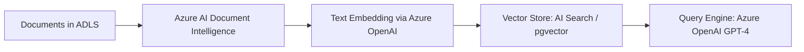
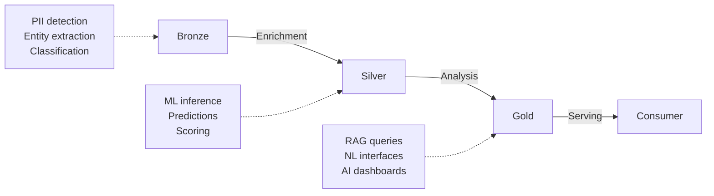

[← Platform Components](../README.md)

# AI Integration — Data Landing Zone AI Enrichment


> [!NOTE]
> **TL;DR:** Provides patterns for integrating Azure AI services (OpenAI, AI Search, ML, Document Intelligence) with CSA-in-a-Box data landing zones for enrichment, classification, RAG, embeddings, and model serving — all GA in Azure Government.

> [!IMPORTANT]
> **Scope clarification (CSA-0114).** The library under this tree ships
> production-grade primitives (chunking, embedding, retrieval,
> generation, content-safety hooks). It is **not** a turnkey AI
> product. The downstream product surface — the CSA Copilot
> (`apps/copilot/`) — provides the agent loop, skill catalog, evals,
> and UI. See the capability matrix below and `apps/copilot/README.md`
> for what the product ships today.

## Capability matrix

| Capability | Status | Notes |
|---|---|---|
| Chunking (markdown, code, generic) | ✅ Library | `rag/chunker.py` |
| Embedding (Azure OpenAI, sync + async) | ✅ Library | `rag/indexer.py` with async credential lifecycle (CSA-0106) |
| Retrieval (Azure AI Search) | ✅ Library | `rag/retriever.py` |
| Generation (Azure OpenAI chat) | ✅ Library | `rag/generate.py` |
| Grounding gate + refusal contract | ✅ Library | Covered in `apps/copilot/` surfaces |
| Evaluation harness | ⚠️ Partial | See `apps/copilot/evals/` |
| Decision-tree walker skill | ⚠️ Partial | See `apps/copilot/skills/` |
| MCP server | ⚠️ Partial | See `apps/copilot/mcp_server/` |
| Document Intelligence (PDF/DOCX/ipynb) | 🛑 Tracked by CSA-0097 | Duplicate code path in `domains/sharedServices` |
| Azure AI Foundry hub/project Bicep | 🛑 Tracked by CSA-0104 | Not yet wired |
| Content safety pre/post filters | 🛑 Tracked by CSA-0112 | Partial — Bicep floor only |
| Conversation memory (Cosmos-backed) | 🛑 Tracked by CSA-0116 | Design only |

Legend: ✅ production-ready · ⚠️ partial / in flight · 🛑 planned, finding tracked.

## Azure OpenAI Capability Summary

| Category | Implemented | Available | Out of Scope |
|----------|-------------|-----------|--------------|
| Embeddings | 5 features | 2 features | 0 |
| Chat Completions | 3 features | 6 features | 0 |
| Assistants API | 0 | 0 | 4 features |
| Batch API | 0 | 1 feature | 1 feature |
| Fine-Tuning | 0 | 0 | 2 features |
| On Your Data | 1 feature | 2 features | 0 |
| Content Safety | 0 | 1 feature (CSA-0112) | 1 feature |

> **Full details:** See [CAPABILITY_MATRIX.md](./CAPABILITY_MATRIX.md) for complete feature-by-feature breakdown with status, models, modules, and configuration.

### Design Decisions

- **RAG over Fine-Tuning**: Domain knowledge is injected via retrieval-augmented generation rather than fine-tuning, enabling dynamic updates without retraining.
- **Semantic Kernel over Assistants API**: Tutorial code under `examples/ai-agents/` shows agent orchestration with Semantic Kernel for plugin composition and multi-agent workflows. (The previous `csa_platform.ai_integration.semantic_kernel` subpackage was removed on 2026-04-24 -- see [SEMANTIC_KERNEL_REMOVED.md](./SEMANTIC_KERNEL_REMOVED.md).)
- **Custom RAG over On Your Data**: Purpose-built pipeline (chunking → embedding → retrieval → reranking → generation) provides more control than the built-in Azure OpenAI On Your Data feature.

## Table of Contents

- [Capabilities](#capabilities)
- [Directory Structure](#directory-structure)
- [Integration with Data Landing Zones](#integration-with-data-landing-zones)
- [Azure Government](#azure-government)
- [Quick Start](#quick-start)
- [Related Documentation](#related-documentation)

This directory provides patterns for integrating Azure AI services with the
CSA-in-a-Box data platform. Every data landing zone can leverage AI for
enrichment, classification, and analysis.

---

## ✨ Capabilities

### 🔌 1. RAG Pattern — Document Intelligence

Retrieve-Augment-Generate over your data lake:



**Use Cases:**
- Query regulatory documents in natural language
- Search across unstructured data in the data lake
- Auto-generate data documentation from schema metadata

### 🗄️ 2. Embeddings Pipeline

Convert any text data to vector embeddings for similarity search:

```python
# Embedding pipeline configuration
embedding_config:
  model: text-embedding-3-small
  dimensions: 1536
  batch_size: 100
  source: adls://silver/documents/
  target: ai-search-index or pgvector
```

### ⚡ 3. AI-Enriched Data Pipelines

Inject AI capabilities into your ADF/Databricks pipelines:

| Enrichment | Azure Service | Input | Output |
|---|---|---|---|
| Entity Extraction | Azure AI Language | Text fields | Extracted entities (JSON) |
| Classification | Azure OpenAI | Records | Category labels |
| Summarization | Azure OpenAI | Long text | Summaries |
| Translation | Azure AI Translator | Multi-language | English |
| PII Detection | Azure AI Language | Any text | PII locations + redacted |
| Sentiment | Azure AI Language | Customer feedback | Sentiment scores |
| Anomaly Detection | Azure AI Anomaly Detector | Time series | Anomaly flags |

### 🔌 4. Model Serving

Deploy ML models as Azure ML endpoints per data domain:

```text
┌─────────────────────────────────────────────────────┐
│                Azure ML Workspace                    │
│                                                      │
│  ┌─────────────┐  ┌─────────────┐  ┌─────────────┐ │
│  │ USDA Models  │  │ DOT Models  │  │ EPA Models  │ │
│  │ - Crop Yield │  │ - Crash     │  │ - AQI       │ │
│  │ - Food Safety│  │   Severity  │  │   Forecast  │ │
│  │ - SNAP Pred. │  │ - Infra     │  │ - Water     │ │
│  │              │  │   Priority  │  │   Quality   │ │
│  └──────┬───────┘  └──────┬──────┘  └──────┬──────┘ │
│         └────────────┬─────┘               │         │
│                      │                      │         │
│              ┌───────┴──────────────────────┘        │
│              │    Azure ML Endpoints                  │
│              │    (Managed Online Endpoints)          │
│              └───────────────────────────────────────┘│
└──────────────────────────────────────────────────────┘
```

---

## 📁 Directory Structure

```text
csa_platform/ai_integration/
├── README.md                    # This file
├── rag/
│   ├── rag_pipeline.py          # RAG ingestion pipeline
│   ├── query_engine.py          # Natural language query
│   └── config.yaml              # RAG configuration
├── embeddings/
│   ├── embedding_pipeline.py    # Batch embedding generator
│   └── vector_store.py          # AI Search / pgvector client
├── enrichment/
│   ├── entity_extraction.py     # Named entity extraction
│   ├── pii_detection.py         # PII detection and redaction
│   ├── classification.py        # AI-powered classification
│   └── summarization.py         # Document summarization
├── serving/
│   ├── deploy_model.py          # Azure ML model deployment
│   ├── model_registry.py        # MLflow model registry
│   └── templates/               # Model serving templates
├── prompts/
│   ├── data_analysis.md         # Prompts for data analysis
│   ├── documentation.md         # Auto-documentation prompts
│   └── quality_assessment.md    # Data quality prompts
└── deploy/
    ├── ai-services.bicep        # IaC for AI services
    └── params.json              # Deployment parameters
```

---

## 🏗️ Integration with Data Landing Zones

AI services integrate at three points in the data pipeline:



1. **Bronze → Silver (Enrichment):** PII detection, entity extraction,
   classification applied during data cleansing
2. **Silver → Gold (Analysis):** ML model inference, predictions, scoring
   applied during analytics model building
3. **Gold → Consumer (Serving):** RAG queries, natural language interfaces,
   AI-powered dashboards

---

## 🔒 Azure Government

> [!IMPORTANT]
> All AI services used here are GA in Azure Government.

- Azure OpenAI: GA (GPT-4, embeddings)
- Azure AI Search: GA
- Azure ML: GA
- Azure AI Language: GA
- Azure AI Document Intelligence: GA

---

## 🚀 Quick Start

```bash
# Set up AI services
az deployment group create \
  --template-file deploy/ai-services.bicep \
  --parameters deploy/params.json

# Run embedding pipeline
python embeddings/embedding_pipeline.py \
  --source adls://silver/documents/ \
  --model text-embedding-3-small \
  --target ai-search

# Query with RAG
python rag/query_engine.py \
  --query "What are the USDA crop yield trends for corn in Iowa?"
```

---

## 🔗 Related Documentation

- [Platform Components](../README.md) — Platform component index
- [Platform Services](../../docs/PLATFORM_SERVICES.md) — Detailed platform service descriptions
- [Architecture](../../docs/ARCHITECTURE.md) — Overall system architecture
- [Data Marketplace](../data_marketplace/README.md) — Data product discovery and access
