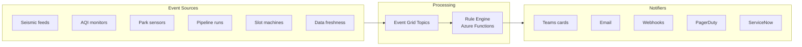

[← Platform Components](../README.md)

# Data Activator — Event-Driven Alerting Engine

> **Last Updated:** 2026-04-15 | **Status:** Active | **Audience:** Platform Engineers

> [!NOTE]
> **TL;DR:** CSA-in-a-Box equivalent of Fabric Data Activator — delivers real-time alerting and action-triggering using Event Grid, Azure Functions, and Logic Apps (all GA in Azure Government). Includes a Pydantic-validated rules engine with windowed aggregations and anomaly detection.

> **CSA-in-a-Box equivalent of Microsoft Fabric Data Activator**
>
> Data Activator is not available in Azure Government. This pattern
> delivers the same real-time alerting and action-triggering capabilities
> using Event Grid, Azure Functions, and Logic Apps — all GA in Azure
> Government.

## Table of Contents

- [Architecture](#architecture)
- [Components](#components)
- [Quick Start](#quick-start)
- [Alert Rule Schema](#alert-rule-schema)
- [Azure Government Compatibility](#azure-government-compatibility)
- [Related Documentation](#related-documentation)

---

## 🏗️ Architecture



---

## ✨ Components

### ⚙️ Rules Engine (`rules/`)

- **`schema.py`** — Pydantic models for alert rules, conditions, actions, and
  schedules.  Validates YAML rule files at load time.
- **`engine.py`** — `RuleEngine` class that loads rules, evaluates conditions
  against incoming events, supports windowed aggregations (count, avg, min,
  max, sum) and anomaly detection via z-score.
- **`sample_rules.yaml`** — Six example rules covering seismic, air quality,
  park capacity, pipeline failure, data freshness, and slot machine anomaly
  scenarios.

### 🔌 Actions (`actions/`)

- **`notifier.py`** — Notification dispatchers: `TeamsNotifier`,
  `EmailNotifier`, `WebhookNotifier`, `IncidentCreator`, and
  `NotifierFactory`.
- **`teams_card.py`** — Adaptive Card builder for rich Teams alerts with
  severity colours, metric values, and recommended actions.

### 📦 Deployment (`deploy/`)

- **`event-grid.bicep`** — Bicep template deploying Event Grid system topic,
  event subscriptions, and the Function App for rule evaluation.
- **`logic-apps.bicep`** — Bicep template for Logic Apps notification workflows.
- **`activator.bicep`** — Full-stack deployment (existing).

### 📁 Legacy (`functions/`, `alert_rules/`)

The original `alert_processor.py` and YAML rules remain for backward
compatibility.  New implementations should use the `rules/` and `actions/`
modules.

---

## 🚀 Quick Start

```bash
# Deploy infrastructure
az deployment group create \
  --resource-group rg-shared-prod \
  --template-file deploy/event-grid.bicep \
  --parameters environment=prod teamsWebhookUrl='<url>'

# Test rule evaluation locally
python -c "
from rules.engine import RuleEngine
engine = RuleEngine.from_yaml('rules/sample_rules.yaml')
print(engine.list_rules())
"
```

---

## 🔌 Alert Rule Schema

Rules are defined in YAML with a Pydantic-validated schema:

```yaml
rules:
  - name: seismic-alert
    description: Alert on earthquake magnitude > 4.0
    source: seismic-event-topic
    enabled: true
    condition:
      field: magnitude
      operator: gt
      threshold: 4.0
      window_minutes: 0
    actions:
      - type: teams
        config:
          webhook_url: ${TEAMS_WEBHOOK_URL}
          channel: "#seismic-alerts"
      - type: email
        config:
          recipients: ["oncall@contoso.com"]
    schedule:
      cron: "* * * * *"
      timezone: UTC
```

---

## 🔒 Azure Government Compatibility

> [!IMPORTANT]
> All services used are GA in Azure Government.

| Service | Status | Notes |
|---|---|---|
| Event Grid | GA | Custom topics + system topics |
| Azure Functions | GA | Python 3.11, v4 runtime |
| Logic Apps | GA | Standard and Consumption |
| SendGrid | GA | Email delivery |

---

## 🔗 Related Documentation

- [Platform Components](../README.md) — Platform component index
- [Platform Services](../../docs/PLATFORM_SERVICES.md) — Detailed platform service descriptions
- [Architecture](../../docs/ARCHITECTURE.md) — Overall system architecture
- [AI Integration](../ai_integration/README.md) — AI enrichment patterns
- [Shared Services](../shared_services/README.md) — Reusable function library
