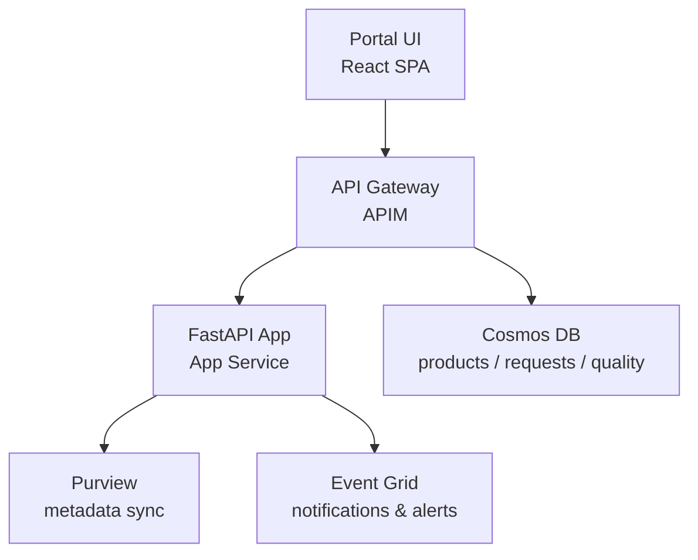
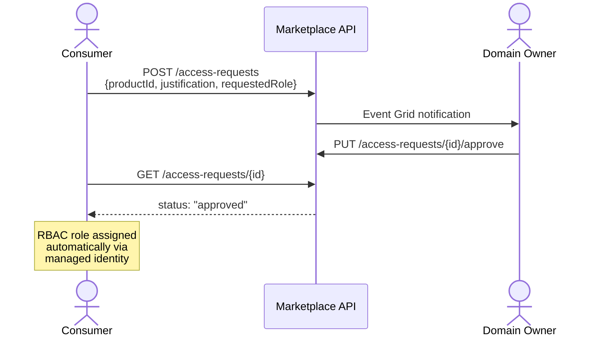

[← Platform Components](../README.md)

# Data Marketplace — Product Discovery, Access, and Quality


> [!NOTE]
> **TL;DR:** A FastAPI + Cosmos DB self-service data marketplace where domain teams register data products and consumers discover, request access, and monitor quality. Includes Purview integration, access request workflows, and weighted quality scoring.

> **CSA-in-a-Box data product marketplace**

## Table of Contents

- [Overview](#overview)
- [Architecture](#architecture)
- [API Endpoints](#api-endpoints)
- [Data Product Schema](#data-product-schema)
- [Access Request Workflow](#access-request-workflow)
- [Quality Scoring](#quality-scoring)
- [Deployment](#deployment)
- [Configuration](#configuration)
- [Purview Integration](#purview-integration)
- [Related Documentation](#related-documentation)

> A self-service data marketplace where domain teams register their data
> products and consumers can discover, request access to, and monitor the
> quality of available datasets.

---

## 📋 Overview

The data marketplace is a FastAPI application backed by Cosmos DB that
provides:

- **Data Product Registration** — domain teams publish their data products
  with schema, SLA, lineage, and quality score metadata
- **Discovery & Search** — consumers browse and search the catalog,
  filtered by domain, quality score, tags, and freshness
- **Access Request Workflow** — consumers request access; domain owners
  approve or deny via the API or portal
- **Quality Monitoring** — quality scores are tracked over time and
  surfaced alongside product listings
- **Purview Integration** — registered products sync metadata to
  Azure Purview for enterprise-wide governance

---

## 🏗️ Architecture



---

## 🔌 API Endpoints

| Method | Path | Description |
|---|---|---|
| `GET` | `/products` | List all data products with quality scores |
| `GET` | `/products/{id}` | Get detailed product info (schema, SLA, lineage) |
| `POST` | `/products` | Register a new data product |
| `POST` | `/access-requests` | Request access to a product |
| `GET` | `/access-requests/{id}` | Check request status |
| `PUT` | `/access-requests/{id}/approve` | Approve an access request |
| `GET` | `/products/{id}/quality` | Get quality metrics history |

See `api/marketplace_api.py` for the full implementation.

---

## 🗄️ Data Product Schema

Every data product registered in the marketplace includes:

```yaml
name: orders
domain: sales
owner: sales-team@contoso.com
description: Customer order transactions
version: "2.1.0"
sla:
  freshnessMinutes: 120
  availabilityPercent: 99.5
  supportedUntil: "2025-12-31"
schema:
  format: delta
  location: "abfss://gold@stprodsaleseus2.dfs.core.windows.net/sales/orders/"
  columns:
    - name: order_id
      type: string
      description: Unique order identifier
    - name: customer_id
      type: string
      description: FK to customers product
      piiClassification: indirect_identifier
tags: [sales, orders, revenue, gold-layer]
qualityScore: 0.94
lineage:
  upstream: [bronze.raw_orders, silver.cleaned_orders]
  downstream: [gold.sales_metrics, gold.revenue_reconciliation]
```

---

## 🔄 Access Request Workflow



---

## 📊 Quality Scoring

Quality scores are calculated from the data contract's quality rules
(see `csa_platform/csa_platform/governance/contracts/contract_validator.py`):

| Metric | Weight | Source |
|---|---|---|
| Completeness (non-null ratio) | 0.25 | Great Expectations checks |
| Freshness (within SLA) | 0.25 | Last modified timestamp vs SLA |
| Accuracy (validation pass rate) | 0.20 | Contract quality rules |
| Consistency (cross-domain checks) | 0.15 | dbt test results |
| Uniqueness (PK uniqueness) | 0.15 | Primary key validation |

---

## 📦 Deployment

```bash
# Deploy marketplace infrastructure
az deployment group create \
  --resource-group rg-shared-prod \
  --template-file csa_platform/data_marketplace/deploy/marketplace.bicep \
  --parameters \
    environment=prod \
    location=eastus2

# Deploy the API application
az webapp deploy \
  --resource-group rg-shared-prod \
  --name app-marketplace-prod \
  --src-path ./api/
```

---

## ⚙️ Configuration

### Environment Variables

| Variable | Description |
|---|---|
| `COSMOS_ENDPOINT` | Cosmos DB account endpoint |
| `COSMOS_DATABASE` | Database name (default: `marketplace`) |
| `PURVIEW_ACCOUNT` | Purview account name for metadata sync |
| `EVENT_GRID_TOPIC_ENDPOINT` | Event Grid topic for notifications |
| `AZURE_CLIENT_ID` | Managed identity client ID |

---

## 🔒 Purview Integration

Registered data products are automatically synced to Azure Purview:

1. Product metadata is pushed via the Purview Atlas API
2. Schema details are registered as Purview entities
3. Lineage relationships are created between upstream/downstream products
4. Classification labels from Purview are reflected in the marketplace

See `csa_platform/csa_platform/governance/purview/purview_automation.py` for the sync implementation.

---

## 🔗 Related Documentation

- [Platform Components](../README.md) — Platform component index
- [Platform Services](../../docs/PLATFORM_SERVICES.md) — Detailed platform service descriptions
- [Architecture](../../docs/ARCHITECTURE.md) — Overall system architecture
- [AI Integration](../ai_integration/README.md) — AI enrichment patterns
- [Governance](../governance/README.md) — Purview automation and classification
