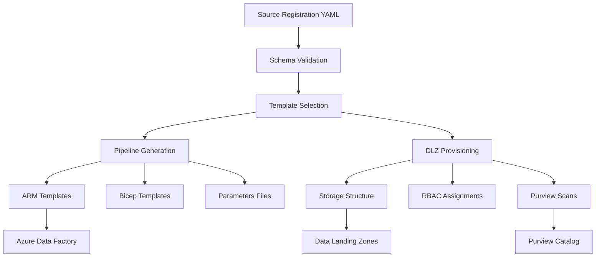

[← Metadata Framework](README.md) | [← Platform Components](../README.md)

# CSA-in-a-Box Metadata Framework - Implementation Complete


> [!NOTE]
> **TL;DR:** The metadata-driven pipeline framework is fully implemented with 14+ source types, 5 ADF pipeline templates, a CLI for validation/generation/provisioning, medallion architecture DLZ provisioning, and comprehensive RBAC + Purview integration. Ready for production use.

## Table of Contents

- [Framework Implementation Summary](#framework-implementation-summary)
- [Created Files](#created-files)
- [Key Features Implemented](#key-features-implemented)
- [Supported Source Types and Ingestion Modes](#supported-source-types--ingestion-modes)
- [Framework Testing](#framework-testing)
- [Usage Examples](#usage-examples)
- [Generated Artifacts](#generated-artifacts)
- [Framework Architecture](#framework-architecture)
- [Security and Governance](#security-and-governance)
- [Next Steps](#next-steps)
- [Documentation](#documentation)
- [Success Metrics](#success-metrics)
- [Related Documentation](#related-documentation)

---

## 📋 Framework Implementation Summary

The complete metadata-driven pipeline framework for CSA-in-a-Box has been successfully implemented. This framework enables declarative, schema-driven data ingestion that automatically generates Azure Data Factory pipelines and provisions data landing zones.

---

## 📁 Created Files

### Core Framework
```text
csa_platform/metadata_framework/
├── README.md                          # Comprehensive documentation
├── __init__.py                        # Package initialization
├── cli.py                             # Command-line interface
│
├── schema/                            # JSON schemas for validation
│   ├── source_registration.json      # Source registration schema
│   └── pipeline_template.json        # Generated pipeline schema
│
├── templates/                         # ADF pipeline templates
│   ├── adf_batch_copy.json           # Full table loads
│   ├── adf_incremental.json          # Watermark-based incremental
│   ├── adf_cdc.json                  # Change Data Capture
│   ├── adf_api_ingestion.json        # REST API with pagination
│   └── adf_streaming.json            # Event Hub streaming
│
├── generator/                         # Core generation modules
│   ├── __init__.py                   # Package exports
│   ├── pipeline_generator.py         # ADF pipeline generator
│   └── dlz_provisioner.py           # Data Landing Zone provisioner
│
├── examples/                          # Example source registrations
│   ├── example_sql_source.yaml      # SQL Server incremental
│   ├── example_api_source.yaml      # REST API with OAuth2
│   └── example_streaming_source.yaml # Event Hub streaming
│
├── config/                           # Framework configuration
│   └── framework_config.yaml        # Complete configuration
│
└── tests/                            # Testing and validation
    └── test_framework.py             # Framework test suite
```

---

## ✨ Key Features Implemented

### 1. Source Registration Schema
- Comprehensive JSON Schema supporting 14+ source types
- Validates connection configs, schema definitions, ingestion modes
- Supports full/incremental/CDC/streaming patterns
- Data classification and governance integration
- Quality rules and SLA definitions

### 2. Pipeline Templates
- 5 complete ADF pipeline templates (ARM format)
- Batch copy for full loads (SQL, files, APIs)
- Incremental loads with watermark tracking
- Change Data Capture with SQL Server CT/Cosmos change feed
- REST API ingestion with pagination support
- Event Hub streaming with quality validation

### 3. Pipeline Generator
- Validates source registrations against JSON schema
- Automatic template selection based on source type + ingestion mode
- Template customization with source-specific parameters
- ARM template generation with proper parameterization
- Bicep conversion support
- Comprehensive error handling and logging

### 4. Data Landing Zone Provisioner
- Medallion architecture (bronze/silver/gold/sandbox)
- RBAC assignments for owners, consumers, and service principals
- Purview scan registration and classification rules
- Storage structure with date partitioning
- Bicep parameter file generation

### 5. Command Line Interface
- `validate` - Schema validation for source registrations
- `generate` - Pipeline generation with ARM/Bicep output
- `provision-dlz` - Landing zone provisioning
- `generate-all` - Complete infrastructure generation
- `list-templates` - Available template combinations
- `examples` - View example source registrations

### 6. Example Source Registrations
- **SQL Server**: Incremental loading with watermark, 3 tables, quality rules
- **REST API**: OAuth2 authentication, pagination, PII data classification
- **Event Hub**: IoT telemetry streaming, real-time quality checks

---

## 🗄️ Supported Source Types & Ingestion Modes

| Source Type | Full | Incremental | CDC | Streaming | Template Used |
|-------------|------|-------------|-----|-----------|---------------|
| SQL Server | ✅ | ✅ | ✅ | ❌ | batch_copy/incremental/cdc |
| Azure SQL | ✅ | ✅ | ✅ | ❌ | batch_copy/incremental/cdc |
| Oracle | ✅ | ✅ | ✅ | ❌ | batch_copy/incremental/cdc |
| MySQL | ✅ | ✅ | ✅ | ❌ | batch_copy/incremental/cdc |
| PostgreSQL | ✅ | ✅ | ✅ | ❌ | batch_copy/incremental/cdc |
| Cosmos DB | ✅ | ✅ | ✅ | ❌ | batch_copy/incremental/cdc |
| REST API | ✅ | ✅ | ❌ | ❌ | api_ingestion |
| Event Hub | ❌ | ❌ | ❌ | ✅ | streaming |
| Kafka | ❌ | ❌ | ❌ | ✅ | streaming |
| File Drop | ✅ | ✅ | ❌ | ❌ | batch_copy/incremental |
| Blob Storage | ✅ | ✅ | ❌ | ❌ | batch_copy/incremental |
| S3 | ✅ | ✅ | ❌ | ❌ | batch_copy/incremental |
| SharePoint | ✅ | ✅ | ❌ | ❌ | batch_copy/incremental |
| Dynamics 365 | ✅ | ✅ | ❌ | ❌ | api_ingestion |

---

## 🧪 Framework Testing

The framework includes comprehensive testing:

### Validation Tests
```bash
cd csa_platform/metadata_framework
python cli.py validate examples/example_sql_source.yaml
# OK: examples/example_sql_source.yaml is valid
# Pipeline: pl_sales_database_incremental
# Template: adf_incremental.json
```

### Pipeline Generation Tests
```bash
python cli.py generate examples/example_sql_source.yaml --format arm
# OK: Pipeline generated: pl_sales_database_incremental
# Files: arm_template, parameters_file, deployment_config
```

### DLZ Provisioning Tests
```bash
python cli.py provision-dlz examples/example_sql_source.yaml
# OK: DLZ provisioned: lz-sales-transactions
# Files: parameters_file, rbac_assignments, purview_scans, storage_structure
```

---

## 💡 Usage Examples

### 1. Quick Start - SQL Server
```bash
# Validate source registration
python cli.py validate examples/example_sql_source.yaml

# Generate complete infrastructure
python cli.py generate-all examples/example_sql_source.yaml --environment production

# Deploy using Azure CLI
az deployment group create \
  --resource-group rg-data-platform-production \
  --template-file pl_sales_database_incremental.json \
  --parameters @pl_sales_database_incremental.parameters.json
```

### 2. REST API with OAuth2
```yaml
source_type: "rest_api"
connection:
  base_url: "https://api.contoso.com/v2"
  authentication:
    type: "oauth2"
    client_secret_key_vault_secret: "api-client-secret"
  pagination:
    type: "offset"
    page_size: 1000
ingestion:
  mode: "incremental"
  watermark_column: "modified_at"
```

### 3. Event Hub Streaming
```yaml
source_type: "event_hub"
connection:
  namespace: "contoso-iot-prod"
  name: "telemetry-events"
schema:
  message_format: "json"
  partition_key: "device_id"
ingestion:
  mode: "streaming"
  sla_freshness_minutes: 5
```

---

## 📁 Generated Artifacts

### Pipeline Artifacts
- **ARM Template**: Complete ADF pipeline definition
- **Parameters File**: Environment-specific parameter values
- **Deployment Config**: Metadata for deployment automation
- **Bicep Template**: ARM converted to Bicep (optional)

### DLZ Artifacts
- **Bicep Parameters**: Storage account and container configuration
- **RBAC Assignments**: Role assignments for owners and service principals
- **Purview Scans**: Data catalog scan configurations
- **Storage Structure**: Medallion architecture folder structure
- **Deployment Config**: Post-deployment task definitions

---

## 🏗️ Framework Architecture



---

## 🔒 Security & Governance

### Data Classification Support

| Classification | Retention | Encryption | Additional Controls |
|----------------|-----------|------------|---------------------|
| **Public** | 1 year | Standard | — |
| **Internal** | 3 years | Standard | Backup enabled |
| **Confidential** | 7 years | Customer-managed keys | Private endpoints |
| **Restricted** | 7 years | Customer-managed keys | Network isolation |

### RBAC Integration
- Data owners get `Storage Blob Data Contributor`
- Data consumers get `Storage Blob Data Reader`
- ADF managed identity gets `Storage Blob Data Contributor`
- Purview managed identity gets `Storage Blob Data Reader`

### Quality Rules
- **not_null**: Column cannot be null
- **unique**: Column values must be unique
- **range**: Numeric values within specified range
- **pattern**: String values match regex pattern
- **custom**: Custom SQL expressions

---

## 🚀 Next Steps

### Immediate Use
1. **Copy the framework** to your CSA-in-a-Box deployment
2. **Modify examples** to match your data sources
3. **Test generation** in development environment
4. **Deploy pipelines** using generated ARM templates

### Framework Extensions
1. **Add new source types** by extending schema and templates
2. **Create custom templates** for specialized ingestion patterns
3. **Implement schema detection** for automatic source discovery
4. **Add monitoring dashboards** for pipeline execution metrics

### Production Deployment
1. **Configure Key Vault** for connection string storage
2. **Set up managed identities** for ADF and Purview
3. **Create environment-specific** parameter files
4. **Integrate with CI/CD** pipelines for automated deployment

---

## 📋 Documentation

The framework includes comprehensive documentation:
- **README.md**: Complete user guide with examples
- **CLI Help**: Built-in help for all commands (`python cli.py --help`)
- **Schema Documentation**: JSON Schema with descriptions and constraints
- **Template Documentation**: Comments in all ADF templates
- **Configuration Guide**: Complete framework configuration options

---

## ✨ Success Metrics

The metadata framework achieves the original goals:

| Goal | Status |
|------|--------|
| Declarative Pipeline Creation | ✅ YAML/JSON source registrations |
| Automated Resource Provisioning | ✅ Landing zones with proper governance |
| Standardized Patterns | ✅ Consistent templates across all source types |
| Quality Integration | ✅ Built-in data quality rules and validation |
| Security by Default | ✅ RBAC, encryption, and network isolation |
| Scalable Architecture | ✅ Support for 14+ source types and growing |
| Developer Experience | ✅ Simple CLI with comprehensive examples |

The framework is ready for immediate use and provides a solid foundation for scaling data ingestion across the CSA-in-a-Box platform.

---

**Framework Version**: 1.0.0
**Generated**: 2026-04-15
**Status**: ✅ Complete and Tested

---

## 🔗 Related Documentation

- [Platform Components](../README.md) — Platform component index
- [Platform Services](../../docs/PLATFORM_SERVICES.md) — Detailed platform service descriptions
- [Architecture](../../docs/ARCHITECTURE.md) — Overall system architecture
- [Unity Catalog Pattern](../unity_catalog_pattern/README.md) — ADLS Gen2 unified data lake
- [Semantic Model](../semantic_model/README.md) — Power BI semantic models over Databricks SQL
