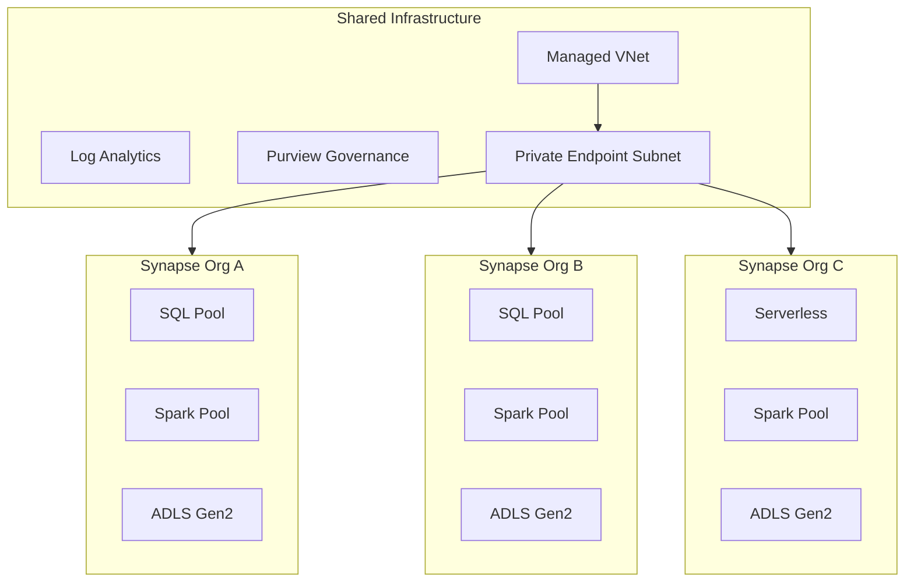

[← Platform Components](../README.md)

# Multi-Synapse — Shared Analytics Environment

> **Last Updated:** 2026-04-15 | **Status:** Active | **Audience:** Platform Engineers

> [!NOTE]
> **TL;DR:** Deploys per-organization Synapse workspaces with isolated compute and storage over shared network infrastructure, supporting cross-workspace query federation, pre-built RBAC templates, and cost allocation by organization tag.

> **Multi-organization Synapse workspace architecture**

## Table of Contents

- [Overview](#overview)
- [Architecture](#architecture)
- [Cross-Workspace Query Federation](#cross-workspace-query-federation)
- [RBAC Templates](#rbac-templates)
- [Cost Allocation](#cost-allocation)
- [Deployment](#deployment)
- [Network Isolation](#network-isolation)
- [Governance Integration](#governance-integration)
- [Related Documentation](#related-documentation)

> Deploys multiple Synapse Analytics workspaces with shared infrastructure
> for multi-tenant or multi-organization data analytics scenarios.

---

## 📋 Overview

In scenarios where multiple organizations (agencies, departments, business
units) share a common data platform, each organization needs its own
Synapse workspace with isolated compute and storage, while sharing common
network infrastructure, monitoring, and governance.

This pattern deploys:

- **One Synapse workspace per organization** — isolated compute, dedicated SQL pools
- **Shared managed VNet** — common network with private endpoints
- **Cross-workspace query federation** — queries that span organizational boundaries
- **RBAC templates** — per-org role assignments for analysts, engineers, and admins
- **Cost allocation** — per-workspace cost tracking via resource tags

---

## 🏗️ Architecture



---

## 🗄️ Cross-Workspace Query Federation

Synapse serverless SQL pools can query data across workspaces using
external data sources:

```sql
-- In Org A's workspace: create external data source pointing to Org B's storage
CREATE EXTERNAL DATA SOURCE OrgBGoldLayer
WITH (
    LOCATION = 'https://stprodorgbeus2.dfs.core.windows.net',
    CREDENTIAL = OrgBCredential  -- uses managed identity
);

-- Query across organizational boundaries
SELECT a.order_id, b.invoice_id, b.amount
FROM OPENROWSET(
    BULK 'gold/sales/orders/**',
    DATA_SOURCE = 'OrgAGoldLayer',
    FORMAT = 'DELTA'
) AS a
JOIN OPENROWSET(
    BULK 'gold/finance/invoices/**',
    DATA_SOURCE = 'OrgBGoldLayer',
    FORMAT = 'DELTA'
) AS b ON a.order_id = b.order_reference;
```

---

## 🔒 RBAC Templates

Pre-defined role templates for each organization are in `rbac_templates/`:

| Template | Permissions | Use Case |
|---|---|---|
| `analyst_role.yaml` | Read-only SQL, read storage | Business analysts |
| `engineer_role.yaml` | Full SQL + Spark, read/write storage | Data engineers |
| `admin_role.yaml` | Full control + RBAC management | Workspace admins |

### Applying RBAC

```bash
# Apply role template for a new organization
python scripts/apply_rbac.py \
  --template rbac_templates/analyst_role.yaml \
  --org-name "Agency-A" \
  --workspace-name "syn-prod-agencya" \
  --group-object-id "aad-group-id"
```

---

## 💡 Cost Allocation

Each workspace is tagged with the organization name for cost tracking:

```json
{
  "tags": {
    "Organization": "Agency-A",
    "CostCenter": "CC-1234",
    "Environment": "Production",
    "Project": "CSA-in-a-Box"
  }
}
```

Use Azure Cost Management to group by the `Organization` tag:

```kusto
// KQL: Monthly cost by organization
AzureDiagnostics
| where ResourceType == "WORKSPACES"
| extend org = tostring(Tags.Organization)
| summarize TotalCost = sum(CostInBillingCurrency) by org, bin(TimeGenerated, 1mo)
```

---

## 📦 Deployment

```bash
# Deploy multi-Synapse environment
az deployment sub create \
  --location eastus2 \
  --template-file csa_platform/multi_synapse/deploy/multi-synapse.bicep \
  --parameters \
    organizations='["agency-a","agency-b","agency-c"]' \
    environment=prod \
    location=eastus2 \
    sqlAdminPassword='<secure-password>'
```

---

## 🔒 Network Isolation

> [!WARNING]
> All workspaces enforce zero public network access. Ensure private endpoints are configured before deployment.

All workspaces share a managed VNet with:

- **Private endpoints** for storage, SQL, and Spark
- **Data exfiltration prevention** — `preventDataExfiltration: true`
- **No public network access** — `publicNetworkAccess: Disabled`
- **NSG rules** — restrict inter-workspace traffic to approved patterns

---

## 🔒 Governance Integration

- **Purview** — each workspace registers its lineage with a shared Purview account
- **Diagnostic Settings** — all workspaces send logs to a shared Log Analytics workspace
- **Azure Policy** — shared policies enforce tagging, encryption, and network rules

---

## 🔗 Related Documentation

- [Platform Components](../README.md) — Platform component index
- [Platform Services](../../docs/PLATFORM_SERVICES.md) — Detailed platform service descriptions
- [Architecture](../../docs/ARCHITECTURE.md) — Overall system architecture
- [Direct Lake](../direct_lake/README.md) — Power BI direct access to Delta Lake
