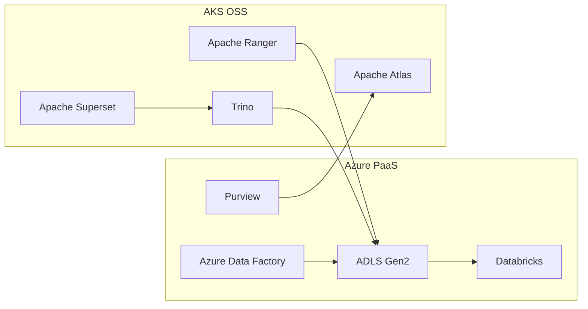

[← Platform Components](../README.md)

# Open-Source Alternatives for Azure Government

> **Last Updated:** 2026-04-15 | **Status:** Active | **Audience:** Platform Engineers

> [!NOTE]
> **TL;DR:** Provides open-source alternatives (Atlas, Ranger, Superset, Trino, NiFi, etc.) deployable on AKS for Azure Government scenarios where PaaS services have limited availability. Supports both full OSS and hybrid Azure+OSS deployment models.

When deploying Cloud Scale Analytics in Azure Government, some services may have
limited availability or missing features. This directory provides open-source
alternatives that can be deployed on AKS (Azure Kubernetes Service) in Gov regions.

## Table of Contents

- [When to Use Open-Source Alternatives](#when-to-use-open-source-alternatives)
- [Deployment Patterns](#deployment-patterns)
- [Helm Charts](#helm-charts)
- [Integration with CSA Platform](#integration-with-csa-platform)
- [Related Documentation](#related-documentation)

---

## 💡 When to Use Open-Source Alternatives

| Scenario | Azure Service | Gov Status | Open-Source Alternative |
|---|---|---|---|
| Data Catalog (gaps) | Microsoft Purview | GA (limited features) | Apache Atlas |
| Fine-grained ACL | Purview policies | Limited | Apache Ranger |
| Data Integration | ADF | GA | Apache NiFi |
| Federated Query | Synapse Serverless | GA | Trino / Presto |
| Metadata Store | Unity Catalog | GA (Databricks) | Apache Hive Metastore |
| Data Quality | Great Expectations | N/A (self-hosted) | Great Expectations (already integrated) |
| Transformation | dbt | N/A (self-hosted) | dbt (already integrated) |
| Visualization | Power BI | GA | Apache Superset |
| ML Lifecycle | Azure ML | GA | MLflow (already integrated) |
| Event Streaming | Event Hubs | GA | Apache Kafka on HDInsight |
| Search | Azure AI Search | GA | OpenSearch |

---

## 📦 Deployment Patterns

### Option 1: AKS-Hosted OSS Stack

Deploy open-source tools as containers on AKS in Gov regions:

```yaml
# Helm values for the OSS data platform stack
services:
  atlas:
    enabled: true
    image: apache/atlas:2.3.0
    replicas: 2
  ranger:
    enabled: true
    image: ranger/ranger-admin:2.4.0
  superset:
    enabled: true
    image: apache/superset:3.1.0
  trino:
    enabled: true
    image: trinodb/trino:440
    workers: 3
  hive-metastore:
    enabled: true
    image: apache/hive:3.1.3
  nifi:
    enabled: false  # Use ADF if available
```

### Option 2: Hybrid (Azure + OSS)

Use Azure services where available, supplement with OSS:

- **Storage**: ADLS Gen2 (Azure - GA in Gov)
- **Compute**: Databricks (Azure - GA in Gov)
- **Orchestration**: ADF (Azure - GA in Gov)
- **Catalog**: Purview + Atlas for extended features
- **Access Control**: Purview + Ranger for row/column-level security
- **Visualization**: Power BI + Superset for embedded analytics



---

## ⚙️ Helm Charts

### Umbrella Chart (deploy everything)
- `helm/csa-oss-stack/` — Deploy the full OSS stack with a single Helm install

### Individual Charts (deploy selectively)
- `helm/atlas/` — Apache Atlas standalone (data catalog)
- `helm/superset/` — Apache Superset standalone (dashboards)
- `helm/trino/` — Trino standalone (SQL analytics)
- `helm/airflow/` — Apache Airflow standalone (orchestration)
- `helm/opensearch/` — OpenSearch standalone (AI Search alternative)

### Deploy Script
```bash
# Deploy full stack or individual services
scripts/deploy-oss-stack.sh -g <rg> -l <location> --services atlas,trino,superset
```

---

## 📖 Guides

- [OSS Ecosystem Overview](../../docs/guides/oss-ecosystem.md) — Architecture decisions and integration
- [Migration Playbook](../../docs/guides/oss-migration-playbook.md) — Azure PaaS ↔ OSS migration
- [Monitoring Setup](../../docs/guides/oss-monitoring.md) — Prometheus, Grafana, alerting

---

## 🏗️ Integration with CSA Platform

All open-source alternatives integrate with the core CSA platform via:
1. **ADLS Gen2** — Shared storage layer (all tools read/write Delta Lake)
2. **Key Vault** — Secrets management for credentials
3. **Managed Identity** — Authentication to Azure resources
4. **Private Endpoints** — Network isolation
5. **Log Analytics** — Centralized monitoring via Fluentd/OpenTelemetry

---

## 🔗 Related Documentation

- [Platform Components](../README.md) — Platform component index
- [Platform Services](../../docs/PLATFORM_SERVICES.md) — Detailed platform service descriptions
- [Architecture](../../docs/ARCHITECTURE.md) — Overall system architecture
- [Governance](../governance/README.md) — Purview automation and classification
- [Platform Functions](../functions/README.md) — Consolidated Azure Functions library
