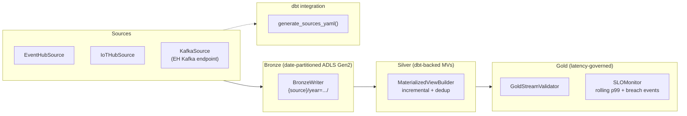

# `csa_platform.streaming` — Unified streaming contract spine (CSA-0137)

> **Status:** Alpha (ships with passing tests, zero Azure credentials required).
> **Package:** `csa_platform.streaming`
> **Extras:** `pip install -e ".[streaming]"`
> **Approval:** AQ-0032
> **Owner:** Data Platform

The streaming spine is the contract-first backbone for every CSA-in-a-Box
vertical that needs real-time ingestion, materialization, and
latency-governed consumption.  It establishes a common shape for
sources, bronze sinks, silver materialized views, and gold contracts so
that dbt, Stream Analytics, ADX, and (future) Fabric Real-Time
Intelligence jobs can all be generated from a single YAML manifest.

## Architecture



## Contracts

| Contract | Purpose | Module |
|---|---|---|
| `SourceContract` | Non-secret descriptor for a streaming source (Event Hub, IoT Hub, Kafka). | `models.py` |
| `StreamingBronze` | Raw-event sink layout (storage account, container, path template, format). | `models.py` |
| `SilverMaterializedView` | dbt-backed materialized view with watermark + dedup semantics. | `models.py` |
| `GoldStreamContract` | Latency-governed consumer contract with an embedded `LatencySLO`. | `models.py` |
| `LatencySLO` | p50/p95/p99 latency targets + SLA threshold + rolling window. | `models.py` |
| `SLOMonitor` | In-process rolling-window monitor that emits breach events. | `slo.py` |

All contracts are **frozen** Pydantic models (`ConfigDict(frozen=True)`),
so a contract cannot be mutated after construction.  This is a hard
requirement for safely passing contracts across async boundaries.

## Source → Bronze → Silver → Gold flow

1. **Source** (`sources.py`) — `EventHubSource`, `IoTHubSource`,
   `KafkaSource` each consume events and yield `StreamEvent`
   envelopes.  Azure SDK imports are lazy so unit tests monkeypatch
   `_load_eventhub_consumer_client` with a fake — no Azure credentials
   needed in CI.
2. **Bronze** (`bronze.py`) — `BronzeWriter` writes batches to
   ADLS Gen2 under the resolved path
   (`bronze/{source}/year={yyyy}/month={mm}/day={dd}/hour={hh}/`).  JSON
   payloads are newline-delimited; Avro/Parquet payloads pass through
   as raw bytes (EH Capture-compatible).
3. **Silver** (`silver.py`) — `MaterializedViewBuilder` emits a dbt
   `schema.yml` fragment and a scaffold incremental SQL model with
   `row_number()` dedup + watermark filter pre-wired.
4. **Gold** (`gold.py`) — `GoldStreamValidator` cross-references the
   gold contract against the silver registry and wires the contract's
   `LatencySLO` into an `SLOMonitor`.

## LatencySLO semantics

```python
slo = LatencySLO(
    p50_ms=500,
    p95_ms=1200,
    p99_ms=2000,
    sla_threshold_ms=2500,   # must be >= p99_ms
    rolling_window_minutes=5,
)
```

The monitor uses **nearest-rank percentiles** on a rolling-window
deque:

* `record_latency(contract_name, observed_ms)` appends an observation.
* Entries older than `rolling_window_minutes` are evicted on every call.
* When the current in-window p99 exceeds `sla_threshold_ms` the
  `on_breach` callback fires with an `SLOBreach` event.

The monitor is deterministic — pass a custom `now` callable in tests for
fully reproducible behaviour.

## dbt integration

`dbt_integration.generate_sources_yaml(contracts)` is a pure function
that emits a dbt-compatible `sources.yml` block.  Output is
deterministic (alphabetical by contract name within a technology
group) so it can be regenerated in CI and diffed against a committed
artefact.

Example input:

```python
from csa_platform.streaming import (
    SourceConnection, SourceContract, SourceType, generate_sources_yaml,
)

contracts = [
    SourceContract(
        name="iot_telemetry",
        source_type=SourceType.IOT_HUB,
        connection=SourceConnection(namespace="csaiot", entity="telemetry"),
        partition_key_path="$.sensor_id",
        schema_ref="schemaregistry://csa/iot-telemetry/v1",
        watermark_field="event_time",
        compliance_tags=("fedramp-high", "iot"),
    ),
]
print(generate_sources_yaml(contracts))
```

Output:

```yaml
version: 2
sources:
  - name: streaming_iot_hub
    description: CSA-in-a-Box streaming sources (streaming_iot_hub).
    tables:
      - name: iot_telemetry
        description: 'Streaming iot_hub source. Watermark: event_time. Partition key: $.sensor_id.'
        loaded_at_field: event_time
        freshness:
          warn_after: { count: 600, period: second }
          error_after: { count: 1200, period: second }
        meta:
          csa_streaming: true
          source_type: iot_hub
          schema_ref: schemaregistry://csa/iot-telemetry/v1
          partition_key_path: $.sensor_id
          compliance_tags: [fedramp-high, iot]
```

Freshness thresholds are derived from `max_lateness_seconds` — warn at
2x lateness, error at 4x.

## CLI usage

```bash
# Validate a contract bundle YAML
python -m csa_platform.streaming validate path/to/contract.yaml
```

Exit codes:

| Code | Meaning |
|---|---|
| 0 | Parsed and cross-references resolved. |
| 1 | YAML / Pydantic validation error (first error printed). |
| 2 | Usage error (missing arg, file not found). |

A sample contract is committed under
`csa_platform/streaming/tests/fixtures/example_contract.yaml` and can
be used as a template for new verticals.

## Configuration env vars

The module itself has no env-var configuration — contracts are always
loaded from YAML by the caller.  Downstream runtime components (source
adapters, bronze writer) resolve auth via `DefaultAzureCredential`
which honours the standard Azure environment variables
(`AZURE_CLIENT_ID`, `AZURE_TENANT_ID`, etc.) plus managed identity when
running on Azure compute.  No `AZURE_*` variables are required to run
the unit-test suite.

## Testing

```bash
python -m pytest csa_platform/streaming/tests/ -v
ruff check csa_platform/streaming/
mypy csa_platform/streaming/ --ignore-missing-imports
```

All tests run without Azure SDK installed — the Azure loaders are
monkeypatched with in-memory fakes.

## Known gaps / deferred work

* **Fabric Real-Time Intelligence**: no adapter yet.  Deferred until
  Fabric RTI reaches Azure Government GA.  When it does, add a
  `FabricRTISource` and `FabricEventstreamContract` alongside the
  existing models (same protocol, different client).
* **Vanilla Apache Kafka**: the `KafkaSource` currently uses the Event
  Hubs Kafka-compatible endpoint (which is what CSA-in-a-Box deploys).
  A dedicated `aiokafka`-based adapter can be dropped in once a
  customer explicitly requires a non-EH Kafka cluster.
* **Schema registry resolution**: `SourceContract.schema_ref` is a free
  string today.  A future iteration can plug in Azure Schema Registry
  lookup so that Avro framing is validated server-side at contract
  registration time.
* **SLOMonitor persistence**: the monitor is in-process only.  For
  cross-pod SLO tracking the gold runtime should push breach events to
  Application Insights / Log Analytics via `csa_platform.common.logging`.
