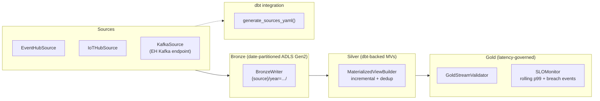

# `csa_platform.streaming` — Unified streaming contract spine (CSA-0137)

> **Status:** Alpha (ships with passing tests, zero Azure credentials required).
> **Package:** `csa_platform.streaming`
> **Extras:** `pip install -e ".[streaming]"`
> **Approval:** AQ-0032
> **Owner:** Data Platform

The streaming spine is the contract-first backbone for every CSA-in-a-Box
vertical that needs real-time ingestion, materialization, and
latency-governed consumption.  It establishes a common shape for
sources, bronze sinks, silver materialized views, and gold contracts so
that dbt, Stream Analytics, ADX, and (future) Fabric Real-Time
Intelligence jobs can all be generated from a single YAML manifest.

## Architecture



## Contracts

| Contract | Purpose | Module |
|---|---|---|
| `SourceContract` | Non-secret descriptor for a streaming source (Event Hub, IoT Hub, Kafka). | `models.py` |
| `StreamingBronze` | Raw-event sink layout (storage account, container, path template, format). | `models.py` |
| `SilverMaterializedView` | dbt-backed materialized view with watermark + dedup semantics. | `models.py` |
| `GoldStreamContract` | Latency-governed consumer contract with an embedded `LatencySLO`. | `models.py` |
| `LatencySLO` | p50/p95/p99 latency targets + SLA threshold + rolling window. | `models.py` |
| `SLOMonitor` | In-process rolling-window monitor that emits breach events. | `slo.py` |

All contracts are **frozen** Pydantic models (`ConfigDict(frozen=True)`),
so a contract cannot be mutated after construction.  This is a hard
requirement for safely passing contracts across async boundaries.

## Source → Bronze → Silver → Gold flow

1. **Source** (`sources.py`) — `EventHubSource`, `IoTHubSource`,
   `KafkaSource` each consume events and yield `StreamEvent`
   envelopes.  Azure SDK imports are lazy so unit tests monkeypatch
   `_load_eventhub_consumer_client` with a fake — no Azure credentials
   needed in CI.
2. **Bronze** (`bronze.py`) — `BronzeWriter` writes batches to
   ADLS Gen2 under the resolved path
   (`bronze/{source}/year={yyyy}/month={mm}/day={dd}/hour={hh}/`).  JSON
   payloads are newline-delimited; Avro/Parquet payloads pass through
   as raw bytes (EH Capture-compatible).
3. **Silver** (`silver.py`) — `MaterializedViewBuilder` emits a dbt
   `schema.yml` fragment and a scaffold incremental SQL model with
   `row_number()` dedup + watermark filter pre-wired.
4. **Gold** (`gold.py`) — `GoldStreamValidator` cross-references the
   gold contract against the silver registry and wires the contract's
   `LatencySLO` into an `SLOMonitor`.

## LatencySLO semantics

```python
slo = LatencySLO(
    p50_ms=500,
    p95_ms=1200,
    p99_ms=2000,
    sla_threshold_ms=2500,   # must be >= p99_ms
    rolling_window_minutes=5,
)
```

The monitor uses **nearest-rank percentiles** on a rolling-window
deque:

* `record_latency(contract_name, observed_ms)` appends an observation.
* Entries older than `rolling_window_minutes` are evicted on every call.
* When the current in-window p99 exceeds `sla_threshold_ms` the
  `on_breach` callback fires with an `SLOBreach` event.

The monitor is deterministic — pass a custom `now` callable in tests for
fully reproducible behaviour.

## dbt integration

`dbt_integration.generate_sources_yaml(contracts)` is a pure function
that emits a dbt-compatible `sources.yml` block.  Output is
deterministic (alphabetical by contract name within a technology
group) so it can be regenerated in CI and diffed against a committed
artefact.

Example input:

```python
from csa_platform.streaming import (
    SourceConnection, SourceContract, SourceType, generate_sources_yaml,
)

contracts = [
    SourceContract(
        name="iot_telemetry",
        source_type=SourceType.IOT_HUB,
        connection=SourceConnection(namespace="csaiot", entity="telemetry"),
        partition_key_path="$.sensor_id",
        schema_ref="schemaregistry://csa/iot-telemetry/v1",
        watermark_field="event_time",
        compliance_tags=("fedramp-high", "iot"),
    ),
]
print(generate_sources_yaml(contracts))
```

Output:

```yaml
version: 2
sources:
  - name: streaming_iot_hub
    description: CSA-in-a-Box streaming sources (streaming_iot_hub).
    tables:
      - name: iot_telemetry
        description: 'Streaming iot_hub source. Watermark: event_time. Partition key: $.sensor_id.'
        loaded_at_field: event_time
        freshness:
          warn_after: { count: 600, period: second }
          error_after: { count: 1200, period: second }
        meta:
          csa_streaming: true
          source_type: iot_hub
          schema_ref: schemaregistry://csa/iot-telemetry/v1
          partition_key_path: $.sensor_id
          compliance_tags: [fedramp-high, iot]
```

Freshness thresholds are derived from `max_lateness_seconds` — warn at
2x lateness, error at 4x.

## CLI usage

```bash
# Validate a contract bundle YAML (structure + cross-references).
python -m csa_platform.streaming validate path/to/contract.yaml

# Resolve every schema_ref against a registry.  The Noop registry
# accepts any ref and is safe to run in CI without network access.
python -m csa_platform.streaming validate-schemas path/to/contract.yaml --registry noop

# Confluent-compatible HTTP registry (Event Hubs Schema Registry, classic
# Confluent Schema Registry):
python -m csa_platform.streaming validate-schemas path/to/contract.yaml \
    --registry confluent --registry-url https://my-schema-registry.example

# Azure Schema Registry (first-party SDK, DefaultAzureCredential):
python -m csa_platform.streaming validate-schemas path/to/contract.yaml \
    --registry azure --registry-url my-eh-ns.servicebus.windows.net
```

Exit codes (both subcommands):

| Code | Meaning |
|---|---|
| 0 | Parsed and cross-references (or schemas) resolved. |
| 1 | YAML / Pydantic validation error, or schema-registry issue (registry 5xx, 404, fingerprint mismatch, version conflict). |
| 2 | Usage error (missing arg, file not found, required flag missing). |

A sample contract is committed under
`csa_platform/streaming/tests/fixtures/example_contract.yaml` and can
be used as a template for new verticals.

## Schema registry integration (Gap 1 closed)

`StreamingContractBundle.validate_schemas(registry)` resolves every
`schema_ref` in `sources` against a `SchemaRegistry` and surfaces
issues as a list of `ValidationIssue` objects.  Problems reported:

* unresolvable refs (registry 404 / unknown name);
* fingerprint (SHA-256) mismatches across sources that claim to share
  a schema name — catches drift between bronze and silver that would
  otherwise only be caught at runtime;
* version conflicts across sources claiming the same schema name —
  catches the "bronze is on v1, silver is on v2" foot-gun.

Three registry adapters ship out of the box:

| Adapter | Transport | When to use |
|---|---|---|
| `NoopSchemaRegistry` | none | Local dev, CI smoke tests, contract-structure-only validation. |
| `ConfluentCompatRegistry` | httpx (REST) | Event Hubs Schema Registry via the Confluent-compatible endpoint, classic Confluent Schema Registry. 5xx retried via tenacity (max 3 attempts, exponential backoff); results cached in a TTL cache. |
| `AzureSchemaRegistry` | `azure-schemaregistry` SDK | Azure Schema Registry with `DefaultAzureCredential`.  Ref shape: `<group>/<name>[#vN]`. |

All Azure SDK imports are lazy so unit tests can exercise each
adapter without touching the network or installing the Azure SDKs.

## Durable SLO-breach fan-out (Gap 2 closed)

`SLOMonitor` now accepts a list of `BreachPublisher` implementations
and fans each breach out to every publisher in addition to the
legacy `on_breach` callback.  Publisher failures are logged but
never propagated — a misbehaving publisher cannot knock the monitor
loop offline.

Four publishers ship out of the box:

| Publisher | Transport | Notes |
|---|---|---|
| `NoopBreachPublisher` | none | Test / explicit opt-out. |
| `LogBreachPublisher` | structlog | Default when nothing else is configured. |
| `EventGridBreachPublisher` | `azure.eventgrid.aio` | Emits a `csa.streaming.slo.breach` Event Grid event.  Accepts `AzureKeyCredential` or any token credential. |
| `CosmosBreachPublisher` | `azure.cosmos.aio` | Upserts to a Cosmos DB container; `partition_key` defaults to the contract name. |

Both Azure publishers retry transient failures via tenacity (max 3
attempts, exponential backoff).

### Deduplication window

`SLOMonitor(dedupe_window_seconds=60)` (default 60s) coalesces
repeated breaches for the same contract inside the window — the
monitor emits one breach per window so downstream sinks are not
flooded while a contract is in sustained breach.  Pass `0` to
disable coalescing entirely.

## Fabric Real-Time Intelligence adapter (Gap 3 — surface landed; runtime Gov-GA-gated)

`FabricRTISource` implements the `SourceAdapter` protocol so code
that targets Fabric compiles today.  Behaviour is controlled by
environment variables:

| Env var | Purpose | Default |
|---|---|---|
| `FABRIC_RTI_ENABLED` | Gate flag; adapter raises `FabricRTINotAvailableError` unless set to `true`. | unset |
| `FABRIC_RTI_ENDPOINT` | Override the REST endpoint (useful for Gov-cloud preview tenants). | `https://{workspace}.fabric.microsoft.com/eventstreams/{entity}/events` |
| `FABRIC_RTI_TOKEN` | Static bearer token (CI / smoke tests).  When unset, the adapter falls back to `DefaultAzureCredential`. | unset |

See [ADR-0018](../../docs/adr/0018-fabric-rti-adapter.md) for the
gating rationale.

## Testing

```bash
python -m pytest csa_platform/streaming/tests/ -v
ruff check csa_platform/streaming/
mypy csa_platform/streaming/ --ignore-missing-imports
```

All tests run without Azure SDK installed — the Azure loaders are
monkeypatched with in-memory fakes.

## Known gaps / deferred work

### Landed (previously on this list)

* **Schema registry resolution (Gap 1)** — `SourceContract.schema_ref`
  is validated against a `SchemaRegistry` via
  `StreamingContractBundle.validate_schemas`.  Adapters: `Noop`,
  `ConfluentCompat` (Event Hubs Schema Registry via the
  Confluent-compatible endpoint), `AzureSchemaRegistry` (first-party
  SDK).  Wired into the `validate-schemas` CLI subcommand.
* **SLOMonitor persistence (Gap 2)** — `SLOMonitor` now accepts a list
  of `BreachPublisher` implementations (`Noop`, `Log` via structlog,
  `EventGrid`, `Cosmos`) with tenacity-backed retries and a
  per-contract deduplication window.  Failures are isolated from the
  monitor loop.
* **Fabric Real-Time Intelligence adapter surface (Gap 3)** —
  `FabricRTISource` ships today behind the `FABRIC_RTI_ENABLED` env
  flag.  See [ADR-0018](../../docs/adr/0018-fabric-rti-adapter.md)
  for the gating rationale.

### Still deferred

* **Fabric RTI Gov-GA runtime enablement** — the adapter surface is
  live and tested, but **runtime ingestion remains gated until Fabric
  RTI reaches Azure Government GA**.  Until then,
  `FABRIC_RTI_ENABLED=true` will work in Commercial tenants only
  (preview programme).  Tracking: ADR-0018 validation section.
* **Vanilla Apache Kafka** — the `KafkaSource` currently uses the
  Event Hubs Kafka-compatible endpoint (which is what CSA-in-a-Box
  deploys).  A dedicated `aiokafka`-based adapter can be dropped in
  once a customer explicitly requires a non-EH Kafka cluster.
* **Deep wire-format validation** — `SchemaRegistry.validate(ref,
  sample)` currently returns `True` when the ref resolves and the
  sample is non-empty.  Deep Avro/Protobuf decoding against the
  resolved schema body is format-specific work; callers that need
  it can use `ResolvedSchema.body` directly.
* **Breach publisher auto-discovery** — today `SLOMonitor` takes an
  explicit publisher list.  A future enhancement can wire
  `csa_platform.common.settings` to materialise publishers from
  environment/config so the monitor bootstraps with Event Grid +
  Cosmos in production and stays in-memory in dev.
