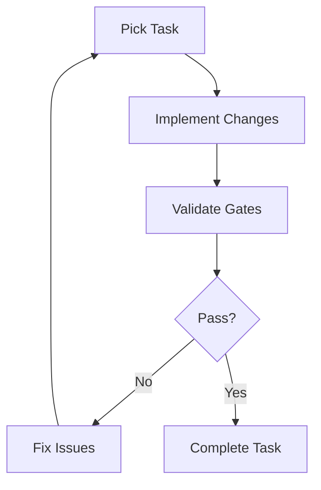

# CSA-in-a-Box Dev Loop — Ralph Loop

> **Note (2026-04-18):** This directory was renamed from `agent-harness/` to
> `dev-loop/` to disambiguate from the upcoming CSA Copilot product (which
> will live under `apps/copilot/`). This is a Ralph-loop CI/CD orchestrator
> for project development automation; it contains no LLM/agent runtime.


## Table of Contents

- [Overview](#-overview)
- [How It Works](#-how-it-works)
- [Task Lifecycle](#-task-lifecycle)
- [Validation Gates](#-validation-gates)
- [Integration Points](#-integration-points)
- [Configuration](#-configuration)
- [Archon Project](#-archon-project)
- [Related Documentation](#-related-documentation)

---

## 📋 Overview

The Ralph loop is an autonomous dev loop for iterative implementation, testing, and validation of the CSA-in-a-Box platform. It follows a task-driven development cycle where agents pick up Archon tasks, implement changes, validate them through automated gates, and iterate until validation passes.

---

## 🏗️ How It Works



---

## 🔄 Task Lifecycle

1. **Pick Task**: Query Archon for next `todo` task in the CSA project
2. **Mark Doing**: Update task status to `doing` in Archon
3. **Implement**: Make code changes following the task description
4. **Validate**: Run validation gates (see below)
5. **Fix/Iterate**: If validation fails, fix issues and re-validate (max 3 iterations)
6. **Complete**: Mark task as `done`, commit changes, pick next task
7. **Escalate**: If max iterations reached, mark for human review

---

## 🧪 Validation Gates

Located in `dev-loop/gates/`:

| Gate | Script | Runs When |
|------|--------|-----------|
| Bicep Lint | `validate-bicep.ps1` | Any `.bicep` file changed |
| Python Lint | `validate-python.ps1` | A tracked `.py`/`.ipynb` under `csa_platform/`, `dev-loop/`, `domains/`, `governance/`, `scripts/`, `tools/` changed |
| dbt Compile | `validate-dbt.ps1` | Any dbt model changed |
| Deployment | `validate-deployment.ps1` | Infrastructure changes |
| TypeScript | `validate-typescript.ps1` | Console `.ts`/`.tsx` that `tsconfig.build.json` compiles |
| All Gates | `validate-all.ps1` | Always (orchestrator) |
| Self-test | `gate-selftest.ps1` | On demand (`make validate-gates`) |

### What the Python gate covers, and what it does NOT

The population is declared in **one** place, `scripts/ci/python_lint_scope.py`,
and everything else derives from it — `validate-python.ps1` lints it,
`validate-all.ps1`'s Gate 2 trigger is asserted against it on every run, and
`test.yml` / `validate.yml` call the same module so CI and `make validate`
cannot grade different files again.

The definition, not a snapshot count: **every tracked `.py` and `.ipynb` under
`csa_platform/`, `dev-loop/`, `domains/`, `governance/`, `scripts/` and
`tools/`.** To see the live numbers, run the gate — it prints them — or:

```bash
python scripts/ci/python_lint_scope.py --print-scope | wc -l
python scripts/ci/python_lint_scope.py --print-trigger-globs
```

> Earlier revisions of this section, of the gate header and of `validate-all.ps1`
> all asserted a hardcoded **207**. It was wrong: ruff was opening **198** `.py`
> (plus 6 `.ipynb`). The nine-file gap is described below. A count in prose that
> nothing re-measures is the class of claim #3811 exists to kill, so the counts
> now come from the tool.

#### The gap that made "207" false

Two populations computed by two methods will eventually disagree:

* the **trigger** was git's view — tracked files under those directories;
* the **check** was ruff's view — files ruff found by *walking* those directories.

`.gitignore:34` contains `data/` and ruff respects gitignore, so ruff's walk
skipped `scripts/data/` entirely. Nine tracked files there carry **216** ruff
findings including 10 `F401`:

```
ruff check scripts domains tools csa_platform dev-loop                      -> RC=0
ruff check scripts domains tools csa_platform dev-loop --no-respect-gitignore
                                                       -> RC=1, 216 errors
```

The gate fired for a change to one of those files and then reported PASS having
read a different, clean set. So the gate no longer names directories on a ruff
command line. `python_lint_scope.py` hands ruff **explicit tracked paths** —
which ruff opens regardless of gitignore — and asserts every run that ruff
actually opened every one of them. That assertion is keyed to the observable
property, so the next `.gitignore` line or `extend-exclude` entry cannot quietly
subtract from the check side; it reds the gate and names the files.

Two side-effects worth knowing:

* untracked build junk under those trees (`.venv/`, `__pycache__/`, `site/`) is
  now excluded *because it is untracked*, which the directory walk only got
  right by accident of gitignore;
* `dev-loop/` is itself gitignored (`.gitignore:377`, 14 files force-added), so
  under the walk its check side could never have been non-empty — the first
  tracked `.py` added there would have been triggered and structurally
  unreadable. Under `git ls-files` + explicit paths it is readable.

#### The ratcheted debt

Those 216 findings are **not** fixed here. They are frozen per file at an exact
count in `RATCHET`, printed on every run, and enforced in both directions — a
finding added is a regression, a finding removed means the number has stopped
being true and the gate tells you what to write instead. A file absent from
`RATCHET` is held at zero, so the debt cannot grow by file count either. Paydown
is #3990; done is `RATCHET == {}`.

#### Still not covered

Tracked `.py` outside those six directories — `examples/`, `apps/`, `portal/`,
`tests/`, `azure-functions/`, `cli/`, `sdk/`. **A `.py` change confined to those
trees selects no gate and `make validate` reports NOT VERIFIED (exit 3)**, not a
green it did not earn; they stay with `test.yml`, `validate.yml` and
`sdk-contract.yml`. Widening this gate to `make lint`'s scope was measured and
deferred: `portal/` + `examples/` carry **758** findings under the pyproject
rules — debt-paydown work, not this gate's to absorb.

### What the TypeScript gate does NOT cover

`validate-typescript.ps1` is a **typecheck only** (`tsc --noEmit` against
`tsconfig.build.json`). Two gaps, stated rather than implied:

- **Console tests are not covered by `make validate`.** `tsconfig.build.json`
  excludes `**/*.test.ts(x)`, `**/*.spec.ts(x)`, `**/__tests__/**`, `e2e/**`,
  `**/*.uat.ts(x)` and the vitest/playwright configs. Measured: that project
  resolves 4107 files, **zero** of them tests, against 1559 `*.test.ts*` files in
  the tree. The gate's trigger mirrors those excludes, so a test-only change
  selects no gate and `make validate` reports **NOT VERIFIED (exit 3)** rather
  than a green it did not earn. Pointing the gate at `tsconfig.json` was measured
  and deferred: 901 pre-existing type errors, **all 901 in test files**.
- `next build`, eslint and vitest stay with the `fiab-console-ci` workflow, which
  remains the full console gate.

### Required vs optional

`validate-all.ps1` reads the `required:` field each gate already declares in
`config.yaml`. A gate that could not run fails the suite **only if it is
`required: true`** — so a machine without dbt or an Azure session stays green,
while a missing required leg is reported non-zero.

| Gate | `required` |
|------|-----------|
| bicep · python · typescript | `true` |
| dbt · deployment | `false` |

### Exit codes (a contract — callers read it)

| Code | Meaning |
|------|---------|
| 0 | Everything required that was selected got measured; nothing failed |
| 1 | A gate ran and found a problem |
| 2 | `-WhatIf`: nothing invoked, nothing measured |
| 3 | **NOT VERIFIED** — nothing was measured, **or** a `required: true` gate could not run, **or** the registry and the orchestrator disagree. Non-zero on purpose |
| 4 | The orchestrator's own in-process control failed; its answer is meaningless |

Exit 3 exists because `make validate` used to print `All gates passed!` and
return 0 on a change where zero gates ran (#3811). `make validate-gates` runs
the self-test that proves the verdicts still move with their inputs.

---

## 🔌 Integration Points

- **Archon MCP**: Task management, project tracking, document storage
- **GitHub Actions**: CI/CD pipeline execution
- **Azure**: `az deployment what-if` for deployment validation
- **Bicep CLI**: Template compilation and linting
- **ruff**: Python linting
- **dbt**: Data model compilation and testing

---

## ⚙️ Configuration

See `dev-loop/config.yaml` for loop settings:
- Max iterations per task
- Validation gate mappings
- Human review triggers
- Escalation rules

---

## 📋 Archon Project

Project ID: `1bd59749-db0a-4009-82c7-f1a56d24a820`

Query tasks: `find_tasks(filter_by="project", filter_value="1bd59749-db0a-4009-82c7-f1a56d24a820")`

---

## 🔗 Related Documentation

- [Architecture Overview](../docs/ARCHITECTURE.md) — Platform architecture reference
- [Getting Started](../docs/GETTING_STARTED.md) — Platform setup and onboarding
- [Contributing](../CONTRIBUTING.md) — Development guidelines and PR process
