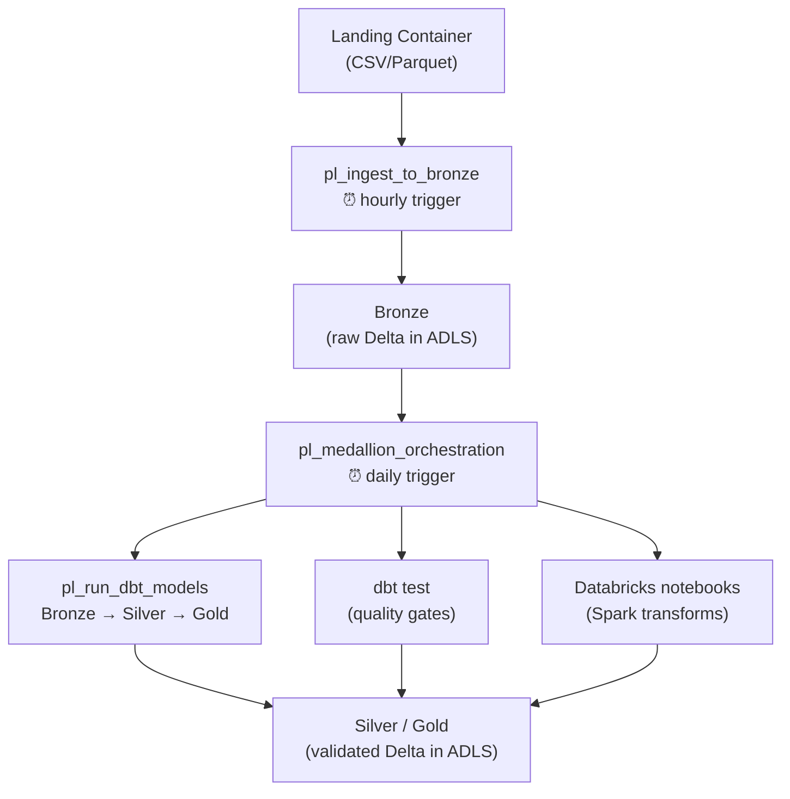

[Home](../README.md) > [Docs](./) > **ADF Setup**

# Azure Data Factory Setup Guide

> **Last Updated:** 2026-04-15 | **Status:** Active | **Audience:** Data Engineers

> [!NOTE]
> **Quick Summary**: Deploy and manage ADF pipeline artifacts for the CSA-in-a-Box platform, including linked services, datasets, pipelines, triggers, and CI/CD integration with Purview lineage.

## 📑 Table of Contents

- [🏗️ Architecture](#-architecture)
- [📎 Prerequisites](#-prerequisites)
- [📁 Pipeline Artifacts](#-pipeline-artifacts)
- [📦 Deployment](#-deployment)
- [⚙️ Linked Service Configuration](#️-linked-service-configuration)
- [⚙️ Trigger Configuration](#️-trigger-configuration)
- [⚙️ Pipeline Parameters](#️-pipeline-parameters)
- [🔄 CI/CD Integration](#-cicd-integration)
- [📊 Purview Lineage](#-purview-lineage)
- [🔧 Troubleshooting](#-troubleshooting)

---

## 🏗️ Architecture

ADF orchestrates the batch data pipeline:



---

## 📎 Prerequisites

- [ ] **ADF instance deployed** via Bicep (`deploy/bicep/DLZ/main.bicep`)
- [ ] **ADLS Gen2 storage** with `landing`, `bronze`, `silver`, `gold` containers
- [ ] **Databricks workspace** with a running cluster or SQL warehouse
- [ ] **Key Vault** with connection secrets stored
- [ ] **Azure CLI** >= 2.50 with the `datafactory` extension

```bash
az extension add --name datafactory
```

---

## 📁 Pipeline Artifacts

All ADF definitions live under `domains/*/pipelines/adf/`:

```text
domains/shared/pipelines/adf/
  linkedServices/
    ls_adls_gen2.json          # ADLS Gen2 via managed identity
    ls_databricks.json         # Databricks workspace
  datasets/
    ds_source_delimited.json   # Parameterized CSV source
    ds_adls_parquet.json       # Parquet format
    ds_adls_delta.json         # Delta Lake format
  pl_ingest_to_bronze.json     # Raw file ingestion
  pl_medallion_orchestration.json  # Bronze -> Silver -> Gold
  pl_run_dbt_models.json       # dbt via Databricks
  triggers/
    tr_daily_medallion.json    # Daily 06:00 UTC
    tr_hourly_ingest.json      # Hourly ingestion

domains/sales/pipelines/adf/
  pl_sales_daily_load.json     # Sales-specific daily pipeline
```

---

## 📦 Deployment

### Automated deployment (recommended)

The `deploy-adf.sh` script deploys all artifacts in dependency order:

```bash
# Dry run — shows what would be deployed
./scripts/deploy/deploy-adf.sh \
    --factory-name csadlzdevdf \
    --resource-group rg-csadlz-dev \
    --dry-run

# Deploy for real
./scripts/deploy/deploy-adf.sh \
    --factory-name csadlzdevdf \
    --resource-group rg-csadlz-dev
```

Or via Make:

```bash
make deploy-adf FACTORY_NAME=csadlzdevdf RESOURCE_GROUP=rg-csadlz-dev
```

> [!IMPORTANT]
> **Deployment order** (handled automatically):
> 1. Linked Services (connections to ADLS, Databricks, Key Vault)
> 2. Datasets (parameterized data shapes)
> 3. Pipelines (orchestration logic)
> 4. Triggers (schedules — started automatically after creation)

### Manual deployment (Azure Portal)

- [ ] Open your Data Factory in the Azure Portal
- [ ] Go to **Author** > **Manage** > **Linked Services**
- [ ] Click **+ New** and import each `ls_*.json` file
- [ ] Repeat for Datasets, Pipelines, and Triggers

---

## ⚙️ Linked Service Configuration

### ls_adls_gen2 — Azure Data Lake Storage

Uses the ADF managed identity for authentication (no keys needed).

**Required setup:**
- [ ] Assign `Storage Blob Data Contributor` to the ADF managed identity on
   the ADLS storage account
- [ ] The ADF Bicep module outputs `managedIdentityPrincipalId` for this purpose

### ls_databricks — Databricks Workspace

Uses Key Vault to retrieve the Databricks access token.

**Required setup:**
- [ ] Generate a personal access token (PAT) in Databricks
- [ ] Store it in Key Vault as secret `databricks-token`
- [ ] Update the linked service JSON if your workspace URL differs

---

## ⚙️ Trigger Configuration

| Trigger | Schedule | Pipeline | Purpose |
|---------|----------|----------|---------|
| `tr_hourly_ingest` | Every hour | `pl_ingest_to_bronze` | Pick up new landing files |
| `tr_daily_medallion` | Daily 06:00 UTC | `pl_medallion_orchestration` | Full Bronze→Silver→Gold refresh |

### ⌨️ Managing triggers

```bash
# Stop a trigger
az datafactory trigger stop \
    --factory-name csadlzdevdf \
    --resource-group rg-csadlz-dev \
    --trigger-name tr_daily_medallion

# Start a trigger
az datafactory trigger start \
    --factory-name csadlzdevdf \
    --resource-group rg-csadlz-dev \
    --trigger-name tr_daily_medallion
```

---

## ⚙️ Pipeline Parameters

### pl_ingest_to_bronze

| Parameter | Type | Default | Description |
|-----------|------|---------|-------------|
| `sourceContainer` | string | `landing` | Source ADLS container |
| `sourceFolder` | string | — | Folder within the source container |
| `targetContainer` | string | `bronze` | Target ADLS container |
| `targetFolder` | string | — | Folder within the target container |

### pl_medallion_orchestration

| Parameter | Type | Default | Description |
|-----------|------|---------|-------------|
| `environment` | string | `dev` | Target environment (dev/staging/prod) |
| `fullRefresh` | bool | `false` | Force full rebuild (skip incremental) |
| `alertWebhookUrl` | string | — | Teams webhook for failure alerts |

### pl_run_dbt_models

| Parameter | Type | Default | Description |
|-----------|------|---------|-------------|
| `dbtCommand` | string | `run` | dbt command: run, test, build, seed |
| `dbtTarget` | string | `dev` | dbt profile target |
| `dbtModels` | string | — | Model selector (e.g., `+gld_revenue`) |
| `fullRefresh` | bool | `false` | Pass `--full-refresh` to dbt |

---

## 🔄 CI/CD Integration

The deploy workflow (`.github/workflows/deploy.yml`) deploys Bicep
infrastructure. After infrastructure is up, run the ADF deployment:

```yaml
# Add to deploy.yml after DLZ Bicep deployment
- name: Deploy ADF pipelines
  run: |
    ./scripts/deploy/deploy-adf.sh \
      --factory-name ${{ env.FACTORY_NAME }} \
      --resource-group ${{ env.RESOURCE_GROUP }}
```

---

## 📊 Purview Lineage

ADF natively pushes lineage to Microsoft Purview when configured. The
Bicep module accepts a `purviewAccountId` parameter that wires this up
automatically. See [Purview integration](#) in the architecture docs.

---

## 🔧 Troubleshooting

See the ADF section in [TROUBLESHOOTING.md](TROUBLESHOOTING.md).

---

## 🔗 Related Documentation

- [Databricks Guide](DATABRICKS_GUIDE.md) — Databricks workspace setup and dbt integration
- [Self-Hosted IR](SELF_HOSTED_IR.md) — Self-Hosted Integration Runtime for on-premises connectivity
- [Getting Started](GETTING_STARTED.md) — Platform deployment quickstart
