# CSA-in-a-Box Architecture

A comprehensive architecture reference for Cloud-Scale Analytics in a Box — an
open-source "build-your-own Microsoft Fabric" using Azure PaaS services and
open-source tooling.

## High-Level Architecture

```mermaid
graph TB
    %% ─── Data Sources ───────────────────────────────────────────────
    subgraph Sources["Data Sources"]
        direction LR
        Batch["Batch Sources<br/>(SQL, API, Files)"]
        Stream["Streaming Sources<br/>(IoT, Events)"]
        OpenData["Open Data APIs<br/>(USDA, NOAA, EPA, Census)"]
    end

    %% ─── Data Management Landing Zone ────────────────────────────────
    subgraph DMLZ["Data Management Landing Zone"]
        direction TB
        Purview["Microsoft Purview<br/>Catalog &amp; Governance"]
        KV["Azure Key Vault<br/>Secrets Management"]
        Marketplace["Data Marketplace API<br/>Discovery &amp; Access"]
        GovFramework["Governance Framework<br/>Classification, Lineage, MDM"]
        APIM["API Management<br/>Gateway &amp; Rate Limiting"]
    end

    %% ─── Data Landing Zone ──────────────────────────────────────────
    subgraph DLZ["Data Landing Zone(s)"]
        direction TB

        subgraph Ingest["Ingestion Layer"]
            ADF["Azure Data Factory<br/>Orchestration"]
            MetaFW["Metadata Framework<br/>Auto-generated Pipelines"]
            EventHub["Event Hubs<br/>Streaming Ingestion"]
            IoTHub["IoT Hub + DPS<br/>Device Management"]
        end

        subgraph Storage["Storage — OneLake Pattern"]
            direction LR
            Bronze["ADLS Gen2<br/>Bronze (Raw)"]
            Silver["ADLS Gen2<br/>Silver (Validated)"]
            Gold["ADLS Gen2<br/>Gold (Business)"]
        end

        subgraph Compute["Compute Layer"]
            Databricks["Azure Databricks<br/>Spark + Unity Catalog"]
            Synapse["Azure Synapse<br/>SQL Pools + Spark"]
            dbt["dbt Core<br/>Medallion Transforms"]
        end

        subgraph RealTime["Real-Time Analytics"]
            ADX["Azure Data Explorer<br/>KQL Engine"]
            ASA["Stream Analytics<br/>Windowed Aggregation"]
        end

        subgraph AI["AI / ML Layer"]
            AzureML["Azure ML<br/>Model Training"]
            AOAI["Azure OpenAI<br/>GPT-4, Embeddings"]
            RAG["RAG Patterns<br/>Domain Knowledge"]
        end
    end

    %% ─── Platform Services ──────────────────────────────────────────
    subgraph Platform["Platform Services"]
        direction TB
        DataActivator["Data Activator<br/>Event-driven Alerts"]
        DirectLake["Direct Lake<br/>Power BI over Delta"]
        SharedSvc["Shared Services<br/>Azure Functions"]
        OSSAlt["OSS Alternatives<br/>Gov Gap Fillers"]
    end

    %% ─── Consumer Layer ─────────────────────────────────────────────
    subgraph Consumers["Consumer Layer"]
        direction LR
        PowerBI["Power BI<br/>Dashboards &amp; Reports"]
        Portal["Data Onboarding Portal<br/>4 Implementations"]
        APIs["REST APIs<br/>Data Products"]
        Teams["Teams Alerts<br/>Webhooks"]
    end

    %% ─── Connections ────────────────────────────────────────────────
    Batch --> ADF
    Stream --> EventHub
    Stream --> IoTHub
    OpenData --> ADF
    IoTHub --> EventHub

    ADF --> Bronze
    EventHub --> Bronze
    MetaFW --> ADF

    Bronze --> dbt
    dbt --> Silver
    Silver --> dbt
    dbt --> Gold

    Databricks --> Bronze
    Databricks --> Silver
    Databricks --> Gold
    Synapse --> Gold

    EventHub --> ADX
    EventHub --> ASA
    ASA --> Gold
    ASA --> ADX

    Gold --> PowerBI
    Gold --> APIs
    Gold --> DirectLake
    DirectLake --> PowerBI
    ADX --> PowerBI

    Purview --> Bronze
    Purview --> Silver
    Purview --> Gold
    Marketplace --> Purview
    GovFramework --> Purview

    AOAI --> RAG
    AzureML --> Gold

    DataActivator --> Teams
    SharedSvc --> ADF

    Portal --> APIM
    APIM --> Marketplace
    APIM --> ADF

    KV --> ADF
    KV --> Databricks
    KV --> SharedSvc

    %% ─── Styling ────────────────────────────────────────────────────
    classDef source fill:#e1f5fe,stroke:#0288d1
    classDef dmlz fill:#f3e5f5,stroke:#7b1fa2
    classDef dlz fill:#e8f5e9,stroke:#388e3c
    classDef platform fill:#fff3e0,stroke:#f57c00
    classDef consumer fill:#fce4ec,stroke:#c62828

    class Batch,Stream,OpenData source
    class Purview,KV,Marketplace,GovFramework,APIM dmlz
    class ADF,MetaFW,EventHub,IoTHub,Bronze,Silver,Gold,Databricks,Synapse,dbt,ADX,ASA,AzureML,AOAI,RAG dlz
    class DataActivator,DirectLake,SharedSvc,OSSAlt platform
    class PowerBI,Portal,APIs,Teams consumer
```



## Architecture Layers

### 1. Data Management Landing Zone (DMLZ)

The DMLZ provides centralized governance and shared services across all Data
Landing Zones. It is deployed once per environment and manages cross-cutting
concerns.

**Components:**

| Component | Service | Purpose |
|-----------|---------|---------|
| Data Catalog | Microsoft Purview | Asset discovery, classification, lineage tracking |
| Secrets Management | Azure Key Vault | Connection strings, tokens, certificates |
| Data Marketplace | Custom FastAPI + Purview | Self-service data product discovery and access requests |
| Governance Framework | Purview + Custom | Sensitivity labels, automated classification, MDM |
| API Gateway | API Management | Rate limiting, authentication, routing for all platform APIs |

**Deployment:** `deploy/bicep/DMLZ/main.bicep`

### 2. Data Landing Zone (DLZ)

Each DLZ represents a domain boundary — a self-contained analytics environment
with its own storage, compute, and pipelines. Organizations deploy one or more
DLZs based on data domain segmentation (e.g., Finance, Health, Environmental).

#### Storage — OneLake Pattern

The medallion architecture uses ADLS Gen2 containers mapped to quality tiers:

| Layer | Container | Format | Purpose |
|-------|-----------|--------|---------|
| Bronze | `bronze/` | Parquet / JSON / Avro | Raw ingestion, append-only, immutable |
| Silver | `silver/` | Delta Lake | Validated, deduplicated, typed, conformed |
| Gold | `gold/` | Delta Lake | Business-ready aggregates, dimensions, facts |

This mirrors Microsoft Fabric's OneLake with Unity Catalog providing the unified
metadata layer across all storage accounts.

#### Ingestion Layer

- **Azure Data Factory** — Batch orchestration with parameterized, metadata-driven
  pipelines. The metadata framework (`platform/metadata-framework/`) auto-generates
  ADF pipelines from source registration YAML.
- **Event Hubs** — Kafka-compatible streaming ingestion for IoT, telemetry, and
  real-time events. Supports Capture to ADLS for cold-path archival.
- **IoT Hub + DPS** — Managed device provisioning and telemetry routing for IoT
  scenarios (weather stations, AQI sensors, industrial equipment).

#### Compute Layer

- **Azure Databricks** — Primary Spark engine with Unity Catalog for fine-grained
  access control. Used for complex transformations, ML feature engineering, and
  interactive analytics.
- **Azure Synapse** — SQL-based analytics with dedicated and serverless SQL pools.
  Multi-workspace isolation per organization when needed.
- **dbt Core** — SQL-first transformations implementing the medallion pattern.
  Each domain has its own dbt project with Bronze, Silver, and Gold models.

#### Real-Time Analytics

- **Azure Data Explorer (ADX)** — Sub-second KQL queries over streaming data.
  Used for IoT dashboards, anomaly detection, and operational monitoring.
- **Stream Analytics** — Windowed aggregation (tumbling, hopping, sliding) with
  built-in anomaly detection via `AnomalyDetection_SpikeAndDip`.

#### AI / ML Layer

- **Azure ML** — Model training, registry, and deployment. Integrated with
  Databricks for feature store access.
- **Azure OpenAI** — GPT-4 and embedding models for document enrichment,
  classification, summarization, and RAG-based Q&A.
- **RAG Patterns** — Domain-specific retrieval-augmented generation using
  vector search over gold-layer data products.

**Deployment:** `deploy/bicep/DLZ/main.bicep`

### 3. Platform Services

Platform services extend the base landing zones with Fabric-equivalent
capabilities. Each component is independently deployable.

| Service | Fabric Equivalent | Location |
|---------|-------------------|----------|
| OneLake Pattern | OneLake | `platform/onelake-pattern/` |
| Data Activator | Data Activator | `platform/data-activator/` |
| Direct Lake | Direct Lake mode | `platform/direct-lake/` |
| Data Marketplace | Data Sharing | `platform/data_marketplace/` |
| Metadata Framework | Metadata-driven ADF | `platform/metadata-framework/` |
| AI Integration | Copilot / AI | `platform/ai_integration/` |
| Shared Services | Shared Functions | `platform/shared-services/` |
| OSS Alternatives | N/A (Gov gaps) | `platform/oss-alternatives/` |
| Multi-Synapse | Multi-workspace | `platform/multi-synapse/` |
| Governance | Purview Integration | `platform/governance/` |

See [PLATFORM_SERVICES.md](PLATFORM_SERVICES.md) for detailed deployment guides.

### 4. Consumer Layer

The consumer layer exposes processed data to end users and downstream systems.

- **Power BI** — Direct Lake mode connects Power BI directly to Delta Lake files
  in ADLS Gen2 via Databricks SQL endpoints, eliminating data import overhead.
- **Data Onboarding Portal** — Four implementations (PowerApps, React/Next.js,
  Static Web Apps, Kubernetes) sharing a common FastAPI backend.
- **REST APIs** — Data product APIs exposed through API Management with OAuth2
  authentication and rate limiting.
- **Teams Alerts** — Webhook-based notifications for pipeline failures, data
  quality violations, and anomaly detection alerts.

### 5. Azure Government Parallel

Every component in CSA-in-a-Box is designed to run in Azure Government
(FedRAMP High, IL4, IL5). Government deployments use:

- Separate Bicep parameter files (`deploy/bicep/gov/`)
- Government-specific endpoints (`.us` instead of `.com`)
- Compliance tagging (FedRAMP level, FISMA impact, data classification)
- OSS alternatives for services not yet available in Gov

See [GOV_SERVICE_MATRIX.md](GOV_SERVICE_MATRIX.md) for the full service
availability matrix.

## Data Flow

### Batch Data Flow

```
Source → ADF Copy Activity → Bronze (raw Parquet/JSON)
    → dbt Bronze model (typed, partitioned)
    → dbt Silver model (validated, deduplicated, flagged)
    → dbt Gold model (business aggregates, dimensions, facts)
    → Power BI / API / Data Product
```

### Streaming Data Flow

```
IoT Device → IoT Hub → Event Hub
    ├── Hot Path:  Event Hub → ADX (sub-second KQL)
    ├── Warm Path: Event Hub → Stream Analytics → Power BI / ADX
    └── Cold Path: Event Hub Capture → ADLS Bronze → dbt → Gold
```

### Data Governance Flow

```
Source Registration → Purview Scan → Auto-Classification
    → Sensitivity Labels → Access Policies
    → Lineage Captured (ADF + dbt + Databricks)
    → Data Marketplace Discovery → Access Request → Approval → Grant
```

## Vertical Examples

CSA-in-a-Box includes 9 vertical-specific implementations that demonstrate
end-to-end patterns for real agencies and industries:

| Vertical | Directory | Key Patterns |
|----------|-----------|-------------|
| USDA (NASS Agriculture) | `examples/usda/` | API ingestion, crop analytics, dbt medallion |
| DOT (Transportation) | `examples/dot/` | Safety data, geospatial, FMCSA/NHTSA |
| USPS (Postal Service) | `examples/usps/` | Address validation, delivery metrics |
| NOAA (Weather/Climate) | `examples/noaa/` | Weather station streaming, climate analysis |
| EPA (Environmental) | `examples/epa/` | AQI sensors, compliance monitoring |
| Commerce (Census/BEA) | `examples/commerce/` | Census data, economic indicators |
| Interior (USGS/BLM) | `examples/interior/` | Geospatial, land management |
| Tribal Health (BIA/IHS) | `examples/tribal-health/` | HIPAA, tribal sovereignty, health analytics |
| Casino Analytics | `examples/casino-analytics/` | Slot telemetry, revenue, Title 31 |
| IoT Streaming | `examples/iot-streaming/` | Generic IoT, real-time, anomaly detection |

Each vertical includes seed data generators, dbt models, deployment templates,
and domain-specific documentation.

## Repository Structure

```
csa-inabox/
├── deploy/                     # Infrastructure as Code
│   ├── bicep/
│   │   ├── LandingZone - ALZ/  # Azure Landing Zone (Management + Connectivity)
│   │   ├── DMLZ/               # Data Management Landing Zone
│   │   ├── DLZ/                # Data Landing Zone
│   │   ├── gov/                # Azure Government templates
│   │   └── shared/             # Shared Bicep modules
│   ├── terraform/              # Terraform alternative
│   └── scripts/                # Deployment orchestration
│
├── domains/                    # Domain-specific data assets
│   ├── shared/                 # Core domain (customers, orders, products)
│   ├── finance/                # Finance domain (invoices, payments)
│   ├── inventory/              # Inventory domain (stock, warehouses)
│   └── sales/                  # Sales domain (orders, revenue)
│
├── examples/                   # Vertical implementations
│   ├── usda/                   # USDA agriculture analytics
│   ├── dot/                    # DOT transportation safety
│   ├── noaa/                   # NOAA weather & climate
│   ├── epa/                    # EPA environmental monitoring
│   ├── iot-streaming/          # Generic IoT & streaming patterns
│   └── ...                     # 5 more verticals
│
├── platform/                   # Fabric-equivalent platform services
│   ├── onelake-pattern/        # Unified data lake
│   ├── data-activator/         # Event-driven alerting
│   ├── direct-lake/            # Power BI Direct Lake
│   ├── data_marketplace/       # Data product marketplace
│   ├── metadata-framework/     # Auto-pipeline generation
│   ├── ai_integration/         # RAG, enrichment, model serving
│   ├── shared-services/        # Reusable Azure Functions
│   └── oss-alternatives/       # OSS for Gov gaps
│
├── portal/                     # Data onboarding portal (4 frontends)
│   ├── shared/                 # Shared FastAPI backend
│   ├── react-webapp/           # React/Next.js frontend
│   ├── static-webapp/          # Azure Static Web Apps frontend
│   ├── powerapps/              # Power Apps frontend
│   └── kubernetes/             # AKS-deployed frontend
│
├── governance/                 # Cross-cutting governance
│   ├── common/                 # Logging, validation, contracts
│   ├── contracts/              # Data product contract framework
│   ├── purview/                # Catalog, glossary, classification
│   └── dataquality/            # Great Expectations quality checks
│
├── monitoring/                 # Observability
│   ├── grafana/dashboards/     # Pipeline, quality, infra dashboards
│   └── alerts/                 # Budget and operational alert templates
│
├── docs/                       # Documentation
├── tests/                      # Unit and integration tests
└── scripts/                    # Utility scripts
```

## Technology Decision Matrix

| Concern | Primary Choice | Alternative | Rationale |
|---------|---------------|-------------|-----------|
| Batch Orchestration | Azure Data Factory | Airflow on AKS | ADF is native, metadata-driven |
| Streaming | Event Hubs + ADX | Kafka on AKS | Event Hubs has Kafka API compatibility |
| Transformation | dbt Core + Databricks | Synapse Spark | dbt provides testability and lineage |
| Storage | ADLS Gen2 (Delta) | Iceberg on ADLS | Delta has best Databricks integration |
| Governance | Microsoft Purview | Apache Atlas | Purview integrates with Azure ecosystem |
| ML / AI | Azure ML + OpenAI | MLflow + Ollama | Azure ML for managed, OSS for Gov |
| Real-time Queries | Azure Data Explorer | ClickHouse on AKS | ADX is native, managed |
| API Gateway | API Management | Kong on AKS | APIM integrates with Entra ID |
| Secrets | Key Vault | HashiCorp Vault | Key Vault is native to Azure |
| IaC | Bicep | Terraform | Bicep is Azure-native, Terraform for multi-cloud |

## Security Architecture

All deployments enforce:

- **Network isolation** — Private endpoints for all PaaS services, no public access
- **Identity-based access** — Managed identities, no shared keys in production
- **Encryption** — At rest (platform-managed or CMK) and in transit (TLS 1.2+)
- **RBAC** — Least-privilege role assignments per domain
- **Audit logging** — Diagnostic settings to Log Analytics workspace
- **Data classification** — Automated PII detection and sensitivity labeling via Purview

## Next Steps

- [GETTING_STARTED.md](GETTING_STARTED.md) — Prerequisites and deployment walkthrough
- [QUICKSTART.md](QUICKSTART.md) — 60-minute hands-on tutorial
- [PLATFORM_SERVICES.md](PLATFORM_SERVICES.md) — Platform component deep-dive
- [GOV_SERVICE_MATRIX.md](GOV_SERVICE_MATRIX.md) — Azure Government compatibility
