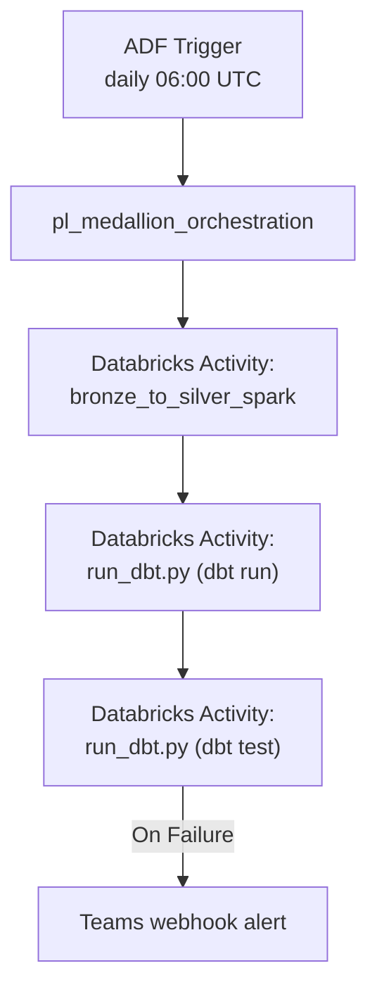

[Home](../README.md) > [Docs](./) > **Databricks Guide**

# Databricks Guide

!!! note
**Quick Summary**: Setting up and operating Databricks within CSA-in-a-Box — workspace configuration, cluster sizing (dev vs prod), notebook orchestration (3 patterns), dbt integration with Unity Catalog, and troubleshooting common issues.

This guide covers setting up and operating Databricks within the
CSA-in-a-Box platform, including workspace configuration, notebook
orchestration, dbt integration, and Unity Catalog.

## 📑 Table of Contents

- [⚙️ Workspace Setup](#️-workspace-setup)
    - [Prerequisites](#prerequisites)
    - [Cluster Configuration](#cluster-configuration)
    - [Required Spark configuration](#required-spark-configuration)
- [📁 Notebook Inventory](#-notebook-inventory)
    - [Naming conventions](#naming-conventions)
- [🔄 Notebook Orchestration](#-notebook-orchestration)
    - [Pattern 1: dbutils.notebook.run() (simple)](#pattern-1-dbutilsnotebookrun-simple)
    - [Pattern 2: ADF orchestration (production)](#pattern-2-adf-orchestration-production)
    - [Pattern 3: Databricks Workflows (native)](#pattern-3-databricks-workflows-native)
- [🗄️ dbt on Databricks](#️-dbt-on-databricks)
    - [Profile configuration](#profile-configuration)
    - [Environment variables](#environment-variables)
    - [Running dbt from a notebook](#running-dbt-from-a-notebook)
    - [Running dbt locally](#running-dbt-locally)
- [📊 Unity Catalog Setup](#-unity-catalog-setup)
- [🔧 Troubleshooting](#-troubleshooting)

---

## ⚙️ Workspace Setup

### Prerequisites

- [ ] Databricks workspace deployed via Bicep (`deploy/bicep/DLZ/modules/databricks/`)
- [ ] ADLS Gen2 storage with Bronze/Silver/Gold containers
- [ ] Key Vault with access tokens and connection secrets
- [ ] Unity Catalog metastore (see [Unity Catalog Setup](#-unity-catalog-setup))

### Cluster Configuration

**Interactive cluster (development):**

| Setting          | Value                | Notes                 |
| ---------------- | -------------------- | --------------------- |
| Runtime          | 14.3 LTS (Spark 3.5) | Use LTS for stability |
| Node Type        | Standard_DS3_v2      | 4 cores, 14 GB (dev)  |
| Min Workers      | 1                    | Auto-scale from 1     |
| Max Workers      | 4                    | Cap for cost control  |
| Auto-termination | 30 minutes           | Save costs            |
| Spark Config     | See below            | ADLS + OpenLineage    |

**Job cluster (production):**

| Setting        | Value                | Notes           |
| -------------- | -------------------- | --------------- |
| Runtime        | 14.3 LTS (Spark 3.5) | Match dev       |
| Node Type      | Standard_DS4_v2      | 8 cores, 28 GB  |
| Min Workers    | 2                    | Higher baseline |
| Max Workers    | 8                    | Scale for load  |
| Spot instances | Yes, 50%             | Cost savings    |

### Required Spark configuration

Add these to your cluster's Spark Config:

```text
# ADLS Gen2 access via managed identity
spark.hadoop.fs.azure.account.auth.type.<STORAGE>.dfs.core.windows.net OAuth
spark.hadoop.fs.azure.account.oauth.provider.type.<STORAGE>.dfs.core.windows.net org.apache.hadoop.fs.azurebfs.oauth2.MsiTokenProvider

# Delta Lake defaults
spark.databricks.delta.preview.enabled true
spark.databricks.delta.optimizeWrite.enabled true
spark.databricks.delta.autoCompact.enabled true

# OpenLineage (lineage to Purview)
spark.openlineage.transport.type http
spark.openlineage.transport.url https://<PURVIEW_ACCOUNT>.purview.azure.com
spark.openlineage.namespace csa-inabox-databricks
spark.extraListeners io.openlineage.spark.agent.OpenLineageSparkListener
```

!!! important
Replace `<STORAGE>` with your ADLS account name and `<PURVIEW_ACCOUNT>`
with your Purview account name.

---

## 📁 Notebook Inventory

All notebooks live under `domains/shared/notebooks/databricks/`:

| Notebook                     | Purpose                                     | Layer           |
| ---------------------------- | ------------------------------------------- | --------------- |
| `bronze_to_silver_spark.py`  | Schema enforcement, dedup, validation flags | Bronze → Silver |
| `silver_to_gold_spark.py`    | Business aggregations, star schema          | Silver → Gold   |
| `delta_lake_optimization.py` | OPTIMIZE, VACUUM, Z-ORDER maintenance       | All layers      |
| `data_quality_monitor.py`    | Contract validation, SLA monitoring         | Silver/Gold     |
| `unity_catalog_setup.py`     | Catalog, schema, permissions setup          | Infrastructure  |
| `orchestration/run_dbt.py`   | Universal dbt runner                        | dbt             |

### Naming conventions

- `<source>_to_<target>_spark.py` for ETL notebooks
- `<action>_<subject>.py` for utility notebooks
- Prefix with domain name for domain-specific: `sales_daily_transform.py`

---

## 🔄 Notebook Orchestration

### Pattern 1: dbutils.notebook.run() (simple)

Chain notebooks within a single Databricks job:

```python
# Master orchestration notebook
results = {}

# Step 1: Bronze -> Silver
results["b2s"] = dbutils.notebook.run(
    "bronze_to_silver_spark",
    timeout_seconds=3600,
    arguments={"domain": "sales", "mode": "incremental"}
)

# Step 2: Silver -> Gold
results["s2g"] = dbutils.notebook.run(
    "silver_to_gold_spark",
    timeout_seconds=3600,
    arguments={"domain": "sales"}
)

# Step 3: Data quality
results["dq"] = dbutils.notebook.run(
    "data_quality_monitor",
    timeout_seconds=1800,
    arguments={"suite": "all"}
)

# Step 4: Delta maintenance (weekly)
from datetime import datetime
if datetime.now().weekday() == 6:  # Sunday
    results["optimize"] = dbutils.notebook.run(
        "delta_lake_optimization",
        timeout_seconds=7200,
        arguments={"tables": "all", "vacuum_hours": "168"}
    )

print(results)
```

### Pattern 2: ADF orchestration (production)

The `pl_medallion_orchestration` ADF pipeline calls notebooks via the
Databricks linked service:



See [ADF_SETUP.md](ADF_SETUP.md) for pipeline configuration.

### Pattern 3: Databricks Workflows (native)

Create a multi-task job in the Databricks UI:

- [ ] Go to **Workflows** > **Create Job**
- [ ] Add tasks in order:
    - Task 1: `bronze_to_silver_spark` (notebook task)
    - Task 2: `run_dbt` (depends on Task 1)
    - Task 3: `data_quality_monitor` (depends on Task 2)
    - Task 4: `delta_lake_optimization` (depends on Task 2, weekly schedule)
- [ ] Set the schedule to daily
- [ ] Configure email/webhook alerts on failure

---

## 🗄️ dbt on Databricks

### Profile configuration

The dbt profile at `domains/shared/dbt/profiles.yml` defines the
Databricks connection:

```yaml
csa_analytics:
    target: dev
    outputs:
        dev:
            type: databricks
            host: "{{ env_var('DBT_DATABRICKS_HOST') }}"
            http_path: "{{ env_var('DBT_DATABRICKS_HTTP_PATH') }}"
            token: "{{ env_var('DBT_DATABRICKS_TOKEN') }}"
            catalog: csa_analytics
            schema: dev
            threads: 4

        prod:
            type: databricks
            host: "{{ env_var('DBT_DATABRICKS_HOST') }}"
            http_path: "{{ env_var('DBT_DATABRICKS_HTTP_PATH') }}"
            token: "{{ env_var('DBT_DATABRICKS_TOKEN') }}"
            catalog: csa_analytics
            schema: prod
            threads: 8
```

### Environment variables

Set these in your Databricks cluster environment or local shell:

```bash
export DBT_DATABRICKS_HOST="adb-1234567890.12.azuredatabricks.net"
export DBT_DATABRICKS_HTTP_PATH="/sql/1.0/warehouses/abc123"
export DBT_DATABRICKS_TOKEN="dapi..."
```

### Running dbt from a notebook

The `orchestration/run_dbt.py` notebook wraps dbt CLI execution with
parameter validation, timeout handling, and result parsing:

```python
# Databricks notebook
dbutils.widgets.text("dbt_command", "run")
dbutils.widgets.text("dbt_target", "dev")
dbutils.widgets.text("dbt_models", "")

# run_dbt.py handles:
# - Parameter validation (prevents shell injection)
# - dbt CLI execution via subprocess
# - run_results.json parsing for summaries
# - 1-hour timeout with configurable retries
```

### Running dbt locally

```bash
cd domains/shared/dbt
dbt compile --profiles-dir .    # Verify SQL compiles
dbt seed --profiles-dir .       # Load sample data
dbt run --profiles-dir .        # Run models
dbt test --profiles-dir .       # Run tests
dbt snapshot --profiles-dir .   # Run SCD Type 2 snapshots
```

---

## 📊 Unity Catalog Setup

The `unity_catalog_setup.py` notebook configures:

- [ ] **Catalog creation** — `csa_analytics` catalog
- [ ] **Schema per domain** — `sales`, `finance`, `shared`
- [ ] **Schema per layer** — `bronze`, `silver`, `gold`, `snapshots`
- [ ] **RBAC permissions** — per-domain access controls mapped to AAD groups
- [ ] **External locations** — ADLS Gen2 paths for Delta tables

Run it once per environment:

```python
dbutils.notebook.run(
    "unity_catalog_setup",
    timeout_seconds=600,
    arguments={"environment": "dev", "dry_run": "true"}
)
```

---

## 🔧 Troubleshooting

### "Cluster not found" or "Cluster terminated"

- [ ] Check the cluster is running in **Compute** tab
- [ ] Verify the HTTP path matches an active SQL warehouse or cluster
- [ ] For auto-terminated clusters, start them manually or increase the timeout

### "Permission denied" on ADLS paths

- [ ] Verify the cluster's managed identity has `Storage Blob Data Contributor`
      on the ADLS storage account
- [ ] Check the Spark config includes the correct OAuth settings
- [ ] For Unity Catalog, verify the external location is registered

### "Module not found: governance"

The governance package must be installed on the cluster:

```bash
# In a notebook cell
%pip install /Workspace/Repos/csa-inabox/governance
```

Or add it to the cluster's Libraries configuration.

### dbt connection timeout

- [ ] Verify the SQL warehouse is running
- [ ] Check the `DBT_DATABRICKS_HTTP_PATH` matches the warehouse's HTTP path
- [ ] Increase `connect_retries` in profiles.yml if the warehouse is auto-starting

### Notebook run timeout

The default timeout for `dbutils.notebook.run()` is 48 hours. Set
explicit timeouts to fail fast:

```python
dbutils.notebook.run("heavy_job", timeout_seconds=3600)  # 1 hour max
```

See the general [TROUBLESHOOTING.md](TROUBLESHOOTING.md) for more issues.

---

## 🔗 Related Documentation

- [ADF Setup](ADF_SETUP.md) — Azure Data Factory pipeline setup and orchestration
- [Getting Started](GETTING_STARTED.md) — Platform deployment quickstart
- [Architecture](ARCHITECTURE.md) — Platform architecture overview
