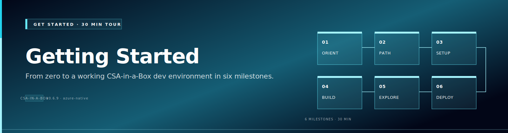
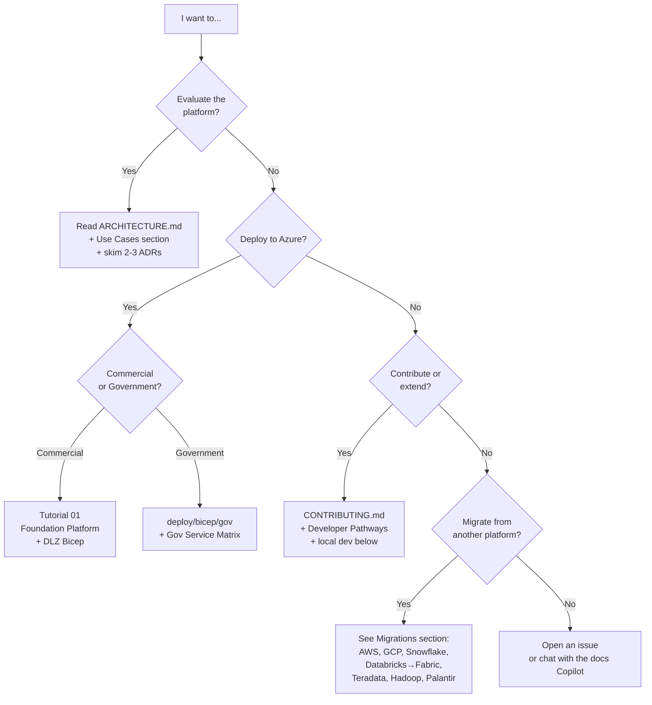

# Getting Started — 30-Minute Tour

!!! info "Comparative positioning note"
    This document is written from the
    perspective of Microsoft Azure, Cloud Scale Analytics, and CSA Loom. Any
    description of third-party or competing products, services, pricing, or
    capabilities is derived from **publicly available documentation and sources**
    believed accurate at the time of writing, and is provided for **general
    comparison only**. We do not claim expertise in, or authority over, any
    non-Microsoft product or service; the respective vendor's official
    documentation is the authoritative source for their offerings, which may
    change over time. Nothing here is intended to disparage any vendor — where a
    competing product has genuine advantages, we aim to note them honestly.
    Verify all third-party details against the vendor's current official
    documentation before making decisions.


{ .architecture-hero loading="eager" }

> **Goal:** by the end of this page you will (1) understand what CSA-in-a-Box is, (2) know which deployment path matches your scenario, and (3) have a working dev environment that can run the platform locally.

If you only have **5 minutes**, jump to [Quickstart](QUICKSTART.md).
If you want to **deploy to Azure now**, jump to [Tutorial 01 — Foundation Platform](tutorials/01-foundation-platform/README.md).

---

## 1. What is CSA-in-a-Box?

CSA-in-a-Box (Cloud-Scale Analytics in a Box) is a **reference implementation** of an enterprise analytics + AI + data-management platform on Microsoft Azure. It bundles:

| Layer                  | What ships in the box                                                                                                       |
| ---------------------- | --------------------------------------------------------------------------------------------------------------------------- |
| **Landing zone (IaC)** | 95 Bicep modules across DLZ (Data Landing Zone), DMLZ (Data Management LZ), gov (Azure Government overlay), and an ALZ fork |
| **Data engineering**   | ADF + dbt-core, Delta Lake medallion, Synapse + Databricks side-by-side, Fabric strategic target                            |
| **Streaming**          | Event Hubs + Stream Analytics + Fabric RTI adapter, Lambda + Kappa patterns                                                 |
| **AI / GenAI**         | Azure OpenAI + AI Search RAG, GraphRAG, MCP server, Semantic Kernel agents, in-docs Copilot widget                          |
| **Governance**         | Microsoft Purview sync, data product contracts (YAML), Great Expectations, Unity Catalog pattern                            |
| **APIs / data apps**   | Data API Builder over Lakehouse, FastAPI BFF + React portal, MSAL auth, Power Apps starter                                  |
| **Compliance**         | NIST 800-53 r5, FedRAMP Moderate, CMMC 2.0 L2, HIPAA, SOC 2, PCI-DSS, GDPR crosswalks                                       |
| **Examples**           | 10 examples (9 verticals + iot-streaming cross-cutting pattern) spanning federal agencies, tribal, casino, ML lifecycle, IoT, AI agents |
| **Operations**         | 8 production runbooks, DR drill automation, supply-chain security (SBOM + signing)                                          |
| **CSA Loom console**   | A Next.js + Fluent UI v9 workspace that delivers the Microsoft Fabric experience on Azure-native services — **117 item-type editors** (Lakehouse, Warehouse, Notebooks, Pipelines, Real-Time Intelligence, a report designer, the Fabric IQ family), governance, security, a Marketplace, a Learning Hub, and Copilot throughout — **no hard Microsoft Fabric dependency**. See [CSA Loom](fiab/index.md). |

**It is _not_** a turnkey SaaS — it is opinionated open-source IaC + reference code you fork into your tenant.

---

## 2. Pick your path (decision tree)



---

## 3. Local development setup (10 minutes)

### Prerequisites

| Tool              | Version                  | Why                                |
| ----------------- | ------------------------ | ---------------------------------- |
| Python            | 3.11+ (3.12 recommended) | Platform code, dbt, AI integration |
| Node.js           | 20 LTS                   | React portal, MSAL frontend        |
| Azure CLI         | 2.60+                    | All `az` commands in tutorials     |
| Bicep CLI         | latest                   | `az bicep upgrade`                 |
| Docker            | 24+                      | Local Postgres, optional dbt CI    |
| Make              | any                      | Wraps every common task            |
| `gh` (GitHub CLI) | optional                 | For PR workflow                    |

### Clone + bootstrap

```bash
git clone https://github.com/fgarofalo56/csa-inabox.git
cd csa-inabox

# Python venv with all platform deps
python -m venv .venv
source .venv/bin/activate          # Windows: .venv\Scripts\activate
pip install -e ".[dev,ai,governance]"

# Verify
make typecheck                      # mypy: should report 0 errors
make test                           # pytest: ~1271 tests, all pass
mkdocs serve                        # docs at http://localhost:8000
```

### Authenticate to Azure (only needed if deploying)

```bash
az login --tenant <YOUR_TENANT_ID>
az account set --subscription <YOUR_SUBSCRIPTION_ID>

# If deploying to Azure Government:
az cloud set --name AzureUSGovernment
az login --tenant <YOUR_GOV_TENANT_ID>
```

---

## 4. Pick your path through the docs

<div class="grid cards" markdown>

- :material-drafting-compass:{ .lg .middle } **Architect / Evaluator**

    ***

    1. [Architecture Overview](ARCHITECTURE.md)
    2. [Reference Architectures](reference-architecture/index.md)
    3. [ADRs](adr/README.md) — 22 decisions, ~1 page each
    4. [Best Practices](best-practices/index.md) — 9 guides
    5. [Use Cases & White Papers](use-cases/index.md)

- :material-database:{ .lg .middle } **Data Engineer**

    ***

    1. [Tutorial 01 — Foundation Platform](tutorials/01-foundation-platform/README.md)
    2. [Tutorial 05 — Streaming (Lambda)](tutorials/05-streaming-lambda/README.md)
    3. Best Practices: [Medallion](best-practices/medallion-architecture.md), [Data Engineering](best-practices/data-engineering.md), [Performance](best-practices/performance-tuning.md)
    4. Patterns: [Cosmos DB](patterns/cosmos-db-patterns.md), [Streaming & CDC](patterns/streaming-cdc.md)
    5. [Examples](examples/index.md) — pick a vertical close to yours

- :material-robot:{ .lg .middle } **AI / GenAI Engineer**

    ***

    1. [Tutorial 06 — AI Analytics (Foundry)](tutorials/06-ai-analytics-foundry/README.md)
    2. [Tutorial 07 — AI Agents (Semantic Kernel)](tutorials/07-agents-foundry-sk/README.md)
    3. [Tutorial 08 — RAG with AI Search](tutorials/08-rag-vector-search/README.md)
    4. [Tutorial 09 — GraphRAG Knowledge Graphs](tutorials/09-graphrag-knowledge/README.md)
    5. [Patterns — LLMOps](patterns/llmops-evaluation.md), [ADR 0017](adr/0017-rag-service-layer.md), [ADR 0007](adr/0007-azure-openai-over-self-hosted-llm.md)

- :material-server-network:{ .lg .middle } **Platform / DevOps Engineer**

    ***

    1. [IaC & CI/CD Best Practices](IaC-CICD-Best-Practices.md)
    2. [Production Checklist](PRODUCTION_CHECKLIST.md)
    3. [Multi-Region](MULTI_REGION.md), [Multi-Tenant](MULTI_TENANT.md), [DR](DR.md)
    4. [Runbooks](runbooks/data-pipeline-failure.md) — all 8
    5. [Supply Chain](SUPPLY_CHAIN.md), [Key Rotation](runbooks/key-rotation.md), [Networking](patterns/networking-dns-strategy.md), [OTel](patterns/observability-otel.md)

- :material-shield-check:{ .lg .middle } **Compliance / Security**

    ***

    1. [Compliance Overview](compliance/README.md)
    2. Pick your framework: [NIST 800-53 r5](compliance/nist-800-53-rev5.md), [FedRAMP](compliance/fedramp-moderate.md), [CMMC 2.0 L2](compliance/cmmc-2.0-l2.md), [HIPAA](compliance/hipaa-security-rule.md), [SOC 2](compliance/soc2-type2.md), [PCI-DSS](compliance/pci-dss-v4.md), [GDPR](compliance/gdpr-privacy.md)
    3. [Best Practices — Security & Compliance](best-practices/security-compliance.md)
    4. Runbooks: [Security Incident](runbooks/security-incident.md), [Break-Glass](runbooks/break-glass-access.md)
    5. [Government Service Matrix](GOV_SERVICE_MATRIX.md)

</div>

---

## 5. Common first-day questions

??? question "How long does it take to deploy a real DLZ?"
With pre-existing networking and identity (typical enterprise), a fresh DLZ deploys in **~45 minutes** end-to-end. From a blank subscription with no parent ALZ, plan **half a day** for the first deploy because you'll iterate on parameter files. Subsequent deploys are idempotent and run in 5–10 minutes.

??? question "What does this cost to run?"
A **dev tier** (small Synapse pool, single-node Databricks Standard, B-series Functions, basic AI Search) runs roughly **$800–1,500/month** if left up 24×7. Most teams pause Synapse + Databricks outside business hours and run closer to **$300–500/mo dev**. **Prod tiers** scale with workload — see each example's `deploy/params.prod.json` for sizing assumptions.

??? question "Can I run this in Azure Government?"
Yes. The `deploy/bicep/gov/` overlay handles MAG/USGov-specific service availability. See the [Government Service Matrix](GOV_SERVICE_MATRIX.md) for which features are GA / preview / unavailable per cloud (Public, USGov, USGov Secret, China).

??? question "Where does Fabric fit vs Synapse vs Databricks?"
See [Reference Architecture — Fabric vs Synapse vs Databricks](reference-architecture/fabric-vs-synapse-vs-databricks.md) and [ADR 0010 — Fabric Strategic Target](adr/0010-fabric-strategic-target.md). Short version: Synapse + Databricks are the production backbone today; Fabric is the strategic forward path for net-new workloads, particularly Real-Time Intelligence and Direct Lake semantic models.

??? question "How is governance / data mesh handled?"
Microsoft Purview is the catalog of record (see [ADR 0006](adr/0006-purview-over-atlas.md)). Each data product owns its YAML contract under `examples/<vertical>/contracts/` and a sync job pushes contracts → Purview classifications + lineage. See [Best Practices — Data Governance](best-practices/data-governance.md) and [ADR 0012 — Data Mesh Federation](adr/0012-data-mesh-federation.md).

??? question "What about non-Azure clouds?"
Out of scope — see [ADR 0011 — Multi-Cloud Scope](adr/0011-multi-cloud-scope.md) for the rationale. We document **virtualization** patterns (query AWS/GCP from Azure) but do not maintain parallel IaC for other clouds.

??? question "How current is this with Azure roadmap?"
The repo is actively maintained against Azure GA features. Preview-only services are documented but gated behind feature flags. ADRs are revisited annually. The [Platform Research Report](research/CSA-Platform-Research-Report.md) is a snapshot of strategic direction.

---

## 6. Next steps

| If you want to...                 | Go to                                                                                                      |
| --------------------------------- | ---------------------------------------------------------------------------------------------------------- |
| **See it running**                | [Quickstart](QUICKSTART.md) (5 min) → [Tutorial 01](tutorials/01-foundation-platform/README.md) (45 min)   |
| **Pick a vertical**               | [End-to-End Examples](examples/index.md) — 10 examples (9 verticals + iot-streaming cross-cutting pattern) |
| **Understand the design**         | [Architecture](ARCHITECTURE.md) → [ADRs](adr/README.md)                                                    |
| **Deploy to production**          | [Production Checklist](PRODUCTION_CHECKLIST.md) → [IaC & CI/CD Best Practices](IaC-CICD-Best-Practices.md) |
| **Migrate from another platform** | [Migrations](migrations/README.md)                                                                         |
| **Talk to the docs**              | [AI Copilot](chat.md) (in-page chat widget)                                                                |

---

## 7. Getting help

- **Open an issue**: https://github.com/fgarofalo56/csa-inabox/issues
- **GitHub Discussions**: https://github.com/fgarofalo56/csa-inabox/discussions (Q&A + feature requests)
- **Docs Copilot**: in-page chat widget on every docs page (powered by Azure OpenAI in our DLZ — see [ADR 0022](adr/0022-copilot-surfaces-vs-docs-widget.md))
- **Security issues**: see [SECURITY.md](https://github.com/fgarofalo56/csa-inabox/blob/main/SECURITY.md) (private disclosure)

---

**See also:**

- ← Previous: [Documentation home](index.md)
- → Next: [Quickstart](QUICKSTART.md)
- ⌂ Index: [Documentation home](index.md)
