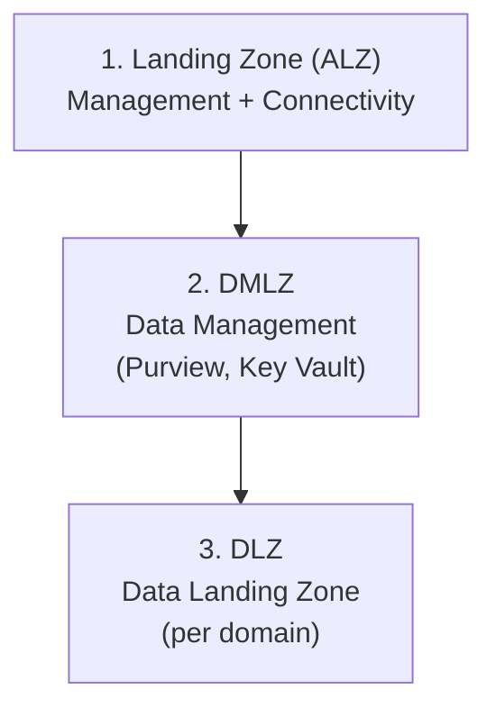

[Home](../README.md) > [Docs](./) > **Getting Started**

# Getting Started with CSA-in-a-Box

> **Last Updated:** 2026-04-15 | **Status:** Active | **Audience:** New Users

> [!NOTE]
> **Quick Summary**: Prerequisites and deployment walkthrough for CSA-in-a-Box — clone, configure parameter files for 4 Azure subscriptions, deploy ALZ → DMLZ → DLZ in order, then layer on platform services, data portals, and vertical examples (USDA, DOT, USPS, NOAA, EPA, and more).

## 📑 Table of Contents

- [📎 Prerequisites](#-prerequisites)
  - [Azure Requirements](#azure-requirements)
  - [Local Tools](#local-tools)
  - [Azure RBAC Permissions](#azure-rbac-permissions)
- [🚀 Quick Start (30 minutes)](#-quick-start-30-minutes)
  - [Step 1: Clone and Setup](#step-1-clone-and-setup)
  - [Step 2: Configure Parameters](#step-2-configure-parameters)
  - [Step 3: Deploy Azure Landing Zone (Foundation)](#step-3-deploy-azure-landing-zone-foundation)
  - [Step 4: Deploy Data Management Landing Zone](#step-4-deploy-data-management-landing-zone)
  - [Step 5: Deploy Data Landing Zone](#step-5-deploy-data-landing-zone)
  - [Step 6: Verify Deployment](#step-6-verify-deployment)
- [📦 Deployment Order](#-deployment-order)
- [⚠️ Common Issues](#️-common-issues)
- [🏗️ Platform Services](#️-platform-services)
- [🌐 Data Onboarding Portal](#-data-onboarding-portal)
  - [Choosing a Frontend](#choosing-a-frontend)
- [📊 Vertical Examples](#-vertical-examples)
  - [Available Verticals](#available-verticals)
  - [Running a Vertical Example](#running-a-vertical-example)
- [🏛️ Azure Government Deployment](#️-azure-government-deployment)
  - [Quick Start (Gov)](#quick-start-gov)
- [🔗 Quick Links](#-quick-links)
- [➡️ Next Steps](#️-next-steps)

---

## 📎 Prerequisites

### Azure Requirements
- **4 Azure Subscriptions**: Management, Connectivity, Data Management (DMLZ), Data Landing Zone (DLZ)
- **Azure AD Tenant** with Global Admin or Privileged Role Admin access
- **Contributor** role on all 4 subscriptions
- **Microsoft.Purview**, **Microsoft.Databricks**, **Microsoft.Synapse** resource providers registered

### Local Tools
| Tool | Version | Install |
|------|---------|---------|
| Azure CLI | >= 2.50 | `winget install Microsoft.AzureCLI` |
| Bicep CLI | >= 0.25 | `az bicep install` |
| PowerShell | >= 7.3 | `winget install Microsoft.PowerShell` |
| Python | >= 3.10 | `winget install Python.Python.3.11` |
| Git | >= 2.40 | `winget install Git.Git` |
| dbt | >= 1.7 | `pip install dbt-databricks` |

### Azure RBAC Permissions
The deploying identity needs:
- **Owner** on Management subscription (for policy assignments)
- **Contributor** on all other subscriptions
- **User Access Administrator** for RBAC assignments

---

## 🚀 Quick Start (30 minutes)

### Step 1: Clone and Setup
```bash
git clone https://github.com/fgarofalo56/csa-inabox.git
cd csa-inabox
make setup  # or `make setup-win` on Windows
```

### Step 2: Configure Parameters

Copy the example parameter files for your environment:
```bash
# Data Management Landing Zone
cp deploy/bicep/DMLZ/params.dev.json deploy/bicep/DMLZ/params.YOUR_ENV.json

# Data Landing Zone
cp deploy/bicep/DLZ/params.dev.json deploy/bicep/DLZ/params.YOUR_ENV.json
```

Edit each file and fill in your Azure-specific values:
- [ ] Subscription IDs
- [ ] VNet/Subnet resource IDs
- [ ] Private DNS Zone configuration
- [ ] Storage account names (must be globally unique)

### Step 3: Deploy Azure Landing Zone (Foundation)
```bash
az login
az account set --subscription YOUR_MGMT_SUBSCRIPTION_ID

az deployment sub create \
  --location eastus \
  --template-file "deploy/bicep/landing-zone-alz/main.bicep" \
  --parameters "deploy/bicep/landing-zone-alz/params.YOUR_ENV.json"
```

### Step 4: Deploy Data Management Landing Zone
```bash
az account set --subscription YOUR_DMLZ_SUBSCRIPTION_ID

az deployment sub create \
  --location eastus \
  --template-file deploy/bicep/DMLZ/main.bicep \
  --parameters deploy/bicep/DMLZ/params.YOUR_ENV.json
```

### Step 5: Deploy Data Landing Zone
```bash
az account set --subscription YOUR_DLZ_SUBSCRIPTION_ID

az deployment sub create \
  --location eastus \
  --template-file deploy/bicep/DLZ/main.bicep \
  --parameters deploy/bicep/DLZ/params.YOUR_ENV.json
```

### Step 6: Verify Deployment
```bash
# Check resource groups were created
az group list --query "[?tags.Project=='CSA-in-a-Box']" -o table

# Verify Databricks workspace
az databricks workspace list -o table

# Verify storage accounts
az storage account list --query "[?tags.Project]" -o table
```

---

## 📦 Deployment Order



> [!IMPORTANT]
> Each layer depends on the previous one. Deploy in order.

---

## ⚠️ Common Issues

| Error | Cause | Fix |
|-------|-------|-----|
| `PrivateDnsZone not found` | DNS zones not deployed | Deploy ALZ first, or create DNS zones manually |
| `SubnetNotFound` | VNet/Subnet doesn't exist | Create VNet infrastructure before DLZ |
| `QuotaExceeded` | Region capacity limit | Try a different region or request quota increase |
| `RoleAssignmentExists` | Re-running deployment | Safe to ignore — assignment already exists |
| `AuthorizationFailed` | Insufficient permissions | Verify you have Contributor on the target subscription |

---

## 🏗️ Platform Services

After deploying the landing zones, you can layer on platform services that
replicate Microsoft Fabric capabilities using Azure PaaS. These live in
`csa_platform/` and are independently deployable.

| Service | What It Does | Quick Start |
|---------|-------------|-------------|
| [OneLake Pattern](../csa_platform/onelake_pattern/) | Unified data lake with Unity Catalog metadata | Deploy after DLZ |
| [Data Marketplace](../csa_platform/data_marketplace/) | Self-service data product discovery + access requests | `python csa_platform/data_marketplace/api/marketplace_api.py` |
| [Data Activator](../csa_platform/data_activator/) | Event-driven alerts (Teams, email, PagerDuty) | Deploy Event Grid + Functions |
| [Direct Lake](../csa_platform/direct_lake/) | Power BI over Delta Lake via Databricks SQL | Configure SQL endpoint |
| [Metadata Framework](../csa_platform/metadata_framework/) | Auto-generate ADF pipelines from YAML | Register sources in YAML |
| [AI Integration](../csa_platform/ai_integration/) | RAG, entity extraction, document classification | Configure Azure OpenAI |
| [Shared Services](../csa_platform/shared_services/) | Reusable Functions (PII detection, schema validation) | `func azure functionapp publish` |
| [Governance](../csa_platform/governance/) | Purview classification, lineage, sensitivity labels | Bootstrap Purview catalog |
| [OSS Alternatives](../csa_platform/oss_alternatives/) | Open-source replacements for Gov gaps | Helm charts on AKS |

See [PLATFORM_SERVICES.md](PLATFORM_SERVICES.md) for detailed deployment instructions.

---

## 🌐 Data Onboarding Portal

The `portal/` directory contains three implementations of an autonomous data
onboarding portal — each with a different frontend but sharing the same FastAPI
backend API.

### Choosing a Frontend

| Implementation | Best For | Deploy Time |
|---------------|----------|-------------|
| [PowerApps](../portal/powerapps/) | M365-native orgs, low-code teams | ~30 min |
| [React/Next.js](../portal/react-webapp/) | Custom enterprise portals, maximum flexibility | ~45 min |
| [Kubernetes](../portal/kubernetes/) | Enterprise-scale, multi-tenant, HA | ~60 min |

All frontends connect to the shared backend at `portal/shared/api/`. To get
started:

```bash
# Start the shared backend (ENVIRONMENT=local enables demo mode)
cd portal/shared
pip install -r requirements.txt
ENVIRONMENT=local uvicorn api.main:app --reload --port 8000

# Then start your chosen frontend (e.g., React)
cd ../react-webapp
npm install && npm run dev
```

---

## 📊 Vertical Examples

The `examples/` directory contains 9 vertical-specific implementations plus a
generic IoT streaming pattern. Each vertical includes seed data, dbt models,
deployment templates, and documentation.

### Available Verticals

| Vertical | Directory | Key Data Sources |
|----------|-----------|-----------------|
| USDA Agriculture | `examples/usda/` | NASS QuickStats API, crop data |
| DOT Transportation | `examples/dot/` | FMCSA, NHTSA safety data |
| USPS Postal | `examples/usps/` | Address validation, delivery metrics |
| NOAA Weather | `examples/noaa/` | Weather stations, climate data |
| EPA Environmental | `examples/epa/` | AQI sensors, compliance monitoring |
| Commerce (Census) | `examples/commerce/` | Census API, BEA economic indicators |
| Interior (USGS) | `examples/interior/` | Geospatial, land management |
| Tribal Health | `examples/tribal-health/` | BIA/IHS health analytics (HIPAA) |
| Casino Analytics | `examples/casino-analytics/` | Slot telemetry, Title 31 compliance |
| IoT Streaming | `examples/iot-streaming/` | Generic IoT sensors, real-time analytics |

### Running a Vertical Example

Each vertical follows the same pattern:

```bash
# 1. Generate seed data
python examples/<vertical>/data/generators/<generator>.py

# 2. Load seeds into dbt
cd examples/<vertical>/domains/<domain>/dbt
dbt seed --profiles-dir .

# 3. Run the medallion pipeline
dbt run --select tag:bronze
dbt run --select tag:silver
dbt run --select tag:gold
dbt test
```

See each vertical's `README.md` and `ARCHITECTURE.md` for detailed instructions.

---

## 🏛️ Azure Government Deployment

CSA-in-a-Box is fully compatible with Azure Government (FedRAMP High, IL4, IL5).
Government-specific templates live in `deploy/bicep/gov/`.

### Quick Start (Gov)

```bash
# Switch to Azure Government cloud
az cloud set --name AzureUSGovernment
az login

# Deploy using Gov parameter files
bash scripts/deploy/deploy-platform.sh \
  --environment gov-dev \
  --location usgovvirginia

# Or deploy individual templates
az deployment sub create \
  --location usgovvirginia \
  --template-file deploy/bicep/gov/main.bicep \
  --parameters deploy/bicep/gov/params.gov-dev.json
```

> [!NOTE]
> Key differences for Government:
> - All endpoints use `.us` / `.usgovcloudapi.net` instead of `.com`
> - Compliance tags are automatically applied (FedRAMP, FISMA, NIST 800-53)
> - Microsoft Fabric is not available — this repo IS the alternative

See [GOV_SERVICE_MATRIX.md](GOV_SERVICE_MATRIX.md) for the full service
availability matrix.

---

## 🔗 Quick Links

| Resource | Link |
|----------|------|
| Architecture Overview | [ARCHITECTURE.md](ARCHITECTURE.md) |
| 60-Minute Quick Start | [QUICKSTART.md](QUICKSTART.md) |
| Platform Services Guide | [PLATFORM_SERVICES.md](PLATFORM_SERVICES.md) |
| Gov Service Matrix | [GOV_SERVICE_MATRIX.md](GOV_SERVICE_MATRIX.md) |
| Platform README | [csa_platform/README.md](../csa_platform/README.md) |
| Portal README | [portal/README.md](../portal/README.md) |
| Gov Templates | [deploy/bicep/gov/README.md](../deploy/bicep/gov/README.md) |
| Contributing Guide | [CONTRIBUTING.md](../CONTRIBUTING.md) |
| Changelog | [CHANGELOG.md](../CHANGELOG.md) |

---

## ➡️ Next Steps

- [ ] **Configure dbt**: Edit `domains/shared/dbt/profiles.yml` with your Databricks connection
- [ ] **Set up ADF pipelines**: Import pipeline definitions from `domains/shared/pipelines/adf/`
- [ ] **Apply RBAC**: Run `governance/rbac/apply-rbac.ps1` to set up access control
- [ ] **Data Quality**: Configure `governance/dataquality/quality-rules.yaml` for your tables
- [ ] **Deploy Platform Services**: Follow [PLATFORM_SERVICES.md](PLATFORM_SERVICES.md) for Fabric-equivalent capabilities
- [ ] **Try a Vertical**: Pick any vertical from `examples/` and run its pipeline end-to-end
- [ ] **Deploy the Portal**: Choose a frontend from `portal/` and connect it to the shared backend
- [ ] **Azure Government**: Use `deploy/bicep/gov/` for FedRAMP-compliant deployments

---

## 🔗 Related Documentation

- [Quick Start](QUICKSTART.md) — 60-minute hands-on tutorial
- [Architecture](ARCHITECTURE.md) — Comprehensive architecture reference
- [Troubleshooting](TROUBLESHOOTING.md) — Common issues and fixes
- [ADF Setup](../scripts/deploy/deploy-adf.sh) — ADF deployment helper script
- [Databricks Guide](DATABRICKS_GUIDE.md) — Databricks setup and troubleshooting
