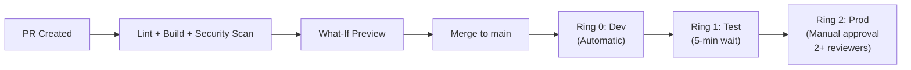
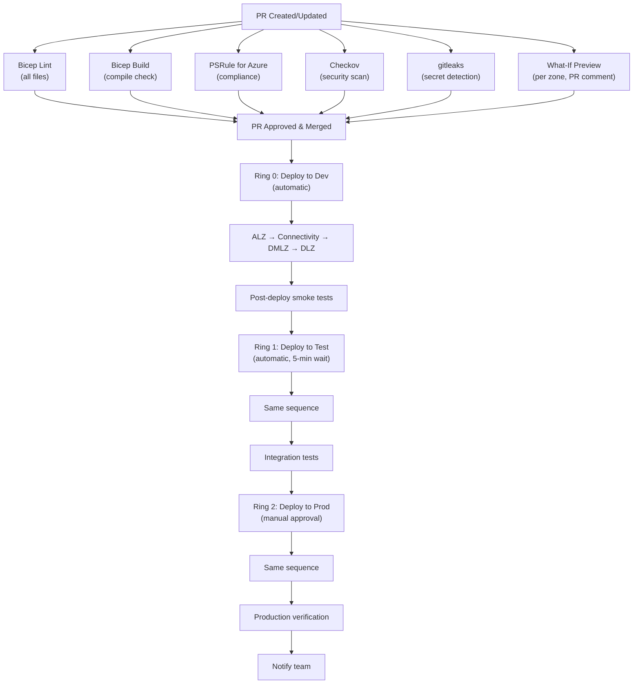

[Home](../README.md) > [Docs](./) > **IaC & CI/CD Best Practices**

# Infrastructure-as-Code & CI/CD Best Practices for CSA-in-a-Box

> **Last Updated:** 2026-04-15 | **Status:** Active | **Audience:** DevOps Engineers

> [!NOTE]
> **Quick Summary**: Comprehensive guide for deploying a Cloud-Scale Analytics platform across 4 Azure subscriptions using Bicep and GitHub Actions — covers Bicep module organization, `.bicepparam` files, Deployment Stacks, what-if validation, OIDC auth, reusable workflows, matrix deployments, PSRule/Checkov/gitleaks security scanning, ALZ accelerators (AVM migration), progressive ring-based deployments, feature flags, policy-as-code, and a phased implementation plan with tool matrix.

> **Research Report** | April 2026
> Comprehensive guide for deploying a Cloud-Scale Analytics platform across 4 Azure subscriptions using Bicep and GitHub Actions.

> [!IMPORTANT]
> This document describes the target-state architecture and recommended improvements. For current CI/CD workflows, see `.github/workflows/`. For current deployment instructions, see [QUICKSTART.md](QUICKSTART.md) or [GETTING_STARTED.md](GETTING_STARTED.md).

> [!NOTE]
> **CAF scenario update (CSA-0068).** The legacy "Cloud-Scale Analytics"
> CAF scenario was **deprecated in April 2026** and replaced by
> [Microsoft CAF — Unify your data platform](https://aka.ms/cafdata).
> Links in this document to
> `https://learn.microsoft.com/azure/cloud-adoption-framework/scenarios/cloud-scale-analytics/...`
> are preserved for historical cross-reference only. For authoritative
> 2026 guidance on Fabric, data mesh, and landing zones, follow the
> "Unify your data platform" link above.

## 📑 Table of Contents

- [🏗️ 1. Bicep Best Practices for Large-Scale Azure Deployments](#️-1-bicep-best-practices-for-large-scale-azure-deployments)
  - [1.1 Module Organization and Naming Conventions](#11-module-organization-and-naming-conventions)
  - [1.2 Parameter Files per Environment](#12-parameter-files-per-environment)
  - [1.3 Bicep Module Registry (ACR)](#13-bicep-module-registry-azure-container-registry)
  - [1.4 Deployment Stacks vs Standard Deployments](#14-deployment-stacks-vs-standard-deployments)
  - [1.5 What-If Deployments and Validation](#15-what-if-deployments-and-validation)
  - [1.6 Cross-Subscription and Cross-Resource-Group Deployments](#16-cross-subscription-and-cross-resource-group-deployments)
  - [1.7 Conditional Deployment Patterns](#17-conditional-deployment-patterns)
  - [1.8 User-Defined Types and Compile-Time Imports](#18-user-defined-types-and-compile-time-imports)
- [🔄 2. GitHub Actions CI/CD for Azure IaC](#-2-github-actions-cicd-for-azure-iac)
  - [2.1 Workflow Organization for Multi-Subscription Deploys](#21-workflow-organization-for-multi-subscription-deploys)
  - [2.2 OIDC Authentication (Federated Credentials)](#22-oidc-authentication-federated-credentials)
  - [2.3 Environment Protection Rules and Approvals](#23-environment-protection-rules-and-approvals)
  - [2.4 Reusable Workflows and Composite Actions](#24-reusable-workflows-and-composite-actions)
  - [2.5 Secret Management with GitHub Environments](#25-secret-management-with-github-environments)
  - [2.6 Bicep Lint, Validate, What-If in PR Checks](#26-bicep-lint-validate-what-if-in-pr-checks)
  - [2.7 Deployment Gates and Rollback Strategies](#27-deployment-gates-and-rollback-strategies)
  - [2.8 Matrix Deployments for Multiple Subscriptions](#28-matrix-deployments-for-multiple-subscriptions)
- [🧪 3. Testing Infrastructure-as-Code](#-3-testing-infrastructure-as-code)
  - [3.1 Bicep Linting with Linter Rules](#31-bicep-linting-with-linter-rules)
  - [3.2 PSRule for Azure (Policy Compliance Testing)](#32-psrule-for-azure-policy-compliance-testing)
  - [3.3 Checkov (IaC Security Scanning)](#33-checkov-iac-security-scanning)
  - [3.4 Additional Security Scanning Tools](#34-additional-security-scanning-tools)
  - [3.5 Cost Estimation in CI Pipelines](#35-cost-estimation-in-ci-pipelines)
- [🏛️ 4. Azure Landing Zone Accelerators](#️-4-azure-landing-zone-accelerators)
  - [4.1 ALZ-Bicep vs Azure Verified Modules (AVM)](#41-alz-bicep-vs-azure-verified-modules-avm)
  - [4.2 Extending ALZ for Data Platforms](#42-extending-alz-for-data-platforms)
  - [4.3 Custom Policy Definitions for Data Governance](#43-custom-policy-definitions-for-data-governance)
- [🌍 5. Multi-Environment Deployment Patterns](#-5-multi-environment-deployment-patterns)
  - [5.1 Recommended: Progressive Deployment (Ring-Based)](#51-recommended-progressive-deployment-ring-based)
  - [5.2 Feature Flags for Infrastructure](#52-feature-flags-for-infrastructure)
  - [5.3 Blue-Green for Infrastructure](#53-blue-green-for-infrastructure)
  - [5.4 Canary Deployments for Data Pipelines](#54-canary-deployments-for-data-pipelines)
- [🔒 6. Secret Scanning and Security in CI/CD](#-6-secret-scanning-and-security-in-cicd)
  - [6.1 Gitleaks Integration](#61-gitleaks-integration)
  - [6.2 GitHub Advanced Security](#62-github-advanced-security)
  - [6.3 Pre-Commit Hooks for Secret Detection](#63-pre-commit-hooks-for-secret-detection)
  - [6.4 Policy-as-Code with Azure Policy](#64-policy-as-code-with-azure-policy)
- [📋 7. Recommended Implementation Plan for CSA-in-a-Box](#-7-recommended-implementation-plan-for-csa-in-a-box)
  - [7.1 Current State Assessment](#71-current-state-assessment)
  - [7.2 Recommended Improvements (Priority Order)](#72-recommended-improvements-priority-order)
  - [7.3 Tool Matrix Summary](#73-tool-matrix-summary)
  - [7.4 CI/CD Pipeline Architecture (Target State)](#74-cicd-pipeline-architecture-target-state)
- [📎 Appendix A: Complete bicepconfig.json](#-appendix-a-complete-bicepconfinjson)
- [🔑 Appendix B: GitHub Secrets Required](#-appendix-b-github-secrets-required)
- [📚 Appendix C: Key Microsoft Documentation References](#-appendix-c-key-microsoft-documentation-references)

---

## 🏗️ 1. Bicep Best Practices for Large-Scale Azure Deployments

### 1.1 Module Organization and Naming Conventions

For a 4-subscription deployment (Management, Connectivity, DMLZ, DLZ), structure Bicep modules by **domain** and **layer**:

```text
deploy/bicep/
  _shared/                          # Shared types, functions, variables
    types.bicep                     # User-defined types (exported)
    naming.bicep                    # Naming convention functions
    tags.bicep                      # Standard tag definitions
  modules/                          # Reusable resource modules
    networking/
      virtualNetwork.bicep
      privateEndpoint.bicep
      privateDnsZone.bicep
      vnetPeering.bicep
    security/
      keyVault.bicep
      managedIdentity.bicep
    storage/
      storageAccount.bicep
      dataLakeStorage.bicep
    compute/
      synapseWorkspace.bicep
      databricksWorkspace.bicep
    governance/
      policyDefinition.bicep
      policyAssignment.bicep
      roleAssignment.bicep
    monitoring/
      logAnalyticsWorkspace.bicep
      diagnosticSettings.bicep
  orchestration/                    # Composition modules per subscription
    alz/
      main.bicep                    # Landing Zone orchestrator
      params.dev.bicepparam
      params.test.bicepparam
      params.prod.bicepparam
    dmlz/
      main.bicep                    # Data Management Landing Zone orchestrator
      params.dev.bicepparam
      params.test.bicepparam
      params.prod.bicepparam
    dlz/
      main.bicep                    # Data Landing Zone orchestrator
      params.dev.bicepparam
      params.test.bicepparam
      params.prod.bicepparam
    connectivity/
      main.bicep                    # Connectivity orchestrator
      params.dev.bicepparam
      params.test.bicepparam
      params.prod.bicepparam
```

**Naming conventions:**
- Use **lowerCamelCase** for symbolic names: `synapseWorkspace`, `dataLakeStorage`
- Never use `name` in symbolic names (e.g., use `storageAccount` not `storageAccountName`)
- Prefix resource names with shortcodes: `st` (storage), `kv` (key vault), `vnet` (virtual network)
- Use template expressions for resource names with `uniqueString()`:

```bicep
param shortAppName string = 'csa'
param environment string = 'dev'
param storageAccountName string = '${shortAppName}${environment}${uniqueString(resourceGroup().id)}'
```

### 1.2 Parameter Files per Environment

Use `.bicepparam` files (native Bicep parameter files) instead of JSON parameter files. They support type safety and compile-time validation:

```bicep
// params.dev.bicepparam
using '../main.bicep'

param environment = 'dev'
param location = 'eastus'
param networkConfig = {
  vnetAddressPrefix: '10.0.0.0/16'
  subnets: [
    { name: 'snet-data', addressPrefix: '10.0.1.0/24' }
    { name: 'snet-compute', addressPrefix: '10.0.2.0/24' }
  ]
}
param tags = {
  Environment: 'Development'
  Project: 'CSA-in-a-Box'
  CostCenter: '12345'
}
```

```bicep
// params.prod.bicepparam
using '../main.bicep'

param environment = 'prod'
param location = 'eastus'
param networkConfig = {
  vnetAddressPrefix: '10.100.0.0/16'
  subnets: [
    { name: 'snet-data', addressPrefix: '10.100.1.0/24' }
    { name: 'snet-compute', addressPrefix: '10.100.2.0/24' }
  ]
}
param tags = {
  Environment: 'Production'
  Project: 'CSA-in-a-Box'
  CostCenter: '67890'
}
```

### 1.3 Bicep Module Registry (Azure Container Registry)

Publish reusable modules to an Azure Container Registry (ACR) for cross-team sharing:

**Setup:**
```bash
# Create registry
az acr create --name csaIacModules --resource-group rg-shared --sku Standard

# Publish a module
az bicep publish \
  --file modules/networking/virtualNetwork.bicep \
  --target br:csaiacmodules.azurecr.io/bicep/modules/networking/vnet:v1.0.0 \
  --with-source

# Consume in Bicep
# module vnet 'br:csaiacmodules.azurecr.io/bicep/modules/networking/vnet:v1.0.0' = { ... }
```

**Configure aliases in `bicepconfig.json`:**
```json
{
  "moduleAliases": {
    "br": {
      "csaModules": {
        "registry": "csaiacmodules.azurecr.io",
        "modulePath": "bicep/modules"
      }
    }
  }
}
```

Then consume modules with short aliases:
```bicep
module vnet 'br/csaModules:networking/vnet:v1.0.0' = {
  name: 'deploy-vnet'
  params: { ... }
}
```

**Versioning strategy:**
- Use semantic versioning: `v1.0.0`, `v1.1.0`, `v2.0.0`
- Publish with `--with-source` flag so consumers can F12 into the source in VS Code
- Publish modules in CI after merge to main; tag with git SHA + semver

### 1.4 Deployment Stacks vs Standard Deployments

**Recommendation: Use Deployment Stacks for CSA-in-a-Box.**

Deployment Stacks are a superset of standard deployments that add lifecycle management:

| Feature | Standard Deployment | Deployment Stack |
|---------|-------------------|-----------------|
| Deploy resources | Yes | Yes |
| Track managed resources | No | Yes |
| Prevent unauthorized changes (deny settings) | No | Yes (DenyDelete, DenyWriteAndDelete) |
| Auto-cleanup on removal | No | Yes (deleteAll, deleteResources, detachAll) |
| Cross-scope deployment | Yes | Yes |

**When to use Deployment Stacks:**
- Managing complete environments (dev/test/prod)
- Protecting production resources from accidental deletion
- Cleaning up test environments after sprints
- Auditing which resources belong to which deployment

**Example for CSA-in-a-Box:**
```bash
# Create a subscription-scoped deployment stack for DMLZ
az stack sub create \
  --name 'csa-dmlz-dev' \
  --location 'eastus' \
  --template-file 'deploy/bicep/orchestration/dmlz/main.bicep' \
  --parameters 'deploy/bicep/orchestration/dmlz/params.dev.bicepparam' \
  --deployment-resource-group 'rg-dmlz-dev' \
  --action-on-unmanage 'deleteResources' \
  --deny-settings-mode 'denyDelete' \
  --deny-settings-excluded-principals '<deployment-sp-object-id>'
```

> [!WARNING]
> **Known limitations (as of early 2026):**
> - Maximum 800 deployment stacks per scope
> - Maximum 2,000 deny assignments per scope
> - What-if is not yet supported with deployment stacks
> - Microsoft Graph provider is not supported
> - Deleting resource groups can bypass deny assignments

### 1.5 What-If Deployments and Validation

What-if provides a preview of changes before deployment. It's critical for PR review workflows.

**Validation levels (az CLI 2.76+):**
- `Provider` (default): Full validation including RBAC permission checks
- `ProviderNoRbac`: Full validation, read-only permission checks
- `Template`: Static syntax/structure validation only (no Azure calls needed)

**CI/CD integration pattern:**
```bash
# In PR pipeline: run what-if and capture output
az deployment sub what-if \
  --location eastus \
  --template-file deploy/bicep/orchestration/dmlz/main.bicep \
  --parameters deploy/bicep/orchestration/dmlz/params.dev.bicepparam \
  --no-pretty-print > whatif-output.json

# Post what-if results as a PR comment
```

**`bicep snapshot` command** (new): Performs local-only comparison by generating a normalized JSON representation. Useful for catching logic changes without Azure connectivity:
```bash
bicep snapshot main.bicep --output snapshot.json
# Compare with previous snapshot to detect drift
```

### 1.6 Cross-Subscription and Cross-Resource-Group Deployments

For a 4-subscription architecture, use scoped modules:

```bicep
targetScope = 'subscription'

// Parameters for cross-subscription targeting
param dmlzSubscriptionId string
param dlzSubscriptionId string
param connectivitySubscriptionId string

// Deploy to Data Management LZ subscription
module dmlzResources 'modules/dmlz.bicep' = {
  name: 'deploy-dmlz'
  scope: subscription(dmlzSubscriptionId)
}

// Deploy to Data Landing Zone subscription
module dlzResources 'modules/dlz.bicep' = {
  name: 'deploy-dlz'
  scope: subscription(dlzSubscriptionId)
}

// Deploy to a specific resource group in another subscription
module networkResources 'modules/networking.bicep' = {
  name: 'deploy-networking'
  scope: resourceGroup(connectivitySubscriptionId, 'rg-connectivity')
}
```

> [!IMPORTANT]
> The deploying identity needs appropriate RBAC on all target subscriptions. For management group scoped deployments, use `targetScope = 'managementGroup'` and deploy to child subscriptions.

### 1.7 Conditional Deployment Patterns

```bicep
// Feature flags for infrastructure
param deployDataFactory bool = true
param deploySynapse bool = true
param deployDatabricks bool = false
param isProduction bool = false

// Conditional resource deployment
module dataFactory 'modules/compute/dataFactory.bicep' = if (deployDataFactory) {
  name: 'deploy-adf'
  params: {
    name: 'adf-${environment}-${uniqueString(resourceGroup().id)}'
    // Production gets managed VNet
    managedVirtualNetworkEnabled: isProduction
  }
}

// Conditional SKU selection
var synapseSkuName = isProduction ? 'DW1000c' : 'DW100c'

// Environment-based conditional logic
var diagnosticsRetentionDays = isProduction ? 365 : 30
```

### 1.8 User-Defined Types and Compile-Time Imports

User-defined types provide strong typing and validation. Combined with `@export()` and `import`, they enable shared type libraries:

<details>
<summary>Shared types library (_shared/types.bicep)</summary>

```bicep
// _shared/types.bicep

@export()
type environmentType = 'dev' | 'test' | 'prod'

@export()
type networkConfigType = {
  vnetName: string
  addressPrefix: string
  subnets: subnetConfigType[]
}

@export()
type subnetConfigType = {
  name: string
  addressPrefix: string
  serviceEndpoints: string[]?
  delegations: string[]?
  privateEndpointNetworkPolicies: ('Enabled' | 'Disabled')?
}

@export()
@sealed()
type dataLakeConfigType = {
  @description('Storage account name (3-24 chars, lowercase)')
  @minLength(3)
  @maxLength(24)
  name: string
  sku: 'Standard_LRS' | 'Standard_GRS' | 'Standard_ZRS'
  containers: string[]
  enableHierarchicalNamespace: bool
}

@export()
type tagType = {
  Environment: string
  Project: string
  CostCenter: string
  Owner: string?
  ManagedBy: ('Bicep' | 'Terraform' | 'Manual')?
}
```

</details>

**Consuming shared types:**
```bicep
// orchestration/dmlz/main.bicep
import { environmentType, networkConfigType, tagType } from '../../_shared/types.bicep'

param environment environmentType
param networkConfig networkConfigType
param tags tagType
```

**Resource-derived types (Bicep CLI 0.34.1+):**
```bicep
// Derive types directly from Azure resource schemas
type storageAccountSku = resourceInput<'Microsoft.Storage/storageAccounts@2024-01-01'>.sku
type accountKind = resourceInput<'Microsoft.Storage/storageAccounts@2024-01-01'>.kind
```

---

## 🔄 2. GitHub Actions CI/CD for Azure IaC

### 2.1 Workflow Organization for Multi-Subscription Deploys

Recommended structure using reusable workflows:

```text
.github/
  workflows/
    # Trigger workflows
    ci.yml                          # PR validation
    cd-dev.yml                      # Deploy to dev (on merge)
    cd-prod.yml                     # Deploy to prod (manual)
    
    # Reusable workflows
    _validate.yml                   # Bicep lint + build + what-if
    _deploy-subscription.yml        # Deploy to a single subscription
    _post-deploy-checks.yml         # Smoke tests
    _security-scan.yml              # Checkov + gitleaks
    
  actions/
    # Composite actions
    bicep-validate/action.yml       # Lint + build
    azure-what-if/action.yml        # What-if with PR comment
    post-deploy-verify/action.yml   # Verification scripts
```

### 2.2 OIDC Authentication (Federated Credentials)

**Always use OIDC over service principal secrets.** OIDC eliminates long-lived credentials.

**Setup for 4 subscriptions:**

```bash
# 1. Create a Microsoft Entra App Registration
az ad app create --display-name "csa-inabox-github-actions"

# 2. Create federated credentials for each environment + branch
# For main branch deployments
az ad app federated-credential create \
  --id <app-object-id> \
  --parameters '{
    "name": "github-main",
    "issuer": "https://token.actions.githubusercontent.com",
    "subject": "repo:<org>/csa-inabox:ref:refs/heads/main",
    "audiences": ["api://AzureADTokenExchange"]
  }'

# For PR validation (environment-scoped)
az ad app federated-credential create \
  --id <app-object-id> \
  --parameters '{
    "name": "github-pr",
    "issuer": "https://token.actions.githubusercontent.com",
    "subject": "repo:<org>/csa-inabox:pull_request",
    "audiences": ["api://AzureADTokenExchange"]
  }'

# For environment-scoped credentials (production approvals)
az ad app federated-credential create \
  --id <app-object-id> \
  --parameters '{
    "name": "github-prod-env",
    "issuer": "https://token.actions.githubusercontent.com",
    "subject": "repo:<org>/csa-inabox:environment:prod",
    "audiences": ["api://AzureADTokenExchange"]
  }'

# 3. Grant RBAC on each subscription
for SUB_ID in $MGMT_SUB $CONN_SUB $DMLZ_SUB $DLZ_SUB; do
  az role assignment create \
    --role "Contributor" \
    --assignee <app-client-id> \
    --scope "/subscriptions/$SUB_ID"
done
```

**GitHub workflow usage:**
```yaml
permissions:
  id-token: write   # Required for OIDC
  contents: read

steps:
  - name: Azure Login (OIDC)
    uses: azure/login@v2
    with:
      client-id: ${{ secrets.AZURE_CLIENT_ID }}
      tenant-id: ${{ secrets.AZURE_TENANT_ID }}
      subscription-id: ${{ secrets.AZURE_MGMT_SUBSCRIPTION_ID }}
```

### 2.3 Environment Protection Rules and Approvals

Configure GitHub Environments with protection rules:

| Environment | Protection Rules | Secrets |
|-------------|-----------------|---------|
| `dev` | None (auto-deploy on merge) | Dev subscription IDs |
| `test` | Wait timer (5 min) | Test subscription IDs |
| `prod` | Required reviewers (2+), deployment branches (main only) | Prod subscription IDs |

**Configuration in workflow:**
```yaml
jobs:
  deploy-prod:
    environment:
      name: prod
      url: https://portal.azure.com/#@tenant/resource/subscriptions/${{ secrets.AZURE_DLZ_SUBSCRIPTION_ID }}
    runs-on: ubuntu-latest
    steps:
      # This job won't run until reviewers approve
      - uses: azure/login@v2
        with:
          client-id: ${{ secrets.AZURE_CLIENT_ID }}
          # Environment-specific secrets
          subscription-id: ${{ secrets.AZURE_DLZ_SUBSCRIPTION_ID }}
```

### 2.4 Reusable Workflows and Composite Actions

<details>
<summary>Reusable workflow for deploying to any subscription</summary>

```yaml
# .github/workflows/_deploy-subscription.yml
name: Deploy to Subscription (Reusable)

on:
  workflow_call:
    inputs:
      environment:
        required: true
        type: string
      template_file:
        required: true
        type: string
      parameters_file:
        required: true
        type: string
      subscription_name:
        required: true
        type: string
        description: 'MGMT, CONN, DMLZ, or DLZ'
      location:
        required: false
        type: string
        default: 'eastus'
      dry_run:
        required: false
        type: boolean
        default: false
    secrets:
      AZURE_CLIENT_ID:
        required: true
      AZURE_TENANT_ID:
        required: true
      AZURE_SUBSCRIPTION_ID:
        required: true
    outputs:
      deployment_name:
        description: 'Name of the deployment'
        value: ${{ jobs.deploy.outputs.deployment_name }}

jobs:
  deploy:
    name: Deploy ${{ inputs.subscription_name }}
    runs-on: ubuntu-latest
    environment: ${{ inputs.environment }}
    outputs:
      deployment_name: ${{ steps.deploy.outputs.name }}
    
    permissions:
      id-token: write
      contents: read

    steps:
      - uses: actions/checkout@v4

      - name: Azure Login (OIDC)
        uses: azure/login@v2
        with:
          client-id: ${{ secrets.AZURE_CLIENT_ID }}
          tenant-id: ${{ secrets.AZURE_TENANT_ID }}
          subscription-id: ${{ secrets.AZURE_SUBSCRIPTION_ID }}

      - name: Install Bicep
        run: az bicep install

      - name: What-If Preview
        if: ${{ inputs.dry_run }}
        run: |
          az deployment sub what-if \
            --location ${{ inputs.location }} \
            --template-file ${{ inputs.template_file }} \
            --parameters ${{ inputs.parameters_file }}

      - name: Deploy
        id: deploy
        if: ${{ !inputs.dry_run }}
        run: |
          DEPLOYMENT_NAME="csa-${{ inputs.subscription_name }}-$(date +%Y%m%d-%H%M%S)"
          az deployment sub create \
            --name "$DEPLOYMENT_NAME" \
            --location ${{ inputs.location }} \
            --template-file ${{ inputs.template_file }} \
            --parameters ${{ inputs.parameters_file }}
          echo "name=$DEPLOYMENT_NAME" >> $GITHUB_OUTPUT
```

</details>

<details>
<summary>Caller workflow example</summary>

```yaml
# .github/workflows/cd-dev.yml
name: Deploy to Dev

on:
  push:
    branches: [main]
    paths: ['deploy/**']

jobs:
  deploy-dmlz:
    uses: ./.github/workflows/_deploy-subscription.yml
    with:
      environment: dev
      template_file: deploy/bicep/orchestration/dmlz/main.bicep
      parameters_file: deploy/bicep/orchestration/dmlz/params.dev.bicepparam
      subscription_name: DMLZ
    secrets:
      AZURE_CLIENT_ID: ${{ secrets.AZURE_CLIENT_ID }}
      AZURE_TENANT_ID: ${{ secrets.AZURE_TENANT_ID }}
      AZURE_SUBSCRIPTION_ID: ${{ secrets.AZURE_DMLZ_SUBSCRIPTION_ID }}

  deploy-dlz:
    needs: deploy-dmlz
    uses: ./.github/workflows/_deploy-subscription.yml
    with:
      environment: dev
      template_file: deploy/bicep/orchestration/dlz/main.bicep
      parameters_file: deploy/bicep/orchestration/dlz/params.dev.bicepparam
      subscription_name: DLZ
    secrets:
      AZURE_CLIENT_ID: ${{ secrets.AZURE_CLIENT_ID }}
      AZURE_TENANT_ID: ${{ secrets.AZURE_TENANT_ID }}
      AZURE_SUBSCRIPTION_ID: ${{ secrets.AZURE_DLZ_SUBSCRIPTION_ID }}
```

</details>

**Composite action for Bicep validation:**
```yaml
# .github/actions/bicep-validate/action.yml
name: Bicep Validate
description: Lint, build, and optionally what-if a Bicep file

inputs:
  template_file:
    required: true
    description: Path to the Bicep file
  parameters_file:
    required: false
    description: Path to the parameters file

runs:
  using: composite
  steps:
    - name: Install Bicep CLI
      shell: bash
      run: az bicep install

    - name: Lint
      shell: bash
      run: az bicep lint --file ${{ inputs.template_file }}

    - name: Build (compile check)
      shell: bash
      run: az bicep build --file ${{ inputs.template_file }}
```

### 2.5 Secret Management with GitHub Environments

```text
GitHub Environments Configuration:
  
  dev:
    Secrets:
      AZURE_CLIENT_ID            # Same across environments (single app registration)
      AZURE_TENANT_ID            # Same across environments
      AZURE_MGMT_SUBSCRIPTION_ID # Dev management subscription
      AZURE_CONN_SUBSCRIPTION_ID # Dev connectivity subscription
      AZURE_DMLZ_SUBSCRIPTION_ID # Dev DMLZ subscription
      AZURE_DLZ_SUBSCRIPTION_ID  # Dev DLZ subscription
    Variables:
      AZURE_REGION: eastus
      RESOURCE_PREFIX: csa-dev

  prod:
    Protection Rules:
      - Required reviewers: [lead-engineer, platform-team]
      - Deployment branches: [main]
      - Wait timer: 15 minutes
    Secrets:
      AZURE_CLIENT_ID
      AZURE_TENANT_ID
      AZURE_MGMT_SUBSCRIPTION_ID # Prod management subscription
      AZURE_CONN_SUBSCRIPTION_ID # Prod connectivity subscription
      AZURE_DMLZ_SUBSCRIPTION_ID # Prod DMLZ subscription
      AZURE_DLZ_SUBSCRIPTION_ID  # Prod DLZ subscription
    Variables:
      AZURE_REGION: eastus
      RESOURCE_PREFIX: csa-prod
```

### 2.6 Bicep Lint, Validate, What-If in PR Checks

<details>
<summary>Complete PR validation workflow</summary>

```yaml
# .github/workflows/ci.yml
name: PR Validation

on:
  pull_request:
    branches: [main]
    paths: ['deploy/**/*.bicep', 'deploy/**/*.bicepparam']

permissions:
  id-token: write
  contents: read
  pull-requests: write

jobs:
  lint-and-build:
    name: Lint & Build
    runs-on: ubuntu-latest
    steps:
      - uses: actions/checkout@v4

      - name: Install Bicep
        run: az bicep install

      - name: Lint all Bicep files
        run: |
          ERRORS=0
          find deploy/ -name "*.bicep" | while read -r file; do
            echo "::group::Linting $file"
            if ! az bicep lint --file "$file" 2>&1; then
              ERRORS=$((ERRORS + 1))
            fi
            echo "::endgroup::"
          done
          exit $ERRORS

      - name: Build all orchestration main files
        run: |
          for main in deploy/bicep/orchestration/*/main.bicep; do
            echo "::group::Building $main"
            az bicep build --file "$main"
            echo "::endgroup::"
          done

  what-if:
    name: What-If Preview
    needs: lint-and-build
    runs-on: ubuntu-latest
    strategy:
      matrix:
        zone: [alz, dmlz, dlz, connectivity]
    steps:
      - uses: actions/checkout@v4

      - name: Azure Login
        uses: azure/login@v2
        with:
          client-id: ${{ secrets.AZURE_CLIENT_ID }}
          tenant-id: ${{ secrets.AZURE_TENANT_ID }}
          subscription-id: ${{ secrets.AZURE_MGMT_SUBSCRIPTION_ID }}

      - name: What-If ${{ matrix.zone }}
        id: whatif
        run: |
          TEMPLATE="deploy/bicep/orchestration/${{ matrix.zone }}/main.bicep"
          PARAMS="deploy/bicep/orchestration/${{ matrix.zone }}/params.dev.bicepparam"
          if [ -f "$TEMPLATE" ] && [ -f "$PARAMS" ]; then
            OUTPUT=$(az deployment sub what-if \
              --location eastus \
              --template-file "$TEMPLATE" \
              --parameters "$PARAMS" \
              --no-pretty-print 2>&1) || true
            echo "output<<EOF" >> $GITHUB_OUTPUT
            echo "$OUTPUT" >> $GITHUB_OUTPUT
            echo "EOF" >> $GITHUB_OUTPUT
          fi

      - name: Comment PR with What-If
        if: steps.whatif.outputs.output
        uses: actions/github-script@v7
        with:
          script: |
            const body = `### What-If Results: \`${{ matrix.zone }}\`\n\`\`\`\n${{ steps.whatif.outputs.output }}\n\`\`\``;
            github.rest.issues.createComment({
              issue_number: context.issue.number,
              owner: context.repo.owner,
              repo: context.repo.repo,
              body: body
            });

  security-scan:
    name: Security Scan
    runs-on: ubuntu-latest
    steps:
      - uses: actions/checkout@v4

      - name: Run Checkov
        uses: bridgecrewio/checkov-action@v12
        with:
          directory: deploy/
          framework: bicep,arm
          soft_fail: true
          output_format: sarif
          output_file_path: results.sarif

      - name: Upload SARIF
        if: always()
        uses: github/codeql-action/upload-sarif@v3
        with:
          sarif_file: results.sarif
```

</details>

### 2.7 Deployment Gates and Rollback Strategies

**Rollback approach for IaC:**

Infrastructure doesn't "roll back" like application code. Instead:

1. **Redeploy previous known-good version**: Keep deployment artifacts (Bicep files + params) in git; redeploy the commit before the broken change.
2. **Deployment Stacks with detach**: If using deployment stacks, unmanaged resources can be detached rather than deleted.
3. **Git-based rollback workflow**:

<details>
<summary>Rollback workflow</summary>

```yaml
# .github/workflows/rollback.yml
name: Rollback Infrastructure

on:
  workflow_dispatch:
    inputs:
      target_commit:
        description: 'Git commit SHA to roll back to'
        required: true
      zone:
        description: 'Zone to rollback'
        type: choice
        options: [alz, dmlz, dlz, connectivity]
      environment:
        type: choice
        options: [dev, test, prod]

jobs:
  rollback:
    runs-on: ubuntu-latest
    environment: ${{ inputs.environment }}
    steps:
      - uses: actions/checkout@v4
        with:
          ref: ${{ inputs.target_commit }}

      - name: Azure Login
        uses: azure/login@v2
        with:
          client-id: ${{ secrets.AZURE_CLIENT_ID }}
          tenant-id: ${{ secrets.AZURE_TENANT_ID }}
          subscription-id: ${{ secrets.AZURE_SUBSCRIPTION_ID }}

      - name: Redeploy from previous commit
        run: |
          az deployment sub create \
            --location eastus \
            --template-file "deploy/bicep/orchestration/${{ inputs.zone }}/main.bicep" \
            --parameters "deploy/bicep/orchestration/${{ inputs.zone }}/params.${{ inputs.environment }}.bicepparam"
```

</details>

### 2.8 Matrix Deployments for Multiple Subscriptions

```yaml
jobs:
  deploy:
    strategy:
      max-parallel: 1    # Sequential for dependency ordering
      matrix:
        include:
          - zone: alz
            subscription_secret: AZURE_MGMT_SUBSCRIPTION_ID
            order: 1
          - zone: connectivity
            subscription_secret: AZURE_CONN_SUBSCRIPTION_ID
            order: 2
          - zone: dmlz
            subscription_secret: AZURE_DMLZ_SUBSCRIPTION_ID
            order: 3
          - zone: dlz
            subscription_secret: AZURE_DLZ_SUBSCRIPTION_ID
            order: 4
    
    environment: ${{ inputs.environment }}
    runs-on: ubuntu-latest
    steps:
      - uses: azure/login@v2
        with:
          client-id: ${{ secrets.AZURE_CLIENT_ID }}
          tenant-id: ${{ secrets.AZURE_TENANT_ID }}
          subscription-id: ${{ secrets[matrix.subscription_secret] }}
      
      - name: Deploy ${{ matrix.zone }}
        run: |
          az deployment sub create \
            --location eastus \
            --template-file "deploy/bicep/orchestration/${{ matrix.zone }}/main.bicep" \
            --parameters "deploy/bicep/orchestration/${{ matrix.zone }}/params.${{ inputs.environment }}.bicepparam"
```

> [!NOTE]
> For true ordered sequential deployment with dependencies, use separate jobs with `needs:` rather than a matrix. Matrices run jobs in parallel (or `max-parallel: 1` but without dependency outputs between runs).

---

## 🧪 3. Testing Infrastructure-as-Code

### 3.1 Bicep Linting with Linter Rules

The Bicep linter is integrated into both the CLI and VS Code extension. Configure it via `bicepconfig.json`:

```json
{
  "analyzers": {
    "core": {
      "rules": {
        "no-hardcoded-env-urls": { "level": "error" },
        "no-hardcoded-location": { "level": "warning" },
        "no-unused-params": { "level": "error" },
        "no-unused-vars": { "level": "error" },
        "outputs-should-not-contain-secrets": { "level": "error" },
        "secure-parameter-default": { "level": "error" },
        "use-recent-api-versions": { "level": "warning" },
        "adminusername-should-not-be-literal": { "level": "error" },
        "no-unnecessary-dependson": { "level": "warning" },
        "simplify-interpolation": { "level": "warning" },
        "use-resource-symbol-reference": { "level": "warning" },
        "use-safe-access": { "level": "warning" },
        "use-secure-value-for-secure-inputs": { "level": "error" },
        "use-stable-resource-identifiers": { "level": "warning" },
        "no-deployments-resources": { "level": "warning" },
        "explicit-values-for-loc-params": { "level": "warning" }
      }
    }
  }
}
```

**Key rules for data platform deployments:**

| Rule | Level | Why |
|------|-------|-----|
| `outputs-should-not-contain-secrets` | Error | Prevents leaking keys/connection strings in outputs |
| `use-secure-value-for-secure-inputs` | Error | Ensures secure params for passwords/keys |
| `no-hardcoded-env-urls` | Error | Ensures cloud-agnostic templates |
| `no-hardcoded-location` | Warning | Enforces parameterized locations |
| `use-recent-api-versions` | Warning | Catches stale API versions |

**CI integration:**
```bash
# Lint with error exit code
az bicep lint --file main.bicep
# Build (implicitly runs linter)
az bicep build --file main.bicep
```

### 3.2 PSRule for Azure (Policy Compliance Testing)

PSRule for Azure provides 500+ pre-built rules that test IaC against Azure Well-Architected Framework pillars.

**Installation and configuration:**

```yaml
# ps-rule.yaml (root of repo)
configuration:
  AZURE_BICEP_FILE_EXPANSION: true
  AZURE_BICEP_FILE_EXPANSION_TIMEOUT: 10
  AZURE_PARAMETER_FILE_EXPANSION: true

input:
  pathIgnore:
    - '.github/'
    - 'codeqlDB/'
    - 'tools/'
    - 'scripts/'
    - 'node_modules/'

rule:
  include:
    - Azure.*

output:
  culture: ['en-US']

binding:
  targetName:
    - ResourceName
    - name
  targetType:
    - ResourceType
    - type
```

**GitHub Actions integration:**
```yaml
# In CI workflow
- name: Run PSRule for Azure
  uses: microsoft/ps-rule@v2
  with:
    inputPath: deploy/
    modules: PSRule.Rules.Azure
    baseline: Azure.Default
    outputFormat: Sarif
    outputPath: psrule-results.sarif
    
- name: Upload PSRule Results
  if: always()
  uses: github/codeql-action/upload-sarif@v3
  with:
    sarif_file: psrule-results.sarif
```

**Recommended baselines for data platforms:**
- `Azure.Default`: General best practices
- `Azure.GA_2024_06` / `Azure.GA_2025_*`: GA service baseline
- `Azure.MCSB.v1`: Microsoft Cloud Security Benchmark rules

### 3.3 Checkov (IaC Security Scanning)

Checkov supports both Bicep and ARM templates with 750+ built-in policies.

```yaml
# GitHub Actions integration
- name: Run Checkov
  uses: bridgecrewio/checkov-action@v12
  with:
    directory: deploy/
    framework: bicep,arm
    check: >-
      CKV_AZURE_35,CKV_AZURE_33,CKV_AZURE_17,
      CKV_AZURE_14,CKV_AZURE_15
    soft_fail: true
    output_format: cli,sarif
    output_file_path: console,results.sarif
    download_external_modules: true
```

**Key Checkov checks for data platforms:**

| Check ID | Description |
|----------|-------------|
| CKV_AZURE_33 | Ensure storage account uses private endpoint |
| CKV_AZURE_35 | Ensure storage account access is restricted |
| CKV_AZURE_36 | Ensure storage account uses customer managed key |
| CKV_AZURE_59 | Ensure Synapse workspace is not accessible publicly |
| CKV_AZURE_110 | Ensure Key Vault enables purge protection |
| CKV_AZURE_190 | Ensure Databricks workspace uses private endpoint |

<details>
<summary>Custom policy example</summary>

```python
# custom_checks/data_lake_security.py
from checkov.common.models.enums import CheckResult, CheckCategories
from checkov.arm.base_resource_check import BaseResourceCheck

class DataLakeEncryption(BaseResourceCheck):
    def __init__(self):
        name = "Ensure Data Lake Storage uses encryption"
        id = "CKV_CSA_001"
        supported_resources = ['Microsoft.Storage/storageAccounts']
        categories = [CheckCategories.ENCRYPTION]
        super().__init__(name=name, id=id, categories=categories,
                        supported_resources=supported_resources)

    def scan_resource_conf(self, conf):
        if conf.get('properties', {}).get('encryption', {}).get('services', {}).get('blob', {}).get('enabled'):
            return CheckResult.PASSED
        return CheckResult.FAILED
```

</details>

### 3.4 Additional Security Scanning Tools

| Tool | What It Scans | Bicep/ARM Support | GitHub Actions |
|------|--------------|-------------------|---------------|
| **Checkov** | IaC misconfigurations | Native Bicep + ARM | `bridgecrewio/checkov-action@v12` |
| **Trivy** | IaC, containers, secrets | ARM JSON (compile Bicep first) | `aquasecurity/trivy-action@master` |
| **tfsec** | IaC misconfigurations | ARM JSON | Deprecated (use Trivy) |
| **PSRule** | Azure compliance/WAF | Native Bicep | `microsoft/ps-rule@v2` |
| **KICS** | IaC misconfigurations | ARM JSON | `checkmarx/kics-github-action@v2` |

**Recommended scanning stack for CSA-in-a-Box:**
- [ ] **Bicep Linter** (built-in) - Syntax and best practices
- [ ] **PSRule for Azure** - Azure Well-Architected compliance
- [ ] **Checkov** - Security misconfigurations
- [ ] **gitleaks** - Secret detection (covered in section 6)

### 3.5 Cost Estimation in CI Pipelines

```yaml
# Cost estimation using Infracost
- name: Setup Infracost
  uses: infracost/actions/setup@v3
  with:
    api-key: ${{ secrets.INFRACOST_API_KEY }}

# Note: Infracost has limited Bicep support.
# Alternative: Use Azure Pricing Calculator API or
# az deployment what-if with cost annotations

- name: Estimate costs from What-If
  run: |
    # Custom script to parse what-if output and estimate costs
    # using Azure Retail Prices API
    python scripts/estimate-costs.py \
      --whatif-output whatif-output.json \
      --region eastus
```

---

## 🏛️ 4. Azure Landing Zone Accelerators

### 4.1 ALZ-Bicep vs Azure Verified Modules (AVM)

> [!WARNING]
> **Critical update: ALZ-Bicep is being deprecated.**

| Aspect | ALZ-Bicep | Azure Verified Modules (AVM) |
|--------|-----------|------------------------------|
| Status | Deprecated Feb 2026, archived Feb 2027 | Active, recommended |
| Modules | Standalone Bicep modules | Module registry on MCR |
| Community | Microsoft maintained | Microsoft + community |
| Consumption | Git clone + customize | `br/public:avm/res/<provider>/<resource>:<version>` |
| Testing | Manual | Built-in CI/CD tests |

**Recommendation: Use AVM modules as the foundation**, supplement with custom modules for data-platform-specific resources.

**AVM module consumption:**
```bicep
// Consume AVM modules from Microsoft Container Registry
module vnet 'br/public:avm/res/network/virtual-network:0.5.0' = {
  name: 'deploy-vnet'
  params: {
    name: 'vnet-csa-dev'
    addressPrefixes: ['10.0.0.0/16']
    subnets: [
      { name: 'snet-data', addressPrefix: '10.0.1.0/24' }
    ]
  }
}

module keyVault 'br/public:avm/res/key-vault/vault:0.8.0' = {
  name: 'deploy-kv'
  params: {
    name: 'kv-csa-dev'
    enablePurgeProtection: true
    enableSoftDelete: true
  }
}
```

### 4.2 Extending ALZ for Data Platforms

The Cloud-Scale Analytics architecture maps to these landing zones:

```text
Management Group Hierarchy:
  
  Tenant Root
  +-- csa-platform (Management Group)
  |   +-- csa-management (Subscription)     # Log Analytics, Sentinel, Defender
  |   +-- csa-connectivity (Subscription)    # Hub VNet, Firewall, DNS
  |
  +-- csa-landing-zones (Management Group)
      +-- csa-data-management (Management Group)
      |   +-- csa-dmlz (Subscription)        # Purview, shared data services
      |
      +-- csa-data-landing-zones (Management Group)
          +-- csa-dlz-001 (Subscription)     # Synapse, Data Lake, ADF
          +-- csa-dlz-002 (Subscription)     # Additional DLZ (scalable)
```

**Reference deployment templates (from Microsoft):**

| Template | Purpose | Per-deployment |
|----------|---------|---------------|
| [Data Management Zone](https://github.com/Azure/data-management-zone) | Purview, shared integration runtime, catalog | One per analytics estate |
| [Data Landing Zone](https://github.com/Azure/data-landing-zone) | Storage, ingestion, compute services | One per domain/team |
| [Data Product - Batch](https://github.com/Azure/data-product-batch) | Batch processing services | One or more per DLZ |
| [Data Product - Streaming](https://github.com/Azure/data-product-streaming) | Stream processing services | One or more per DLZ |
| [Data Product - Analytics](https://github.com/Azure/data-product-analytics) | Analytics and AI services | One or more per DLZ |

### 4.3 Custom Policy Definitions for Data Governance

<details>
<summary>Custom policy Bicep examples</summary>

```bicep
// Custom policy: Require private endpoints on Synapse workspaces
resource synapsePrivateEndpointPolicy 'Microsoft.Authorization/policyDefinitions@2025-03-01' = {
  name: 'csa-require-synapse-private-endpoint'
  properties: {
    policyType: 'Custom'
    displayName: 'Require private endpoints for Synapse workspaces'
    description: 'Synapse workspaces must use private endpoints for connectivity'
    mode: 'Indexed'
    metadata: {
      category: 'Synapse'
      version: '1.0.0'
    }
    policyRule: {
      if: {
        allOf: [
          {
            field: 'type'
            equals: 'Microsoft.Synapse/workspaces'
          }
          {
            field: 'Microsoft.Synapse/workspaces/publicNetworkAccess'
            notEquals: 'Disabled'
          }
        ]
      }
      then: {
        effect: 'deny'
      }
    }
  }
}

// Policy initiative for data governance
resource dataGovernanceInitiative 'Microsoft.Authorization/policySetDefinitions@2025-03-01' = {
  name: 'csa-data-governance'
  properties: {
    policyType: 'Custom'
    displayName: 'CSA Data Governance Initiative'
    policyDefinitions: [
      { policyDefinitionId: synapsePrivateEndpointPolicy.id }
      // Add: require encryption, require diagnostics, require tagging, etc.
    ]
  }
}
```

</details>

**Recommended built-in policies for data platforms:**
- `Require secure transfer for storage accounts`
- `Azure Synapse workspaces should use private link`
- `Azure Data Factory should use private link`
- `Diagnostic logs in Azure Data Lake Store should be enabled`
- `Azure Databricks workspaces should be in a virtual network`
- `Storage accounts should restrict network access`

---

## 🌍 5. Multi-Environment Deployment Patterns

### 5.1 Recommended: Progressive Deployment (Ring-Based)

For data platforms, use a ring-based deployment pattern:



```yaml
# cd-progressive.yml
name: Progressive Deployment

on:
  push:
    branches: [main]
    paths: ['deploy/**']

jobs:
  # Ring 0: Dev (automatic)
  deploy-dev:
    uses: ./.github/workflows/_deploy-all-zones.yml
    with:
      environment: dev
    secrets: inherit

  # Ring 1: Test (after dev succeeds)
  deploy-test:
    needs: deploy-dev
    uses: ./.github/workflows/_deploy-all-zones.yml
    with:
      environment: test
    secrets: inherit

  # Ring 2: Prod (manual gate)
  deploy-prod:
    needs: deploy-test
    uses: ./.github/workflows/_deploy-all-zones.yml
    with:
      environment: prod     # Has required reviewers configured
    secrets: inherit
```

### 5.2 Feature Flags for Infrastructure

Use Bicep parameters as feature flags:

```bicep
// Feature flags - centralized in parameters file
param features = {
  enableDataFactory: true
  enableSynapse: true
  enableDatabricks: false          // Not yet ready for this env
  enablePurview: true
  enableStreamAnalytics: false     // Phase 2 feature
  enableCosmosDb: false            // Phase 3 feature
  enableDiagnosticLogs: true
  enablePrivateEndpoints: true     // Always true in prod
}

// Conditional deployment based on flags
module dataFactory 'modules/compute/dataFactory.bicep' = if (features.enableDataFactory) {
  name: 'deploy-adf'
  params: { ... }
}

module synapse 'modules/compute/synapse.bicep' = if (features.enableSynapse) {
  name: 'deploy-synapse'
  params: { ... }
}
```

### 5.3 Blue-Green for Infrastructure

True blue-green is complex for stateful infrastructure. For data platforms, use a **slot-based approach** for stateless components and **in-place updates** for stateful ones:

| Component Type | Strategy | Examples |
|----------------|----------|----------|
| **Stateless** (blue-green capable) | Deploy alongside, swap routing | Synapse SQL pools, Spark pools, ADF IRs, Load balancers |
| **Stateful** (in-place update only) | Incremental update | Data Lake, Cosmos DB, Purview catalog, Key Vault, Private DNS |

**Pattern:** Deploy new stateless infrastructure alongside existing, test, then swap DNS/routing:

```bicep
// Blue-green for Synapse SQL pool
param activeSlot string = 'blue' // or 'green'

var slots = {
  blue: { name: 'sqlpool-blue', sku: 'DW1000c' }
  green: { name: 'sqlpool-green', sku: 'DW1000c' }
}

module activePool 'modules/synapseSqlPool.bicep' = {
  name: 'deploy-active-pool'
  params: {
    name: slots[activeSlot].name
    sku: slots[activeSlot].sku
    state: 'Active'
  }
}
```

### 5.4 Canary Deployments for Data Pipelines

For data pipelines, canary means routing a percentage of data through the new pipeline:

- [ ] Deploy new pipeline version alongside existing (v1 + v2)
- [ ] Route 10% of incoming data to v2 pipeline
- [ ] Compare output quality metrics (data quality, latency, completeness)
- [ ] If metrics pass: increase to 50%, then 100%
- [ ] If metrics fail: route 100% back to v1, investigate

This is implemented at the ADF/Synapse pipeline level rather than at the IaC level.

---

## 🔒 6. Secret Scanning and Security in CI/CD

### 6.1 Gitleaks Integration

```yaml
# .github/workflows/ci.yml (add to existing)
secret-scan:
  name: Secret Detection
  runs-on: ubuntu-latest
  steps:
    - uses: actions/checkout@v4
      with:
        fetch-depth: 0    # Full history for scanning

    - name: Run gitleaks
      uses: gitleaks/gitleaks-action@v2
      env:
        GITHUB_TOKEN: ${{ secrets.GITHUB_TOKEN }}
```

<details>
<summary>Custom gitleaks configuration (.gitleaks.toml)</summary>

```toml
title = "CSA-in-a-Box gitleaks config"

[extend]
useDefault = true

[[rules]]
id = "azure-storage-key"
description = "Azure Storage Account Key"
regex = '''(?i)(?:DefaultEndpointsProtocol|AccountKey|SharedAccessSignature)\s*=\s*[^\s;]+'''
tags = ["azure", "storage", "key"]

[[rules]]
id = "azure-connection-string"
description = "Azure Connection String"
regex = '''(?i)(?:Server|Data Source)=[^;]+;(?:Initial Catalog|Database)=[^;]+;'''
tags = ["azure", "connection-string"]

[allowlist]
paths = [
  '''\.gitleaks\.toml$''',
  '''docs/.*\.md$''',
  '''.*_test\.go$''',
  '''.*\.bicep$''',        # Bicep files use param references, not actual secrets
]
```

</details>

### 6.2 GitHub Advanced Security

If available on your plan, enable:

- **Secret scanning**: Automatically detects Azure keys, SAS tokens, connection strings
- **Secret scanning push protection**: Blocks pushes containing detected secrets
- **Code scanning**: SARIF upload from Checkov/PSRule
- **Dependabot**: Monitors action versions and dependencies

```yaml
# .github/dependabot.yml
version: 2
updates:
  - package-ecosystem: "github-actions"
    directory: "/"
    schedule:
      interval: "weekly"
    groups:
      azure-actions:
        patterns:
          - "azure/*"
```

### 6.3 Pre-Commit Hooks for Secret Detection

```yaml
# .pre-commit-config.yaml
repos:
  - repo: https://github.com/gitleaks/gitleaks
    rev: v8.18.0
    hooks:
      - id: gitleaks

  - repo: https://github.com/pre-commit/pre-commit-hooks
    rev: v4.6.0
    hooks:
      - id: detect-private-key
      - id: check-added-large-files
        args: ['--maxkb=500']
      - id: no-commit-to-branch
        args: ['--branch', 'main']

  - repo: local
    hooks:
      - id: bicep-lint
        name: Bicep Lint
        entry: bash -c 'for f in "$@"; do az bicep lint --file "$f"; done'
        language: system
        types_or: [file]
        files: '\.bicep$'
```

**Installation:**
```bash
pip install pre-commit
pre-commit install
```

### 6.4 Policy-as-Code with Azure Policy

Azure Policy enforces governance at the Azure control plane level. Combine with OPA/Gatekeeper for Kubernetes workloads if applicable:

<details>
<summary>Policy-as-Code Bicep examples</summary>

```bicep
// Deploy policies as part of the ALZ deployment
targetScope = 'managementGroup'

// Enforce data residency
resource dataResidencyPolicy 'Microsoft.Authorization/policyAssignments@2025-03-01' = {
  name: 'csa-data-residency'
  properties: {
    displayName: 'Restrict data platform resources to approved regions'
    policyDefinitionId: '/providers/Microsoft.Authorization/policyDefinitions/e56962a6-4747-49cd-b67b-bf8b01975c4c'
    parameters: {
      listOfAllowedLocations: {
        value: ['eastus', 'eastus2']
      }
    }
    enforcementMode: 'Default'
  }
}

// Enforce encryption at rest
resource encryptionPolicy 'Microsoft.Authorization/policyAssignments@2025-03-01' = {
  name: 'csa-require-encryption'
  properties: {
    displayName: 'Require encryption for storage accounts'
    policyDefinitionId: '/providers/Microsoft.Authorization/policyDefinitions/b2982f36-99f2-4db5-8eff-283140c09693'
    enforcementMode: 'Default'
  }
}
```

</details>

---

## 📋 7. Recommended Implementation Plan for CSA-in-a-Box

### 7.1 Current State Assessment

Based on the existing repository structure, the project already has:
- A `validate.yml` workflow with Bicep lint, gitleaks, Checkov, and PowerShell lint
- A `deploy.yml` workflow with OIDC auth, what-if support, and per-zone deployment
- Bicep modules organized by zone (ALZ, DMLZ, DLZ) with modules subdirectories
- Per-environment parameter files (referenced but may need `.bicepparam` migration)

### 7.2 Recommended Improvements (Priority Order)

#### Phase 1: Foundation (Week 1-2)

- [ ] **Migrate to `.bicepparam` files** from JSON parameter files
- [ ] **Create shared types library** (`_shared/types.bicep`) with exported types
- [ ] **Add `bicepconfig.json`** with strict linter rules (see section 3.1)
- [ ] **Add PSRule for Azure** to the validation pipeline
- [ ] **Add `.pre-commit-config.yaml`** with gitleaks + bicep-lint hooks

#### Phase 2: CI/CD Enhancement (Week 3-4)

- [ ] **Refactor workflows to use reusable workflows** (`_deploy-subscription.yml`)
- [ ] **Configure GitHub Environments** with protection rules for test/prod
- [ ] **Add what-if PR comments** using the matrix strategy (section 2.6)
- [ ] **Set up OIDC federated credentials** per environment
- [ ] **Add Dependabot** for GitHub Actions version monitoring

#### Phase 3: Module Registry & Governance (Week 5-6)

- [ ] **Set up Azure Container Registry** for Bicep module publishing
- [ ] **Publish shared modules** to ACR with semantic versioning
- [ ] **Adopt AVM modules** where available (networking, key vault, storage)
- [ ] **Deploy custom Azure Policy initiative** for data governance
- [ ] **Consider Deployment Stacks** for environment lifecycle management

#### Phase 4: Advanced Patterns (Week 7-8)

- [ ] **Implement progressive (ring-based) deployment** across environments
- [ ] **Add cost estimation** to PR checks
- [ ] **Create rollback workflow** for emergency scenarios
- [ ] **Add post-deployment smoke tests** for each zone
- [ ] **Document architecture decisions** in ADRs

### 7.3 Tool Matrix Summary

| Category | Tool | Priority | Status in Repo |
|----------|------|----------|----------------|
| **Linting** | Bicep Linter | P0 | Exists (enhance config) |
| **Compliance** | PSRule for Azure | P0 | Not yet |
| **Security** | Checkov | P0 | Exists |
| **Secrets** | gitleaks | P0 | Exists |
| **Secrets** | Pre-commit hooks | P1 | Not yet |
| **Auth** | OIDC (Workload Identity) | P0 | Exists |
| **Deployment** | What-if in PRs | P1 | Partial |
| **Deployment** | Deployment Stacks | P2 | Not yet |
| **Deployment** | Reusable Workflows | P1 | Not yet |
| **Registry** | ACR for Bicep modules | P2 | Not yet |
| **Modules** | Azure Verified Modules | P2 | Not yet |
| **Policy** | Azure Policy-as-Code | P1 | Partial (in ALZ) |
| **Monitoring** | Dependabot | P1 | Not yet |
| **Cost** | Cost estimation | P3 | Not yet |

### 7.4 CI/CD Pipeline Architecture (Target State)



---

## 📎 Appendix A: Complete bicepconfig.json

<details>
<summary>Full bicepconfig.json</summary>

```json
{
  "analyzers": {
    "core": {
      "verbose": false,
      "enabled": true,
      "rules": {
        "no-hardcoded-env-urls": { "level": "error" },
        "no-hardcoded-location": { "level": "warning" },
        "no-unused-params": { "level": "error" },
        "no-unused-vars": { "level": "error" },
        "no-unused-existing-resources": { "level": "warning" },
        "outputs-should-not-contain-secrets": { "level": "error" },
        "secure-parameter-default": { "level": "error" },
        "secure-params-in-nested-deploy": { "level": "error" },
        "secure-secrets-in-params": { "level": "error" },
        "use-secure-value-for-secure-inputs": { "level": "error" },
        "use-recent-api-versions": { "level": "warning" },
        "adminusername-should-not-be-literal": { "level": "error" },
        "no-unnecessary-dependson": { "level": "warning" },
        "simplify-interpolation": { "level": "warning" },
        "prefer-interpolation": { "level": "warning" },
        "use-resource-symbol-reference": { "level": "warning" },
        "use-safe-access": { "level": "warning" },
        "use-stable-resource-identifiers": { "level": "warning" },
        "no-deployments-resources": { "level": "warning" },
        "explicit-values-for-loc-params": { "level": "warning" },
        "use-parent-property": { "level": "warning" },
        "no-conflicting-metadata": { "level": "warning" }
      }
    }
  },
  "moduleAliases": {
    "br": {
      "csaModules": {
        "registry": "csaiacmodules.azurecr.io",
        "modulePath": "bicep/modules"
      },
      "public": {
        "registry": "mcr.microsoft.com",
        "modulePath": "bicep"
      }
    }
  },
  "experimentalFeaturesEnabled": {
    "userDefinedTypes": true,
    "compileTimeImports": true
  }
}
```

</details>

---

## 🔑 Appendix B: GitHub Secrets Required

```text
Repository-level secrets:
  GITLEAKS_LICENSE           # For gitleaks-action

Environment: dev
  AZURE_CLIENT_ID            # App registration client ID
  AZURE_TENANT_ID            # Entra tenant ID
  AZURE_MGMT_SUBSCRIPTION_ID # Management subscription
  AZURE_CONN_SUBSCRIPTION_ID # Connectivity subscription
  AZURE_DMLZ_SUBSCRIPTION_ID # DMLZ subscription
  AZURE_DLZ_SUBSCRIPTION_ID  # DLZ subscription

Environment: test
  (Same structure, different subscription IDs)

Environment: prod
  (Same structure, different subscription IDs)
  Protection rules: 2 required reviewers, main branch only
```

---

## 📚 Appendix C: Key Microsoft Documentation References

- [Bicep Best Practices](https://learn.microsoft.com/en-us/azure/azure-resource-manager/bicep/best-practices)
- [Deployment Stacks](https://learn.microsoft.com/en-us/azure/azure-resource-manager/bicep/deployment-stacks)
- [User-Defined Types](https://learn.microsoft.com/en-us/azure/azure-resource-manager/bicep/user-defined-data-types)
- [Compile-Time Imports](https://learn.microsoft.com/en-us/azure/azure-resource-manager/bicep/bicep-import)
- [Private Module Registry](https://learn.microsoft.com/en-us/azure/azure-resource-manager/bicep/private-module-registry)
- [Deploy to Subscription Scope](https://learn.microsoft.com/en-us/azure/azure-resource-manager/bicep/deploy-to-subscription)
- [What-If Deployments](https://learn.microsoft.com/en-us/azure/azure-resource-manager/bicep/deploy-what-if)
- [Bicep Linter](https://learn.microsoft.com/en-us/azure/azure-resource-manager/bicep/linter)
- [GitHub OIDC with Azure](https://learn.microsoft.com/en-us/azure/developer/github/connect-from-azure-openid-connect)
- [Microsoft CAF — Unify your data platform (2026 guidance)](https://aka.ms/cafdata) — replaces the deprecated Cloud-Scale Analytics scenario (April 2026)
- [Cloud-Scale Analytics Architectures (deprecated, kept for historical cross-reference)](https://learn.microsoft.com/en-us/azure/cloud-adoption-framework/scenarios/cloud-scale-analytics/architectures/overview-architectures)
- [PSRule for Azure](https://azure.github.io/PSRule.Rules.Azure/)
- [GitHub Reusable Workflows](https://docs.github.com/en/actions/sharing-automations/reusing-workflows)

---

## 🔗 Related Documentation

- [Terraform Deployment](../deploy/terraform/README.md) — Terraform deployment path for CSA-in-a-Box
- [Bicep Gov Deployment](../deploy/bicep/gov/README.md) — Government cloud Bicep deployment
- [ARCHITECTURE.md](ARCHITECTURE.md) — Platform architecture overview
- [SELF_HOSTED_IR.md](SELF_HOSTED_IR.md) — Self-Hosted Integration Runtime setup and operations
