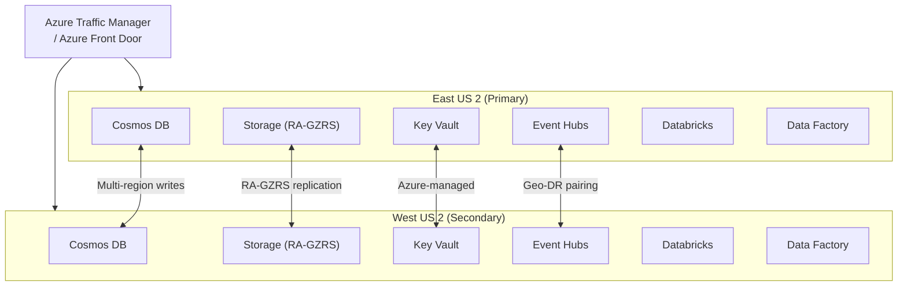

[Home](../README.md) > [Docs](./) > **Multi-Region Deployment**

# Multi-Region Deployment Guide

> **Last Updated:** 2026-04-15 | **Status:** Active | **Audience:** Platform Engineers

!!! note
    **Quick Summary**: Active-active multi-region deployment for CSA-in-a-Box — service capability matrix (native replication vs stamp-per-region), data replication patterns (RA-GZRS, Cosmos multi-master, Event Hubs Geo-DR), failover procedures, RPO/RTO targets, step-by-step deployment, chaos testing, monitoring, and cost implications (+40-80% overhead).

This guide covers deploying CSA-in-a-Box in an active-active
multi-region configuration for high availability and disaster recovery.
It extends the standard deployment in
[GETTING_STARTED.md](GETTING_STARTED.md) and pairs with the DR runbook
in [DR.md](DR.md) which documents the operational failover procedures.

!!! important
    **Scope:** the CSA-in-a-Box Data Landing Zone (DLZ) and its dependent
    services. The Management and Connectivity landing zones have their own
    multi-region considerations (Azure Policy replication, hub VNet per
    region) that are out of scope here.

## 📑 Table of Contents

- [🏗️ 1. Architecture Overview](#️-1-architecture-overview)
- [📊 2. Service Capability Matrix](#-2-service-capability-matrix)
- [🔄 3. Data Replication Patterns](#-3-data-replication-patterns)
  - [3.1 Storage: RA-GZRS Automatic Replication](#31-storage-ra-gzrs-automatic-replication)
  - [3.2 Cosmos DB: Multi-Master Writes](#32-cosmos-db-multi-master-writes)
  - [3.3 dbt Models: Idempotent, Deploy to Both Regions](#33-dbt-models-idempotent-deploy-to-both-regions)
  - [3.4 Event Hubs: Geo-DR Namespace Pairing](#34-event-hubs-geo-dr-namespace-pairing)
- [🚀 4. Failover Procedures](#-4-failover-procedures)
  - [4.1 Automatic Failover](#41-automatic-failover-no-operator-action-required)
  - [4.2 Manual Failover](#42-manual-failover-operator-action-required)
  - [4.3 DNS / Traffic Manager Configuration](#43-dns--traffic-manager-configuration)
- [📋 5. RPO / RTO Targets by Service Tier](#-5-rpo--rto-targets-by-service-tier)
- [📦 6. Deployment Process](#-6-deployment-process)
- [🧪 7. Chaos Testing](#-7-chaos-testing)
- [📈 8. Monitoring Multi-Region Health](#-8-monitoring-multi-region-health)
- [💰 9. Cost Implications of Multi-Region](#-9-cost-implications-of-multi-region)
- [🏢 10. Combining Multi-Region with Multi-Tenant](#-10-combining-multi-region-with-multi-tenant)
- [📋 11. Quick Reference](#-11-quick-reference)

---

## 🏗️ 1. Architecture Overview

CSA-in-a-Box multi-region uses an **active-active** topology where both
regions serve traffic simultaneously. Services that support native
multi-region replication (Cosmos DB, Storage) are configured for
automatic data synchronization. Services without built-in multi-region
support (Databricks, Data Factory, Synapse) are deployed as independent
stamps in each region.



The primary region handles all writes for stamp-based services. The
secondary region is a warm standby for compute services and an active
read replica for data services. During a regional failure, the secondary
region can be promoted to primary with the failover procedures in
[DR.md](DR.md).

---

## 📊 2. Service Capability Matrix

Not all Azure services support multi-region the same way. This matrix
documents the strategy for each service deployed by CSA-in-a-Box.

| Service | Multi-Region Support | Strategy | RPO | RTO |
|---|---|---|---|---|
| **Cosmos DB** | Native multi-region writes | Active-active | < 15 min | < 30 min |
| **Storage (Silver/Gold)** | RA-GZRS | Built-in geo-replication | < 1 h | < 1 h |
| **Storage (Bronze/raw)** | ZRS | Zone-redundant, single region | < 4 h | < 4 h |
| **Key Vault** | Azure-managed geo-replication | Built-in | N/A | < 15 min |
| **Event Hubs** | Geo-DR namespace pairing | Manual config post-deploy | < 5 min | < 15 min |
| **Databricks** | No native support | Stamp per region | < 4 h | < 4 h |
| **Data Factory** | No native support | Stamp per region | < 4 h | < 8 h |
| **Synapse** | No native support | Stamp per region | < 1 h | < 2 h |
| **Azure ML** | No native support | Stamp per region | < 4 h | < 4 h |
| **Data Explorer** | Follower databases | Read replicas in secondary | < 30 min | < 1 h |
| **App Insights** | Per-region instance | Stamp per region | N/A | N/A |
| **Stream Analytics** | No native support | Stamp per region | < 4 h | < 4 h |
| **Purview** | No native support | Accept 24h RPO | < 24 h | < 24 h |

<details markdown="1">
<summary>Legend</summary>

- **Native**: The service replicates data automatically across regions.
- **Geo-DR pairing**: The service supports a disaster-recovery
  namespace/alias that can be failed over.
- **Stamp per region**: Deploy the service independently in each region.
  No automatic data sync — the service is stateless or re-populated from
  replicated data sources.
- **Follower databases**: ADX-specific — a secondary cluster attaches
  read-only copies of databases from the primary cluster.

</details>

---

## 🔄 3. Data Replication Patterns

### 3.1 Storage: RA-GZRS Automatic Replication

When `sku` is set to `Standard_RAGZRS`, Azure Storage replicates data
synchronously across three availability zones in the primary region and
asynchronously to the paired secondary region. The secondary region
provides read-only access at all times.

**Key points:**
- RPO is typically < 15 minutes but Azure does not guarantee a specific
  RPO for asynchronous replication. Plan for up to 1 hour.
- After a customer-initiated failover, the account's replication drops
  to LRS. Re-enable geo-replication after the primary region recovers
  (see [DR.md](DR.md) §5).
- The secondary endpoint is at `{account}-secondary.blob.core.windows.net`.
  Configure read clients to use this endpoint for cross-region reads.

**Configuration in `params.multi-region.json`:**
```json
"parStorage": {
    "value": {
        "sku": "Standard_RAGZRS"
    }
}
```

### 3.2 Cosmos DB: Multi-Master Writes

With `enableMultipleWriteLocations=true` and `secondaryLocation` set,
Cosmos DB accepts writes in both regions simultaneously. Conflict
resolution uses Last-Writer-Wins (LWW) by default, based on the `_ts`
(timestamp) property.

**Key points:**
- Session consistency is maintained per-region. Cross-region reads may
  show slight staleness (typically < 10ms for multi-master).
- Automatic failover is enabled — if the primary region goes down,
  Cosmos automatically promotes the secondary.
- Conflict resolution policy is configurable per container. For
  last-writer-wins, no application changes are needed.
- Continuous backup (30-day PITR) works across both regions.

**Configuration in `params.multi-region.json`:**
```json
"parCosmosDB": {
    "value": {
        "enableMultipleWriteLocations": "Enabled",
        "secondaryLocation": "westus2",
        "enableAutomaticFailover": "Enabled"
    }
}
```

### 3.3 dbt Models: Idempotent, Deploy to Both Regions

dbt models are inherently idempotent — they read from source data and
produce output tables. In a multi-region deployment, run dbt against
both regions' Databricks workspaces to populate the medallion layers
from the region-local storage replicas.

```bash
# Run dbt against the primary region
dbt run --target prod_eastus2

# Run dbt against the secondary region
dbt run --target prod_westus2
```

!!! note
    Since the source data (Storage RA-GZRS) is eventually consistent
    across regions, model outputs may differ slightly during replication
    lag. For critical aggregations, run dbt in the primary region first
    and let replication propagate the source data before running in the
    secondary.

### 3.4 Event Hubs: Geo-DR Namespace Pairing

Event Hubs Geo-DR replicates namespace metadata (event hub definitions,
consumer groups, access policies) but **not message data**. During
normal operation, producers send to the primary namespace. After
failover, the alias DNS record points to the secondary namespace and
producers seamlessly reconnect.

```bash
# Create the Geo-DR alias (one-time setup after both namespaces are deployed)
az eventhubs georecovery-alias create \
  --resource-group rg-dlz-prod-eventhubs-eastus2 \
  --namespace-name dlz-prod-ehns-eastus2 \
  --alias dlz-prod-ehns-geo \
  --partner-namespace "/subscriptions/<SUB_ID>/resourceGroups/rg-dlz-prod-eventhubs-westus2/providers/Microsoft.EventHub/namespaces/dlz-prod-ehns-westus2"
```

!!! warning
    - Messages in-flight during failover may be lost. Design consumers for
      at-least-once processing with idempotent writes.
    - After failover, the secondary becomes the new primary. The old primary
      must be re-paired as the secondary.
    - Consumer offsets are not replicated — consumers restart from the latest
      checkpoint or the beginning of the retention window.

---

## 🚀 4. Failover Procedures

The detailed step-by-step failover procedure is in [DR.md](DR.md) §3.
This section summarizes the decision framework.

### 4.1 Automatic Failover (No operator action required)

| Service | Trigger | Behavior |
|---|---|---|
| Cosmos DB | Regional outage detected by Azure | Secondary promoted to primary automatically. Multi-master writes continue in the surviving region. |
| Storage (RA-GZRS) | No automatic failover | Read traffic can use the secondary endpoint immediately. Write failover requires operator action. |
| Key Vault | Azure-managed | Automatic within Azure's SLA. |

### 4.2 Manual Failover (Operator action required)

| Service | Command | Time to Complete |
|---|---|---|
| Storage | `az storage account failover --name <name> --yes` | 10–60 minutes |
| Event Hubs | `az eventhubs georecovery-alias fail-over --alias <alias>` | < 5 minutes |
| Databricks | Activate secondary workspace, update linked services | 1–2 hours |
| Data Factory | Redeploy pipelines to secondary factory | 1–4 hours |
| ADX | Promote follower databases to primary | 30–60 minutes |

### 4.3 DNS / Traffic Manager Configuration

For clients to seamlessly fail over, deploy Azure Traffic Manager (or
Azure Front Door) with priority-based routing:

```bash
# Create Traffic Manager profile
az network traffic-manager profile create \
  --name "csa-dlz-tm" \
  --resource-group "rg-global-traffic" \
  --routing-method Priority \
  --unique-dns-name "csa-dlz"

# Add primary endpoint
az network traffic-manager endpoint create \
  --name "eastus2-primary" \
  --profile-name "csa-dlz-tm" \
  --resource-group "rg-global-traffic" \
  --type azureEndpoints \
  --target-resource-id "<PRIMARY_RESOURCE_ID>" \
  --priority 1

# Add secondary endpoint
az network traffic-manager endpoint create \
  --name "westus2-secondary" \
  --profile-name "csa-dlz-tm" \
  --resource-group "rg-global-traffic" \
  --type azureEndpoints \
  --target-resource-id "<SECONDARY_RESOURCE_ID>" \
  --priority 2
```

---

## 📋 5. RPO / RTO Targets by Service Tier

Services are classified into tiers that drive the SKU, replication mode,
and expected recovery behavior. See [DR.md](DR.md) §1 for the
authoritative table.

### Tier: Critical (RPO < 1h, RTO < 1h)

| Service | Configuration | Recovery |
|---|---|---|
| Cosmos DB | Multi-master, automatic failover | Automatic — no data loss in surviving region |
| Storage (Silver/Gold) | RA-GZRS | Manual failover; read traffic uses secondary immediately |
| Key Vault | Azure-managed geo-replication | Automatic |
| Event Hubs | Geo-DR pairing | Manual failover; in-flight messages may be lost |

### Tier: Standard (RPO < 4h, RTO < 8h)

| Service | Configuration | Recovery |
|---|---|---|
| Databricks | Passive workspace in secondary | Activate workspace, rehydrate Unity Catalog |
| Data Factory | Paired factory in secondary | Redeploy pipelines, update linked services |
| Synapse | Per-region workspace | Reattach serverless endpoints to failover storage |
| Azure ML | Per-region workspace | Retarget compute to secondary region |
| Data Explorer | Follower databases | Promote followers to writable databases |

### Tier: Best-Effort (RPO < 24h, RTO < 24h)

| Service | Configuration | Recovery |
|---|---|---|
| Purview | No geo-replication | Re-scan from source after region recovery |
| Stream Analytics | Per-region job | Redeploy job definition |

---

## 📦 6. Deployment Process

### 6.1 Prerequisites

Before deploying multi-region:

- [ ] Two Azure subscriptions (or a single subscription with
  region-specific resource groups)
- [ ] Spoke VNets deployed in both regions, peered to respective hubs
- [ ] Private DNS zones linked to both spoke VNets
- [ ] Key Vault provisioned in both regions (or relying on Azure-managed
  geo-replication of a single vault)
- [ ] Log Analytics workspace accessible from both regions

### 6.2 Step 1 — Deploy the Primary Region

```bash
az account set --subscription <DLZ_SUBSCRIPTION_ID>

az deployment sub create \
  --location eastus2 \
  --template-file deploy/bicep/DLZ/main.bicep \
  --parameters deploy/bicep/DLZ/params.multi-region.json
```

### 6.3 Step 2 — Deploy Stamp-Based Services in the Secondary Region

Create a secondary parameter file for services that need separate stamps:

```bash
cp deploy/bicep/DLZ/params.multi-region.json \
   deploy/bicep/DLZ/params.multi-region-westus2.json
```

Edit the secondary file:
- [ ] Change `location` to `"West US 2"`
- [ ] Update resource names to include `westus2` suffix
- [ ] Update VNet/subnet references to the secondary region's network
- [ ] Disable services that are already multi-region (Cosmos DB, Storage)
- [ ] Keep stamp-based services enabled (Databricks, Data Factory, etc.)

```bash
az deployment sub create \
  --location westus2 \
  --template-file deploy/bicep/DLZ/main.bicep \
  --parameters deploy/bicep/DLZ/params.multi-region-westus2.json
```

### 6.4 Step 3 — Configure Geo-DR Pairing

After both namespaces are deployed, pair Event Hubs:

```bash
az eventhubs georecovery-alias create \
  --resource-group rg-dlz-prod-eventhubs-eastus2 \
  --namespace-name dlz-prod-ehns-eastus2 \
  --alias dlz-prod-ehns-geo \
  --partner-namespace "<SECONDARY_NAMESPACE_RESOURCE_ID>"
```

### 6.5 Step 4 — Configure ADX Follower Databases

```bash
az kusto attached-database-configuration create \
  --cluster-name dlzprodadxwestus2 \
  --resource-group rg-dlz-prod-adx-westus2 \
  --attached-database-configuration-name "analytics-follower" \
  --cluster-resource-id "/subscriptions/<SUB_ID>/resourceGroups/rg-dlz-prod-adx-eastus2/providers/Microsoft.Kusto/Clusters/dlzprodadxeastus2" \
  --database-name "analytics" \
  --default-principals-modification-kind "Union"
```

### 6.6 Step 5 — Configure Traffic Manager

Set up global routing as described in §4.3 above.

### 6.7 Step 6 — Verify

```bash
# Cosmos DB — verify both regions
az cosmosdb show \
  --name <COSMOS_ACCOUNT> \
  --resource-group <RG> \
  --query "locations[].{Name:locationName, Priority:failoverPriority, Status:provisioningState}" \
  -o table

# Storage — verify RAGZRS
az storage account show \
  --name <STORAGE_ACCOUNT> \
  --resource-group <RG> \
  --query "{Primary:primaryLocation, Secondary:secondaryLocation, SKU:sku.name}" \
  -o table

# Event Hubs — verify Geo-DR
az eventhubs georecovery-alias show \
  --resource-group <RG> \
  --namespace-name <PRIMARY_NAMESPACE> \
  --alias <ALIAS>
```

---

## 🧪 7. Chaos Testing

Use Azure Chaos Studio to validate failover behavior before a real
outage occurs.

### 7.1 Experiment: Storage Failover

```json
{
    "name": "storage-failover-test",
    "identity": { "type": "SystemAssigned" },
    "properties": {
        "steps": [
            {
                "name": "Step1-StorageFailover",
                "branches": [
                    {
                        "name": "Branch1",
                        "actions": [
                            {
                                "type": "continuous",
                                "name": "urn:csci:microsoft:storageAccount:failover/1.0",
                                "duration": "PT10M",
                                "parameters": [],
                                "selectorId": "storageSelector"
                            }
                        ]
                    }
                ]
            }
        ],
        "selectors": [
            {
                "type": "List",
                "id": "storageSelector",
                "targets": [
                    {
                        "type": "ChaosTarget",
                        "id": "/subscriptions/<SUB_ID>/resourceGroups/<RG>/providers/Microsoft.Storage/storageAccounts/<ACCOUNT>/providers/Microsoft.Chaos/targets/Microsoft-StorageAccount"
                    }
                ]
            }
        ]
    }
}
```

### 7.2 Experiment: Cosmos DB Region Outage

Simulate a region outage by temporarily removing the primary region from
the Cosmos account's location list:

```bash
# Force failover to secondary (non-destructive, reversible)
az cosmosdb failover-priority-change \
  --name <COSMOS_ACCOUNT> \
  --resource-group <RG> \
  --failover-policies westus2=0 eastus2=1
```

Verify that applications continue to operate using the secondary region,
then reverse:

```bash
az cosmosdb failover-priority-change \
  --name <COSMOS_ACCOUNT> \
  --resource-group <RG> \
  --failover-policies eastus2=0 westus2=1
```

### 7.3 Quarterly Drill Schedule

| Quarter | Service | Environment | Focus |
|---|---|---|---|
| Q1 | Cosmos DB | Dev | Automatic failover verification |
| Q2 | Storage | Dev | Customer-initiated failover timing |
| Q3 | Event Hubs | Dev | Geo-DR alias failover + consumer restart |
| Q4 | Full stack | Staging | End-to-end failover drill |

---

## 📈 8. Monitoring Multi-Region Health

### 8.1 Cross-Region Dashboard

Create an Azure Monitor workbook that displays health across both
regions side by side:

**Cosmos DB replication lag:**
```kusto
AzureDiagnostics
| where ResourceProvider == "MICROSOFT.DOCUMENTDB"
| where Category == "DataPlaneRequests"
| summarize AvgLatencyMs=avg(duration_s * 1000),
            P99LatencyMs=percentile(duration_s * 1000, 99)
  by Region=location_s, bin(TimeGenerated, 5m)
| render timechart
```

**Storage geo-replication status:**
```bash
az storage account show \
  --name <ACCOUNT> \
  --query "geoReplicationStats.{Status:status, LastSync:lastSyncTime}" \
  -o table
```

**Event Hubs Geo-DR health:**
```kusto
AzureDiagnostics
| where ResourceProvider == "MICROSOFT.EVENTHUB"
| where OperationName == "GeoReplication"
| project TimeGenerated, Status=status_s, Alias=resource_s
| order by TimeGenerated desc
| take 10
```

### 8.2 Alerts

| Alert | Metric | Threshold | Action |
|---|---|---|---|
| Cosmos replication lag | `ReplicationLatency` | > 5,000 ms for 10 min | Page on-call |
| Storage geo-replication unhealthy | `GeoReplicationStatus` | != `Live` for 15 min | Page on-call |
| Event Hubs Geo-DR broken | Manual check | Alias not resolving | Page on-call |
| ADX follower lag | `FollowerLatency` | > 60,000 ms for 15 min | Notify platform team |

### 8.3 Azure Resource Graph: Multi-Region Inventory

```kusto
Resources
| where tags['MultiRegion'] != '' or tags['PrimaryRegion'] != ''
| summarize ResourceCount=count() by location, type
| order by location, type
```

---

## 💰 9. Cost Implications of Multi-Region

Multi-region deployments increase cost. Understanding the cost drivers
helps right-size the secondary region.

### 9.1 Cost Multipliers by Service

| Service | Multi-Region Cost Impact | Notes |
|---|---|---|
| **Cosmos DB** | 2× RU cost | Each region charges for provisioned/consumed RUs |
| **Storage (RA-GZRS)** | ~1.5× vs LRS | Geo-replication adds ~50% to storage cost |
| **Event Hubs** | 2× namespace cost | Two full namespaces (primary + secondary) |
| **Databricks** | 1×–2× | Secondary workspace can be cold standby (1×) or active (2×) |
| **Data Factory** | ~1.5× | Secondary factory but potentially fewer pipeline runs |
| **Data Explorer** | 1.5×–2× | Follower databases consume compute in secondary cluster |
| **Key Vault** | Negligible | Geo-replication included in Standard/Premium tier |
| **Azure ML** | 1×–2× | Depends on compute utilization in secondary |

### 9.2 Cost Optimization Strategies

- [ ] **Cold standby for stamp-based services**: Deploy Databricks and ADF
   in the secondary region but keep clusters stopped and pipelines
   disabled. Reduces 2× cost to ~1.1×.
- [ ] **Right-size the secondary ADX cluster**: Use a smaller SKU for the
   follower cluster since it only handles read traffic.
- [ ] **Selective multi-region**: Use `Standard_ZRS` for Bronze/raw data
   and reserve RA-GZRS for Silver/Gold layers.
- [ ] **Reserved instances**: Commit to 1-year or 3-year reservations for
   Cosmos DB RUs and Databricks DBUs in both regions.
- [ ] **Monitor and tune**: Use Azure Cost Management with the
   `MultiRegion` and `PrimaryRegion` tags.

### 9.3 Estimated Monthly Cost Overhead

| Category | Single-Region | Multi-Region | Delta |
|---|---|---|---|
| Data (Cosmos + Storage) | Baseline | +60–80% | RA-GZRS + multi-master |
| Compute (Databricks + ADF) | Baseline | +10–100% | Cold standby to active |
| Networking (VNet peering, PE) | Baseline | +50–80% | Second set of endpoints |
| Monitoring (Log Analytics) | Baseline | +30–50% | Second workspace or cross-region shipping |
| **Total estimate** | Baseline | **+40–80%** | Depends on active vs cold standby |

---

## 🏢 10. Combining Multi-Region with Multi-Tenant

For deployments that require both multi-tenant isolation and
multi-region availability, deploy each tenant stamp in both regions:

```text
Tenant A: params.tenant-contoso-eastus2.json → eastus2
           params.tenant-contoso-westus2.json → westus2

Tenant B: params.tenant-fabrikam-eastus2.json → eastus2
           params.tenant-fabrikam-westus2.json → westus2
```

Each tenant's Cosmos DB account and storage account get their own
multi-region replication. Stamp-based services (Databricks, ADF) are
deployed per-tenant per-region.

See [MULTI_TENANT.md](MULTI_TENANT.md) for the tenant isolation model
and naming conventions.

---

## 📋 11. Quick Reference

| Scenario | Guide |
|---|---|
| Deploy multi-region from scratch | §6 above |
| Understand which services support multi-region | §2 Service Capability Matrix |
| Configure Cosmos DB multi-master | §3.2 |
| Configure Storage RA-GZRS | §3.1 |
| Set up Event Hubs Geo-DR | §3.4 |
| Failover the whole platform | [DR.md](DR.md) §3 |
| Fail back after recovery | [DR.md](DR.md) §5 |
| Run a chaos experiment | §7 |
| Monitor cross-region health | §8 |
| Understand cost impact | §9 |
| Multi-region + multi-tenant | §10 |
| Quarterly DR drill | §7.3 / [DR.md](DR.md) §4 |

---

## 🔗 Related Documentation

- [MULTI_TENANT.md](MULTI_TENANT.md) — Multi-tenant stamped deployment model
- [DR.md](DR.md) — Disaster recovery runbook and failover procedures
- [ARCHITECTURE.md](ARCHITECTURE.md) — Platform architecture overview
- [PLATFORM_SERVICES.md](PLATFORM_SERVICES.md) — Platform services reference and SKU details
