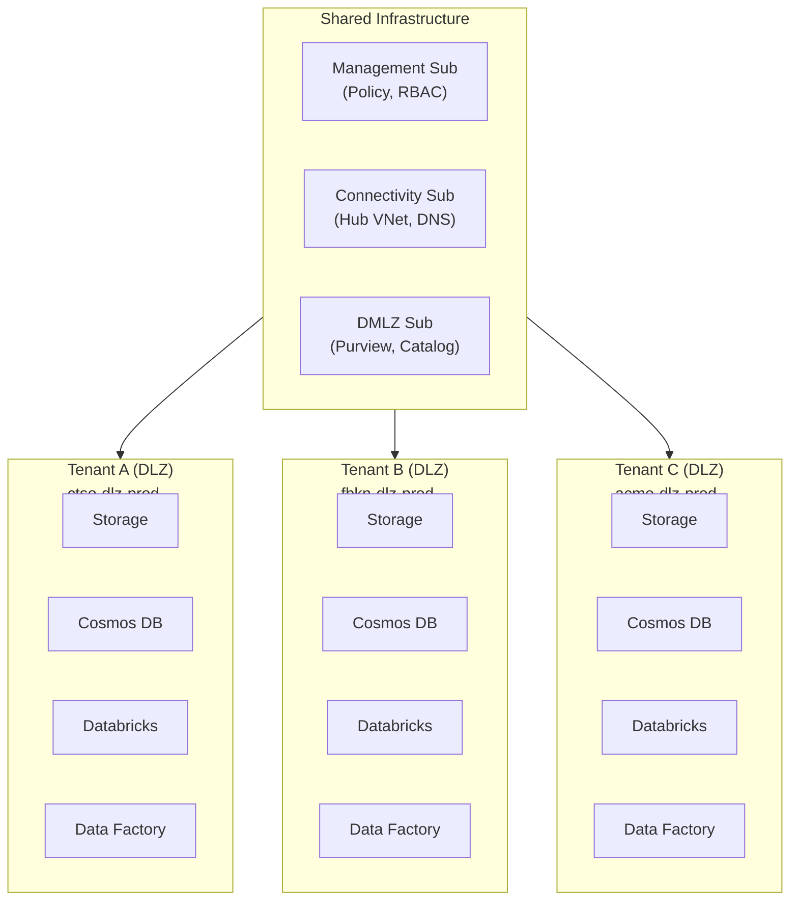

[Home](../README.md) > [Docs](./) > **Multi-Tenant**

# Multi-Tenant Deployment Guide

> **Last Updated:** 2026-04-15 | **Status:** Active | **Audience:** Platform Engineers

> [!NOTE]
> **Quick Summary**: Stamped multi-tenant deployment model for CSA-in-a-Box — resource naming conventions, three data isolation strategies (physical, logical, hybrid), tenant onboarding/offboarding procedures, cost attribution via tags, per-tenant IAM and monitoring, dbt multi-tenant configuration, and decommission runbook.

This guide covers deploying CSA-in-a-Box in a multi-tenant configuration
where each tenant (customer, business unit, or organizational boundary)
receives an isolated set of data platform resources. It pairs with the
standard deployment procedure in [GETTING_STARTED.md](GETTING_STARTED.md)
and the disaster recovery runbook in [DR.md](DR.md).

> [!IMPORTANT]
> **Scope:** the CSA-in-a-Box Data Landing Zone (DLZ). The Management,
> Connectivity, and DMLZ landing zones are shared infrastructure and are
> deployed once regardless of tenant count.

## 📑 Table of Contents

- [🏗️ 1. Architecture Overview](#️-1-architecture-overview)
- [📛 2. Resource Naming Convention](#-2-resource-naming-convention)
- [🔒 3. Data Isolation Strategies](#-3-data-isolation-strategies)
  - [3.1 Physical Isolation](#31-physical-isolation-recommended-for-regulated-workloads)
  - [3.2 Logical Isolation](#32-logical-isolation-shared-infrastructure-row-level-filtering)
  - [3.3 Hybrid](#33-hybrid-separate-storage-shared-compute)
- [📦 4. Deployment Process](#-4-deployment-process)
- [💰 5. Cost Attribution via Tags](#-5-cost-attribution-via-tags)
- [🔑 6. Identity & Access Management per Tenant](#-6-identity--access-management-per-tenant)
- [📈 7. Monitoring & Alerting per Tenant](#-7-monitoring--alerting-per-tenant)
- [🗄️ 8. dbt Multi-Tenant Configuration](#️-8-dbt-multi-tenant-configuration)
- [🚪 9. Offboarding / Tenant Decommission](#-9-offboarding--tenant-decommission)
- [📋 10. Quick Reference](#-10-quick-reference)

---

## 🏗️ 1. Architecture Overview

CSA-in-a-Box uses a **stamped deployment model** for multi-tenancy. Each
tenant receives a complete, independent deployment ("stamp") of the DLZ
Bicep templates. Stamps are identical in structure but isolated in
resources, networking, and identity.



**Why stamps?** Physical isolation provides the strongest security,
compliance, and performance guarantees. Each tenant's data never
co-mingles with another tenant's data at the infrastructure layer. This
is the recommended model for regulated workloads, government tenants, or
any scenario where a shared-nothing architecture is required.

---

## 📛 2. Resource Naming Convention

All tenant resources follow a consistent naming pattern that embeds the
tenant prefix, environment, service name, and region:

```text
{tenant_prefix}-{standard_prefix}-{environment}-{service}-{region}
```

| Component | Example | Source |
|---|---|---|
| `tenant_prefix` | `ctso` | Short (3–5 char) tenant abbreviation |
| `standard_prefix` | `dlz` | The `prefix` parameter in the Bicep template |
| `environment` | `prod` | The `environment` parameter |
| `service` | `cosmosdb`, `storage`, `dbw` | Per-module naming |
| `region` | `eastus2` | Derived from `location` parameter |

### Examples

| Resource Type | Single-Tenant Name | Multi-Tenant Name (Contoso) |
|---|---|---|
| Resource Group (Cosmos) | `rg-dlz-prod-cosmosdb-eastus2` | `rg-ctso-dlz-prod-cosmosdb-eastus2` |
| Storage Account | `dlzprodst` | `ctsodlzprodst` |
| Cosmos DB Account | `dlz-prod-cosmos-eastus2` | `ctso-dlz-prod-cosmos-eastus2` |
| Databricks Workspace | `dlz-prod-dbw` | `ctso-dlz-prod-dbw` |
| Event Hubs Namespace | `dlz-prod-ehns` | `ctso-dlz-prod-ehns` |
| Data Factory | `dlz-prod-adf` | `ctso-dlz-prod-adf` |

The `prefix` parameter in the Bicep params file controls this. Setting
`prefix` to `ctso-dlz` causes the `basename` variable
(`${prefix}-${environment}`) to produce `ctso-dlz-prod`, which
propagates through all resource group and resource names automatically.

### Naming constraints

> [!WARNING]
> - **Storage accounts**: max 24 characters, lowercase alphanumeric only.
>   The Bicep module truncates and sanitizes names automatically.
> - **Cosmos DB accounts**: max 44 characters, lowercase alphanumeric and
>   hyphens only.
> - **ADX clusters**: max 22 characters, lowercase alphanumeric only.
>   Keep tenant prefixes short.

---

## 🔒 3. Data Isolation Strategies

CSA-in-a-Box supports three isolation strategies. Choose based on your
compliance requirements, cost tolerance, and operational complexity.

### 3.1 Physical Isolation (Recommended for regulated workloads)

Each tenant gets completely separate Azure resources. This is the default
stamped model described in this guide.

**Characteristics:**
- Separate storage accounts, Cosmos DB accounts, compute clusters
- No shared data plane — zero risk of cross-tenant data leakage
- Independent scaling, backups, and failover per tenant
- Highest cost (full resource set per tenant)
- Simplest compliance story — each tenant is a self-contained boundary

**When to use:**
- Government / FedRAMP / ITAR workloads
- Tenants with strict data residency requirements
- Tenants that require dedicated encryption keys (CMK per tenant)
- Contractual obligations for physical separation

### 3.2 Logical Isolation (Shared infrastructure, row-level filtering)

All tenants share the same Azure resources. Data is partitioned by a
`tenant_id` column and filtered at the query layer.

**Characteristics:**
- Single storage account, single Cosmos DB, shared Databricks
- Data separated by partition key / folder structure / row-level filters
- Lower cost (shared infrastructure amortized across tenants)
- Higher operational complexity (RBAC, row-level security, auditing)

**When to use:**
- Internal business units within the same organization
- Non-regulated workloads with low cross-tenant risk
- Cost-sensitive deployments with many small tenants

**Storage layout for logical isolation:**
```text
raw/
├── tenant_id=contoso/
│   ├── orders/
│   └── customers/
├── tenant_id=fabrikam/
│   ├── orders/
│   └── customers/
```

### 3.3 Hybrid (Separate storage, shared compute)

Tenants get dedicated storage and databases but share compute resources
(Databricks, Data Factory, Synapse).

**Characteristics:**
- Data-at-rest isolation (separate storage accounts per tenant)
- Shared compute reduces cost versus full physical isolation
- Compute workloads use tenant-specific credentials / linked services
- Moderate complexity — compute must be configured per-tenant

**When to use:**
- Tenants that need data isolation but not compute isolation
- Cost-conscious deployments that still need strong data boundaries

---

## 📦 4. Deployment Process

### 4.1 Prerequisites

- [ ] Tenant subscription provisioned (or resource groups designated)
- [ ] Spoke VNet deployed and peered to the hub
- [ ] Private DNS zones linked to the tenant's spoke VNet
- [ ] Tenant admin group created in Azure AD
- [ ] CMK Key Vault provisioned (if using per-tenant CMK)

### 4.2 Creating the Parameter File

```bash
# Copy the multi-tenant template
cp deploy/bicep/DLZ/params.multi-tenant.json \
   deploy/bicep/DLZ/params.tenant-fabrikam.json

# Edit the file — replace all placeholder values:
#   - Tenant prefix: fbkn
#   - Tenant name in tags: fabrikam
#   - Subscription IDs
#   - VNet / subnet references
#   - Key Vault URIs
#   - Cost center
```

### 4.3 Deploying the Tenant Stamp

```bash
# Set the subscription for the tenant's DLZ
az account set --subscription <TENANT_DLZ_SUBSCRIPTION_ID>

# Deploy the stamp
az deployment sub create \
  --location eastus2 \
  --template-file deploy/bicep/DLZ/main.bicep \
  --parameters deploy/bicep/DLZ/params.tenant-fabrikam.json

# Verify deployment
az deployment sub show \
  --name main \
  --query "properties.provisioningState"
```

### 4.4 Post-Deployment RBAC

```bash
TENANT_ADMIN_GROUP_ID="<AZURE_AD_GROUP_OBJECT_ID>"

# Storage Blob Data Contributor on the tenant's storage
az role assignment create \
  --assignee "$TENANT_ADMIN_GROUP_ID" \
  --role "Storage Blob Data Contributor" \
  --scope "/subscriptions/<SUB_ID>/resourceGroups/rg-fbkn-dlz-prod-storage-eastus2"

# Cosmos DB Account Reader on the tenant's Cosmos
az role assignment create \
  --assignee "$TENANT_ADMIN_GROUP_ID" \
  --role "Cosmos DB Account Reader Role" \
  --scope "/subscriptions/<SUB_ID>/resourceGroups/rg-fbkn-dlz-prod-cosmosdb-eastus2"

# Databricks Contributor on the tenant's workspace
az role assignment create \
  --assignee "$TENANT_ADMIN_GROUP_ID" \
  --role "Contributor" \
  --scope "/subscriptions/<SUB_ID>/resourceGroups/rg-fbkn-dlz-prod-databricks-eastus2"
```

### 4.5 Tenant Onboarding Checklist

- [ ] Parameter file created and committed to repo
- [ ] Bicep deployment completed successfully
- [ ] RBAC assignments configured for tenant admin group
- [ ] Private endpoints verified (connectivity from tenant VNet)
- [ ] dbt project configured with tenant profile
- [ ] Data ingestion pipeline tested end-to-end
- [ ] Monitoring dashboards created for tenant
- [ ] Tenant-specific alerts configured
- [ ] Runbook updated with tenant-specific failover details
- [ ] Tenant admin notified with access instructions

---

## 💰 5. Cost Attribution via Tags

Every resource in a tenant stamp carries tags for cost tracking and
chargeback:

| Tag Key | Example Value | Purpose |
|---|---|---|
| `tenant-id` | `contoso` | Primary tenant identifier |
| `tenant-prefix` | `ctso` | Short prefix used in resource names |
| `cost-center` | `CONTOSO-TENANT-001` | Billing code for chargeback |
| `environment` | `prod` | Environment tier |
| `CostCenter` | `CSA-Platform` | Platform-level cost center (shared) |
| `PrimaryContact` | `platform-team@contoso.com` | Tenant contact |

### Cost Management queries

```kusto
// Azure Resource Graph query — cost by tenant
Resources
| where tags['tenant-id'] != ''
| summarize ResourceCount=count(), 
            Services=make_set(type) 
  by TenantId=tostring(tags['tenant-id']),
     CostCenter=tostring(tags['cost-center'])
| order by ResourceCount desc
```

### Chargeback report

```bash
# Export costs filtered by tenant tag
az costmanagement export create \
  --name "tenant-contoso-monthly" \
  --scope "/subscriptions/<SUB_ID>" \
  --type "ActualCost" \
  --timeframe "MonthToDate" \
  --storage-account-id "<EXPORT_STORAGE_ID>" \
  --storage-container "cost-exports" \
  --query-filter "tags/tenant-id eq 'contoso'"
```

---

## 🔑 6. Identity & Access Management per Tenant

### 6.1 Azure AD Group Structure

| Group Name | Role | Scope |
|---|---|---|
| `sg-{tenant}-dlz-admins` | Owner | Tenant subscription/RGs |
| `sg-{tenant}-dlz-data-engineers` | Storage Blob Data Contributor, ADF Contributor | Tenant data resources |
| `sg-{tenant}-dlz-data-scientists` | Databricks Contributor, AML Contributor | Tenant compute resources |
| `sg-{tenant}-dlz-readers` | Reader, Storage Blob Data Reader | Tenant resources (read-only) |

### 6.2 Cross-Tenant Access Controls

By default, no cross-tenant access is permitted. The stamped model
enforces this through separate subscriptions and RBAC boundaries.

If cross-tenant data sharing is required (e.g., a shared reference
dataset), use one of these patterns:

1. **Shared storage account** — a dedicated "shared" storage account
   outside any tenant stamp, with explicit RBAC grants per tenant.
2. **Azure Data Share** — managed data sharing with snapshot-based or
   in-place sharing.
3. **External tables** — Databricks external tables pointing at
   cross-tenant storage with explicit Unity Catalog grants.

### 6.3 Managed Identity Isolation

Each tenant stamp deploys its own managed identities. Service-to-service
RBAC (ADF → Storage, Databricks → Storage, etc.) is scoped within the
tenant's resource groups. The `main.bicep` RBAC role assignments section
handles this automatically because all `principalId` references come
from the tenant's own module outputs.

---

## 📈 7. Monitoring & Alerting per Tenant

### 7.1 Log Analytics Strategy

**Option A — Shared workspace with resource-scoped access:**
All tenants log to a central Log Analytics workspace. Use resource-level
RBAC so each tenant can only query their own resources.

**Option B — Per-tenant workspace (recommended for strict isolation):**
Each tenant gets their own Log Analytics workspace specified via the
`logAnalyticsWorkspaceId` parameter. Dashboards and alerts are
workspace-scoped.

### 7.2 Tenant-Specific Alerts

```bash
# Storage availability alert for tenant contoso
az monitor metrics alert create \
  --name "alert-contoso-storage-availability" \
  --resource-group "rg-ctso-dlz-prod-storage-eastus2" \
  --scopes "/subscriptions/<SUB_ID>/resourceGroups/rg-ctso-dlz-prod-storage-eastus2/providers/Microsoft.Storage/storageAccounts/ctsodlzprodst" \
  --condition "avg Availability < 99.9" \
  --window-size 5m \
  --evaluation-frequency 1m \
  --action "/subscriptions/<SUB_ID>/resourceGroups/<RG>/providers/Microsoft.Insights/actionGroups/ag-contoso-ops"
```

### 7.3 Cross-Tenant Dashboard

```kusto
// Azure Resource Graph — all tenant resources with health
Resources
| where tags['tenant-id'] != ''
| join kind=leftouter (
    ResourceContainers
    | where type == 'microsoft.resources/subscriptions'
    | project subscriptionId, SubscriptionName=name
) on subscriptionId
| summarize ResourceCount=count(),
            HealthyCount=countif(properties.provisioningState == 'Succeeded')
  by TenantId=tostring(tags['tenant-id']),
     SubscriptionName
| extend HealthPct = round(100.0 * HealthyCount / ResourceCount, 1)
| order by HealthPct asc
```

---

## 🗄️ 8. dbt Multi-Tenant Configuration

### 8.1 Per-Tenant dbt Profiles

```yaml
# domains/shared/dbt/profiles.yml
csa_inabox:
  target: "{{ env_var('DBT_TARGET', 'dev') }}"
  outputs:
    contoso_prod:
      type: databricks
      host: "{{ env_var('CONTOSO_DATABRICKS_HOST') }}"
      http_path: "{{ env_var('CONTOSO_DATABRICKS_HTTP_PATH') }}"
      schema: contoso_gold
      catalog: contoso_catalog
      token: "{{ env_var('CONTOSO_DATABRICKS_TOKEN') }}"
    fabrikam_prod:
      type: databricks
      host: "{{ env_var('FABRIKAM_DATABRICKS_HOST') }}"
      http_path: "{{ env_var('FABRIKAM_DATABRICKS_HTTP_PATH') }}"
      schema: fabrikam_gold
      catalog: fabrikam_catalog
      token: "{{ env_var('FABRIKAM_DATABRICKS_TOKEN') }}"
```

### 8.2 Running dbt for a Specific Tenant

```bash
# Physical isolation — target the tenant's Databricks
dbt run --target contoso_prod

# Logical isolation — shared Databricks, filter by tenant
dbt run --target prod --vars '{"tenant_id": "contoso"}'
```

### 8.3 Tenant Filter Macro

The `tenant_filter` macro in `domains/shared/dbt/macros/tenant_filter.sql`
provides optional row-level filtering. It is a no-op when `tenant_id` is
not set, making all models portable across single-tenant and multi-tenant
deployments.

```sql
-- In a dbt model
SELECT *
FROM {{ ref('stg_orders') }}
WHERE 1=1
  {{ tenant_filter() }}
```

---

## 🚪 9. Offboarding / Tenant Decommission

### 9.1 Pre-Decommission Checklist

- [ ] Tenant admin notified of decommission date (minimum 30 days)
- [ ] Data export completed (tenant receives their data)
- [ ] Billing finalized through decommission date
- [ ] Audit logs exported and archived
- [ ] Shared resources audited for cross-references to tenant

### 9.2 Decommission Procedure

```bash
# 1. Disable all data pipelines
az datafactory pipeline update \
  --resource-group "rg-ctso-dlz-prod-adf-eastus2" \
  --factory-name "ctso-dlz-prod-adf" \
  --name "*" \
  --set properties.activities=[]

# 2. Remove RBAC assignments
az role assignment delete \
  --assignee "<TENANT_ADMIN_GROUP_ID>" \
  --scope "/subscriptions/<TENANT_SUB_ID>"

# 3. Remove resource locks (required before deletion)
az lock delete \
  --name "ctsodlzprodst-no-delete" \
  --resource-group "rg-ctso-dlz-prod-storage-eastus2" \
  --resource-type "Microsoft.Storage/storageAccounts" \
  --resource "ctsodlzprodst"

# 4. Delete resource groups (cascading delete of all resources)
az group delete --name "rg-ctso-dlz-prod-storage-eastus2" --yes --no-wait
az group delete --name "rg-ctso-dlz-prod-cosmosdb-eastus2" --yes --no-wait
az group delete --name "rg-ctso-dlz-prod-databricks-eastus2" --yes --no-wait
az group delete --name "rg-ctso-dlz-prod-adf-eastus2" --yes --no-wait
az group delete --name "rg-ctso-dlz-prod-eventhubs-eastus2" --yes --no-wait
az group delete --name "rg-ctso-dlz-prod-externalstorage-eastus2" --yes --no-wait

# 5. Clean up DNS records
# Remove private endpoint DNS entries from the shared DNS zone

# 6. Remove the tenant parameter file from version control
git rm deploy/bicep/DLZ/params.tenant-contoso.json
git commit -m "chore: decommission tenant contoso"
```

### 9.3 Data Retention

> [!WARNING]
> After decommission, Cosmos DB data is retained for the soft-delete
> period (90 days with purge protection). Storage account data is
> available for 30 days via soft-delete. After these windows expire,
> data is irrecoverable.

For regulated workloads, export data to a long-term archive storage
account before decommissioning the tenant stamp.

### 9.4 Post-Decommission

- [ ] Verify all resource groups deleted
- [ ] Verify DNS records cleaned up
- [ ] Remove tenant from monitoring dashboards
- [ ] Remove tenant Azure AD groups (or repurpose)
- [ ] Update cost management to stop tracking tenant
- [ ] Archive decommission record in incident tracker
- [ ] Update `docs/MULTI_TENANT.md` if the tenant had special configuration

---

## 📋 10. Quick Reference

| Scenario | Guide |
|---|---|
| Onboard a new tenant | §4 above |
| Deploy tenant stamp | §4.3 |
| Cost report per tenant | §5 |
| Set up tenant RBAC | §6 |
| Run dbt for a tenant | §8 |
| Offboard a tenant | §9 |
| Disaster recovery | [DR.md](DR.md) |
| Multi-region + multi-tenant | [MULTI_REGION.md](MULTI_REGION.md) — deploy a stamp per tenant per region |

---

## 🔗 Related Documentation

- [MULTI_REGION.md](MULTI_REGION.md) — Multi-region deployment for high availability
- [COST_MANAGEMENT.md](COST_MANAGEMENT.md) — Cost estimation, budgets, and FinOps practices
- [ARCHITECTURE.md](ARCHITECTURE.md) — Platform architecture overview
