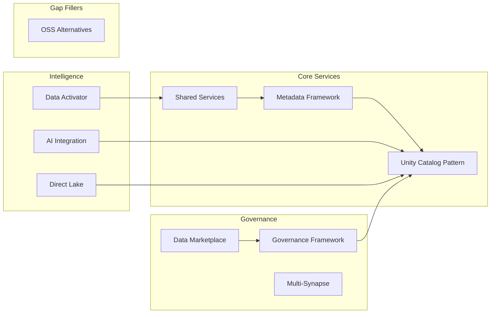

[Home](../README.md) > [Docs](./) > **Platform Services**

# Platform Services Guide

> **Last Updated:** 2026-04-15 | **Status:** Active | **Audience:** Architects

> [!NOTE]
> **Quick Summary**: Detailed guide to 10 platform services that deliver Fabric-parity capabilities on Azure PaaS — OneLake pattern, Data Activator, Direct Lake, Data Marketplace, Governance Framework, Multi-Synapse, Metadata Framework, AI Integration, Shared Services, and OSS alternatives. Intended for Azure Government (where Fabric is forecast, not GA) and for Commercial workloads that need a composable IaC stack as a stepping stone toward a future Fabric migration.

Platform services are the Fabric-parity capabilities that extend the base
landing zones. Each service is independently deployable, has its own README
with detailed usage instructions, and maps to a Microsoft Fabric equivalent so
workloads can migrate incrementally as Fabric becomes available in their
cloud/region.

## 📑 Table of Contents

- [🏗️ Services Overview](#️-services-overview)
- [1. 🗄️ Unity Catalog Pattern](#1-️-unity-catalog-pattern)
- [2. ⚡ Data Activator](#2--data_activator)
- [3. 📊 Semantic Model](#3--semantic-model)
- [4. 🛒 Data Marketplace](#4--data-marketplace)
- [5. 📋 Governance Framework](#5--governance-framework)
- [6. 🔄 Multi-Synapse](#6--multi_synapse)
- [7. ⚙️ Metadata Framework](#7-️-metadata_framework)
- [8. 🤖 AI Integration](#8--ai-integration)
- [9. 🔧 Shared Services](#9--shared_services)
- [10. 🔓 OSS Alternatives](#10--oss_alternatives)
- [📦 Service Dependency Map](#-service-dependency-map)
- [⚙️ Configuration](#️-configuration)

---

## 🏗️ Services Overview



---

## 1. 🗄️ Unity Catalog Pattern

**Location:** `csa_platform/unity_catalog_pattern/` *(renamed from `onelake_pattern/` in CSA-0132; this pattern implements Databricks Unity Catalog with ADLS Gen2, not Microsoft OneLake.)*
**Fabric Equivalent (conceptual):** OneLake — a future `csa_platform/fabric/` module (CSA-0129) will own the real OneLake integration.

Implements a unified data lake using ADLS Gen2 with Databricks Unity Catalog
providing the shared metadata layer. All domain data lives in a single logical
lake with physical separation via containers and folders.

**What it does:**
- Provides a standardized storage layout (Bronze / Silver / Gold) per domain
- Configures Unity Catalog for cross-domain metadata and access control
- Sets up storage lifecycle policies (hot → cool → archive)
- Creates shared Delta Lake tables accessible across Databricks and Synapse

**Deploy:**
```bash
az deployment group create \
  --resource-group rg-datalake \
  --template-file csa_platform/unity_catalog_pattern/deploy/onelake.bicep \
  --parameters csa_platform/unity_catalog_pattern/deploy/params.json
```

**Dependencies:** ADLS Gen2 (from DLZ deployment), Databricks workspace

---

## 2. ⚡ Data Activator

**Location:** `csa_platform/data_activator/`
**Fabric Equivalent:** Data Activator

Event-driven alerting and automation triggered by data conditions. Replaces
Fabric Data Activator using Event Grid, Logic Apps, and Azure Functions.

**What it does:**
- Monitors data lake events (new files, schema changes, quality violations)
- Triggers alerts via Teams webhooks, email, or PagerDuty
- Executes remediation workflows (re-run pipeline, quarantine bad data)
- Provides configurable thresholds and notification routing

**Deploy:**
```bash
az deployment group create \
  --resource-group rg-platform \
  --template-file csa_platform/data_activator/deploy/activator.bicep \
  --parameters csa_platform/data_activator/deploy/params.json
```

**Dependencies:** Event Grid (from DLZ), Logic Apps, Azure Functions, Key Vault

---

## 3. 📊 Semantic Model

**Location:** `csa_platform/semantic_model/` *(renamed from `direct_lake/` in CSA-0132; this pattern implements Power BI semantic models over Databricks SQL, not Microsoft Fabric Direct Lake.)*
**Fabric Equivalent (conceptual):** Direct Lake mode in Power BI — a future `csa_platform/fabric/` module (CSA-0129) will own the real Direct Lake integration.

Enables Power BI to query Delta Lake files directly from ADLS Gen2 via
Databricks SQL endpoints, eliminating the need to import data into Power BI
datasets.

**What it does:**
- Configures Databricks SQL Serverless endpoints for Power BI consumption
- Provides DAX measures and M query templates for common patterns
- Sets up row-level security passthrough from Entra ID to Unity Catalog
- Optimizes Delta tables for Direct Lake performance (file size, Z-ordering)

**Deploy:**
```bash
# Databricks SQL endpoint is created via workspace configuration
databricks sql-endpoints create \
  --name "powerbi-direct-lake" \
  --cluster-size "Small" \
  --auto-stop-mins 30
```

**Dependencies:** Databricks workspace with Unity Catalog, Power BI Pro/Premium

---

## 4. 🛒 Data Marketplace

**Location:** `csa_platform/data_marketplace/`
**Fabric Equivalent:** Data Sharing / OneLake Data Hub

A self-service portal for discovering, requesting access to, and consuming data
products published across the organization.

**What it does:**
- Exposes a FastAPI-based catalog of data products with search and filtering
- Integrates with Purview for asset metadata and lineage
- Provides an access request and approval workflow (owner-based, time-bound)
- Tracks data product quality scores and SLA compliance
- Publishes usage metrics and consumer analytics

**Deploy:**
```bash
# Deploy the marketplace API
az deployment group create \
  --resource-group rg-platform \
  --template-file csa_platform/data_marketplace/deploy/marketplace.bicep \
  --parameters csa_platform/data_marketplace/deploy/params.json

# Initialize the catalog
python csa_platform/data_marketplace/api/marketplace_api.py --init
```

**Dependencies:** Purview, API Management, Azure SQL or Cosmos DB for catalog state

---

## 5. 📋 Governance Framework

**Location:** `csa_platform/csa_platform/governance/purview/` (Python automation) + top-level `csa_platform/governance/` (shared logging, contracts, dataquality, finops)
**Fabric Equivalent:** Purview-integrated governance
**Note:** These two trees overlap today and are scheduled for consolidation (see AQ-0025 / CSA-0126 in the audit approval queue). Both are canonical until that decision is made.

Extends Microsoft Purview with automated data governance workflows including
classification, sensitivity labeling, and master data management.

**What it does:**
- Automatically classifies new assets using built-in and custom classifiers
- Applies sensitivity labels (Public, Internal, Confidential, CUI, PHI)
- Captures lineage from ADF, Databricks, dbt, and Synapse
- Enforces data product contracts (schema, SLA, quality thresholds)
- Provides a master data management (MDM) framework for reference data

**Deploy:**
```bash
# Bootstrap Purview with glossary, classifications, and scan rules
python scripts/purview/bootstrap_catalog.py \
  --purview-account <purview-name> \
  --config csa_platform/governance/purview/catalog-config.yaml
```

**Dependencies:** Microsoft Purview, Key Vault

---

## 6. 🔄 Multi-Synapse

**Location:** `csa_platform/multi_synapse/`
**Fabric Equivalent:** Multi-workspace Synapse

Provides a shared Synapse Analytics environment with per-organization or
per-domain isolation using workspace-level RBAC and network segmentation.

**What it does:**
- Deploys multiple Synapse workspaces with shared managed VNet
- Configures per-workspace SQL pools (dedicated and serverless)
- Sets up cross-workspace linked services for shared data access
- Implements workspace-level RBAC and audit logging

**Deploy:**
```bash
az deployment group create \
  --resource-group rg-synapse \
  --template-file csa_platform/multi_synapse/deploy/synapse.bicep \
  --parameters @csa_platform/multi_synapse/deploy/params.json
```

**Dependencies:** DLZ VNet, ADLS Gen2, Key Vault

---

## 7. ⚙️ Metadata Framework

**Location:** `csa_platform/metadata_framework/`
**Fabric Equivalent:** Metadata-driven Data Factory pipelines

Auto-generates ADF pipelines from YAML-based source registration metadata.
Register a source once and the framework creates copy activities, Bronze
ingestion, scheduling, and error handling automatically.

**What it does:**
- Reads source registration YAML files with connection, schema, schedule metadata
- Generates parameterized ADF pipeline JSON
- Deploys pipelines via ARM/Bicep or ADF REST API
- Supports incremental load watermarking and change data capture

**Configuration:**
```yaml
# Example source registration
source:
  name: usda_crop_data
  type: rest_api
  connection:
    base_url: https://quickstats.nass.usda.gov/api/api_GET
    auth_type: api_key
    key_vault_secret: nass-api-key
  schedule:
    frequency: daily
    time: "06:00"
  destination:
    container: bronze
    folder: usda/crop_data
    format: parquet
```

**Dependencies:** Azure Data Factory, Key Vault, ADLS Gen2

---

## 8. 🤖 AI Integration

**Location:** `csa_platform/ai_integration/`
**Fabric Equivalent:** Copilot / AI features

Provides domain-aware AI capabilities including document enrichment, entity
extraction, text summarization, and RAG-based question answering.

**What it does:**
- **Document Classifier** — Categorizes incoming documents using Azure OpenAI
- **Entity Extractor** — Extracts named entities (people, orgs, locations) from text
- **Text Summarizer** — Generates concise summaries of data product descriptions
- **RAG Patterns** — Retrieval-augmented generation over gold-layer data products
- **Model Serving** — Deploys custom ML models as API endpoints

**Deploy:**
```bash
pip install -r csa_platform/ai_integration/requirements.txt

# Configure Azure OpenAI connection
export AZURE_OPENAI_ENDPOINT=https://<resource>.openai.azure.com/
export AZURE_OPENAI_API_KEY=<key>
export AZURE_OPENAI_DEPLOYMENT=gpt-4
```

**Dependencies:** Azure OpenAI, Azure ML (optional), ADLS Gen2

---

## 9. 🔧 Shared Services

**Location:** `csa_platform/shared_services/`
**Fabric Equivalent:** Shared utility functions

A library of reusable Azure Functions for common data operations used across
pipelines and platform services.

**Available Functions:**

| Function | Purpose |
|----------|---------|
| `detect_pii` | Scans text columns for PII using regex and AI classification |
| `validate_schema` | Validates incoming data against registered JSON/Avro schemas |
| `validate_quality` | Runs Great Expectations checkpoints and returns results |
| `send_teams_alert` | Posts formatted alerts to Microsoft Teams via webhook |

**Deploy:**
```bash
cd csa_platform/shared_services/functions

# Deploy to Azure Functions
func azure functionapp publish <function-app-name> --python

# Or deploy via Bicep
az deployment group create \
  --resource-group rg-platform \
  --template-file csa_platform/shared_services/deploy/functions.bicep
```

**Dependencies:** Azure Functions runtime, Key Vault, Teams webhook URL

---

## 10. 🔓 OSS Alternatives

**Location:** `csa_platform/oss_alternatives/`
**Fabric Equivalent:** N/A (fills Azure Government gaps)

Containerized open-source alternatives for services that are unavailable or
restricted in Azure Government at certain impact levels.

**Available Alternatives:**

| Service Gap | OSS Replacement | Deployment |
|-------------|----------------|-----------|
| Entra ID B2C (not in Gov) | Keycloak | Helm chart on AKS |
| AI Search (no IL5) | OpenSearch | Helm chart on AKS |
| Azure ML (no IL5) | MLflow + Kubeflow | Helm chart on AKS |
| Cognitive Services (limited) | Hugging Face Inference | Docker on AKS |

**Deploy:**
```bash
# Example: deploy Keycloak on AKS
helm install keycloak csa_platform/oss_alternatives/keycloak/chart \
  --namespace identity \
  --values csa_platform/oss_alternatives/keycloak/values-gov.yaml
```

**Dependencies:** AKS cluster, Azure Container Registry

---

## 📦 Service Dependency Map

Deploy platform services in this recommended order:

| Order | Service | Foundation |
|-------|---------|-----------|
| 1 | OneLake Pattern | Storage + metadata |
| 2 | Shared Services | Reusable functions |
| 3 | Governance Framework | Classification + lineage |
| 4 | Metadata Framework | Auto-pipeline generation |
| 5 | Data Marketplace | Discovery + access |
| 6 | AI Integration | Enrichment + RAG |
| 7 | Data Activator | Alerting + automation |
| 8 | Direct Lake | Power BI consumption |
| 9 | Multi-Synapse | If multi-org needed |
| 10 | OSS Alternatives | If Gov gaps exist |

---

## ⚙️ Configuration

All platform services read shared configuration from:

- **Key Vault** — Connection strings, API keys, secrets
- **App Configuration** — Feature flags, service endpoints, environment settings
- **Environment Variables** — Local development overrides

See the root [`.env.example`](../.env.example) for all required environment variables.

---

## 🔗 Related Documentation

- [Architecture](ARCHITECTURE.md) — Comprehensive architecture reference
- [Multi-Region DR](DR.md) — Multi-region disaster recovery runbook
- [Cost Management](COST_MANAGEMENT.md) — FinOps budget alerts and cost optimization
