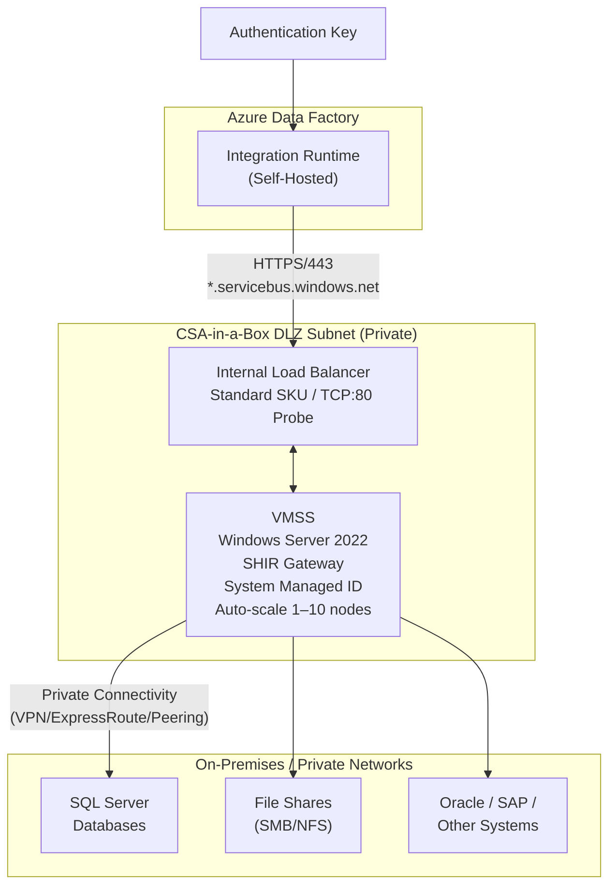

[Home](../README.md) > [Docs](./) > **Self-Hosted Integration Runtime**

# Self-Hosted Integration Runtime (SHIR)

!!! note
**Quick Summary**: Deploy a highly available, auto-scaling Self-Hosted Integration Runtime on Windows Server VMSS — bridges on-premises and private network data sources to Azure Data Factory via HTTPS/443 with internal load balancing, system-managed identity, auto-scale 1–10 nodes, and full monitoring/security/DR operations runbook.

The Self-Hosted Integration Runtime (SHIR) module enables CSA-in-a-Box to securely connect to on-premises and private network data sources from Azure Data Factory. This module deploys a highly available, auto-scaling Windows Server infrastructure that bridges your private networks with Azure's cloud analytics services.

!!! important
**Module Location:** `deploy/bicep/DLZ/modules/vms/selfHostedIntegrationRuntime.bicep`
**Status:** Available but commented out in `deploy/bicep/DLZ/main.bicep`
**Prerequisites:** Requires `installSHIRGateway.ps1` script and ADF Integration Runtime auth key

## 📑 Table of Contents

- [🏗️ 1. Architecture Overview](#️-1-architecture-overview)
    - [System Diagram](#system-diagram)
    - [Component Breakdown](#component-breakdown)
    - [Data Flow Architecture](#data-flow-architecture)
- [📎 2. Prerequisites](#-2-prerequisites)
    - [Network Connectivity Requirements](#network-connectivity-requirements)
    - [DNS Resolution Requirements](#dns-resolution-requirements)
    - [Azure Data Factory Prerequisites](#azure-data-factory-prerequisites)
    - [Required Files](#required-files)
- [📦 3. Installation & Registration](#-3-installation--registration)
    - [Step 1: Prepare Installation Script](#step-1-prepare-installation-script)
    - [Step 2: Configure Deployment Parameters](#step-2-configure-deployment-parameters)
    - [Step 3: Deploy the Platform](#step-3-deploy-the-platform)
    - [Step 4: Verify Deployment](#step-4-verify-deployment)
- [📈 4. High Availability & Scaling](#-4-high-availability--scaling)
    - [Recommended HA Configuration](#recommended-ha-configuration)
    - [Auto-Scaling Configuration](#auto-scaling-configuration)
    - [Load Balancer Distribution](#load-balancer-distribution)
    - [Fault Domain Considerations](#fault-domain-considerations)
- [🔍 5. Monitoring & Troubleshooting](#-5-monitoring--troubleshooting)
    - [ADF Integration Runtime Monitoring](#adf-integration-runtime-monitoring)
    - [VMSS Instance Diagnostics](#vmss-instance-diagnostics)
    - [Key Log Locations](#key-log-locations)
    - [Common Issues & Solutions](#common-issues--solutions)
    - [Log Analytics Integration](#log-analytics-integration)
- [🔒 6. Security Considerations](#-6-security-considerations)
    - [Network Isolation](#network-isolation)
    - [Identity & Access Management](#identity--access-management)
    - [Credential Management](#credential-management)
    - [Disk Encryption & Patching](#disk-encryption--patching)
    - [Compliance Considerations](#compliance-considerations)
- [⚡ 7. Performance Tuning](#-7-performance-tuning)
    - [VM Size Selection Guide](#vm-size-selection-guide)
    - [Concurrent Job Configuration](#concurrent-job-configuration)
    - [Data Transfer Optimization](#data-transfer-optimization)
    - [Network Bandwidth Optimization](#network-bandwidth-optimization)
    - [Memory Management](#memory-management)
- [🔧 8. Operations Runbook](#-8-operations-runbook)
    - [Authentication Key Rotation](#authentication-key-rotation)
    - [Adding/Removing SHIR Nodes](#addingremoving-shir-nodes)
    - [SHIR Gateway Version Updates](#shir-gateway-version-updates)
    - [Disaster Recovery Procedures](#disaster-recovery-procedures)
    - [Emergency Procedures](#emergency-procedures)

---

## 🏗️ 1. Architecture Overview

### System Diagram



### Component Breakdown

| Component                            | Purpose                                    | Configuration                                        |
| ------------------------------------ | ------------------------------------------ | ---------------------------------------------------- |
| **VMSS (Virtual Machine Scale Set)** | Compute platform for SHIR nodes            | Windows Server 2022, Standard_DS2_v2, 1-10 instances |
| **Internal Load Balancer**           | Health monitoring and traffic distribution | Standard SKU, TCP/80 probe, 5s interval              |
| **Custom Script Extension**          | Automated SHIR installation                | PowerShell script deployment via customData          |
| **System Managed Identity**          | Microsoft Entra ID authentication for VMSS | Enabled for secure Azure service access              |
| **ADF Integration Runtime**          | Logical connection point in Data Factory   | Created separately, provides auth key                |

### Data Flow Architecture

1. **Registration Phase:**
    - [ ] VMSS instances boot with Windows Server 2022
    - [ ] Custom Script Extension executes `installSHIRGateway.ps1`
    - [ ] Script downloads and installs SHIR gateway
    - [ ] Registers with ADF using provided authentication key
    - [ ] Node appears as "Online" in ADF Portal

2. **Runtime Phase:**
    - [ ] ADF pipelines target the SHIR by name
    - [ ] Load balancer distributes requests across healthy nodes
    - [ ] SHIR nodes execute copy activities and lookups
    - [ ] Data flows directly from source to Azure (via SHIR proxy)
    - [ ] Metadata and control plane use HTTPS/443 to Azure

3. **High Availability:**
    - [ ] Multiple VMSS instances provide redundancy
    - [ ] Load balancer removes failed nodes from rotation
    - [ ] ADF automatically retries on available nodes
    - [ ] Auto-scale adds capacity during peak loads

---

## 📎 2. Prerequisites

### Network Connectivity Requirements

The SHIR nodes require outbound internet access to specific Azure Service Tags and endpoints. Configure your NSG rules and on-premises firewalls accordingly.

#### Required Outbound Endpoints

| Destination                 | Port        | Purpose                            | Required       |
| --------------------------- | ----------- | ---------------------------------- | -------------- |
| `*.servicebus.windows.net`  | 443 (HTTPS) | Control plane communication        | ✅ Critical    |
| `download.microsoft.com`    | 443 (HTTPS) | SHIR gateway downloads and updates | ✅ Critical    |
| `login.microsoftonline.com` | 443 (HTTPS) | Microsoft Entra ID authentication  | ✅ Critical    |
| `*.blob.core.windows.net`   | 443 (HTTPS) | Staging and temporary storage      | ⚠️ Recommended |
| `*.database.windows.net`    | 1433 (TDS)  | Azure SQL Database sources         | 🔵 If used     |
| `*.vault.azure.net`         | 443 (HTTPS) | Key Vault linked services          | 🔵 If used     |

#### Azure Service Tags (for NSG Rules)

```json
{
    "direction": "Outbound",
    "access": "Allow",
    "protocol": "Tcp",
    "sourceAddressPrefix": "VirtualNetwork",
    "destinationAddressPrefix": "DataFactory",
    "destinationPortRange": "443"
}
```

**Required Service Tags:**

- `DataFactory` (port 443) - Core SHIR communication
- `ServiceBus` (port 443) - Message queuing and coordination
- `AzureActiveDirectory` (port 443) - Authentication flows
- `Storage` (port 443) - Staging and metadata operations

### DNS Resolution Requirements

Ensure the SHIR subnet can resolve public Azure DNS names. If using custom DNS:

```powershell
# Test from SHIR node
nslookup login.microsoftonline.com
nslookup <your-region>.servicebus.windows.net
nslookup download.microsoft.com

# Should return public IP addresses, not private/blocked
```

### Azure Data Factory Prerequisites

Before deploying the SHIR module, create the Integration Runtime in your ADF instance:

- [ ] **Create Integration Runtime in ADF:**

    ```bash
    # Via Azure CLI (replace values)
    az datafactory integration-runtime self-hosted create \
      --resource-group "rg-csa-adf-prod" \
      --factory-name "adf-csa-prod" \
      --name "shir-onprem-prod" \
      --description "Self-hosted IR for on-premises data sources"
    ```

- [ ] **Retrieve Authentication Key:**

    ```bash
    # Get the auth key for deployment
    az datafactory integration-runtime list-auth-key \
      --resource-group "rg-csa-adf-prod" \
      --factory-name "adf-csa-prod" \
      --integration-runtime-name "shir-onprem-prod"
    ```

    Save the `authKey1` value for the deployment parameters.

### Required Files

The deployment expects the PowerShell installation script at:

- **Path:** `deploy/bicep/DLZ/code/installSHIRGateway.ps1`
- **Purpose:** Automated SHIR gateway installation and registration

<details markdown="1">
<summary>Example script structure</summary>

```powershell
param(
    [Parameter(Mandatory=$true)]
    [string]$gatewayKey
)

# Download SHIR installer
$installerUrl = "https://download.microsoft.com/download/E/4/7/E47A6841-5DDD-4E76-A8D6-3D47B1595723/IntegrationRuntime_5.42.8684.1.msi"
$installerPath = "C:\temp\IntegrationRuntime.msi"

# Create temp directory
New-Item -Path "C:\temp" -ItemType Directory -Force

# Download and install
Invoke-WebRequest -Uri $installerUrl -OutFile $installerPath
Start-Process -FilePath "msiexec.exe" -ArgumentList "/i $installerPath /quiet" -Wait

# Register with ADF
$irPath = "C:\Program Files\Microsoft Integration Runtime\5.0\Shared\dmgcmd.exe"
& $irPath -RegisterNewNode $gatewayKey

# Start services
Start-Service "DIAHostService"
Start-Service "Microsoft Integration Runtime Service"
```

</details>

---

## 📦 3. Installation & Registration

### Step 1: Prepare Installation Script

- [ ] Create the required PowerShell script:

```bash
# Create the code directory
mkdir -p deploy/bicep/DLZ/code
```

<details markdown="1">
<summary>Full installSHIRGateway.ps1 script</summary>

```bash
# Create the installation script
cat > deploy/bicep/DLZ/code/installSHIRGateway.ps1 << 'EOF'
param(
    [Parameter(Mandatory=$true)]
    [string]$gatewayKey
)

# Set execution policy and error handling
Set-ExecutionPolicy -ExecutionPolicy RemoteSigned -Scope Process -Force
$ErrorActionPreference = "Stop"

# Logging setup
$logPath = "C:\temp\shir-install.log"
New-Item -Path "C:\temp" -ItemType Directory -Force
Start-Transcript -Path $logPath -Append

try {
    Write-Output "Starting SHIR installation at $(Get-Date)"

    # Download latest SHIR installer
    $installerUrl = "https://download.microsoft.com/download/E/4/7/E47A6841-5DDD-4E76-A8D6-3D47B1595723/IntegrationRuntime_5.42.8684.1.msi"
    $installerPath = "C:\temp\IntegrationRuntime.msi"

    Write-Output "Downloading SHIR installer from $installerUrl"
    Invoke-WebRequest -Uri $installerUrl -OutFile $installerPath -UseBasicParsing

    # Install SHIR silently
    Write-Output "Installing SHIR gateway..."
    $installArgs = "/i `"$installerPath`" /quiet /norestart ADDLOCAL=ALL"
    $process = Start-Process -FilePath "msiexec.exe" -ArgumentList $installArgs -Wait -PassThru

    if ($process.ExitCode -ne 0) {
        throw "SHIR installation failed with exit code: $($process.ExitCode)"
    }

    # Wait for installation to complete
    Start-Sleep -Seconds 30

    # Register the node with ADF
    $irPath = "C:\Program Files\Microsoft Integration Runtime\5.0\Shared\dmgcmd.exe"
    if (-not (Test-Path $irPath)) {
        throw "SHIR command line tool not found at $irPath"
    }

    Write-Output "Registering SHIR node with authentication key..."
    $registerArgs = "-RegisterNewNode", $gatewayKey
    $process = Start-Process -FilePath $irPath -ArgumentList $registerArgs -Wait -PassThru

    if ($process.ExitCode -ne 0) {
        throw "SHIR registration failed with exit code: $($process.ExitCode)"
    }

    # Verify services are running
    Write-Output "Starting SHIR services..."
    Start-Service "DIAHostService" -ErrorAction SilentlyContinue
    Start-Service "Microsoft Integration Runtime Service" -ErrorAction SilentlyContinue

    # Final verification
    $services = @("DIAHostService", "Microsoft Integration Runtime Service")
    foreach ($service in $services) {
        $svc = Get-Service $service -ErrorAction SilentlyContinue
        if ($svc.Status -ne "Running") {
            Write-Warning "Service $service is not running: $($svc.Status)"
        } else {
            Write-Output "Service $service is running successfully"
        }
    }

    Write-Output "SHIR installation completed successfully at $(Get-Date)"
}
catch {
    Write-Error "SHIR installation failed: $_"
    exit 1
}
finally {
    Stop-Transcript
}
EOF
```

</details>

### Step 2: Configure Deployment Parameters

- [ ] Edit your DLZ parameters file to enable SHIR:

```json
{
    "$schema": "https://schema.management.azure.com/schemas/2019-04-01/deploymentParameters.json#",
    "contentVersion": "1.0.0.0",
    "parameters": {
        "deployModules": {
            "value": {
                "selfHostedIR": true
            }
        },
        "parSelfHostedIR": {
            "value": {
                "subnetId": "/subscriptions/{subscription-id}/resourceGroups/rg-csa-network-prod/providers/Microsoft.Network/virtualNetworks/vnet-csa-dlz-prod/subnets/snet-shir",
                "vmssName": "vmss-shir-prod",
                "vmssSkuName": "Standard_DS2_v2",
                "vmssSkuCapacity": 2,
                "administratorUsername": "shirAdmin",
                "administratorPassword": "SecurePassword123!",
                "datafactoryIntegrationRuntimeAuthKey": "IR@xxxxxxx-xxxx-xxxx-xxxx-xxxxxxxxxxxx@adf-csa-prod@ServiceEndpoint=adf-csa-prod.eastus2.datafactory.azure.net@xxxxxxxxxxxxxxxxxx=="
            }
        }
    }
}
```

**Key Parameters:**

- `subnetId`: Private subnet for SHIR nodes (no public IPs)
- `vmssSkuName`: VM size (Standard_DS2_v2 recommended minimum)
- `vmssSkuCapacity`: Number of initial nodes (2+ for HA)
- `datafactoryIntegrationRuntimeAuthKey`: From ADF portal/CLI

### Step 3: Deploy the Platform

- [ ] Deploy with SHIR module enabled:

```bash
# Navigate to deployment directory
cd deploy

# Deploy with SHIR enabled
./deploy-platform.sh --environment prod --landing-zone DLZ
```

### Step 4: Verify Deployment

- [ ] **Check VMSS Status:**

    ```bash
    # List VMSS instances
    az vmss list-instances \
      --resource-group "rg-csa-shir-prod" \
      --name "vmss-shir-prod" \
      --output table

    # Check instance health
    az vmss get-instance-view \
      --resource-group "rg-csa-shir-prod" \
      --name "vmss-shir-prod" \
      --instance-id 0
    ```

- [ ] **Check ADF Integration Runtime:**

    ```bash
    # List integration runtimes
    az datafactory integration-runtime list \
      --resource-group "rg-csa-adf-prod" \
      --factory-name "adf-csa-prod"

    # Get specific IR status
    az datafactory integration-runtime get \
      --resource-group "rg-csa-adf-prod" \
      --factory-name "adf-csa-prod" \
      --integration-runtime-name "shir-onprem-prod"
    ```

- [ ] **Verify in ADF Portal:**
    1. Navigate to Azure Data Factory Studio
    2. Go to **Manage** → **Integration runtimes**
    3. Locate your SHIR and verify status shows **"Running"**
    4. Click on the IR to see connected nodes and their health

---

## 📈 4. High Availability & Scaling

### Recommended HA Configuration

For production workloads, deploy with these minimum settings:

```json
{
    "vmssSkuCapacity": 3,
    "vmssSkuName": "Standard_DS3_v2"
}
```

**Justification:**

- **3 nodes minimum:** Survives single node failure + maintenance
- **DS3_v2 or larger:** 4 vCPU, 14GB RAM for concurrent activities
- **Automatic upgrade policy:** Ensures security patches without downtime

### Auto-Scaling Configuration

The VMSS supports automatic scaling based on performance metrics:

```bash
# Create auto-scale profile (via Azure CLI)
az monitor autoscale create \
  --resource-group "rg-csa-shir-prod" \
  --resource "vmss-shir-prod" \
  --resource-type "Microsoft.Compute/virtualMachineScaleSets" \
  --name "shir-autoscale" \
  --min-count 2 \
  --max-count 10 \
  --count 3

# Add CPU-based scale-out rule
az monitor autoscale rule create \
  --resource-group "rg-csa-shir-prod" \
  --autoscale-name "shir-autoscale" \
  --condition "Percentage CPU > 75 avg 5m" \
  --scale out 1

# Add CPU-based scale-in rule
az monitor autoscale rule create \
  --resource-group "rg-csa-shir-prod" \
  --autoscale-name "shir-autoscale" \
  --condition "Percentage CPU < 25 avg 15m" \
  --scale in 1
```

### Load Balancer Distribution

The internal load balancer uses **Default distribution** (5-tuple hash):

- Source IP + Source Port + Destination IP + Destination Port + Protocol
- Ensures session affinity for long-running operations
- Health probe removes failed nodes from rotation automatically

**Health Probe Configuration:**

- **Protocol:** HTTP (port 80)
- **Path:** `/` (root path)
- **Interval:** 5 seconds
- **Threshold:** 2 consecutive failures = unhealthy

### Fault Domain Considerations

The VMSS is configured with:

- **Platform fault domains:** 1 (single placement group)
- **Overprovision:** True (extra capacity during deployments)
- **Upgrade policy:** Automatic (rolling updates)

For multi-zone resilience in supported regions:

```json
{
    "zones": ["1", "2", "3"],
    "platformFaultDomainCount": 3
}
```

---

## 🔍 5. Monitoring & Troubleshooting

### ADF Integration Runtime Monitoring

**Portal Monitoring:**

- [ ] **ADF Studio** → **Monitor** → **Integration runtime**
- [ ] View real-time status, activity runs, and performance metrics
- [ ] Check node connectivity and version information

**Programmatic Monitoring:**

```bash
# Get IR metrics
az monitor metrics list \
  --resource "/subscriptions/{sub}/resourceGroups/rg-csa-adf-prod/providers/Microsoft.DataFactory/factories/adf-csa-prod" \
  --metric "IntegrationRuntimeCpuPercentage,IntegrationRuntimeAvailableMemory" \
  --interval PT1M

# Get recent activity runs
az datafactory activity-run query-by-pipeline-run \
  --resource-group "rg-csa-adf-prod" \
  --factory-name "adf-csa-prod" \
  --run-id "{pipeline-run-id}"
```

### VMSS Instance Diagnostics

**Boot Diagnostics:**

```bash
# Enable boot diagnostics
az vmss diagnostics set \
  --resource-group "rg-csa-shir-prod" \
  --vmss-name "vmss-shir-prod" \
  --settings @diagnostics-config.json

# Get boot diagnostic logs
az vmss boot-diagnostics get-boot-log \
  --resource-group "rg-csa-shir-prod" \
  --name "vmss-shir-prod" \
  --instance-id 0
```

**Serial Console Access:**

```bash
# Connect to instance serial console
az serial-console connect \
  --resource-group "rg-csa-shir-prod" \
  --name "vmss-shir-prod" \
  --instance-id 0
```

### Key Log Locations

When troubleshooting SHIR issues, check these log locations on the VM instances:

| Log Type               | Path                                                                                | Purpose                 |
| ---------------------- | ----------------------------------------------------------------------------------- | ----------------------- |
| **SHIR Installation**  | `C:\temp\shir-install.log`                                                          | Custom script execution |
| **SHIR Gateway**       | `C:\ProgramData\Microsoft\DataTransfer\DataManagementGateway\log`                   | Gateway operations      |
| **Windows Event Log**  | `Applications and Services Logs\Microsoft Integration Runtime`                      | System-level events     |
| **Activity Execution** | `C:\ProgramData\Microsoft\DataTransfer\DataManagementGateway\log\ActivityExecution` | Copy activity details   |

### Common Issues & Solutions

| Issue                     | Symptoms                        | Root Cause                                   | Solution                                      |
| ------------------------- | ------------------------------- | -------------------------------------------- | --------------------------------------------- |
| **Node Offline**          | IR shows "Offline" in portal    | Network connectivity or service failure      | Check NSG rules, restart VMSS instance        |
| **Authentication Failed** | "Invalid key" errors            | Expired auth key or incorrect configuration  | Regenerate key in ADF, update VMSS parameters |
| **Extension Failed**      | VMSS deployment stuck           | PowerShell execution policy or script errors | Check boot diagnostics, verify script syntax  |
| **Slow Copy Performance** | High latency, low throughput    | Under-resourced VMs or network bottlenecks   | Scale up VMSS SKU, check bandwidth limits     |
| **High CPU Usage**        | Copy activities queuing         | Insufficient parallel capacity               | Scale out VMSS instances, optimize queries    |
| **Memory Errors**         | Out of memory exceptions        | Large datasets with insufficient RAM         | Scale up to DS4_v2 or larger SKU              |
| **SSL/TLS Errors**        | Certificate validation failures | Outdated SHIR version or blocked endpoints   | Update SHIR, verify outbound access           |

### Log Analytics Integration

Enable comprehensive monitoring by configuring Log Analytics:

```bash
# Create Log Analytics workspace (if needed)
az monitor log-analytics workspace create \
  --resource-group "rg-csa-monitoring-prod" \
  --workspace-name "law-csa-prod"

# Configure VMSS diagnostic settings
az monitor diagnostic-settings create \
  --resource "/subscriptions/{sub}/resourceGroups/rg-csa-shir-prod/providers/Microsoft.Compute/virtualMachineScaleSets/vmss-shir-prod" \
  --name "shir-diagnostics" \
  --workspace "/subscriptions/{sub}/resourceGroups/rg-csa-monitoring-prod/providers/Microsoft.OperationalInsights/workspaces/law-csa-prod" \
  --logs '[
    {
      "category": "Administrative",
      "enabled": true
    }
  ]' \
  --metrics '[
    {
      "category": "AllMetrics",
      "enabled": true
    }
  ]'
```

**Useful KQL Queries:**

```kql
// VMSS instance health
Heartbeat
| where Computer startswith "vmss-shir"
| summarize LastHeartbeat = max(TimeGenerated) by Computer
| where LastHeartbeat < ago(5m)

// SHIR activity performance
AzureDiagnostics
| where ResourceProvider == "MICROSOFT.DATAFACTORY"
| where Category == "ActivityRuns"
| where ActivityType == "Copy"
| summarize AvgDuration = avg(DurationInMs) by bin(TimeGenerated, 1h)

// Failed activities by integration runtime
AzureDiagnostics
| where ResourceProvider == "MICROSOFT.DATAFACTORY"
| where Status == "Failed"
| where IntegrationRuntimeName contains "shir"
| summarize count() by ErrorCode, bin(TimeGenerated, 1h)
```

---

## 🔒 6. Security Considerations

### Network Isolation

The SHIR module implements defense-in-depth security:

**Private Networking:**

- Deployed in private subnet with no public IP addresses
- All traffic flows through internal load balancer
- Outbound internet access controlled via NSG and firewall rules
- VPN or ExpressRoute connectivity for on-premises access

<details markdown="1">
<summary>NSG Rules (Recommended)</summary>

```json
{
    "securityRules": [
        {
            "name": "DenyAllInbound",
            "priority": 4096,
            "direction": "Inbound",
            "access": "Deny",
            "protocol": "*",
            "sourcePortRange": "*",
            "destinationPortRange": "*",
            "sourceAddressPrefix": "*",
            "destinationAddressPrefix": "*"
        },
        {
            "name": "AllowAzureDataFactory",
            "priority": 1000,
            "direction": "Outbound",
            "access": "Allow",
            "protocol": "Tcp",
            "sourcePortRange": "*",
            "destinationPortRange": "443",
            "sourceAddressPrefix": "VirtualNetwork",
            "destinationAddressPrefix": "DataFactory"
        },
        {
            "name": "AllowLoadBalancerHealthProbe",
            "priority": 1010,
            "direction": "Inbound",
            "access": "Allow",
            "protocol": "Tcp",
            "sourcePortRange": "*",
            "destinationPortRange": "80",
            "sourceAddressPrefix": "AzureLoadBalancer",
            "destinationAddressPrefix": "VirtualNetwork"
        }
    ]
}
```

</details>

### Identity & Access Management

**System-Assigned Managed Identity:**

- Each VMSS instance gets a unique Microsoft Entra ID identity
- No stored credentials or certificates required
- Automatic token refresh and lifecycle management

**RBAC Recommendations:**

```bash
# Minimum permissions for SHIR managed identity
az role assignment create \
  --assignee $(az vmss identity show --resource-group "rg-csa-shir-prod" --name "vmss-shir-prod" --query "principalId" -o tsv) \
  --role "Data Factory Contributor" \
  --scope "/subscriptions/{subscription}/resourceGroups/rg-csa-adf-prod"

# For Key Vault access (if using linked services)
az role assignment create \
  --assignee $(az vmss identity show --resource-group "rg-csa-shir-prod" --name "vmss-shir-prod" --query "principalId" -o tsv) \
  --role "Key Vault Secrets User" \
  --scope "/subscriptions/{subscription}/resourceGroups/rg-csa-keyvault-prod/providers/Microsoft.KeyVault/vaults/kv-csa-prod"
```

### Credential Management

**Key Vault Integration:**
Store sensitive connection strings and passwords in Azure Key Vault:

```json
{
    "type": "AzureKeyVaultSecret",
    "secretName": "sql-server-connection-string",
    "store": {
        "referenceName": "KeyVaultLinkedService",
        "type": "LinkedServiceReference"
    }
}
```

**Authentication Key Rotation:**
ADF integration runtime auth keys should be rotated regularly:

```bash
# Regenerate primary key
az datafactory integration-runtime regenerate-auth-key \
  --resource-group "rg-csa-adf-prod" \
  --factory-name "adf-csa-prod" \
  --integration-runtime-name "shir-onprem-prod" \
  --key-name "authKey1"

# Update VMSS with new key (requires redeploy or manual update)
```

### Disk Encryption & Patching

**Azure Disk Encryption (ADE):**

```bash
# Enable ADE on VMSS (requires Key Vault)
az vmss encryption enable \
  --resource-group "rg-csa-shir-prod" \
  --name "vmss-shir-prod" \
  --disk-encryption-keyvault "kv-csa-prod"
```

**Automatic OS Updates:**
The VMSS uses automatic upgrade policy to ensure security patches:

- **Upgrade Policy Mode:** `Automatic`
- **Rolling Upgrade:** Updates 20% of instances at a time
- **Health Monitoring:** Waits for application health before continuing

### Compliance Considerations

For regulated environments, implement additional controls:

**Audit Logging:**

- Enable Azure Activity Log retention
- Configure Log Analytics for VMSS and ADF audit trails
- Monitor privileged operations and configuration changes

**Data Residency:**

- Deploy VMSS in compliant Azure regions
- Ensure data sources and destinations meet residency requirements
- Configure ADF data flows to respect geographical boundaries

---

## ⚡ 7. Performance Tuning

### VM Size Selection Guide

Choose VMSS SKU based on your concurrent activity requirements:

| VM Size             | vCPUs | RAM   | Network   | Concurrent Activities | Use Case                         |
| ------------------- | ----- | ----- | --------- | --------------------- | -------------------------------- |
| **Standard_DS2_v2** | 2     | 7 GB  | Moderate  | 2-4                   | Development/testing              |
| **Standard_DS3_v2** | 4     | 14 GB | High      | 4-8                   | Production (recommended minimum) |
| **Standard_DS4_v2** | 8     | 28 GB | High      | 8-16                  | High-throughput workloads        |
| **Standard_DS5_v2** | 16    | 56 GB | Very High | 16-32                 | Data warehouse loads             |
| **Standard_E4s_v3** | 4     | 32 GB | High      | 4-12                  | Memory-intensive transformations |
| **Standard_E8s_v3** | 8     | 64 GB | High      | 8-24                  | Large dataset processing         |

**Selection Criteria:**

- **CPU:** 1-2 activities per vCPU for I/O bound operations
- **Memory:** 2-4 GB per concurrent activity + OS overhead
- **Network:** High throughput SKUs for multi-GB transfers

### Concurrent Job Configuration

Configure ADF linked services for optimal parallelism:

```json
{
    "type": "SqlServer",
    "typeProperties": {
        "connectionString": "Server=onprem-sql;Database=warehouse;Integrated Security=True",
        "maxConcurrentConnections": 4,
        "connectTimeout": 60,
        "commandTimeout": 120
    },
    "connectVia": {
        "referenceName": "shir-onprem-prod",
        "type": "IntegrationRuntimeReference"
    }
}
```

**Best Practices:**

- **maxConcurrentConnections**: 1-2 per vCPU on SHIR nodes
- **connectTimeout**: 60-120 seconds for reliable connections
- **commandTimeout**: Match to query complexity (300+ for large extracts)

### Data Transfer Optimization

<details markdown="1">
<summary>Copy Activity Settings (JSON)</summary>

```json
{
    "type": "Copy",
    "typeProperties": {
        "source": {
            "type": "SqlSource",
            "queryTimeout": "00:05:00",
            "partitionOption": "PhysicalPartitionsOfTable"
        },
        "sink": {
            "type": "ParquetSink",
            "storeSettings": {
                "maxConcurrentConnections": 4,
                "blockSizeInMB": 256
            }
        },
        "enableStaging": true,
        "stagingSettings": {
            "linkedServiceName": "AzureBlobStorageLinkedService",
            "path": "staging/shir"
        },
        "parallelCopies": 8,
        "dataIntegrationUnits": 16
    }
}
```

</details>

**Key Parameters:**

- **parallelCopies**: 2x vCPU count on SHIR (max 32)
- **dataIntegrationUnits**: For cloud-to-cloud portions
- **enableStaging**: For better performance with data type conversion
- **blockSizeInMB**: 64-256 MB based on network bandwidth

### Network Bandwidth Optimization

**Bandwidth Planning:**

```powershell
# Test network throughput to Azure
# Run from SHIR node
Invoke-WebRequest -Uri "https://download.microsoft.com/download/0/0/A/00A285B5-0806-4946-B47F-7CBA0A0447E7/SpeedTest.ps1" -OutFile "SpeedTest.ps1"
.\SpeedTest.ps1 -Region "East US 2" -Verbose
```

**Optimization Techniques:**

- **Accelerated Networking:** Enable on DS3_v2 and larger
- **Compression:** Use compressed file formats (Parquet, ORC)
- **Batching:** Combine multiple small files into larger transfers
- **Scheduling:** Run large transfers during off-peak hours

### Memory Management

**JVM Heap Settings (for Java-based activities):**

```powershell
# On SHIR nodes, modify gateway configuration
$configPath = "C:\Program Files\Microsoft Integration Runtime\5.0\Shared\diahost.exe.config"

# Add JVM arguments for heap size
<appSettings>
  <add key="DotNetActivityJavaVMArgs" value="-Xms2048m -Xmx8192m -XX:+UseG1GC" />
</appSettings>
```

**Windows Memory Settings:**

```powershell
# Increase virtual memory on SHIR nodes
$pagefile = Get-WmiObject -Class Win32_ComputerSystem
$pagefile.AutomaticManagedPagefile = $false
Set-WmiInstance -Class Win32_PageFileSetting -Arguments @{
    Name = "C:"
    InitialSize = 16384
    MaximumSize = 32768
}
```

---

## 🔧 8. Operations Runbook

### Authentication Key Rotation

**Quarterly rotation procedure:**

- [ ] **Generate new key in ADF:**

    ```bash
    # Regenerate auth key (use authKey2 if authKey1 is active)
    az datafactory integration-runtime regenerate-auth-key \
      --resource-group "rg-csa-adf-prod" \
      --factory-name "adf-csa-prod" \
      --integration-runtime-name "shir-onprem-prod" \
      --key-name "authKey2"
    ```

- [ ] **Update deployment parameters:**

    ```json
    {
        "datafactoryIntegrationRuntimeAuthKey": "NEW_AUTH_KEY_HERE"
    }
    ```

- [ ] **Redeploy with rolling update:**

    ```bash
    ./deploy-platform.sh --environment prod --landing-zone DLZ
    ```

- [ ] **Verify all nodes are online:**
    ```bash
    # Check ADF portal or CLI
    az datafactory integration-runtime get \
      --resource-group "rg-csa-adf-prod" \
      --factory-name "adf-csa-prod" \
      --integration-runtime-name "shir-onprem-prod"
    ```

### Adding/Removing SHIR Nodes

**Scale out procedure:**

```bash
# Increase VMSS capacity
az vmss scale \
  --resource-group "rg-csa-shir-prod" \
  --name "vmss-shir-prod" \
  --new-capacity 4

# Monitor new instances coming online
watch -n 30 'az vmss list-instances \
  --resource-group "rg-csa-shir-prod" \
  --name "vmss-shir-prod" \
  --output table'
```

**Scale in procedure:**

```bash
# Verify no critical activities running
az datafactory activity-run query-by-pipeline-run \
  --resource-group "rg-csa-adf-prod" \
  --factory-name "adf-csa-prod" \
  --run-id "latest"

# Scale down gradually
az vmss scale \
  --resource-group "rg-csa-shir-prod" \
  --name "vmss-shir-prod" \
  --new-capacity 2
```

### SHIR Gateway Version Updates

**Quarterly update procedure:**

- [ ] **Check current version:**

    ```powershell
    # From SHIR node
    Get-ItemProperty "HKLM:\SOFTWARE\Microsoft\Microsoft Integration Runtime" | Select-Object Version
    ```

- [ ] **Update installation script with latest MSI URL:**

    ```powershell
    # Check Microsoft Download Center for latest version
    # Update installSHIRGateway.ps1 with new URL
    $installerUrl = "https://download.microsoft.com/download/E/4/7/E47A6841-5DDD-4E76-A8D6-3D47B1595723/IntegrationRuntime_5.XX.XXXX.X.msi"
    ```

- [ ] **Deploy with rolling update:**

    ```bash
    # Redeploy VMSS with updated script
    ./deploy-platform.sh --environment prod --landing-zone DLZ
    ```

- [ ] **Verify version update** from ADF portal or PowerShell on nodes

### Disaster Recovery Procedures

**Regional Failover:**

- [ ] **Deploy SHIR in secondary region:**

    ```bash
    # Deploy to DR region (e.g., West US 2 if primary is East US 2)
    ./deploy-platform.sh --environment prod --landing-zone DLZ --region westus2
    ```

- [ ] **Update ADF pipelines to use DR integration runtime:**

    ```json
    {
        "connectVia": {
            "referenceName": "shir-onprem-dr",
            "type": "IntegrationRuntimeReference"
        }
    }
    ```

- [ ] **Verify connectivity from DR region to on-premises:**

    ```bash
    # Test from DR SHIR nodes
    Test-NetConnection -ComputerName "onprem-sql.contoso.com" -Port 1433
    ```

- [ ] **Failback procedure:**
    - Restore primary region SHIR
    - Update pipelines back to primary IR
    - Decommission DR resources if no longer needed

**Data Consistency Verification:**

```sql
-- Compare record counts between source and destination
SELECT 'Source' as Location, COUNT(*) as RecordCount FROM SourceTable
UNION ALL
SELECT 'Destination' as Location, COUNT(*) FROM DestinationTable

-- Check last successful sync timestamp
SELECT MAX(LastModified) FROM SyncMetadata WHERE Status = 'Success'
```

### Emergency Procedures

!!! danger
**Complete SHIR outage response** — follow these steps in order, escalating if unresolved within the stated timeframe.

- [ ] **Immediate assessment (0-15 minutes):**
    - Check ADF pipeline status and failure patterns
    - Verify VMSS health and instance status
    - Review recent configuration changes

- [ ] **Mitigation (15-30 minutes):**
    - Restart failed VMSS instances
    - Scale out VMSS for additional capacity
    - Disable non-critical pipelines to reduce load

- [ ] **Recovery (30-60 minutes):**
    - Redeploy VMSS from last known good configuration
    - Restore from backup if data corruption suspected
    - Engage Microsoft support if Azure service issues

- [ ] **Communication:**
    ```bash
    # Notify stakeholders
    echo "SHIR outage detected at $(date). ETR: 1 hour. Status updates every 15 minutes." | \
    mail -s "CSA Platform Alert: SHIR Outage" stakeholders@company.com
    ```

**Recovery verification checklist:**

- [ ] All VMSS instances show "Succeeded" provisioning state
- [ ] ADF Integration Runtime shows "Online" status
- [ ] Test pipeline executes successfully end-to-end
- [ ] Performance metrics return to baseline
- [ ] No error alerts in monitoring system
- [ ] Stakeholder communication sent with "Resolved" status

---

## 🔗 Related Documentation

- [ADF_SETUP.md](ADF_SETUP.md) — Azure Data Factory pipeline setup and orchestration
- [IaC-CICD-Best-Practices.md](IaC-CICD-Best-Practices.md) — Infrastructure-as-Code and CI/CD patterns
- [ARCHITECTURE.md](ARCHITECTURE.md) — Platform architecture overview
