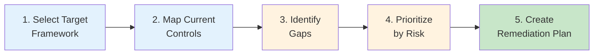

# Assessment — Compliance Gap Analysis

A template for identifying gaps between your current control implementation and the requirements of a target compliance framework. This assessment works with any framework — FedRAMP, SOC 2, HIPAA, PCI-DSS, CMMC, NIST CSF, or others — and maps identified gaps to CSA-in-a-Box capabilities that can accelerate remediation.

---

## Framework selection guide

Start by identifying which compliance framework(s) apply to your organization. The table below maps common industries and scenarios to recommended frameworks.

| Industry / Scenario           | Primary Framework                    | Secondary Frameworks                        | CSA-in-a-Box Coverage                                                                                         |
| ----------------------------- | ------------------------------------ | ------------------------------------------- | ------------------------------------------------------------------------------------------------------------- |
| **Federal civilian agencies** | FedRAMP Moderate (NIST 800-53 Rev 5) | FISMA, OMB M-22-09 (Zero Trust), CISA BODs  | [FedRAMP Moderate](../compliance/fedramp-moderate.md), [NIST 800-53 Rev 5](../compliance/nist-800-53-rev5.md) |
| **DoD / defense contractors** | CMMC 2.0 Level 2                     | NIST 800-171, DFARS 252.204-7012, ITAR      | [CMMC 2.0 L2](../compliance/cmmc-2.0-l2.md)                                                                   |
| **DoD classified (CUI/NSS)**  | FedRAMP High + DoD SRG IL4/IL5       | NIST 800-53 High baseline, CNSSI 1253       | [NIST 800-53 Rev 5](../compliance/nist-800-53-rev5.md), [DoD IL4/IL5](../compliance/dod-il4-il5.md)           |
| **Healthcare**                | HIPAA Security Rule                  | HITRUST CSF, NIST CSF                       | [HIPAA Security Rule](../compliance/hipaa-security-rule.md)                                                   |
| **Financial services**        | SOC 2 Type II                        | PCI-DSS v4, GLBA, NYDFS 23 NYCRR 500        | [SOC 2 Type II](../compliance/soc2-type2.md), [PCI-DSS v4](../compliance/pci-dss-v4.md)                       |
| **Payment processing**        | PCI-DSS v4.0                         | SOC 2 Type II                               | [PCI-DSS v4](../compliance/pci-dss-v4.md)                                                                     |
| **State / local government**  | StateRAMP or FedRAMP Moderate        | CJIS (law enforcement), IRS 1075 (tax data) | [FedRAMP Moderate](../compliance/fedramp-moderate.md)                                                         |
| **EU data processing**        | GDPR                                 | SOC 2, ISO 27001                            | [GDPR & EU Data Boundary](../compliance/gdpr-privacy.md)                                                      |
| **Enterprise SaaS**           | SOC 2 Type II                        | ISO 27001, NIST CSF 2.0                     | [SOC 2 Type II](../compliance/soc2-type2.md)                                                                  |
| **Multi-framework**           | NIST 800-53 Rev 5 (superset)         | Map to specific frameworks as needed        | [NIST 800-53 Rev 5](../compliance/nist-800-53-rev5.md)                                                        |

!!! tip "Start with NIST 800-53 for multi-framework needs"
If you need to satisfy multiple frameworks, start with NIST 800-53 Rev 5 as your control baseline. Most other frameworks (FedRAMP, CMMC, HIPAA, SOC 2) map to NIST 800-53 controls, so a single gap analysis against 800-53 can inform remediation across all of them.

---

## Gap analysis process

Follow these five steps to complete the analysis:

### Step 1 — Select target framework

- [ ] Identify the compliance framework(s) required for your deployment
- [ ] Obtain the official control catalog (e.g., NIST 800-53 Rev 5 control catalog, PCI-DSS v4 requirements)
- [ ] Determine the applicable baseline or scope (e.g., FedRAMP Moderate vs. High, CMMC Level 1 vs. Level 2)
- [ ] Identify any agency-specific or customer-specific overlays (additional requirements beyond the base framework)

### Step 2 — Map current controls

For each control in the target framework, document your current implementation state:

- [ ] Inventory existing policies, procedures, and technical controls
- [ ] Determine which controls are inherited from the cloud provider (Azure shared responsibility)
- [ ] Identify controls implemented by CSA-in-a-Box Bicep modules, policies, and configurations
- [ ] Document controls that your organization implements through operational processes
- [ ] Classify each control using the status codes defined below

**Control status codes** (aligned with CSA-in-a-Box compliance manifests):

| Status                    | Definition                                                                                                       |
| ------------------------- | ---------------------------------------------------------------------------------------------------------------- |
| **IMPLEMENTED**           | Control is fully satisfied. Evidence exists (code, configuration, documentation, logs).                          |
| **PARTIALLY_IMPLEMENTED** | Some evidence exists but gaps remain. Control is not fully satisfied.                                            |
| **PLANNED**               | Control is not yet implemented. A plan and timeline exist for remediation.                                       |
| **NOT_APPLICABLE**        | Control does not apply to your system's scope, architecture, or classification. Justification required.          |
| **INHERITED**             | Control is satisfied by an upstream provider (Azure, Microsoft 365, etc.) under the shared responsibility model. |
| **NOT_ASSESSED**          | Control has not yet been evaluated. Starting state for new gap analyses.                                         |

### Step 3 — Identify gaps

A gap exists when a control is in any state other than IMPLEMENTED, NOT_APPLICABLE, or INHERITED:

- [ ] Flag all PARTIALLY_IMPLEMENTED controls — document what is missing
- [ ] Flag all PLANNED controls — document the timeline and effort
- [ ] Flag all NOT_ASSESSED controls — schedule evaluation
- [ ] For INHERITED controls, verify the inheritance claim against the CSP's authorization documentation
- [ ] Document compensating controls where full implementation is not feasible

### Step 4 — Prioritize gaps by risk

Score each gap on impact and likelihood to determine remediation priority:

- [ ] Assess the impact of non-compliance for each gap (data exposure, regulatory penalty, operational disruption)
- [ ] Assess the likelihood that the gap could be exploited or result in an audit finding
- [ ] Assign priority (Critical, High, Medium, Low) using the risk matrix below
- [ ] Group related gaps for efficient remediation

**Priority matrix:**

|                   | **High Likelihood**               | **Medium Likelihood**             | **Low Likelihood**                          |
| ----------------- | --------------------------------- | --------------------------------- | ------------------------------------------- |
| **High Impact**   | Critical — Remediate immediately  | High — Remediate within 30 days   | Medium — Remediate within 90 days           |
| **Medium Impact** | High — Remediate within 30 days   | Medium — Remediate within 90 days | Low — Remediate within 180 days             |
| **Low Impact**    | Medium — Remediate within 90 days | Low — Remediate within 180 days   | Low — Accept or remediate opportunistically |

### Step 5 — Create remediation plan

For each gap, document the remediation approach:

- [ ] Define the remediation action (implement control, configure service, write policy, deploy module)
- [ ] Identify the responsible owner
- [ ] Set a target completion date based on priority
- [ ] Estimate effort (hours/days) and resources needed
- [ ] Identify CSA-in-a-Box resources that address the gap (see resource mapping below)
- [ ] Define success criteria (how will you know the control is satisfied?)
- [ ] Plan evidence collection for future audits

---

## Control mapping template

Use the following table format to document your gap analysis. Create one row per control in your target framework.

| Control ID | Control Name          | Current Status | Gap Description               | Priority | Remediation Action                       | Owner           | Target Date | CSA-in-a-Box Resource                                                           |
| ---------- | --------------------- | -------------- | ----------------------------- | -------- | ---------------------------------------- | --------------- | ----------- | ------------------------------------------------------------------------------- |
| _AC-2_     | _Account Management_  | _PARTIAL_      | _No automated deprovisioning_ | _High_   | _Implement Entra ID lifecycle workflows_ | _Security Team_ | _[Date]_    | _[Identity & Secrets Flow](../reference-architecture/identity-secrets-flow.md)_ |
| _AC-6_     | _Least Privilege_     | _IMPLEMENTED_  | _—_                           | _—_      | _—_                                      | _—_             | _—_         | _Bicep RBAC modules_                                                            |
| _AU-6_     | _Audit Record Review_ | _PLANNED_      | _No automated review_         | _Medium_ | _Deploy Sentinel workbooks_              | _SOC Team_      | _[Date]_    | _[Monitoring Best Practices](../best-practices/monitoring-observability.md)_    |
|            |                       |                |                               |          |                                          |                 |             |                                                                                 |
|            |                       |                |                               |          |                                          |                 |             |                                                                                 |

---

## Common gaps by framework

The following sections identify the most frequently encountered gaps for each major framework. Use these as a starting point — not a substitute for a complete control-by-control analysis.

### FedRAMP Moderate — Top gaps

| Gap Area                                  | Typical Finding                                                              | CSA-in-a-Box Remediation                                                                                                                                    |
| ----------------------------------------- | ---------------------------------------------------------------------------- | ----------------------------------------------------------------------------------------------------------------------------------------------------------- |
| **Continuous monitoring (CA-7)**          | No automated vulnerability scanning or configuration monitoring              | Deploy Defender for Cloud with continuous assessment; configure Azure Policy compliance dashboards                                                          |
| **Contingency plan testing (CP-4)**       | DR plan exists but has never been tested                                     | Use the [DR Drill Runbook](../runbooks/dr-drill.md) to conduct tabletop and functional tests                                                                |
| **Configuration management (CM-2, CM-6)** | No baseline configurations documented or enforced                            | Bicep modules serve as the configuration baseline; Azure Policy enforces configuration drift detection                                                      |
| **Incident response (IR-4, IR-5)**        | No documented incident response procedures or post-incident analysis process | Deploy the [Security Incident Runbook](../runbooks/security-incident.md); integrate with Defender for Cloud alerts                                          |
| **Audit record review (AU-6)**            | Logs collected but not reviewed; no automated alerting for security events   | Configure Log Analytics alert rules; deploy Sentinel for automated analysis; see [Monitoring Best Practices](../best-practices/monitoring-observability.md) |

For the complete FedRAMP control crosswalk, see [FedRAMP Moderate](../compliance/fedramp-moderate.md).

### SOC 2 Type II — Top gaps

| Gap Area                                   | Typical Finding                                           | CSA-in-a-Box Remediation                                                                                                                                       |
| ------------------------------------------ | --------------------------------------------------------- | -------------------------------------------------------------------------------------------------------------------------------------------------------------- |
| **Change management (CC8.1)**              | Changes deployed without formal approval or documentation | GitHub branch protection, PR reviews, and CI/CD pipelines enforce change management; see [IaC & CI/CD Best Practices](../IaC-CICD-Best-Practices.md)           |
| **Risk assessment (CC3.1-CC3.4)**          | No formal risk assessment process or documentation        | Use the [Migration Readiness Assessment](migration-readiness.md) risk matrix as a starting template; conduct annual risk assessments                           |
| **Logical access reviews (CC6.1-CC6.3)**   | Access granted but not reviewed periodically              | Entra ID Access Reviews, PIM for just-in-time access; see [Identity & Secrets Flow](../reference-architecture/identity-secrets-flow.md)                        |
| **Monitoring and detection (CC7.2-CC7.3)** | No centralized monitoring or anomaly detection            | Defender for Cloud, Log Analytics, and Sentinel provide detection capabilities; see [Monitoring Best Practices](../best-practices/monitoring-observability.md) |
| **Vendor management (CC9.2)**              | No formal process for assessing third-party risk          | Document vendor risk assessment process; review Azure's SOC 2 report for inherited controls                                                                    |

For the complete SOC 2 TSC crosswalk, see [SOC 2 Type II](../compliance/soc2-type2.md).

### HIPAA Security Rule — Top gaps

| Gap Area                                        | Typical Finding                                                    | CSA-in-a-Box Remediation                                                                                                       |
| ----------------------------------------------- | ------------------------------------------------------------------ | ------------------------------------------------------------------------------------------------------------------------------ |
| **Risk analysis (§164.308(a)(1))**              | No documented risk analysis covering ePHI                          | Conduct risk analysis using NIST 800-30 methodology; document in POA&M format                                                  |
| **Audit controls (§164.312(b))**                | Insufficient logging of ePHI access                                | Enable diagnostic settings on all data stores; configure audit logging for database access; see [Log Schema](../LOG_SCHEMA.md) |
| **Encryption at rest (§164.312(a)(2)(iv))**     | Some data stores lack encryption or use platform-managed keys only | Bicep modules deploy CMK encryption via Key Vault; see [Security Best Practices](../best-practices/security-compliance.md)     |
| **Business associate agreements (§164.308(b))** | BAAs not in place with all vendors processing ePHI                 | Review Azure BAA (available via Microsoft Trust Portal); ensure BAAs with all subprocessors                                    |
| **Contingency planning (§164.308(a)(7))**       | No backup or disaster recovery plan for ePHI systems               | Deploy geo-redundant storage; use [DR Planning](../DR.md) guide for recovery procedures                                        |

For the complete HIPAA crosswalk, see [HIPAA Security Rule](../compliance/hipaa-security-rule.md).

### PCI-DSS v4.0 — Top gaps

| Gap Area                                 | Typical Finding                                                       | CSA-in-a-Box Remediation                                                                                                                                              |
| ---------------------------------------- | --------------------------------------------------------------------- | --------------------------------------------------------------------------------------------------------------------------------------------------------------------- |
| **Network segmentation (Req 1)**         | Cardholder data environment not segmented from other networks         | Hub-spoke topology with dedicated subnets; Azure Firewall Premium rules; Private Endpoints; see [Hub-Spoke Topology](../reference-architecture/hub-spoke-topology.md) |
| **Encryption in transit (Req 4)**        | TLS 1.0/1.1 still enabled on some services                            | Bicep modules enforce TLS 1.2+ minimum; Azure Policy denies non-compliant configurations                                                                              |
| **Access control (Req 7-8)**             | Excessive access to cardholder data; no MFA for administrative access | Entra ID with PIM, Conditional Access with MFA; RBAC scoped to minimum necessary                                                                                      |
| **Logging and monitoring (Req 10)**      | Audit trail does not cover all cardholder data access                 | Diagnostic settings on all data stores; centralized Log Analytics with 12-month retention                                                                             |
| **Vulnerability management (Req 6, 11)** | No regular vulnerability scanning or penetration testing              | Defender for Cloud vulnerability assessment; see [Supply Chain](../SUPPLY_CHAIN.md) for dependency scanning                                                           |

For the complete PCI-DSS crosswalk, see [PCI-DSS v4](../compliance/pci-dss-v4.md).

### CMMC 2.0 Level 2 — Top gaps

| Gap Area                                      | Typical Finding                                                      | CSA-in-a-Box Remediation                                                                                                                   |
| --------------------------------------------- | -------------------------------------------------------------------- | ------------------------------------------------------------------------------------------------------------------------------------------ |
| **CUI identification (3.1.3, 3.8.1-3.8.5)**   | CUI not identified, marked, or handled per NIST 800-171 requirements | Purview sensitivity labels for CUI classification; data handling policies; see [Data Governance](../governance/DATA_CATALOGING.md)         |
| **Multi-factor authentication (3.5.3)**       | MFA not enforced for all CUI access                                  | Entra ID Conditional Access with phishing-resistant MFA; see [Identity & Secrets Flow](../reference-architecture/identity-secrets-flow.md) |
| **Security awareness training (3.2.1-3.2.3)** | No role-based security training program                              | Customer-implement; platform provides [Developer Pathways](../DEVELOPER_PATHWAYS.md) for technical training                                |
| **Audit log protection (3.3.8-3.3.9)**        | Audit logs not protected from unauthorized modification              | Immutable storage for Log Analytics; RBAC restricts log deletion; see [Environment Protection](../ENVIRONMENT_PROTECTION.md)               |
| **System security plan (3.12.4)**             | No SSP documenting security controls                                 | Use CSA-in-a-Box compliance manifests as SSP evidence source; see [CMMC 2.0 L2](../compliance/cmmc-2.0-l2.md)                              |

For the complete CMMC practice mapping, see [CMMC 2.0 Level 2](../compliance/cmmc-2.0-l2.md).

---

## CSA-in-a-Box control mapping

The following table maps CSA-in-a-Box capabilities to common compliance control areas. Use this to identify which platform features address your identified gaps.

| Control Area                     | CSA-in-a-Box Capability                                                          | Implementation Evidence                                                                                                                             |
| -------------------------------- | -------------------------------------------------------------------------------- | --------------------------------------------------------------------------------------------------------------------------------------------------- |
| **Identity & access management** | Entra ID, PIM, Conditional Access, RBAC, managed identities                      | Bicep RBAC modules, [ADR 0014](../adr/0014-msal-bff-auth-pattern.md), [Identity & Secrets Flow](../reference-architecture/identity-secrets-flow.md) |
| **Network security**             | Hub-spoke topology, Azure Firewall Premium, Private Endpoints, NSGs, Private DNS | Bicep network modules, [Hub-Spoke Topology](../reference-architecture/hub-spoke-topology.md)                                                        |
| **Encryption at rest**           | CMK via Key Vault, Azure Storage encryption, database TDE                        | Bicep Key Vault modules, [Security Best Practices](../best-practices/security-compliance.md)                                                        |
| **Encryption in transit**        | TLS 1.2+ enforced, Private Endpoints eliminate public traffic                    | Azure Policy assignments, Bicep service configurations                                                                                              |
| **Logging & monitoring**         | Log Analytics, Diagnostic Settings, Activity Log, Defender for Cloud             | [Log Schema](../LOG_SCHEMA.md), [Monitoring Best Practices](../best-practices/monitoring-observability.md)                                          |
| **Vulnerability management**     | Defender for Cloud, Defender for SQL, dependency scanning, SBOM                  | [Supply Chain](../SUPPLY_CHAIN.md), CI/CD pipeline scanning                                                                                         |
| **Configuration management**     | Bicep IaC, Azure Policy, GitHub branch protection                                | [IaC & CI/CD Best Practices](../IaC-CICD-Best-Practices.md)                                                                                         |
| **Disaster recovery**            | Geo-redundant storage, multi-region Bicep modules, documented DR procedures      | [DR Planning](../DR.md), [DR Drill Runbook](../runbooks/dr-drill.md), [Multi-Region](../MULTI_REGION.md)                                            |
| **Data governance**              | Purview classification, sensitivity labels, data lineage, access policies        | [Data Cataloging](../governance/DATA_CATALOGING.md), [Data Lineage](../governance/DATA_LINEAGE.md)                                                  |
| **Incident response**            | Defender for Cloud alerts, documented runbooks, escalation procedures            | [Security Incident Runbook](../runbooks/security-incident.md)                                                                                       |
| **Supply chain**                 | Pinned dependencies, SBOM generation, signed artifacts, Dependabot, Trivy        | [Supply Chain](../SUPPLY_CHAIN.md)                                                                                                                  |
| **Data quality**                 | Automated quality checks, freshness monitoring, schema enforcement               | [Data Quality](../governance/DATA_QUALITY.md), [Data Engineering Best Practices](../best-practices/data-engineering.md)                             |

---

## Remediation priority matrix

After completing the gap analysis, summarize your remediation priorities:

| Priority       | Count  | Target Resolution          | Actions |
| -------------- | ------ | -------------------------- | ------- |
| **Critical**   | \_\_\_ | Immediate (within 2 weeks) | \_\_\_  |
| **High**       | \_\_\_ | Within 30 days             | \_\_\_  |
| **Medium**     | \_\_\_ | Within 90 days             | \_\_\_  |
| **Low**        | \_\_\_ | Within 180 days            | \_\_\_  |
| **Total gaps** | \_\_\_ | —                          | —       |

### Remediation tracking

For ongoing tracking, maintain a remediation log:

| #   | Control ID | Gap Description | Remediation Action | Owner | Target Date | Actual Date | Status | Evidence |
| --- | ---------- | --------------- | ------------------ | ----- | ----------- | ----------- | ------ | -------- |
| 1   |            |                 |                    |       |             |             |        |          |
| 2   |            |                 |                    |       |             |             |        |          |
| 3   |            |                 |                    |       |             |             |        |          |

---

## Continuous compliance

Gap analysis is not a one-time activity. Establish ongoing compliance monitoring:

- [ ] **Quarterly gap review** — Reassess gaps and update remediation status
- [ ] **Azure Policy compliance** — Monitor Azure Policy compliance dashboard for configuration drift
- [ ] **Defender for Cloud secure score** — Track secure score trend as a proxy for security posture
- [ ] **Automated evidence collection** — Configure diagnostic settings and Log Analytics to generate audit evidence continuously
- [ ] **Annual full assessment** — Conduct a complete gap analysis annually or when the target framework updates
- [ ] **Incident-driven review** — Reassess relevant controls after security incidents

!!! tip "OSCAL for automation"
As FedRAMP moves toward OSCAL-formatted security packages, consider generating machine-readable control documentation from your CSA-in-a-Box deployment. This is on the CSA-in-a-Box Phase 2 roadmap. See [Federal Cloud Adoption Trends](../research/federal-cloud-adoption-trends.md) for the latest on FedRAMP automation.

---

## Related

- [Migration Readiness Assessment](migration-readiness.md) — Pre-migration readiness evaluation
- [Platform Maturity Model](platform-maturity.md) — Ongoing maturity assessment across 8 dimensions
- [Assessment Templates Index](index.md) — Overview of all assessment tools
- [Compliance Documentation](../compliance/README.md) — Control mappings for NIST 800-53, FedRAMP, CMMC, HIPAA, SOC 2, PCI-DSS
- [FedRAMP Moderate Guide](../compliance/fedramp-moderate.md) — FedRAMP control crosswalk
- [NIST 800-53 Rev 5](../compliance/nist-800-53-rev5.md) — NIST control mapping
- [Security & Compliance Best Practices](../best-practices/security-compliance.md) — Defense-in-depth patterns
- [Federal Cloud Adoption Trends](../research/federal-cloud-adoption-trends.md) — Federal compliance landscape and trends

---

**Last updated:** 2026-04-30
**Review cadence:** Annual (or when target framework releases updates)
**Owner:** CSA-in-a-Box platform team
