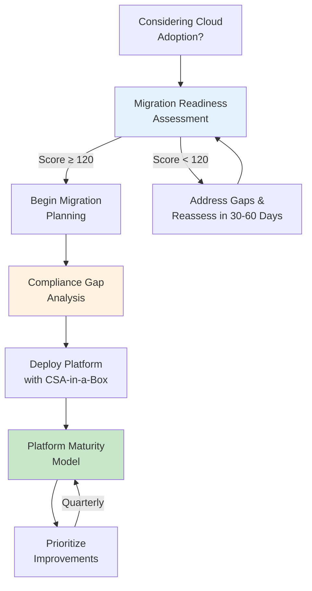

# Assessment Templates

Structured assessment tools for evaluating readiness, maturity, and compliance gaps before and during cloud platform adoption. Each template provides a scored framework with clear criteria, actionable outputs, and direct links to CSA-in-a-Box resources that address identified gaps.

---

## Available assessments

| Assessment                                            | Purpose                                                                                                          | Estimated Time          | Output                                                                                    |
| ----------------------------------------------------- | ---------------------------------------------------------------------------------------------------------------- | ----------------------- | ----------------------------------------------------------------------------------------- |
| [Migration Readiness](migration-readiness.md)         | Scored readiness checklist across 8 dimensions for evaluating preparedness to migrate workloads to Azure         | 2-4 hours               | Readiness score (40-200), risk matrix, recommended timeline, resource mapping             |
| [Platform Maturity Model](platform-maturity.md)       | 5-level maturity assessment across 8 platform dimensions to benchmark current capabilities and plan improvements | 3-5 hours               | Maturity scores per dimension, radar chart visualization, level-specific action plans     |
| [Compliance Gap Analysis](compliance-gap-analysis.md) | Template for identifying gaps between current controls and target compliance framework requirements              | 4-8 hours per framework | Gap inventory, remediation plan with priorities, control mapping to platform capabilities |

---

## How to use the assessments

**Before migration.** Start with the [Migration Readiness](migration-readiness.md) assessment to determine whether your organization is prepared to begin a cloud migration. This assessment identifies blockers and prerequisites across infrastructure, data, applications, skills, governance, security, financial, and organizational dimensions.

**During platform build-out.** Use the [Platform Maturity Model](platform-maturity.md) periodically (quarterly is recommended) to measure progress across data engineering, governance, analytics, AI/ML, security, operations, cost management, and developer experience. The maturity model helps prioritize investment and track improvement over time.

**For compliance.** The [Compliance Gap Analysis](compliance-gap-analysis.md) template works with any compliance framework — FedRAMP, SOC 2, HIPAA, PCI-DSS, CMMC, or others. Use it to systematically identify gaps, prioritize remediation, and map existing CSA-in-a-Box controls to framework requirements.

!!! tip "Sequence matters"
For new deployments, work through the assessments in order: Migration Readiness first (to validate you're prepared), then Compliance Gap Analysis (to understand the controls you need), then Platform Maturity (to track ongoing improvement). For existing deployments, start with whichever assessment addresses your most pressing need.

---

## Scoring and interpretation

All three assessments use a consistent 1-5 scoring scale. Individual items are scored, then aggregated by area or dimension. The assessments provide interpretation tables that map aggregate scores to recommended actions.

Scores are meant to be honest, not aspirational. An organization that scores Level 2 across the board has a clear, actionable path forward — and that path is documented in the remediation guidance and CSA-in-a-Box resource links within each assessment.

---

## Assessment workflow

The diagram below shows how the three assessments relate to each other and where they fit in a typical cloud adoption lifecycle.

---

## Who should participate

Effective assessments require input from multiple stakeholders. The table below maps roles to the assessments where their input is most critical.

| Role                                    | Migration Readiness       | Platform Maturity      | Compliance Gap Analysis |
| --------------------------------------- | ------------------------- | ---------------------- | ----------------------- |
| **Platform / infrastructure engineers** | Primary                   | Primary                | Supporting              |
| **Data engineers and analysts**         | Supporting                | Primary                | Supporting              |
| **Security and compliance staff**       | Supporting                | Supporting             | Primary                 |
| **Finance / procurement**               | Primary (financial area)  | Supporting (cost area) | Supporting              |
| **Leadership / sponsors**               | Primary (org change area) | Supporting             | Supporting              |
| **Application owners**                  | Primary (app area)        | Supporting             | Supporting              |
| **Legal / privacy**                     | Supporting                | —                      | Primary (GDPR, HIPAA)   |

---

## Tips for effective assessments

!!! tip "Be honest"
The value of these assessments comes from honest scoring. Inflating scores hides risks that will surface later — during migration, during an audit, or during an outage. Score where you are today, not where you hope to be.

!!! tip "Document evidence"
For each score, note the evidence that supports it. This makes reassessments faster and provides a baseline for measuring improvement.

!!! tip "Involve the right people"
A single person cannot accurately score all dimensions. Bring in domain experts for each area and resolve disagreements through discussion rather than averaging.

!!! tip "Set improvement targets"
After scoring, set specific targets for the next assessment cycle (e.g., "move Data Governance from Level 2 to Level 3 by Q3"). Attach owners and action items to each target.

---

## Related

- [Compliance Documentation](../compliance/README.md) — Control mappings for NIST 800-53, FedRAMP, CMMC, HIPAA, SOC 2, PCI-DSS
- [Federal Cloud Adoption Trends](../research/federal-cloud-adoption-trends.md) — Market context for federal cloud migration decisions
- [Migration Guides](../migrations/README.md) — Detailed migration playbooks for AWS, GCP, Snowflake, and other platforms
- [Best Practices](../best-practices/index.md) — Operational best practices across security, data engineering, cost optimization
- [Getting Started](../GETTING_STARTED.md) — Deployment quickstart after completing readiness assessment
- [Platform Research Report](../research/CSA-Platform-Research-Report.md) — Strategic platform analysis and competitive landscape
