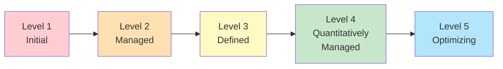

# Assessment — Platform Maturity Model

!!! info "Comparative positioning note"
    This document is written from the
    perspective of Microsoft Azure, Cloud Scale Analytics, and CSA Loom. Any
    description of third-party or competing products, services, pricing, or
    capabilities is derived from **publicly available documentation and sources**
    believed accurate at the time of writing, and is provided for **general
    comparison only**. We do not claim expertise in, or authority over, any
    non-Microsoft product or service; the respective vendor's official
    documentation is the authoritative source for their offerings, which may
    change over time. Nothing here is intended to disparage any vendor — where a
    competing product has genuine advantages, we aim to note them honestly.
    Verify all third-party details against the vendor's current official
    documentation before making decisions.


A 5-level maturity model across 8 dimensions for evaluating data platform maturity. Use this assessment to benchmark your current capabilities, identify improvement areas, and build a prioritized roadmap for platform advancement. Designed for periodic reassessment (quarterly recommended) to track progress over time.

---

## Maturity levels

The model defines five maturity levels that apply consistently across all dimensions:

| Level | Name                       | Description                                                                                                                                                                                                           |
| ----- | -------------------------- | --------------------------------------------------------------------------------------------------------------------------------------------------------------------------------------------------------------------- |
| **1** | **Initial**                | Ad-hoc processes. No standardization. Reactive approach. Work depends on individual heroics. Results are unpredictable and unrepeatable.                                                                              |
| **2** | **Managed**                | Basic processes established for major activities. Some documentation exists. Processes are repeatable but inconsistent across teams. Monitoring is manual.                                                            |
| **3** | **Defined**                | Standardized processes documented and followed across the organization. Automation covers routine tasks. Metrics are collected. Roles and responsibilities are clear.                                                 |
| **4** | **Quantitatively Managed** | Processes are measured with quantitative KPIs. Data-driven decision-making guides improvements. Proactive management based on metrics. Automation covers most workflows.                                              |
| **5** | **Optimizing**             | Continuous improvement culture. Processes are regularly refined based on measurement. Innovation is systematic. Industry-leading practices adopted. The platform enables the business rather than just supporting it. |



---

## How to use this assessment

1. Assemble stakeholders from platform engineering, data engineering, analytics, security, and management
2. Score each dimension using the rubric tables below — select the level that best describes your current state
3. Record scores in the summary table at the end
4. Plot scores on a radar chart for visualization
5. Identify the lowest-scoring dimensions as priority improvement areas
6. Use the action plans by maturity level to build your roadmap

---

## Dimension 1 — Data Engineering

Evaluate the maturity of data pipelines, orchestration, and data quality processes.

| Level                          | Indicators                                                                                                                                                                                                                          |
| ------------------------------ | ----------------------------------------------------------------------------------------------------------------------------------------------------------------------------------------------------------------------------------- |
| **1 — Initial**                | Data is moved manually or with ad-hoc scripts. No orchestration. Pipeline failures are discovered by downstream consumers. No data quality checks.                                                                                  |
| **2 — Managed**                | Basic ETL/ELT pipelines exist. Some scheduling (cron, ADF triggers). Pipeline failures are alerted. Data quality is checked manually after incidents.                                                                               |
| **3 — Defined**                | Standardized pipeline patterns (medallion architecture). Orchestration tool in place (ADF, Airflow, Fabric pipelines). Data quality checks run on every pipeline execution. Schema enforcement on ingestion.                        |
| **4 — Quantitatively Managed** | Pipeline SLAs defined and measured (latency, throughput, freshness). Automated data quality scoring with dashboards. Pipeline performance optimized using metrics. Data contracts between producers and consumers.                  |
| **5 — Optimizing**             | Self-healing pipelines with automated retry and fallback. ML-driven anomaly detection on data quality. Pipeline templates enable self-service data product creation. Continuous optimization based on cost and performance metrics. |

**Your Score:** \_\_\_ / 5

!!! tip "CSA-in-a-Box data engineering resources"
See [Data Engineering Best Practices](../best-practices/data-engineering.md), [Medallion Architecture](../best-practices/medallion-architecture.md), [ADF Setup Guide](../ADF_SETUP.md), and [Data Pipeline Failure Runbook](../runbooks/data-pipeline-failure.md).

---

## Dimension 2 — Data Governance

Evaluate cataloging, lineage, access control, and data stewardship.

| Level                          | Indicators                                                                                                                                                                                                                     |
| ------------------------------ | ------------------------------------------------------------------------------------------------------------------------------------------------------------------------------------------------------------------------------ |
| **1 — Initial**                | No data catalog. Data ownership undefined. Access granted ad-hoc with no review. No lineage tracking. Users cannot discover what data exists.                                                                                  |
| **2 — Managed**                | Basic inventory of major datasets. Some documented owners. Access requests follow a manual process. Lineage understood informally by experienced staff.                                                                        |
| **3 — Defined**                | Data catalog deployed (Purview, Unity Catalog). Data stewards assigned per domain. Access governed by policies with regular reviews. Automated lineage for major pipelines. Classification labels applied to sensitive data.   |
| **4 — Quantitatively Managed** | Data catalog adoption measured (search volume, curation completeness). Access review completion tracked. Lineage coverage measured. Data quality metrics tied to governance SLAs. Compliance evidence generated automatically. |
| **5 — Optimizing**             | Federated governance (data mesh) with domain ownership. Self-service data discovery drives analytics adoption. Governance is an enabler, not a bottleneck. Automated policy enforcement across all data products.              |

**Your Score:** \_\_\_ / 5

!!! tip "CSA-in-a-Box governance resources"
See [Data Cataloging](../governance/DATA_CATALOGING.md), [Data Lineage](../governance/DATA_LINEAGE.md), [Data Quality](../governance/DATA_QUALITY.md), [Metadata Management](../governance/METADATA_MANAGEMENT.md), and [Purview Setup Guide](../governance/PURVIEW_SETUP.md).

---

## Dimension 3 — Analytics & BI

Evaluate reporting capabilities, self-service analytics, and semantic model maturity.

| Level                          | Indicators                                                                                                                                                                                                                           |
| ------------------------------ | ------------------------------------------------------------------------------------------------------------------------------------------------------------------------------------------------------------------------------------ |
| **1 — Initial**                | Reports created in spreadsheets or ad-hoc queries. No centralized BI tool. Each team maintains its own "source of truth." No semantic layer.                                                                                         |
| **2 — Managed**                | BI tool deployed (Power BI, Tableau). Some centralized reports. Limited self-service — analysts depend on IT for new reports. Metrics definitions inconsistent across reports.                                                       |
| **3 — Defined**                | Certified datasets and semantic models published. Self-service analytics available for business users. Report governance in place (workspaces, access, refresh schedules). Common metrics defined and documented.                    |
| **4 — Quantitatively Managed** | Report usage and adoption tracked. Semantic model coverage measured against business KPIs. Data freshness and report performance monitored. Capacity and cost per workspace managed.                                                 |
| **5 — Optimizing**             | Analytics embedded in business processes (real-time dashboards, automated insights, natural language queries). Business users create and share governed analyses independently. AI-augmented analytics surface insights proactively. |

**Your Score:** \_\_\_ / 5

!!! tip "CSA-in-a-Box analytics resources"
See [Power BI Guide](../guides/power-bi.md), [Performance Tuning Best Practices](../best-practices/performance-tuning.md), and [BI Developer Quickstart](../quickstarts/bi-developer.md).

---

## Dimension 4 — AI/ML

Evaluate model development, MLOps, and responsible AI practices.

| Level                          | Indicators                                                                                                                                                                                                                                  |
| ------------------------------ | ------------------------------------------------------------------------------------------------------------------------------------------------------------------------------------------------------------------------------------------- |
| **1 — Initial**                | No ML models in production. Data science is experimental (notebooks, POCs). No model management. No awareness of responsible AI requirements.                                                                                               |
| **2 — Managed**                | A few ML models deployed manually. Model performance monitored reactively. Feature engineering is ad-hoc. Basic awareness of bias and fairness issues.                                                                                      |
| **3 — Defined**                | MLOps pipeline established (experiment tracking, model registry, automated deployment). Feature store available. Model monitoring with drift detection. Responsible AI assessments conducted for production models.                         |
| **4 — Quantitatively Managed** | Model performance tracked against business KPIs. A/B testing for model versions. Automated retraining triggers. Responsible AI metrics (fairness, explainability) measured continuously. Model governance integrated with data governance.  |
| **5 — Optimizing**             | ML is embedded in business processes at scale. Automated feature engineering and AutoML reduce time-to-model. Continuous learning systems adapt to new data. AI governance framework meets regulatory requirements (EO 14110, NIST AI RMF). |

**Your Score:** \_\_\_ / 5

!!! tip "CSA-in-a-Box AI/ML resources"
See [AI/ML Architecture](../reference-architecture/ai-ml-architecture.md), [Azure AI Foundry Guide](../guides/azure-ai-foundry.md), [Azure AI Search Guide](../guides/azure-ai-search.md), and [ML Lifecycle Example](../examples/ml-lifecycle.md).

---

## Dimension 5 — Security & Compliance

Evaluate zero trust implementation, compliance framework coverage, and security operations.

| Level                          | Indicators                                                                                                                                                                                                                                                      |
| ------------------------------ | --------------------------------------------------------------------------------------------------------------------------------------------------------------------------------------------------------------------------------------------------------------- |
| **1 — Initial**                | Perimeter-based security. Shared accounts and static credentials common. No compliance framework mapped. Vulnerability management is reactive.                                                                                                                  |
| **2 — Managed**                | Basic identity management in place. Some MFA enforcement. Primary compliance framework identified. Periodic vulnerability scanning. Incident response is ad-hoc.                                                                                                |
| **3 — Defined**                | Zero trust architecture implemented (identity-first, network segmentation, private endpoints). Primary compliance framework mapped with evidence. SIEM deployed. Documented incident response procedures. Regular vulnerability scanning with remediation SLAs. |
| **4 — Quantitatively Managed** | Security metrics dashboard (MTTD, MTTR, vulnerability aging, compliance posture). Continuous compliance monitoring with automated evidence collection. Threat hunting program. Red team exercises conducted periodically.                                       |
| **5 — Optimizing**             | Automated compliance validation (OSCAL, continuous ATO). Security integrated into CI/CD (DevSecOps). Threat intelligence-driven defense. Security enables velocity rather than constraining it. Multi-framework compliance managed holistically.                |

**Your Score:** \_\_\_ / 5

!!! tip "CSA-in-a-Box security resources"
See [Security & Compliance Best Practices](../best-practices/security-compliance.md), [Compliance Documentation](../compliance/README.md), [Identity & Secrets Flow](../reference-architecture/identity-secrets-flow.md), [Security Incident Runbook](../runbooks/security-incident.md), and [Compliance Gap Analysis](compliance-gap-analysis.md).

---

## Dimension 6 — Platform Operations

Evaluate monitoring, incident response, and capacity management.

| Level                          | Indicators                                                                                                                                                                                                                                |
| ------------------------------ | ----------------------------------------------------------------------------------------------------------------------------------------------------------------------------------------------------------------------------------------- |
| **1 — Initial**                | No centralized monitoring. Issues discovered by users. No runbooks. Capacity managed by over-provisioning. No SLAs defined.                                                                                                               |
| **2 — Managed**                | Basic monitoring (uptime, errors). Alerting for critical failures. Some runbooks for common issues. Capacity reviewed periodically. Informal SLAs.                                                                                        |
| **3 — Defined**                | Centralized monitoring platform (Log Analytics, Application Insights). Standardized alerting with escalation paths. Runbooks for all common scenarios. Capacity planning based on growth projections. SLAs documented for all services.   |
| **4 — Quantitatively Managed** | SLA compliance tracked and reported. Incident metrics (MTTD, MTTR, recurrence rate) measured and improved. Capacity auto-scaling where possible. Change management with impact analysis. Post-incident reviews with action items tracked. |
| **5 — Optimizing**             | AIOps for anomaly detection and automated remediation. Chaos engineering practices validate resilience. SRE culture with error budgets. Platform self-heals for known failure modes. Continuous improvement driven by incident data.      |

**Your Score:** \_\_\_ / 5

!!! tip "CSA-in-a-Box operations resources"
See [Monitoring & Observability Best Practices](../best-practices/monitoring-observability.md), [Log Schema](../LOG_SCHEMA.md), [Troubleshooting Guide](../TROUBLESHOOTING.md), [DR Planning](../DR.md), and [Runbooks](../runbooks/data-pipeline-failure.md).

---

## Dimension 7 — Cost Management

Evaluate cost optimization, chargeback, and financial forecasting.

| Level                          | Indicators                                                                                                                                                                                                                                   |
| ------------------------------ | -------------------------------------------------------------------------------------------------------------------------------------------------------------------------------------------------------------------------------------------- |
| **1 — Initial**                | No visibility into cloud costs. Resources provisioned without cost awareness. No tagging. Bills are a surprise. No budget controls.                                                                                                          |
| **2 — Managed**                | Cost dashboard available. Basic tagging strategy. Monthly cost review. Some awareness of expensive resources. Budgets set but not enforced.                                                                                                  |
| **3 — Defined**                | FinOps practice established. Tagging policy enforced. Cost allocation by team/project. Reserved instances and savings plans evaluated. Budget alerts configured. Regular optimization reviews.                                               |
| **4 — Quantitatively Managed** | Cost per unit metrics (cost per pipeline run, cost per query, cost per user). Showback/chargeback operational. Forecasting accuracy measured. Automated rightsizing recommendations. Cost anomaly detection.                                 |
| **5 — Optimizing**             | Real-time cost optimization (spot instances, auto-pause, serverless where appropriate). Engineering teams own their cost efficiency. Cost is a first-class metric in architecture decisions. Continuous benchmarking against industry peers. |

**Your Score:** \_\_\_ / 5

!!! tip "CSA-in-a-Box cost management resources"
See [Cost Management](../COST_MANAGEMENT.md) and [Cost Optimization Best Practices](../best-practices/cost-optimization.md).

---

## Dimension 8 — Developer Experience

Evaluate self-service capabilities, documentation, and onboarding efficiency.

| Level                          | Indicators                                                                                                                                                                                                                                             |
| ------------------------------ | ------------------------------------------------------------------------------------------------------------------------------------------------------------------------------------------------------------------------------------------------------ |
| **1 — Initial**                | Onboarding takes weeks. No documentation. Tribal knowledge dominates. Developers wait days for environment access. No self-service.                                                                                                                    |
| **2 — Managed**                | Basic onboarding documentation. Some self-service capabilities (portal, wiki). Environment provisioning takes hours to days. Key processes documented but not always current.                                                                          |
| **3 — Defined**                | Comprehensive documentation with role-based guides. Self-service portal for common tasks (environment provisioning, data access requests). Onboarding measured in hours. Templates and starter kits for common patterns. CI/CD pipelines standardized. |
| **4 — Quantitatively Managed** | Developer satisfaction measured (surveys, NPS). Onboarding time-to-productivity tracked. Platform adoption metrics guide investment. Internal developer platform with service catalog. Support ticket volume and resolution time measured.             |
| **5 — Optimizing**             | Platform-as-a-product mindset. Internal developer community contributes templates, tools, and documentation. Self-service covers 90%+ of developer needs. Platform team operates with product management discipline (roadmap, user research, OKRs).    |

**Your Score:** \_\_\_ / 5

!!! tip "CSA-in-a-Box developer experience resources"
See [Developer Pathways](../DEVELOPER_PATHWAYS.md), [Quickstarts](../quickstarts/index.md), [Tutorials](../tutorials/README.md), and [IaC & CI/CD Best Practices](../IaC-CICD-Best-Practices.md).

---

## Scoring summary

Record your scores for each dimension:

| Dimension                | Score (1-5) |
| ------------------------ | ----------- |
| 1. Data Engineering      | \_\_\_      |
| 2. Data Governance       | \_\_\_      |
| 3. Analytics & BI        | \_\_\_      |
| 4. AI/ML                 | \_\_\_      |
| 5. Security & Compliance | \_\_\_      |
| 6. Platform Operations   | \_\_\_      |
| 7. Cost Management       | \_\_\_      |
| 8. Developer Experience  | \_\_\_      |
| **Average Score**        | **\_\_\_**  |

---

## Radar chart visualization

Plot your scores on a radar (spider) chart to visualize strengths and gaps at a glance. Any standard charting tool works — Excel, Google Sheets, or a web-based tool like [ChartJS](https://www.chartjs.org/docs/latest/charts/radar.html).

**How to create the radar chart:**

1. Create 8 axes, one per dimension, arranged in a circle
2. Scale each axis from 0 (center) to 5 (outer edge)
3. Plot your current scores as a polygon
4. Optionally, plot your target scores (e.g., 6-month goals) as a second polygon for comparison

```
              Data Engineering (5)
                    /\
                   /  \
  Developer       /    \      Data
  Experience     /      \     Governance
        \       /        \       /
         \     /          \     /
          \   /            \   /
           \ /              \ /
  Cost -----.-------.--------.---- Analytics
  Mgmt      \              /        & BI
              \            /
               \          /
        Platform \      / AI/ML
        Operations \  /
                    \/
          Security & Compliance
```

!!! tip "Track over time"
Re-run this assessment quarterly and overlay the radar charts to visualize progress. Expanding the polygon toward the outer edge across all dimensions indicates balanced platform maturation.

---

## Action plans by maturity level

### Moving from Level 1 to Level 2 — Establishing Foundations

**Focus:** Get basics in place. Make processes repeatable. Reduce dependence on individual knowledge.

- [ ] Deploy a centralized monitoring solution (Azure Monitor, Log Analytics)
- [ ] Establish basic data pipelines with error alerting
- [ ] Deploy a BI tool and create initial dashboards for key metrics
- [ ] Implement centralized identity with MFA (Entra ID)
- [ ] Create a basic tagging strategy and apply to all resources
- [ ] Document top 10 operational procedures as runbooks
- [ ] Create onboarding documentation for new team members
- [ ] Identify your primary compliance framework

**CSA-in-a-Box starting point:** [Getting Started Guide](../GETTING_STARTED.md) and [Quickstart](../QUICKSTART.md)

### Moving from Level 2 to Level 3 — Standardizing Processes

**Focus:** Standardize across teams. Automate routine tasks. Establish governance. Build self-service.

- [ ] Implement medallion architecture for data pipelines
- [ ] Deploy a data catalog (Purview) and begin metadata curation
- [ ] Publish certified semantic models for key business domains
- [ ] Implement MLOps pipeline (experiment tracking, model registry)
- [ ] Implement zero trust architecture (private endpoints, network segmentation, PIM)
- [ ] Map your primary compliance framework to platform controls
- [ ] Implement Infrastructure-as-Code for all deployments (Bicep)
- [ ] Create role-based developer guides and self-service portal
- [ ] Establish FinOps practice with cost allocation and optimization reviews

**CSA-in-a-Box starting point:** [Architecture Overview](../ARCHITECTURE.md), [Best Practices](../best-practices/index.md), and [Compliance Documentation](../compliance/README.md)

### Moving from Level 3 to Level 4 — Measuring and Managing

**Focus:** Define KPIs for every dimension. Build dashboards. Make data-driven decisions. Automate compliance.

- [ ] Define and measure pipeline SLAs (latency, freshness, quality scores)
- [ ] Implement data contracts between producers and consumers
- [ ] Track BI adoption metrics (active users, report usage, self-service ratio)
- [ ] Measure model performance against business outcomes
- [ ] Implement continuous compliance monitoring with automated evidence collection
- [ ] Track SLA compliance, MTTD, MTTR, and incident recurrence
- [ ] Implement cost-per-unit metrics and showback/chargeback
- [ ] Measure developer onboarding time-to-productivity and satisfaction

**CSA-in-a-Box starting point:** [Monitoring & Observability](../best-practices/monitoring-observability.md) and [Production Checklist](../PRODUCTION_CHECKLIST.md)

### Moving from Level 4 to Level 5 — Continuous Optimization

**Focus:** Embed continuous improvement. Enable innovation. Make the platform a competitive advantage.

- [ ] Implement self-healing pipelines with automated remediation
- [ ] Adopt federated governance (data mesh) with domain ownership
- [ ] Embed AI-augmented analytics (automated insights, natural language queries)
- [ ] Implement continuous learning and automated retraining
- [ ] Achieve continuous ATO with OSCAL integration
- [ ] Implement AIOps for predictive incident management
- [ ] Optimize costs continuously with real-time automation
- [ ] Operate platform-as-a-product with internal developer community

**CSA-in-a-Box starting point:** [Platform Research Report](../research/CSA-Platform-Research-Report.md) and [Federal Cloud Adoption Trends](../research/federal-cloud-adoption-trends.md)

---

## Interpreting results

| Average Score | Overall Maturity       | Interpretation                                                                                              |
| ------------- | ---------------------- | ----------------------------------------------------------------------------------------------------------- |
| **4.5-5.0**   | Optimizing             | Industry-leading platform. Focus on innovation and maintaining excellence.                                  |
| **3.5-4.4**   | Quantitatively Managed | Strong platform with metrics-driven management. Focus on continuous improvement and closing remaining gaps. |
| **2.5-3.4**   | Defined                | Solid foundation with standardized processes. Focus on measurement and automation to advance.               |
| **1.5-2.4**   | Managed                | Basics in place but inconsistent. Focus on standardization and governance to advance.                       |
| **1.0-1.4**   | Initial                | Significant foundational work needed. Focus on establishing repeatable processes and core capabilities.     |

!!! tip "Balance matters"
A platform that scores 5 on Data Engineering but 1 on Security has a critical imbalance. Prioritize raising your lowest dimensions to at least Level 3 before pushing any single dimension beyond Level 4. The weakest dimension often determines your actual platform reliability.

---

## Related

- [Migration Readiness Assessment](migration-readiness.md) — Pre-migration readiness evaluation
- [Compliance Gap Analysis](compliance-gap-analysis.md) — Detailed compliance control gap identification
- [Assessment Templates Index](index.md) — Overview of all assessment tools
- [Best Practices](../best-practices/index.md) — Operational guidance across all platform dimensions
- [Architecture Overview](../ARCHITECTURE.md) — Platform architecture reference
- [Platform Research Report](../research/CSA-Platform-Research-Report.md) — Strategic platform direction

---

**Last updated:** 2026-04-30
**Review cadence:** Quarterly (reassess maturity scores each quarter)
**Owner:** CSA-in-a-Box platform team
