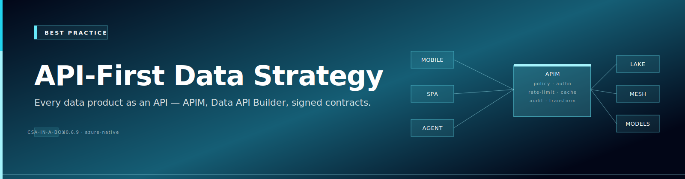

# Best Practice — API-First Data Strategy


{ .architecture-hero loading="eager" }

## What "API-first" actually means

API-first is not "we have some APIs." API-first is the architectural choice that **every dataset, model, and system is consumed exclusively through stable, versioned, machine-readable, identity-grounded contracts**. The data is the API. The model is the API. The system is the API. No exceptions, no side channels, no "just this once" direct database access.

This page is the opinionated playbook for executing that choice on Azure.

---

## The eight rules

| # | Rule | Why |
|---|---|---|
| 1 | **Every data product publishes an OpenAPI / OData / GraphQL contract** | Machine-readable surface; agents and code can plan against it |
| 2 | **APIM is the front door for everything** | One identity, one policy plane, one observability surface |
| 3 | **Entra is the universal identity** | Tokens carry user, app, and assurance signals; no per-system credentials |
| 4 | **Purview catalogs every API** | Discoverability + lineage + classification = governance |
| 5 | **Versioning is mandatory; revisions handle hotfixes** | Zero-downtime change; consumers pin to stable contracts |
| 6 | **Rate limits and token budgets are non-optional** | Cost control + noisy-neighbor protection |
| 7 | **Read-write paths require explicit RBAC and audit** | Writes are higher consequence than reads |
| 8 | **Deprecation is announced; sunsets are enforced** | API estates without deprecation rot into legacy |

The rest of this page is the implementation detail under each rule.

---

## Rule 1 — Every data product publishes a contract

### Pick the right shape

| Shape | Best for | Notes |
|---|---|---|
| **OpenAPI 3.x REST** | Transactional reads and writes; broad client compatibility | Default choice |
| **OData v4** | Rich filtering, server-side projection, metadata discovery | Default for Dataverse-style structured business data |
| **GraphQL** | Aggregating multiple sub-resources in one call; flexible client-driven queries | Choose intentionally; defaults of REST/OData are usually fine |
| **gRPC** | High-throughput internal service-to-service | Niche; APIM supports it; clients are narrower |
| **AsyncAPI** | Event-driven contracts (queues, topics, streams) | Document Event Hubs / Service Bus messages with AsyncAPI 2.x |

Default to **OpenAPI + OData filter conventions**. Reach for GraphQL only when client query flexibility is the documented business requirement.

### Contract hygiene

- One contract per resource; resource names plural and lowercase
- Stable identifiers (UUIDs, not auto-increments)
- ISO 8601 timestamps with timezone
- Idempotent `PUT` and `DELETE`; non-idempotent `POST`
- HTTP status codes mean what they mean — `201` for create, `204` for no-content, `409` for conflict, `412` for ETag failure, `429` for rate-limited
- Pagination via `$top` + `$skip` or `@odata.nextLink` or cursor — pick one and apply consistently
- Field filtering via `$select`; field expansion via `$expand`
- Error responses follow RFC 7807 Problem Details

---

## Rule 2 — APIM is the front door

No data API is exposed directly. Every consumer reaches APIM; APIM reaches the backend.

### Minimum policy set for every API

```xml
<policies>
  <inbound>
    <base />
    <!-- Identity -->
    <validate-jwt header-name="Authorization" failed-validation-httpcode="401">
      <openid-config url="https://login.microsoftonline.com/{tenant}/v2.0/.well-known/openid-configuration" />
      <required-claims>
        <claim name="aud" match="any"><value>api://your-app-id</value></claim>
      </required-claims>
    </validate-jwt>
    <!-- Rate limit -->
    <rate-limit-by-key calls="100" renewal-period="60" counter-key="@(context.Subscription.Id)" />
    <quota-by-key calls="1000000" renewal-period="2592000" counter-key="@(context.Subscription.Id)" />
    <!-- Content safety on body for write endpoints -->
    <choose>
      <when condition="@(context.Request.Method == "POST" || context.Request.Method == "PATCH")">
        <set-body>@(context.Request.Body.As<string>(preserveContent: true))</set-body>
      </when>
    </choose>
    <!-- Audit dimensions -->
    <set-variable name="auditUser" value="@(context.User.Email ?? "anonymous")" />
  </inbound>
  <backend><forward-request /></backend>
  <outbound>
    <base />
    <set-header name="X-RateLimit-Remaining" exists-action="override"><value>@(context.Variables["remaining-calls"]?.ToString())</value></set-header>
  </outbound>
</policies>
```

For LLM-backed APIs, add the AI policy set documented in [the APIM universal gateway guide](../guides/apim-universal-gateway.md).

### Self-hosted gateway for hybrid

For backends that cannot leave on-prem / sovereign / partner-cloud boundaries, run **APIM Self-Hosted Gateway** as a single container inside the boundary. The control plane stays in Azure; the data plane stays where the data lives.

---

## Rule 3 — Entra is the universal identity

### Token patterns

| Caller type | Token pattern |
|---|---|
| Interactive user app | OAuth 2.0 Auth Code + PKCE → user-delegated token |
| Server-to-server inside Azure | Managed identity → federated workload identity token |
| Server-to-server outside Azure | Service principal (cert preferred over secret) |
| On-behalf-of (middle tier) | OBO exchange to preserve user identity |
| External agency / partner | Entra B2B with cross-tenant access settings |
| External customer / consumer | Entra External ID (formerly Entra B2C) |

### Conditional Access for APIs

API endpoints (especially write paths and high-sensitivity reads) sit behind Conditional Access policies that require:

- Compliant or hybrid-joined device
- Approved client app
- MFA on token issuance
- No high-risk sign-in state

These policies attach to the APIM API as the resource. CAE revokes tokens when device compliance or risk state changes.

---

## Rule 4 — Purview catalogs every API

Each API has a Purview catalog entry with:

- **Owner** — named team and on-call rotation
- **SLA** — availability target, p95 latency target
- **Classification** — public, internal, confidential, mission-CUI, restricted
- **Lineage** — backing data products, consuming applications and agents
- **Schema** — link to the OpenAPI / OData metadata document
- **Deprecation status** — current, deprecated (with sunset date), retired

This entry is created at API publication time as part of CI. APIs without a Purview entry do not pass production deployment review.

---

## Rule 5 — Versioning and revisions

APIM supports two orthogonal mechanisms:

| Mechanism | Use for |
|---|---|
| **Versions** (v1 / v2 / v3) | Breaking changes; long-lived parallel surfaces |
| **Revisions** (current / next) | Backwards-compatible changes; testing in production |

A reasonable policy:

- Minor changes (additive fields, new optional parameters) ship as new revisions
- Breaking changes (removed fields, changed semantics) ship as a new version with a deprecation timer on the prior version
- The current revision is always pointed at by the public URL
- The current version is the default; clients can pin via `api-version` header or URL segment

### Deprecation policy

| Stage | Duration | Action |
|---|---|---|
| Notice | 30 days minimum | Add `Deprecation` and `Sunset` response headers; documentation banner |
| Soft sunset | Variable | Return 410 for opted-in clients; continue serving others |
| Hard sunset | After defined date | All callers get 410; documentation removed |

Document the policy in the API's Purview entry. Notify consumers via APIM Developer Portal subscriptions.

---

## Rule 6 — Rate limits and token budgets

Three layers of protection:

1. **Request rate** — `rate-limit-by-key` and `quota-by-key`
2. **Concurrent connections** — APIM backend pool sizing
3. **Token budget** (for LLM-backed APIs) — `llm-token-limit`

Defaults:

| Tier | Per-second | Per-minute | Per-month |
|---|---|---|---|
| Free / trial | 1 | 60 | 100,000 |
| Standard | 10 | 600 | 5,000,000 |
| Premium | 100 | 6,000 | 50,000,000 |
| Enterprise | Negotiated | Negotiated | Negotiated |

Apply at subscription level. Adjust per consuming application's actual need based on usage telemetry.

---

## Rule 7 — Writes require explicit RBAC and audit

Writes are higher-consequence than reads. Apply tighter controls:

- Require a specific scope (e.g., `Api.WriteAccounts`) not just `Api.Read`
- Require a Conditional Access policy that includes MFA
- Require an audit annotation header (`X-Audit-Reason`) for sensitive write operations
- Log full request and response bodies to a tamper-evident audit log (Log Analytics workspace with immutable retention)
- Require approval flow for high-sensitivity writes (Power Automate + Adaptive Card approval)

---

## Rule 8 — Deprecation is announced; sunsets are enforced

API estates without deprecation rot. The pattern:

1. Every API has an explicit deprecation policy in Purview
2. New revisions / versions announce sunset dates for predecessors at release
3. Consumer adoption is tracked via subscription metrics
4. 60 days before sunset, hard-blocked clients without a migration path get an outreach
5. On sunset date, the old version returns 410 with a `Link` header pointing at the new contract

This is the discipline that separates a long-lived API estate from a legacy backlog.

---

## Catalog discipline

A healthy API estate is governed by a **portfolio review** monthly:

| Metric | Target |
|---|---|
| APIs with Purview entry | 100% |
| APIs with documented owner | 100% |
| APIs with OpenAPI / OData spec in version control | 100% |
| APIs with a measurable SLA | 100% |
| APIs with deprecation status set | 100% |
| APIs without traffic in the last 60 days | < 5% (review for retirement) |
| APIs with declining adoption | Tracked; intervene |
| New APIs published this quarter | Tracked; trend the platform's growth |

The portfolio review is owned by the API platform team and reported to data governance. It is the single most reliable predictor of estate health.

---

## Anti-patterns to refuse

| Anti-pattern | Why to refuse |
|---|---|
| "We'll publish the OpenAPI later" | The OpenAPI **is** the contract. Without it there is no API. |
| "This caller doesn't need Entra; it has an internal credential" | Every system that integrates uses Entra. Otherwise the trust fabric leaks. |
| "We'll skip APIM for this internal API" | The platform must apply universally or none of its guarantees hold. |
| "We don't need rate limits — it's internal" | Internal callers cause production outages too. Limits start at modestly generous and tighten on signal. |
| "We'll version it when we have to" | Version from day one. The cost is one extra URL segment and infinite future flexibility. |
| "We'll catalog it after launch" | No Purview entry means no governance. Block at deploy. |

---

## Related material

- [Whitepaper — API-first data strategy on Azure](../research/api-first-data-strategy-whitepaper.md)
- [Best practice — Zero-move data architecture](./zero-move-data-architecture.md)
- [Best practice — Multi-model AI orchestration](./multi-model-ai-orchestration.md)
- [Guide — APIM as the universal API gateway](../guides/apim-universal-gateway.md)
- [Guide — Zero-trust API governance for federal mission environments](../guides/zero-trust-api-governance-federal.md)
