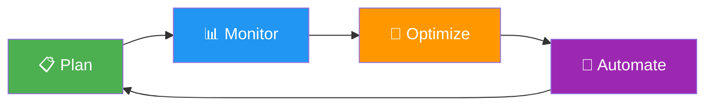

# Cost Optimization Best Practices

## Overview

Cost optimization is a **first-class architecture concern** in CSA-in-a-Box. Every design decision — from cluster sizing to storage tiering — carries a direct cost implication. This guide provides concrete, actionable strategies to minimize spend without sacrificing performance or reliability.

!!! tip "Related Guide"
For operational cost management workflows (budgets, alerts, chargebacks), see the [Cost Management Guide](../COST_MANAGEMENT.md).

The cost optimization lifecycle is a continuous process, not a one-time exercise:



| Phase        | Activities                                                        |
| ------------ | ----------------------------------------------------------------- |
| **Plan**     | Right-size resources, choose pricing tiers, estimate monthly cost |
| **Monitor**  | Track spend vs budget, identify anomalies, review utilization     |
| **Optimize** | Eliminate waste, consolidate workloads, apply tiering             |
| **Automate** | Auto-pause, lifecycle policies, scheduled scaling                 |

---

## Compute Cost Optimization

### Databricks

| Strategy                       | Savings Estimate | Complexity |
| ------------------------------ | ---------------- | ---------- |
| Auto-termination (10 min)      | 30–60%           | Low        |
| Spot instances for jobs        | 60–80%           | Medium     |
| Jobs clusters over all-purpose | 40–70%           | Low        |
| Cluster policies               | 20–40%           | Medium     |
| Photon acceleration            | 20–50%           | Low        |

**Jobs clusters vs all-purpose clusters:** Jobs clusters spin up for a specific job and terminate immediately after. All-purpose clusters stay running for interactive use. Always use jobs clusters for production pipelines.

!!! example "Cluster Policy — Enforce Cost Controls"
`json
    {
      "cluster_name": {
        "type": "fixed",
        "value": "job-cluster-{user}"
      },
      "autotermination_minutes": {
        "type": "range",
        "minValue": 10,
        "maxValue": 60,
        "defaultValue": 15
      },
      "spark_conf.spark.databricks.cluster.profile": {
        "type": "fixed",
        "value": "serverless"
      },
      "node_type_id": {
        "type": "allowlist",
        "values": [
          "Standard_DS3_v2",
          "Standard_DS4_v2",
          "Standard_E4ds_v5"
        ]
      },
      "num_workers": {
        "type": "range",
        "minValue": 1,
        "maxValue": 8,
        "defaultValue": 2
      },
      "azure_attributes.availability": {
        "type": "fixed",
        "value": "SPOT_WITH_FALLBACK_AZURE"
      },
      "custom_tags.CostCenter": {
        "type": "fixed",
        "value": "analytics"
      }
    }
    `

### Synapse Analytics

| Pool Type           | Pricing Model      | Best For                      |
| ------------------- | ------------------ | ----------------------------- |
| Serverless SQL pool | Pay-per-query (TB) | Ad-hoc queries, exploration   |
| Dedicated SQL pool  | Reserved DWU/hour  | Predictable, high-concurrency |

- **Serverless SQL pools** charge ~$5/TB scanned — ideal for infrequent or exploratory queries
- **Dedicated SQL pools** start at ~$1.20/hour (DW100c) — only cost-effective at sustained utilization >60%
- Pause dedicated pools during off-hours to eliminate idle charges

### Microsoft Fabric

Fabric uses Capacity Units (CUs). Sizing depends on workload:

| Environment | SKU  | CUs | Cost (approx/month) | Use Case                    |
| ----------- | ---- | --- | ------------------- | --------------------------- |
| Dev/Test    | F2   | 2   | ~$260               | Individual developer work   |
| Team Dev    | F8   | 8   | ~$1,040             | Shared development          |
| Staging     | F32  | 32  | ~$4,160             | Integration testing         |
| Production  | F64  | 64  | ~$8,320             | Production workloads        |
| Large Prod  | F128 | 128 | ~$16,640            | High-concurrency production |

!!! example "Auto-Pause Fabric Capacity (Bicep)"

````bicep
resource fabricCapacity 'Microsoft.Fabric/capacities@2023-11-01' = {
name: 'csa-dev-fabric'
location: resourceGroup().location
sku: {
name: 'F2'
tier: 'Fabric'
}
properties: {}
}

    // Auto-pause via Azure Automation runbook
    resource automationAccount 'Microsoft.Automation/automationAccounts@2023-11-01' = {
      name: 'csa-cost-automation'
      location: resourceGroup().location
      properties: {
        sku: {
          name: 'Basic'
        }
      }
    }

    resource pauseSchedule 'Microsoft.Automation/automationAccounts/schedules@2023-11-01' = {
      parent: automationAccount
      name: 'pause-fabric-evenings'
      properties: {
        frequency: 'Day'
        interval: 1
        startTime: '2024-01-01T18:00:00-05:00'
        timeZone: 'Eastern Standard Time'
      }
    }

    resource resumeSchedule 'Microsoft.Automation/automationAccounts/schedules@2023-11-01' = {
      parent: automationAccount
      name: 'resume-fabric-mornings'
      properties: {
        frequency: 'Day'
        interval: 1
        startTime: '2024-01-01T07:00:00-05:00'
        timeZone: 'Eastern Standard Time'
      }
    }
    ```

### Spark Right-Sizing

- **Adaptive Query Execution (AQE):** Enable `spark.sql.adaptive.enabled=true` to automatically coalesce shuffle partitions and optimize join strategies at runtime.
- **Photon acceleration:** Use Photon-enabled runtimes for ETL workloads — typically 2–5× faster, reducing DBU consumption proportionally.
- **Executor sizing:** Start with 4 cores / 16 GB per executor. Scale horizontally (more executors) rather than vertically (bigger executors) for better spot instance tolerance.
- **Auto-scaling:** Set min workers = 1, max workers = workload peak. Databricks auto-scaling adds/removes nodes based on pending tasks.

### Compute Do's and Don'ts

| ✅ Do                                            | ❌ Don't                                    | Cost Impact |
| ------------------------------------------------ | ------------------------------------------- | ----------- |
| Use jobs clusters for pipelines                  | Run all-purpose clusters 24/7               | Save 40–70% |
| Set auto-termination to 10–15 min                | Leave default auto-termination at 120 min   | Save 30–60% |
| Use spot instances for fault-tolerant jobs       | Use on-demand for all workloads             | Save 60–80% |
| Enforce cluster policies                         | Allow users to create unlimited clusters    | Save 20–40% |
| Pause dedicated SQL pools on nights/weekends     | Run dedicated pools 24/7                    | Save 65%    |
| Use serverless SQL for < 1 TB/day queries        | Provision dedicated pool for ad-hoc queries | Save 70–90% |
| Pause Fabric dev capacity outside business hours | Run dev capacity 24/7                       | Save 65%    |
| Enable Photon for ETL workloads                  | Use standard runtime for heavy transforms   | Save 20–50% |

---

## Storage Cost Optimization

### ADLS Gen2 Tiering

Azure Data Lake Storage Gen2 supports three access tiers with dramatically different pricing:

| Tier        | Storage (per TB/month) | Read (per 10K ops) | Write (per 10K ops) | Min Retention | Best For                    |
| ----------- | ---------------------- | ------------------ | ------------------- | ------------- | --------------------------- |
| **Hot**     | ~$20.80                | $0.0044            | $0.055              | None          | Active data, frequent reads |
| **Cool**    | ~$10.00                | $0.011             | $0.110              | 30 days       | Infrequent access data      |
| **Archive** | ~$1.80                 | $5.50              | $0.110              | 180 days      | Compliance, long-term       |

!!! info "CSA-in-a-Box Retention Strategy"
| Medallion Layer | Hot Retention | Cool Retention | Archive Retention |
| --------------- | ------------- | -------------- | ----------------- |
| **Bronze** | 30 days | 90 days | 7 years |
| **Silver** | 90 days | 1 year | 3 years |
| **Gold** | 1 year | 2 years | As needed |

!!! example "Lifecycle Management Policy"
`json
    {
      "rules": [
        {
          "enabled": true,
          "name": "bronze-tiering",
          "type": "Lifecycle",
          "definition": {
            "filters": {
              "blobTypes": ["blockBlob"],
              "prefixMatch": ["bronze/"]
            },
            "actions": {
              "baseBlob": {
                "tierToCool": {
                  "daysAfterModificationGreaterThan": 30
                },
                "tierToArchive": {
                  "daysAfterModificationGreaterThan": 120
                },
                "delete": {
                  "daysAfterModificationGreaterThan": 2555
                }
              }
            }
          }
        },
        {
          "enabled": true,
          "name": "silver-tiering",
          "type": "Lifecycle",
          "definition": {
            "filters": {
              "blobTypes": ["blockBlob"],
              "prefixMatch": ["silver/"]
            },
            "actions": {
              "baseBlob": {
                "tierToCool": {
                  "daysAfterModificationGreaterThan": 90
                },
                "tierToArchive": {
                  "daysAfterModificationGreaterThan": 365
                }
              }
            }
          }
        }
      ]
    }
    `

### Delta Lake Optimization

Small files are the #1 hidden cost driver in lakehouse architectures. Each small file increases storage transactions and degrades query performance.

```sql
-- Remove old files (default retention: 7 days)
VACUUM bronze.raw_events RETAIN 168 HOURS;

-- Compact small files into larger ones
OPTIMIZE silver.customer_transactions
  ZORDER BY (customer_id, transaction_date);

-- Check table statistics
DESCRIBE DETAIL silver.customer_transactions;
````

- Run `VACUUM` weekly on Bronze tables, daily on high-write Silver/Gold tables
- Run `OPTIMIZE` after large batch loads or when file count exceeds 10× the ideal
- Use `ZORDER` on columns used in `WHERE` and `JOIN` filters
- **Compression:** Use Zstandard (`zstd`) for Parquet — 10–20% smaller than Snappy with comparable decompression speed

---

## Network & Egress Cost Management

### Egress Pricing

| Transfer Type               | Cost per GB |
| --------------------------- | ----------- |
| Same region (intra-region)  | Free        |
| Cross-region (within Azure) | $0.02       |
| Azure → Internet            | $0.087      |
| AWS → Azure (cross-cloud)   | $0.09       |
| GCP → Azure (cross-cloud)   | $0.12       |

!!! warning "Cross-cloud egress adds up fast"
Transferring 10 TB/month from AWS to Azure costs ~$900/month in egress alone. For multi-cloud scenarios, see the [Multi-Cloud Data Virtualization](../use-cases/) use case.

### Strategies to Minimize Egress

1. **Co-locate compute with storage.** Always run Databricks/Synapse/Fabric in the same region as your ADLS storage account.
2. **Use Private Endpoints.** Traffic over Private Link stays on the Azure backbone — no egress charges.
3. **Cache at edge.** For repeated cross-region reads, use Azure CDN or a regional cache layer.
4. **Prefer data virtualization over data copying** for cross-cloud queries — query in place rather than replicating.
5. **Batch transfers during off-peak.** Azure ExpressRoute circuits have predictable pricing vs metered egress.

---

## Fabric Capacity Planning

### CU Sizing Guide

Capacity Units (CUs) are consumed by all Fabric workloads (Lakehouse, Warehouse, Pipelines, Notebooks, Reports). Key concepts:

- **Smoothing:** Fabric averages CU consumption over a 5-minute window, preventing short spikes from throttling
- **Bursting:** Workloads can temporarily burst up to 2× the provisioned CUs, with excess consumption repaid over the next 24 hours
- **Throttling:** At sustained consumption >100% of capacity, background jobs are delayed; at >200%, interactive queries are also throttled

### Auto-Scale Configuration

```json
{
    "capacityName": "csa-prod-fabric",
    "autoScale": {
        "enabled": true,
        "maxCUs": 128,
        "scaleUpThresholdPercent": 80,
        "scaleDownThresholdPercent": 30,
        "cooldownMinutes": 15
    }
}
```

### Pause Schedules for Dev/Test

| Environment   | Active Hours   | Days    | Monthly Savings |
| ------------- | -------------- | ------- | --------------- |
| Dev (F2)      | 08:00–18:00 ET | Mon–Fri | ~65%            |
| Staging (F32) | 06:00–22:00 ET | Mon–Fri | ~55%            |
| Production    | 24/7           | All     | 0% (always on)  |

### Monitoring Capacity Utilization

Track these metrics in the Fabric Capacity Metrics app:

- **CU utilization %** — target < 70% sustained
- **Throttling events** — should be zero in production
- **Bursting duration** — track to avoid sustained overuse
- **Per-workload CU breakdown** — identify cost-heavy workloads

---

## Azure Cost Management

### Budget Alerts

Set up tiered alerts to catch spend increases early:

!!! example "Azure CLI — Budget Alerts"
`bash
    # Create a monthly budget with alerts at 50%, 75%, 90%, 100%
    az consumption budget create \
      --budget-name "csa-platform-monthly" \
      --amount 15000 \
      --time-grain Monthly \
      --start-date "2024-01-01" \
      --end-date "2025-12-31" \
      --resource-group "rg-csa-prod" \
      --category Cost \
      --notifications '{
        "alert-50": {
          "enabled": true,
          "operator": "GreaterThanOrEqualTo",
          "threshold": 50,
          "contactEmails": ["platform-team@agency.gov"],
          "thresholdType": "Actual"
        },
        "alert-75": {
          "enabled": true,
          "operator": "GreaterThanOrEqualTo",
          "threshold": 75,
          "contactEmails": ["platform-team@agency.gov"],
          "thresholdType": "Actual"
        },
        "alert-90": {
          "enabled": true,
          "operator": "GreaterThanOrEqualTo",
          "threshold": 90,
          "contactEmails": ["platform-team@agency.gov", "finance@agency.gov"],
          "thresholdType": "Actual"
        },
        "forecast-100": {
          "enabled": true,
          "operator": "GreaterThanOrEqualTo",
          "threshold": 100,
          "contactEmails": ["platform-team@agency.gov", "finance@agency.gov"],
          "thresholdType": "Forecasted"
        }
      }'
    `

### Cost Allocation Tags

Apply consistent tags to every resource for chargeback and cost attribution:

| Tag Key       | Example Values                   | Purpose                   |
| ------------- | -------------------------------- | ------------------------- |
| `Environment` | `dev`, `staging`, `prod`         | Environment segmentation  |
| `Domain`      | `finance`, `hr`, `compliance`    | Business domain ownership |
| `Team`        | `data-eng`, `analytics`, `infra` | Team chargeback           |
| `CostCenter`  | `CC-1234`                        | Financial tracking        |
| `Project`     | `csa-inabox`                     | Project-level attribution |

### Azure Advisor Recommendations

Review Azure Advisor weekly for:

- **Right-sizing** — VMs and SQL pools running under 30% utilization
- **Reserved instances** — workloads running 24/7 that would benefit from 1-year or 3-year reservations
- **Shutdown recommendations** — idle resources with zero utilization
- **Storage optimization** — blobs that could be moved to cooler tiers

### Reserved Instances

For predictable, always-on workloads, Reserved Instances provide significant savings:

| Resource           | Pay-as-you-go | 1-Year RI | 3-Year RI | Savings (3Y) |
| ------------------ | ------------- | --------- | --------- | ------------ |
| Databricks (E4ds)  | $0.313/hr     | $0.198/hr | $0.130/hr | 58%          |
| SQL Dedicated Pool | $1.20/hr      | $0.78/hr  | $0.52/hr  | 57%          |
| Fabric F64         | $11.39/hr     | $7.90/hr  | $5.70/hr  | 50%          |

---

## Cost Monitoring Dashboard

### Key Metrics to Track

| Metric                     | Target                | Alert Threshold          |
| -------------------------- | --------------------- | ------------------------ |
| Monthly spend vs budget    | < 80% of budget       | > 90% of budget          |
| Daily spend delta          | < 10% day-over-day    | > 25% spike              |
| Compute utilization        | > 60%                 | < 30% (over-provisioned) |
| Storage growth rate        | < 5% month-over-month | > 15% month-over-month   |
| Idle resource count        | 0                     | > 0                      |
| Reserved instance coverage | > 70%                 | < 50%                    |

### Anomaly Detection

Set up anomaly detection alerts in Azure Cost Management:

- **Sudden spend spikes** — a runaway pipeline or misconfigured auto-scale
- **New high-cost resources** — unplanned deployments
- **Unusual egress patterns** — potential data exfiltration or misconfigured networking
- **Weekend/holiday spend increases** — workloads that should be paused

---

## Cost Anti-Patterns

!!! danger "Anti-Pattern: All-Purpose Clusters Running 24/7"
**Problem:** Interactive clusters left running overnight and weekends.
**Cost:** A 4-node Standard_DS4_v2 cluster costs ~$2,000/month running 24/7 vs ~$600/month with business-hours-only auto-termination.
**Fix:** Set auto-termination to 10–15 minutes. Use jobs clusters for all automated workloads.

!!! danger "Anti-Pattern: Hot Storage for Archival Data"
**Problem:** Keeping 5+ years of Bronze data in Hot tier.
**Cost:** 50 TB in Hot = ~$1,040/month. In Archive = ~$90/month.
**Fix:** Apply lifecycle management policies to move data to Cool after 30 days and Archive after 120 days.

!!! danger "Anti-Pattern: Unoptimized Delta Tables (Millions of Small Files)"
**Problem:** Streaming ingestion creates millions of small Parquet files. Each `LIST` and `GET` operation costs money and degrades performance.
**Cost:** 1M small files can cost 10–50× more in transaction fees than 1,000 properly sized files.
**Fix:** Schedule regular `OPTIMIZE` and `VACUUM` operations. Use auto-compaction (`spark.databricks.delta.autoCompact.enabled=true`).

!!! danger "Anti-Pattern: No Auto-Termination on Dev Clusters"
**Problem:** Developers spin up clusters and forget to terminate them.
**Cost:** A forgotten 2-node cluster costs ~$30/day.
**Fix:** Enforce auto-termination via cluster policies (max 15 minutes for dev clusters).

!!! danger "Anti-Pattern: Over-Provisioned Dedicated SQL Pools"
**Problem:** Running DW1000c for workloads that only need DW100c.
**Cost:** DW1000c = ~$12/hour vs DW100c = ~$1.20/hour — a 10× overspend.
**Fix:** Start with the smallest pool, monitor query performance, scale up only when queue times exceed SLA.

---

## Monthly Cost Estimation Table

Reference pricing for CSA-in-a-Box platform sizes (all prices approximate, USD):

| Component                  | Small (Dev/POC) | Medium (Dept)     | Large (Enterprise)  |
| -------------------------- | --------------- | ----------------- | ------------------- |
| **Databricks (DBUs)**      | $500            | $3,000            | $15,000             |
| **Fabric Capacity**        | $260 (F2)       | $4,160 (F32)      | $16,640 (F128)      |
| **ADLS Gen2 Storage**      | $50 (2 TB Hot)  | $300 (20 TB mix)  | $1,200 (100 TB mix) |
| **Synapse Serverless**     | $25             | $200              | $1,000              |
| **Networking/Egress**      | $10             | $100              | $500                |
| **Key Vault + Monitoring** | $50             | $150              | $500                |
| **Azure DevOps / CI-CD**   | $0 (free tier)  | $30               | $150                |
| **Azure Cost Management**  | Free            | Free              | Free                |
| **Total (estimated)**      | **~$895/month** | **~$7,940/month** | **~$34,990/month**  |

!!! note "Optimization Impact"
Applying the strategies in this guide typically reduces spend by **30–50%** from unoptimized baselines. A medium platform can realistically operate at **$5,000–6,000/month** with proper auto-pause, spot instances, and storage tiering.

| Optimization Applied           | Small Savings | Medium Savings | Large Savings |
| ------------------------------ | ------------- | -------------- | ------------- |
| Auto-pause dev/staging compute | $100          | $1,500         | $5,000        |
| Spot instances for batch jobs  | $150          | $1,200         | $6,000        |
| Storage lifecycle tiering      | $15           | $100           | $500          |
| Right-sized Fabric capacity    | $0            | $800           | $3,000        |
| Reserved instances (1-year)    | $0            | $600           | $4,000        |
| **Total optimized estimate**   | **~$630**     | **~$5,740**    | **~$16,490**  |
