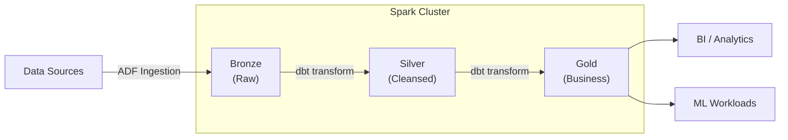
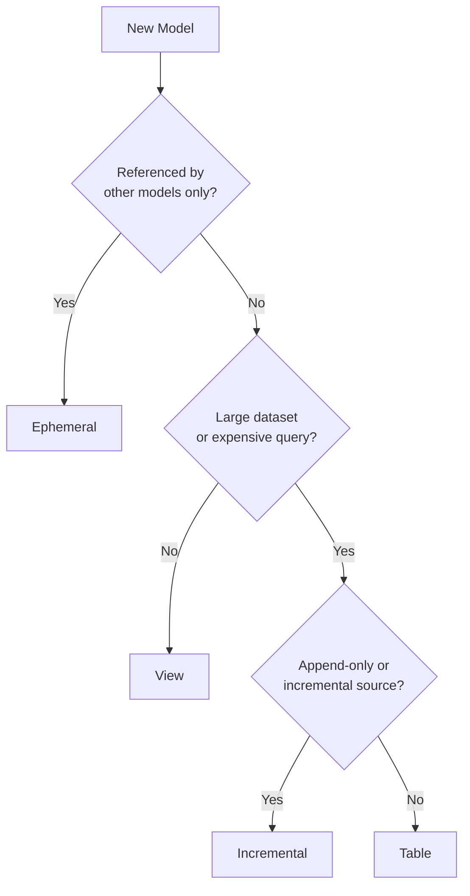
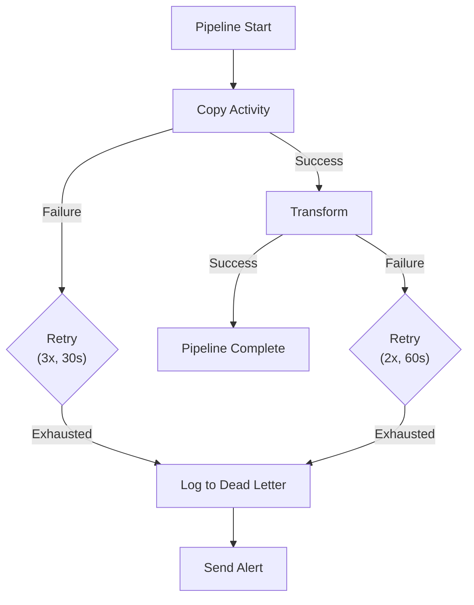
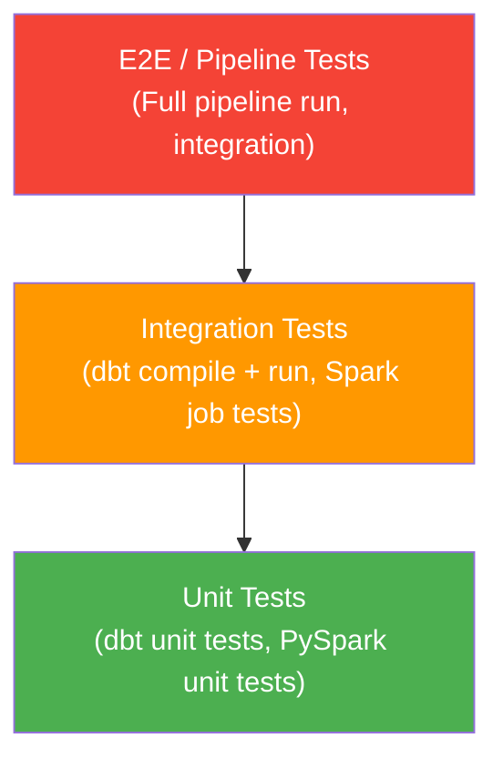

# Data Engineering Best Practices

## Overview

CSA-in-a-Box uses a modern data engineering stack built on three pillars:

| Component                    | Role                      | Key Strength                               |
| ---------------------------- | ------------------------- | ------------------------------------------ |
| **dbt**                      | Transformation layer      | SQL-based modeling, testing, documentation |
| **Azure Data Factory (ADF)** | Orchestration & ingestion | Cloud-native ETL, 90+ connectors           |
| **Apache Spark**             | Large-scale processing    | Distributed compute for big data workloads |

Together these tools implement the [medallion architecture](../architecture/medallion-architecture.md) — ingesting raw data, transforming it through bronze → silver → gold layers, and serving analytics-ready datasets.



---

## dbt Best Practices

### Project Structure

Organize dbt projects by **domain** with a shared layer for cross-cutting models:

```
dbt_project/
├── dbt_project.yml
├── packages.yml
├── macros/
│   ├── generic_tests/
│   │   └── test_not_negative.sql
│   ├── utils/
│   │   └── generate_surrogate_key.sql
│   └── materializations/
├── seeds/
│   ├── dim_country_codes.csv
│   └── schema.yml
├── models/
│   ├── bronze/
│   │   ├── finance/
│   │   │   ├── brz_finance__transactions.sql
│   │   │   └── schema.yml
│   │   └── hr/
│   │       ├── brz_hr__employees.sql
│   │       └── schema.yml
│   ├── silver/
│   │   ├── finance/
│   │   │   ├── slv_finance__transactions_cleansed.sql
│   │   │   └── schema.yml
│   │   └── hr/
│   │       ├── slv_hr__employees_cleansed.sql
│   │       └── schema.yml
│   ├── gold/
│   │   ├── finance/
│   │   │   ├── gld_finance__monthly_revenue.sql
│   │   │   └── schema.yml
│   │   └── shared/
│   │       ├── gld_shared__dim_date.sql
│   │       └── schema.yml
│   └── staging/
│       └── _sources.yml
└── tests/
    └── data_tests/
        └── assert_revenue_positive.sql
```

### Model Naming Conventions

| Layer   | Prefix | Example                              | Materialization  |
| ------- | ------ | ------------------------------------ | ---------------- |
| Bronze  | `brz_` | `brz_finance__transactions`          | Incremental      |
| Silver  | `slv_` | `slv_finance__transactions_cleansed` | Incremental      |
| Gold    | `gld_` | `gld_finance__monthly_revenue`       | Table            |
| Staging | `stg_` | `stg_finance__raw_transactions`      | Ephemeral / View |

!!! info "Double-underscore convention"
Use `{prefix}_{domain}__{entity}` — the double underscore separates the domain from the entity name, making lineage easier to parse.

### Incremental Models

Use incremental models when:

- The source table is large (>1M rows)
- Data arrives in append-only or slowly-changing patterns
- Full refreshes are too expensive or slow

```sql
-- models/silver/finance/slv_finance__transactions_cleansed.sql
{{
    config(
        materialized='incremental',
        unique_key='transaction_id',
        incremental_strategy='merge',
        on_schema_change='sync_all_columns'
    )
}}

with source as (
    select * from {{ ref('brz_finance__transactions') }}
    
        where _loaded_at > (select max(_loaded_at) from {{ this }})
    
),

cleansed as (
    select
        transaction_id,
        customer_id,
        cast(amount as decimal(18, 2)) as amount,
        upper(trim(currency_code)) as currency_code,
        cast(transaction_date as date) as transaction_date,
        current_timestamp() as _transformed_at
    from source
    where transaction_id is not null
      and amount is not null
)

select * from cleansed
```

!!! warning "Incremental pitfalls" - Always define `unique_key` for merge strategies to avoid duplicates. - Test with `dbt run --full-refresh` periodically to ensure correctness. - Late-arriving data can be missed — consider a lookback window:
`sql
      where _loaded_at > dateadd(day, -3, (select max(_loaded_at) from {{ this }}))
      `

### Materialization Decision Tree



| Materialization | Use When                                   | Avoid When                             |
| --------------- | ------------------------------------------ | -------------------------------------- |
| **View**        | Small datasets, real-time freshness needed | Query is expensive or slow             |
| **Table**       | Moderate size, full refresh is acceptable  | Data is append-only and huge           |
| **Incremental** | Large tables with identifiable new rows    | Logic is complex and hard to partition |
| **Ephemeral**   | Intermediate CTEs shared across models     | End users query it directly            |

### Testing

#### Schema Tests

```yaml
# models/silver/finance/schema.yml
version: 2

models:
    - name: slv_finance__transactions_cleansed
      description: "Cleansed financial transactions with validated types"
      columns:
          - name: transaction_id
            description: "Primary key"
            tests:
                - unique
                - not_null
          - name: amount
            tests:
                - not_null
                - dbt_expectations.expect_column_values_to_be_between:
                      min_value: 0
                      max_value: 1000000
          - name: currency_code
            tests:
                - accepted_values:
                      values: ["USD", "EUR", "GBP", "CAD", "AUD"]
```

#### Custom Generic Tests

```sql
-- macros/generic_tests/test_not_negative.sql


select {{ column_name }}
from {{ model }}
where {{ column_name }} < 0


```

#### Freshness Checks

```yaml
# models/staging/_sources.yml
version: 2

sources:
    - name: raw_finance
      database: raw_db
      schema: finance
      freshness:
          warn_after: { count: 12, period: hour }
          error_after: { count: 24, period: hour }
      loaded_at_field: _loaded_at
      tables:
          - name: transactions
          - name: accounts
```

Run freshness checks: `dbt source freshness`

### Documentation

```sql
-- models/gold/finance/gld_finance__monthly_revenue.sql
{{
    config(
        materialized='table',
        description='Monthly revenue aggregation by business unit'
    )
}}
```

```yaml
# models/gold/finance/schema.yml
version: 2

models:
    - name: gld_finance__monthly_revenue
      description: >
          {{ doc("monthly_revenue_description") }}
      columns:
          - name: revenue_month
            description: "First day of the month (date grain)"
          - name: business_unit
            description: "Business unit identifier from the HR domain"
          - name: total_revenue
            description: "Sum of all transaction amounts for the period"
```

```markdown
<!-- models/gold/finance/docs.md -->


Monthly revenue by business unit, sourced from cleansed transactions.
Used by the executive dashboard and finance reporting.

**Owner:** Finance Analytics Team
**SLA:** Refreshed daily by 06:00 UTC

```

### Macros and Packages

```yaml
# packages.yml
packages:
    - package: dbt-labs/dbt_utils
      version: [">=1.0.0", "<2.0.0"]
    - package: calogica/dbt_expectations
      version: [">=0.10.0", "<1.0.0"]
```

Example reusable macro:

```sql
-- macros/utils/cents_to_dollars.sql

    cast({{ column_name }} as decimal(18, 2)) / 100.0


-- Usage in a model:
-- select {{ cents_to_dollars('amount_cents') }} as amount_dollars
```

### Seeds

!!! tip "Seeds: when to use"
**Use for:** Small, static lookup/reference tables (<1,000 rows) — country codes, status enums, currency mappings.
**Don't use for:** Large datasets, frequently changing data, or anything over a few thousand rows.

```csv
-- seeds/dim_country_codes.csv
country_code,country_name,region
US,United States,North America
GB,United Kingdom,Europe
CA,Canada,North America
```

```yaml
# seeds/schema.yml
version: 2

seeds:
    - name: dim_country_codes
      description: "ISO country code lookup"
      config:
          column_types:
              country_code: varchar(3)
              country_name: varchar(100)
              region: varchar(50)
```

---

## ADF Pipeline Best Practices

### Naming Conventions

| Resource       | Pattern                            | Example                            |
| -------------- | ---------------------------------- | ---------------------------------- |
| Pipeline       | `pl_{domain}_{source}_{frequency}` | `pl_finance_sap_daily`             |
| Dataset        | `ds_{format}_{system}_{entity}`    | `ds_parquet_datalake_transactions` |
| Linked Service | `ls_{type}_{environment}`          | `ls_adls_prod`                     |
| Trigger        | `tr_{type}_{schedule}`             | `tr_schedule_daily_0600`           |
| Activity       | `act_{verb}_{entity}`              | `act_copy_transactions`            |
| Data Flow      | `df_{domain}_{purpose}`            | `df_finance_cleanse_transactions`  |

### Parameterized Pipelines

Design pipelines for **multi-environment promotion** — dev → staging → prod without code changes:

```json
{
    "name": "pl_finance_sap_daily",
    "properties": {
        "parameters": {
            "environment": { "type": "string", "defaultValue": "dev" },
            "source_schema": { "type": "string" },
            "sink_container": { "type": "string", "defaultValue": "bronze" },
            "load_date": {
                "type": "string",
                "defaultValue": "@utcnow('yyyy-MM-dd')"
            }
        }
    }
}
```

!!! info "Environment promotion"
Use ARM template parameters or Terraform variables to swap linked service endpoints between environments. Never hard-code connection strings.

### Error Handling



- Set **retry policies** on every activity: `"retry": 3, "retryIntervalInSeconds": 30`
- Use **Upon Failure** dependencies to route to dead-letter and alerting activities
- Log failed records to a dead-letter table/container for reprocessing
- Send alerts via Logic Apps or Azure Monitor Action Groups

### Trigger Types

| Trigger Type        | Use When                                       | Example                  |
| ------------------- | ---------------------------------------------- | ------------------------ |
| **Schedule**        | Fixed cadence (daily, hourly)                  | Daily 6 AM batch load    |
| **Tumbling Window** | Need backfill, exactly-once, dependency chains | Hourly partitioned loads |
| **Event-based**     | React to file arrival (Blob/ADLS)              | Process file on landing  |

!!! tip "Prefer tumbling window over schedule"
Tumbling window triggers support **backfill**, **concurrency control**, and **dependency chaining** — schedule triggers do not.

### Do / Don't

| ✅ Do                                                | ❌ Don't                                    |
| ---------------------------------------------------- | ------------------------------------------- |
| Use Managed Identity for linked services             | Use connection strings or keys              |
| Parameterize environment-specific values             | Hard-code server names or paths             |
| Set retry and timeout on every activity              | Leave default (no retry) settings           |
| Use tumbling window for partitioned loads            | Use schedule when you need backfill         |
| Monitor with Azure Monitor alerts                    | Rely on manual pipeline run checks          |
| Version control ARM templates / Terraform            | Make changes only through the portal        |
| Use metadata-driven frameworks for similar pipelines | Copy-paste pipelines with minor differences |
| Log pipeline metrics to Log Analytics                | Ignore execution statistics                 |

---

## Spark Optimization

### Cluster Sizing

!!! tip "Right-size your clusters" - Start small, scale up based on metrics — don't over-provision. - Use **auto-scaling** with min/max workers defined. - Match worker VM size to workload: memory-optimized for joins, compute-optimized for transformations.

```python
# Databricks cluster config example
{
    "autoscale": {
        "min_workers": 2,
        "max_workers": 8
    },
    "spark_conf": {
        "spark.sql.shuffle.partitions": "200",
        "spark.sql.adaptive.enabled": "true",
        "spark.sql.adaptive.coalescePartitions.enabled": "true"
    }
}
```

### Partition Management

```python
# ✅ GOOD — reduce partitions for writing small outputs
df_small = df.coalesce(4)  # Avoids shuffle, just merges partitions
df_small.write.parquet("/output/small_table")

# ✅ GOOD — repartition by key for downstream joins
df_partitioned = df.repartition(200, "customer_id")

# ❌ BAD — repartition when coalesce would suffice
df_small = df.repartition(4)  # Unnecessary full shuffle
```

| Operation             | Shuffle? | Use When                                |
| --------------------- | -------- | --------------------------------------- |
| `coalesce(n)`         | No       | Reducing partitions (writing output)    |
| `repartition(n)`      | Yes      | Even distribution needed (before joins) |
| `repartition(n, col)` | Yes      | Partition by key for co-located joins   |

### Broadcast Joins

```python
from pyspark.sql.functions import broadcast

# ✅ GOOD — small dimension table broadcast to all workers
result = large_fact_df.join(
    broadcast(small_dim_df),
    on="dim_key",
    how="left"
)

# Rule of thumb: broadcast tables < 100MB
# Check with: spark.conf.set("spark.sql.autoBroadcastJoinThreshold", 100 * 1024 * 1024)
```

### Caching Strategies

```python
from pyspark import StorageLevel

# ✅ cache() — keep in memory (default MEMORY_AND_DISK)
df_reused = df.filter(df.status == "active").cache()
df_reused.count()  # Materialize the cache
# ... use df_reused multiple times ...
df_reused.unpersist()  # Release when done

# ✅ persist() — control storage level
df_large = df.persist(StorageLevel.DISK_ONLY)  # When memory is constrained
```

!!! warning "Cache management" - Always call `.unpersist()` when done — leaked caches waste cluster memory. - Only cache DataFrames used **multiple times** in the same job. - Don't cache DataFrames that are only read once.

### Avoiding Shuffles

```python
# ✅ Salting to fix data skew
from pyspark.sql.functions import lit, rand, ceil, col, explode, array

SALT_BUCKETS = 10

# Salt the skewed key
skewed_df = skewed_df.withColumn("salt", ceil(rand() * SALT_BUCKETS).cast("int"))

# Explode the small table to match all salt values
small_df = small_df.withColumn(
    "salt", explode(array([lit(i) for i in range(1, SALT_BUCKETS + 1)]))
)

result = skewed_df.join(small_df, on=["join_key", "salt"], how="inner").drop("salt")
```

```python
# ✅ Bucketing for repeated joins on the same key
df.write.bucketBy(256, "customer_id").sortBy("customer_id").saveAsTable("bucketed_customers")
```

### UDF Anti-Patterns

| ✅ Do                                  | ❌ Don't                                  |
| -------------------------------------- | ----------------------------------------- |
| `F.upper(col("name"))`                 | `udf(lambda x: x.upper())`                |
| `F.when(cond, val).otherwise(other)`   | `udf(lambda x: val if cond else other)`   |
| `F.regexp_replace(col, pattern, repl)` | `udf(lambda x: re.sub(pattern, repl, x))` |
| `F.from_json(col, schema)`             | `udf(lambda x: json.loads(x))`            |

```python
# ❌ BAD — Python UDF (serialization overhead, no Catalyst optimization)
from pyspark.sql.functions import udf
from pyspark.sql.types import StringType

@udf(returnType=StringType())
def clean_name(name):
    return name.strip().upper() if name else None

df = df.withColumn("clean_name", clean_name(df.name))

# ✅ GOOD — built-in functions (runs in JVM, Catalyst-optimized)
from pyspark.sql import functions as F

df = df.withColumn("clean_name", F.upper(F.trim(F.col("name"))))
```

---

## Data Contracts

### What Are Data Contracts?

A **data contract** is a formal agreement between a data producer and its consumers that defines the schema, quality guarantees, SLAs, and ownership of a dataset. They prevent breaking changes from silently propagating downstream.

### Contract YAML Structure

```yaml
# contracts/finance/transactions.yml
contract:
    name: finance_transactions
    version: "2.1"
    owner: finance-data-team
    contact: finance-data@company.com

    description: >
        Cleansed financial transactions from SAP.
        Updated daily by 06:00 UTC.

    sla:
        freshness: "24 hours"
        availability: "99.5%"
        update_frequency: "daily"

    schema:
        - name: transaction_id
          type: string
          required: true
          primary_key: true
          description: "Unique transaction identifier"

        - name: amount
          type: decimal(18,2)
          required: true
          constraints:
              - type: range
                min: 0
                max: 10000000

        - name: currency_code
          type: string
          required: true
          constraints:
              - type: enum
                values: [USD, EUR, GBP, CAD, AUD]

        - name: transaction_date
          type: date
          required: true
          constraints:
              - type: not_future

    tests:
        - unique: [transaction_id]
        - not_null: [transaction_id, amount, currency_code, transaction_date]
        - row_count_min: 1000
        - freshness:
              column: _loaded_at
              warn_after: 12h
              error_after: 24h
```

### Enforcement via dbt

Generate dbt schema tests from contract definitions:

```yaml
# Generated from contract: contracts/finance/transactions.yml
# models/silver/finance/schema.yml
version: 2

models:
    - name: slv_finance__transactions_cleansed
      description: "Cleansed financial transactions — contract v2.1"
      config:
          contract:
              enforced: true
      columns:
          - name: transaction_id
            data_type: varchar
            constraints:
                - type: not_null
                - type: primary_key
            tests:
                - unique
                - not_null
          - name: amount
            data_type: decimal(18,2)
            constraints:
                - type: not_null
            tests:
                - not_null
                - dbt_expectations.expect_column_values_to_be_between:
                      min_value: 0
                      max_value: 10000000
          - name: currency_code
            data_type: varchar
            constraints:
                - type: not_null
            tests:
                - accepted_values:
                      values: ["USD", "EUR", "GBP", "CAD", "AUD"]
```

### Breaking Change Management

| Change Type         | Breaking? | Action Required                                          |
| ------------------- | --------- | -------------------------------------------------------- |
| Add nullable column | No        | Update contract version (minor)                          |
| Remove column       | **Yes**   | Deprecation notice → 2 sprint grace period → remove      |
| Change data type    | **Yes**   | New contract version (major), notify consumers           |
| Tighten constraint  | **Yes**   | Communicate and validate downstream impact               |
| Loosen constraint   | No        | Update contract version (minor)                          |
| Rename column       | **Yes**   | Add alias, deprecate old name, remove after grace period |

---

## Testing Strategy

### Testing Pyramid



### dbt Unit Tests

```yaml
# models/silver/finance/schema.yml
unit_tests:
    - name: test_cents_conversion
      model: slv_finance__transactions_cleansed
      given:
          - input: ref('brz_finance__transactions')
            rows:
                - {
                      transaction_id: "T001",
                      amount: 1500,
                      currency_code: "usd",
                      transaction_date: "2024-01-15",
                  }
                - {
                      transaction_id: "T002",
                      amount: null,
                      currency_code: "EUR",
                      transaction_date: "2024-01-15",
                  }
      expect:
          rows:
              - {
                    transaction_id: "T001",
                    amount: 1500.00,
                    currency_code: "USD",
                }
          # T002 excluded due to null amount filter
```

### Data Quality with dbt-expectations

```yaml
models:
    - name: gld_finance__monthly_revenue
      tests:
          - dbt_expectations.expect_table_row_count_to_be_between:
                min_value: 1
                max_value: 1000000
          - dbt_expectations.expect_column_values_to_match_regex:
                column_name: business_unit
                regex: "^BU-[A-Z]{3,5}$"
          - dbt_expectations.expect_column_pair_values_A_to_be_greater_than_B:
                column_A: total_revenue
                column_B: total_cost
                or_equal: true
```

### CI Pipeline Testing

```yaml
# .azure-pipelines/dbt-ci.yml
stages:
    - stage: dbt_test
      jobs:
          - job: lint_and_test
            steps:
                - script: |
                      pip install dbt-core dbt-sqlserver
                      dbt deps
                      dbt compile --target ci
                      dbt test --target ci --select state:modified+
                  displayName: "dbt compile and test modified models"

                - script: |
                      dbt source freshness --target ci
                  displayName: "Check source freshness"
```

!!! tip "Slim CI"
Use `state:modified+` to only test models that changed in the PR, plus their downstream dependents. This keeps CI fast.

---

## Anti-Patterns

!!! danger "Never SELECT _ in production models"
Always explicitly list columns. `SELECT _` breaks data contracts when upstream schemas change and hides column-level lineage.

    ```sql
    -- ❌ BAD
    select * from {{ ref('brz_finance__transactions') }}

    -- ✅ GOOD
    select transaction_id, amount, currency_code, transaction_date
    from {{ ref('brz_finance__transactions') }}
    ```

!!! danger "Never skip testing in CI"
Every PR that modifies a dbt model must run `dbt test` on modified models and their dependents. Untested changes will eventually cause silent data corruption.

!!! danger "Never hard-code environment values in ADF"
Hard-coded server names, storage accounts, or paths make promotion impossible and cause production incidents when dev resources are referenced.

!!! danger "Never use Python UDFs for simple transformations in Spark"
Python UDFs serialize data from JVM → Python → JVM, adding 10-100x overhead. Use built-in Spark SQL functions for any operation that has a native equivalent.

!!! danger "Never ignore data skew in Spark joins"
A single skewed key can cause one task to process 90% of the data while others sit idle. Monitor stage metrics and apply salting or broadcast joins when skew is detected.

!!! danger "Never deploy dbt models without freshness checks on sources"
Without freshness monitoring, stale source data flows silently through the pipeline, producing outdated reports that stakeholders trust as current.

---

## Checklist: Data Engineering Readiness

- [ ] dbt project follows `brz_/slv_/gld_` naming conventions
- [ ] All models have schema tests (unique, not_null at minimum)
- [ ] Incremental models define `unique_key` and handle late-arriving data
- [ ] Source freshness checks are configured and monitored
- [ ] Data contracts exist for all gold-layer models
- [ ] ADF pipelines are parameterized for multi-environment promotion
- [ ] ADF linked services use Managed Identity
- [ ] ADF activities have retry policies and failure alerting
- [ ] Spark jobs use built-in functions instead of Python UDFs
- [ ] Spark cluster auto-scaling is configured with appropriate min/max
- [ ] CI pipeline runs `dbt test --select state:modified+` on PRs
- [ ] Documentation exists for all gold-layer models (`doc()` blocks)
- [ ] Breaking changes follow deprecation process (2-sprint grace period)

---

## Cross-References

- [Medallion Architecture](../architecture/medallion-architecture.md) — Bronze/Silver/Gold layer design
- [Data Governance](../governance/data-governance.md) — Classification, access control, lineage
- [Monitoring & Observability](../operations/monitoring.md) — Pipeline alerting, data quality dashboards
- [Security Best Practices](./security.md) — Managed Identity, key vault integration
