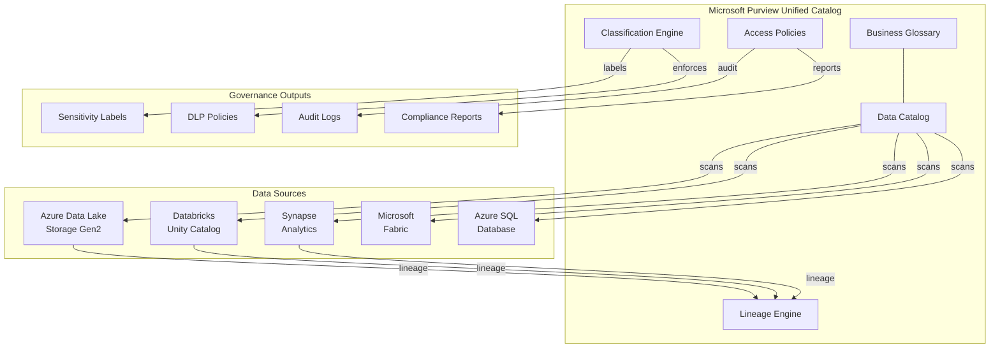
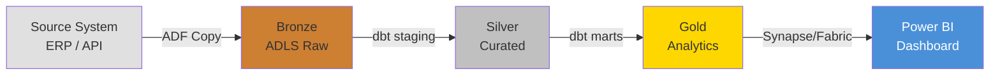

# Data Governance Best Practices

## Overview

Data governance is an **enabler**, not a blocker. When implemented correctly, governance accelerates
data consumption by making data discoverable, trustworthy, and self-service — while ensuring
compliance with organizational and regulatory requirements.

CSA-in-a-Box uses **Microsoft Purview** as the unified governance hub, providing a single pane of
glass for cataloging, lineage, classification, and access policies across the entire data estate.

!!! tip "Governance Philosophy"
The best governance is invisible to data consumers. They find data quickly, understand its
meaning, trust its quality, and access it without filing tickets. Governance works _behind_
the scenes to make this possible.

## Architecture Overview



---

## Microsoft Purview Setup

### Account Creation and Configuration

!!! info "Prerequisites"
Purview requires a Microsoft Entra ID tenant with at least a Contributor role on the
target subscription. For GCC/GCC-High environments, verify Purview availability in your
sovereign cloud region.

1. **Deploy the Purview account** via Bicep (see `infra/modules/purview.bicep`).
2. **Configure managed identity** — grant the Purview MSI `Storage Blob Data Reader` on all
   ADLS accounts and `db_datareader` on SQL databases.
3. **Set up collections** — organize by domain (see [Data Cataloging](#data-cataloging) below).
4. **Enable diagnostic logging** to Log Analytics workspace.

### Data Source Registration

Register each data source so Purview can scan and catalog assets.

```python
# Register an ADLS Gen2 source via Purview REST API
import requests

def register_adls_source(
    purview_account: str,
    collection_name: str,
    source_name: str,
    adls_endpoint: str,
    credential: str,
):
    """Register an ADLS Gen2 data source in Purview."""
    url = (
        f"https://{purview_account}.purview.azure.com"
        f"/scan/datasources/{source_name}?api-version=2022-07-01-preview"
    )
    payload = {
        "kind": "AdlsGen2",
        "properties": {
            "endpoint": adls_endpoint,
            "collection": {"referenceName": collection_name},
        },
    }
    headers = {
        "Authorization": f"Bearer {credential}",
        "Content-Type": "application/json",
    }
    response = requests.put(url, json=payload, headers=headers)
    response.raise_for_status()
    return response.json()
```

**Sources to register:**

| Source Type              | Registration Method            | Notes                            |
| ------------------------ | ------------------------------ | -------------------------------- |
| ADLS Gen2                | Purview UI or REST API         | Use managed identity auth        |
| Databricks Unity Catalog | Native connector               | Requires access connector        |
| Azure SQL Database       | Purview UI or REST API         | Use managed identity or SQL auth |
| Synapse Analytics        | Auto-registered if same tenant | Verify lineage integration       |
| Microsoft Fabric         | Native integration             | OneLake auto-discovery           |

### Scan Scheduling and Classification Rules

- **Full scans**: Weekly on Sunday at 02:00 UTC.
- **Incremental scans**: Daily at 06:00 UTC.
- **Classification rules**: Enable all built-in system classifiers, then add custom rules (see
  [Sensitivity Classification](#sensitivity-classification)).

### Custom Classifications for Domain-Specific Data

```json
{
    "name": "CUI_Marking",
    "description": "Controlled Unclassified Information marking",
    "classificationRuleType": "Custom",
    "pattern": {
        "kind": "Regex",
        "pattern": "\\b(CUI|CONTROLLED UNCLASSIFIED)\\b"
    },
    "minimumPercentageMatch": 5.0
}
```

---

## Data Cataloging

!!! abstract "Cross-Reference"
For detailed cataloging procedures, see [Data Cataloging](../governance/DATA_CATALOGING.md).

### Naming Standards for Assets

| Layer              | Pattern                       | Example                           |
| ------------------ | ----------------------------- | --------------------------------- |
| Raw / Bronze       | `raw_{source}_{entity}`       | `raw_erp_purchase_orders`         |
| Curated / Silver   | `curated_{domain}_{entity}`   | `curated_finance_invoices`        |
| Consumption / Gold | `analytics_{domain}_{entity}` | `analytics_finance_spend_summary` |
| Feature Store      | `feature_{domain}_{feature}`  | `feature_customer_churn_score`    |

### Business Glossary Terms

Maintain a **living glossary** in Purview. Each term must include:

- **Definition** — plain-language explanation.
- **Steward** — domain owner responsible for the term.
- **Related assets** — linked catalog assets.
- **Approved synonyms** — alternate names consumers may search.

!!! warning "Glossary Drift"
Review glossary terms quarterly. Stale or conflicting definitions erode trust faster than
missing definitions.

### Collection Hierarchy

Organize collections by **business domain**, not by technology:

```
Root Collection
├── Finance
│   ├── Accounts Payable
│   └── General Ledger
├── Human Resources
│   ├── Compensation
│   └── Talent Acquisition
├── Operations
│   ├── Supply Chain
│   └── Logistics
└── Shared
    ├── Reference Data
    └── Master Data
```

### Tagging Strategy

Apply tags consistently using this taxonomy:

| Tag Category   | Examples                           | Purpose                   |
| -------------- | ---------------------------------- | ------------------------- |
| `data-layer`   | `bronze`, `silver`, `gold`         | Identify processing stage |
| `domain`       | `finance`, `hr`, `ops`             | Business ownership        |
| `freshness`    | `real-time`, `daily`, `weekly`     | SLA expectations          |
| `pii`          | `contains-pii`, `pii-free`         | Quick sensitivity filter  |
| `quality-tier` | `validated`, `raw`, `experimental` | Trust level               |

---

## Data Lineage

!!! abstract "Cross-Reference"
For detailed lineage implementation, see [Data Lineage](../governance/DATA_LINEAGE.md).

### ADF Lineage (Automatic)

Azure Data Factory pipelines automatically emit lineage to Purview when connected. Ensure:

- [x] ADF managed identity has `Purview Data Curator` role.
- [x] Purview account is linked in ADF → Manage → Purview.
- [x] Copy activities, Data Flows, and Mapping Data Flows all emit lineage.

### dbt Lineage → Purview Integration

Use the `dbt-purview` integration to push dbt model lineage into Purview:

```yaml
# dbt_project.yml — lineage metadata
models:
    csa_inabox:
        staging:
            +meta:
                purview_collection: "Finance"
                purview_classification: "Internal"
        marts:
            +meta:
                purview_collection: "Finance"
                purview_classification: "Confidential"
```

### Spark Lineage with OpenLineage

For Databricks notebooks and Spark jobs, integrate OpenLineage:

```python
# spark-defaults.conf or cluster init script
spark.extraListeners=io.openlineage.spark.agent.OpenLineageSparkListener
spark.openlineage.transport.type=http
spark.openlineage.transport.url=https://<purview-account>.purview.azure.com
spark.openlineage.namespace=databricks-prod
```

### End-to-End Lineage Visualization



---

## Sensitivity Classification

### Built-in Classifiers

Purview includes 200+ system classifiers. Enable at minimum:

| Classifier                  | Category       | Priority |
| --------------------------- | -------------- | -------- |
| Social Security Number (US) | PII            | Critical |
| Credit Card Number          | PCI            | Critical |
| Email Address               | PII            | High     |
| Phone Number                | PII            | High     |
| Passport Number             | PII            | High     |
| Bank Account Number         | Financial      | High     |
| IP Address                  | Infrastructure | Medium   |

### Custom Classifiers for Government Data

!!! danger "Government-Specific Requirements"
Federal and state agencies must classify CUI, FOUO, and other controlled markings.
Failure to detect and protect these markings is a compliance violation.

| Custom Classifier | Pattern                                  | Use Case                            |
| ----------------- | ---------------------------------------- | ----------------------------------- |
| `CUI_Marking`     | `\b(CUI\|CONTROLLED UNCLASSIFIED)\b`     | Controlled Unclassified Information |
| `FOUO_Marking`    | `\bFOR OFFICIAL USE ONLY\b`              | For Official Use Only               |
| `LES_Marking`     | `\bLAW ENFORCEMENT SENSITIVE\b`          | Law Enforcement Sensitive           |
| `ITAR_Marking`    | `\bITAR\b.*\b(CONTROLLED\|RESTRICTED)\b` | Export-controlled data              |

### Sensitivity Labels and Auto-Labeling

Configure auto-labeling policies to apply sensitivity labels based on classification results:

1. **Public** — No restrictions, open data.
2. **Internal** — Organization-wide access, no external sharing.
3. **Confidential** — Restricted to specific domains/teams.
4. **Highly Confidential** — Need-to-know basis, encryption required.

!!! tip "Auto-Labeling Thresholds"
Set auto-labeling confidence to ≥85% for `Confidential` and ≥95% for `Highly Confidential`.
Lower thresholds generate noise; higher thresholds miss detections.

### DLP Policy Integration

Connect classification results to Microsoft Purview DLP policies to prevent exfiltration:

- Block external sharing of `Highly Confidential` assets.
- Warn on download of `Confidential` data to unmanaged devices.
- Log all access to `CUI`-classified assets.

---

## Data Contracts and Domain Ownership

### Contract Structure

Every Gold-layer dataset must have a data contract:

```yaml
# data_contracts/finance/spend_summary.yml
contract:
    name: analytics_finance_spend_summary
    version: "2.1"
    owner:
        domain: Finance
        steward: jane.doe@org.gov
        team: financial-analytics
    schema:
        format: delta
        columns:
            - name: fiscal_year
              type: int
              nullable: false
              description: Federal fiscal year (e.g., 2025)
            - name: agency_code
              type: string
              nullable: false
              description: Two-letter agency identifier
            - name: total_spend
              type: decimal(18,2)
              nullable: false
              description: Total obligated amount in USD
    sla:
        freshness: daily
        latency_max_minutes: 120
        availability: 99.5%
    quality:
        completeness: ">= 99%"
        uniqueness: "fiscal_year + agency_code is unique"
        validity: "total_spend >= 0"
    classification: Confidential
```

### Domain Steward Responsibilities

| Responsibility                  | Frequency              | Deliverable                  |
| ------------------------------- | ---------------------- | ---------------------------- |
| Review data quality metrics     | Weekly                 | Quality dashboard sign-off   |
| Approve access requests         | Within 2 business days | Access grant/deny in Purview |
| Update glossary terms           | Quarterly              | Reviewed glossary entries    |
| Validate data contracts         | Per release            | Contract version bump        |
| Incident triage for domain data | As needed              | Root cause analysis          |

### Data Mesh Domain Boundaries

!!! abstract "Cross-Reference"
See [ADR-0012: Data Mesh Federation](../adr/0012-data-mesh-federation.md) for the
architectural decision record on domain boundaries and federated governance.

Each domain owns its data products end-to-end (ingestion → quality → serving) while
adhering to platform-wide governance standards set by the central governance team.

---

## Access Policies

!!! abstract "Cross-Reference"
For detailed access patterns, see [Data Access](../governance/DATA_ACCESS.md).

### Role-Based Access via Purview Policies

Use Purview DevOps policies and data-plane policies to manage access declaratively:

| Role               | Access Level                  | Scope                 |
| ------------------ | ----------------------------- | --------------------- |
| Data Reader        | Read-only to Gold layer       | Per-domain collection |
| Data Contributor   | Read/write to Silver + Gold   | Per-domain collection |
| Data Engineer      | Full access to Bronze → Gold  | Platform-wide         |
| Data Steward       | Catalog + glossary management | Per-domain collection |
| Compliance Officer | Audit + classification review | Platform-wide         |

### Row-Level Security Patterns

```sql
-- Row-level security in Synapse / SQL
CREATE FUNCTION dbo.fn_agency_filter(@agency_code NVARCHAR(2))
RETURNS TABLE
WITH SCHEMABINDING
AS
    RETURN SELECT 1 AS result
    WHERE @agency_code = SESSION_CONTEXT(N'user_agency')
       OR IS_MEMBER('db_owner') = 1;

CREATE SECURITY POLICY AgencyFilter
    ADD FILTER PREDICATE dbo.fn_agency_filter(agency_code)
    ON dbo.spend_summary
    WITH (STATE = ON);
```

### Column-Level Masking

```sql
-- Dynamic data masking for sensitive columns
ALTER TABLE dbo.employee_records
ALTER COLUMN ssn ADD MASKED WITH (FUNCTION = 'partial(0,"XXX-XX-",4)');

ALTER TABLE dbo.employee_records
ALTER COLUMN salary ADD MASKED WITH (FUNCTION = 'default()');
```

### Self-Service Access Requests

Enable self-service access through Purview:

1. Consumer discovers dataset in catalog.
2. Consumer requests access via Purview portal.
3. Domain steward receives notification and reviews request.
4. Approved access is provisioned automatically via Entra ID groups.
5. Access is time-bound (default: 90 days) with renewal workflow.

---

## Compliance Integration

### Purview + Defender for Cloud

Integrate Purview findings with Microsoft Defender for Cloud to create a unified security posture:

- **Data-aware security posture** — Defender surfaces Purview-classified assets with
  misconfigurations (e.g., `Highly Confidential` data in a storage account without encryption).
- **Attack path analysis** — Includes sensitive data stores in attack path visualization.
- **Alert correlation** — Suspicious access to classified data triggers Defender alerts.

### Audit Logging

| Log Source            | Destination   | Retention |
| --------------------- | ------------- | --------- |
| Purview audit logs    | Log Analytics | 2 years   |
| ADLS access logs      | Log Analytics | 1 year    |
| Databricks audit logs | Log Analytics | 1 year    |
| SQL audit logs        | Log Analytics | 1 year    |
| Entra ID sign-in logs | Log Analytics | 2 years   |

```kusto
// KQL: Query Purview audit events for sensitive data access
PurviewAuditLogs
| where TimeGenerated > ago(7d)
| where OperationName == "DataAccess"
| where Classification contains "Highly Confidential"
| summarize AccessCount = count() by UserPrincipalName, AssetName
| order by AccessCount desc
```

### Retention Policies

!!! abstract "Cross-Reference"
See the compliance mappings in `docs/compliance/` for framework-specific retention
requirements (FedRAMP, NIST 800-53, StateRAMP).

| Data Layer       | Default Retention | Override Authority |
| ---------------- | ----------------- | ------------------ |
| Bronze (raw)     | 7 years           | Compliance Officer |
| Silver (curated) | 5 years           | Domain Steward     |
| Gold (analytics) | 3 years           | Domain Steward     |
| Audit logs       | 2 years           | Compliance Officer |
| Temp / scratch   | 30 days           | Automated cleanup  |

---

## Anti-Patterns

!!! failure "Common Anti-Patterns to Avoid"

    **1. Governance Theater** — Creating extensive policies that nobody follows. Start small,
    enforce consistently, and expand incrementally.

    **2. Central Bottleneck** — Routing all data access through a single governance team.
    Use federated domain stewards instead.

    **3. Scan-and-Forget** — Running Purview scans but never acting on classification findings.
    Wire scan results to alerts and policies.

    **4. Schema-on-Read Everywhere** — Skipping schemas in Bronze "because it's raw." At minimum,
    define expected file formats and partitioning in Bronze.

    **5. Manual Lineage** — Maintaining lineage in spreadsheets. Use automated lineage
    (ADF, OpenLineage, dbt) and validate it is flowing into Purview.

### Do / Don't Table

| Do                                                     | Don't                                                      |
| ------------------------------------------------------ | ---------------------------------------------------------- |
| Use Purview as the single catalog for all data assets  | Maintain separate catalogs per team or technology          |
| Automate classification scans on a schedule            | Rely on manual classification by data engineers            |
| Define data contracts for all Gold-layer datasets      | Publish datasets without schema or SLA commitments         |
| Assign domain stewards with clear responsibilities     | Leave data ownership undefined or with "the platform team" |
| Time-bound access grants with automatic expiry         | Grant permanent access and never review                    |
| Integrate lineage from all pipeline tools              | Accept gaps in lineage ("we'll fix it later")              |
| Review glossary terms quarterly                        | Let glossary become a dumping ground of stale terms        |
| Use sensitivity labels with auto-labeling              | Classify data only when an auditor asks                    |
| Wire classification findings to DLP policies           | Treat classification as informational-only                 |
| Store data contracts as code in version control        | Define contracts in wikis or email threads                 |
| Implement row/column-level security for sensitive data | Rely solely on network-level access controls               |
| Log and monitor all access to classified data          | Assume internal users are always trusted                   |

---

## Governance Maturity Checklist

Use this checklist to assess and track your governance maturity:

- [ ] Purview account deployed and configured
- [ ] All data sources registered and scanning on schedule
- [ ] Business glossary has ≥ 80% coverage of Gold-layer terms
- [ ] Collection hierarchy reflects business domains
- [ ] Custom classifiers deployed for domain-specific data
- [ ] Sensitivity labels applied with auto-labeling policies
- [ ] Data contracts defined for all Gold-layer datasets
- [ ] Domain stewards assigned for every collection
- [ ] Self-service access request workflow operational
- [ ] Lineage flowing from ADF, dbt, and Spark into Purview
- [ ] Audit logs shipping to Log Analytics with ≥ 1-year retention
- [ ] DLP policies enforcing classification-based controls
- [ ] Quarterly glossary and access review process in place
- [ ] Compliance mapping validated against target framework

---

## Cross-References

| Resource                                                              | Description                                              |
| --------------------------------------------------------------------- | -------------------------------------------------------- |
| [Data Cataloging](../governance/DATA_CATALOGING.md)                   | Detailed cataloging procedures and Purview configuration |
| [Data Lineage](../governance/DATA_LINEAGE.md)                         | Lineage implementation across ADF, dbt, and Spark        |
| [Data Access](../governance/DATA_ACCESS.md)                           | Access control patterns and policy enforcement           |
| [Data Quality](../governance/DATA_QUALITY.md)                         | Quality rules, monitoring, and alerting                  |
| [Purview Setup](../governance/PURVIEW_SETUP.md)                       | Step-by-step Purview deployment guide                    |
| [Metadata Management](../governance/METADATA_MANAGEMENT.md)           | Technical and business metadata standards                |
| [ADR-0012: Data Mesh Federation](../adr/0012-data-mesh-federation.md) | Domain boundary decisions                                |
| [Compliance Mappings](../compliance/)                                 | FedRAMP, NIST 800-53, StateRAMP control mappings         |
