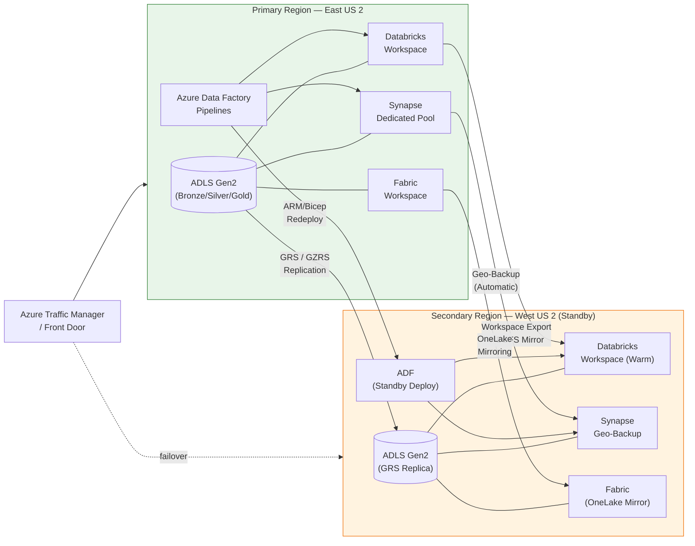

# Disaster Recovery Best Practices

## Overview

Disaster recovery (DR) for analytics platforms goes far beyond "turn on GRS." A resilient CSA-in-a-Box deployment must protect **data, compute, metadata, and orchestration** — and prove that protection works through regular drills.

!!! tip "Related Guides"
| Guide | Purpose |
|-------|---------|
| [DR Architecture](../DR.md) | Platform-level DR design and Azure service capabilities |
| [Multi-Region Deployment](../MULTI_REGION.md) | Active-active and active-passive region patterns |
| [DR Drill Runbook](../runbooks/dr-drill.md) | Step-by-step drill execution playbook |
| [Rollback Procedures](../ROLLBACK.md) | Service-level rollback and recovery steps |

---

## Multi-Region Architecture

The reference architecture uses an **active-passive** pattern with automated failover for Tier 1 workloads.



---

## RTO / RPO Planning

### Tier Definitions

| Tier                | RPO        | RTO        | Workload Examples                                               | Replication Strategy                                   | Cost |
| ------------------- | ---------- | ---------- | --------------------------------------------------------------- | ------------------------------------------------------ | ---- |
| **Tier 1 — Gold**   | < 1 hour   | < 4 hours  | Gold analytics, executive dashboards, regulatory reports        | GRS + near-real-time Delta clone + hot standby compute | $$$  |
| **Tier 2 — Silver** | < 4 hours  | < 8 hours  | Silver curated datasets, ML feature stores, operational reports | GRS + scheduled Delta clone (hourly) + warm standby    | $$   |
| **Tier 3 — Bronze** | < 24 hours | < 24 hours | Bronze raw ingestion, staging, dev/test environments            | GRS only — data is rebuildable from sources            | $    |

### Cost vs Recovery Speed

```
Recovery Speed  ◄──────────────────────────────────────► Cost
      Fast                                              High
        │  Hot standby + sync replication (Tier 1)        │
        │  Warm standby + scheduled replication (Tier 2)  │
        │  Cold rebuild from GRS + IaC (Tier 3)           │
      Slow                                              Low
```

!!! info "Business Impact Analysis Template"
For each workload, document:

    1. **Business process** it supports
    2. **Revenue impact** per hour of downtime (quantified)
    3. **Regulatory/compliance** requirements (e.g., data availability SLAs)
    4. **Upstream/downstream dependencies** — what breaks if this is unavailable?
    5. **Acceptable data loss** window (drives RPO)
    6. **Acceptable downtime** window (drives RTO)
    7. **Assigned tier** based on answers above

---

## Data Replication

### ADLS Gen2

| Method                              | RPO                | Cost           | Complexity | Notes                                                      |
| ----------------------------------- | ------------------ | -------------- | ---------- | ---------------------------------------------------------- |
| **GRS** (Geo-Redundant Storage)     | ~15 min (async)    | Low — built-in | Low        | Default for most workloads; Microsoft-managed              |
| **GZRS** (Geo-Zone-Redundant)       | ~15 min (async)    | Medium         | Low        | Adds zone redundancy in primary region                     |
| **Cross-region AzCopy** (scheduled) | Schedule-dependent | Medium         | Medium     | Full control over timing; useful for selective replication |
| **Storage Object Replication**      | Near-real-time     | Low            | Low        | Policy-based, container-level replication rules            |

### Delta Lake

Use **deep clone** for point-in-time copies of critical tables:

```sql
-- Full deep clone for DR (creates independent copy)
CREATE TABLE gold_dr.sales_summary
DEEP CLONE gold.sales_summary
LOCATION 'abfss://dr-container@secondary.dfs.core.windows.net/gold/sales_summary';

-- Incremental deep clone (subsequent runs copy only changes)
CREATE OR REPLACE TABLE gold_dr.sales_summary
DEEP CLONE gold.sales_summary;
```

!!! note
**Deep clone** copies data files. **Shallow clone** only copies metadata and references source files — not suitable for cross-region DR since the source files would be unavailable during an outage.

### Databricks

- **Workspace configuration**: Export via Databricks CLI or Terraform and store in Git
- **DBFS content**: Mirror critical DBFS paths to secondary region ADLS using AzCopy or ADF copy activities
- **Unity Catalog metastore**: Replicate catalog metadata via API export; storage locations should point to GRS-replicated ADLS
- **Secrets**: Back up to Key Vault (which has its own DR — see below)

### Synapse Analytics

- **Dedicated SQL pools**: Automatic geo-backup every ~8 hours; restore to secondary region via Portal/PowerShell
- **User-defined restore points**: Create before major changes — retained for 7 days
- **Serverless SQL**: Stateless — just redeploy with IaC; data is in ADLS (already replicated)

### Fabric

- **OneLake mirroring**: Configure cross-region mirroring for lakehouses
- **Workspace recovery**: Export workspace metadata; rely on OneLake replication for data
- **Semantic models**: Back up `.bim` files to version control

### Replication Comparison

| Service    | Method                         | RPO             | Cost Impact | Complexity |
| ---------- | ------------------------------ | --------------- | ----------- | ---------- |
| ADLS Gen2  | GRS / GZRS                     | ~15 min         | Low         | Low        |
| Delta Lake | Deep clone (scheduled)         | 1–4 hours       | Medium      | Medium     |
| Databricks | Workspace export + DBFS mirror | 4–24 hours      | Medium      | High       |
| Synapse    | Geo-backup (automatic)         | ~8 hours        | Included    | Low        |
| Fabric     | OneLake mirroring              | Near-real-time  | Included    | Low        |
| ADF        | Bicep redeploy                 | N/A (stateless) | None        | Low        |

---

## Compute Recovery

### Databricks

Re-provision the workspace from IaC — **never** rely on manual portal recreation.

```bicep
// databricks-workspace.bicep — deploy to secondary region
param location string = 'westus2'
param workspaceName string = 'dbx-csa-dr'

resource workspace 'Microsoft.Databricks/workspaces@2023-02-01' = {
  name: workspaceName
  location: location
  sku: { name: 'premium' }
  properties: {
    managedResourceGroupId: subscriptionResourceId(
      'Microsoft.Resources/resourceGroups',
      '${workspaceName}-managed-rg'
    )
  }
}
```

**Recovery checklist:**

- [ ] Deploy workspace via Bicep/Terraform
- [ ] Apply cluster policies from version control
- [ ] Deploy init scripts from Git repo
- [ ] Restore secrets from Key Vault
- [ ] Point jobs to secondary ADLS endpoints
- [ ] Validate Unity Catalog connectivity

### Azure Data Factory

ADF pipelines are metadata — export and redeploy:

```bash
# Export ADF as ARM template
az datafactory export \
  --resource-group rg-csa-primary \
  --factory-name adf-csa-primary \
  --output-folder ./adf-export

# Deploy to secondary region (parameterized)
az deployment group create \
  --resource-group rg-csa-secondary \
  --template-file ./adf-export/ARMTemplateForFactory.json \
  --parameters factoryName=adf-csa-secondary \
               location=westus2 \
               storageAccountUrl=https://csasecondary.dfs.core.windows.net
```

!!! tip
**Parameterize** linked service endpoints, Key Vault URIs, and storage account URLs so the same template deploys to any region.

### Synapse Dedicated Pool

```powershell
# Restore dedicated pool from geo-backup to secondary region
Restore-AzSynapseSqlPool `
  -FromBackup `
  -ResourceGroupName "rg-csa-secondary" `
  -WorkspaceName "syn-csa-secondary" `
  -Name "gold_pool" `
  -ResourceId "/subscriptions/{sub}/resourceGroups/rg-csa-primary/providers/Microsoft.Synapse/workspaces/syn-csa-primary/sqlPools/gold_pool" `
  -BackupResourceGroupName "rg-csa-primary"
```

### dbt

dbt projects live in Git — recovery is trivial:

1. Clone the repo to a new compute environment
2. Update `profiles.yml` to point to the secondary Databricks/Synapse target
3. Run `dbt build` to rebuild transformations

---

## Failover Automation

### Routing with Azure Traffic Manager / Front Door

Configure Traffic Manager with priority-based routing:

- **Primary endpoint** → East US 2 resources (priority 1)
- **Secondary endpoint** → West US 2 resources (priority 2)
- **Health probes** monitor primary availability; automatic failover on failure

### Automated Failover Script

```powershell
# dr-failover.ps1 — Orchestrate regional failover
param(
    [Parameter(Mandatory)]
    [ValidateSet('eastus2', 'westus2')]
    [string]$TargetRegion,

    [switch]$DryRun
)

$ErrorActionPreference = 'Stop'
$timestamp = Get-Date -Format 'yyyy-MM-dd_HH-mm-ss'

Write-Host "=== DR Failover to $TargetRegion — $timestamp ===" -ForegroundColor Yellow

# Step 1: Validate secondary region readiness
Write-Host "[1/5] Validating secondary region resources..."
$storageReady = Test-AzStorageAccountNetworkRuleSet -ResourceGroupName "rg-csa-$TargetRegion"
$dbxReady = Get-AzDatabricksWorkspace -ResourceGroupName "rg-csa-$TargetRegion" -ErrorAction SilentlyContinue
if (-not $storageReady -or -not $dbxReady) {
    throw "Secondary region resources not ready. Aborting."
}

# Step 2: Initiate ADLS failover (if using RA-GRS)
if (-not $DryRun) {
    Write-Host "[2/5] Initiating storage account failover..."
    Invoke-AzStorageAccountFailover `
        -ResourceGroupName "rg-csa-$TargetRegion" `
        -Name "csastorage$TargetRegion" `
        -Force
}

# Step 3: Update Traffic Manager priority
Write-Host "[3/5] Updating Traffic Manager routing..."
if (-not $DryRun) {
    $profile = Get-AzTrafficManagerProfile -ResourceGroupName "rg-csa-global" -Name "tm-csa"
    $profile.Endpoints | Where-Object { $_.Target -like "*$TargetRegion*" } |
        ForEach-Object { $_.Priority = 1 }
    Set-AzTrafficManagerProfile -TrafficManagerProfile $profile
}

# Step 4: Start standby compute
Write-Host "[4/5] Activating standby compute..."
if (-not $DryRun) {
    # Resume Synapse dedicated pool
    Resume-AzSynapseSqlPool -ResourceGroupName "rg-csa-$TargetRegion" `
        -WorkspaceName "syn-csa-$TargetRegion" -Name "gold_pool"
}

# Step 5: Validate connectivity
Write-Host "[5/5] Running post-failover validation..."
# ... validation logic ...

Write-Host "=== Failover complete ===" -ForegroundColor Green
```

### DNS Failover Patterns

| Pattern                       | Mechanism                  | Failover Time                 | Complexity |
| ----------------------------- | -------------------------- | ----------------------------- | ---------- |
| **Traffic Manager (DNS)**     | DNS-based priority routing | 30–90 seconds (TTL-dependent) | Low        |
| **Front Door**                | Anycast + health probes    | < 30 seconds                  | Medium     |
| **Custom DNS + health check** | Script-driven DNS update   | Variable                      | High       |

!!! warning
DNS TTL caching can delay failover visibility. Set TTL to **30–60 seconds** for DR-critical endpoints.

---

## DR Drill Best Practices

### Quarterly Drill Schedule

| Quarter | Drill Type            | Scope                                        | Duration |
| ------- | --------------------- | -------------------------------------------- | -------- |
| Q1      | **Tabletop exercise** | Walk through runbook; identify gaps          | 2 hours  |
| Q2      | **Partial failover**  | Fail over Tier 1 workloads only              | 4 hours  |
| Q3      | **Full failover**     | Complete regional failover and failback      | 8 hours  |
| Q4      | **Chaos engineering** | Inject failures; validate automated recovery | 4 hours  |

### Drill Runbook Template

!!! tip "Cross-Reference"
See [runbooks/dr-drill.md](../runbooks/dr-drill.md) for the full executable runbook.

**Summary structure:**

1. **Pre-drill**: Notify stakeholders, snapshot current state, confirm rollback plan
2. **Execute failover**: Run `dr-failover.ps1` or manual steps per runbook
3. **Validate**: Confirm RTO/RPO met, run data integrity checks, verify user access
4. **Failback**: Return to primary region
5. **Post-drill review**: Document findings, update runbook, file improvement tickets

### Success Criteria

- [ ] RTO met for all tiers exercised
- [ ] RPO met — no data loss beyond tier threshold
- [ ] Data integrity verified (row counts, checksums on Gold tables)
- [ ] User access restored (AAD/Entra ID, RBAC, network access)
- [ ] Orchestration pipelines (ADF/Fabric) running in secondary region
- [ ] Monitoring and alerting functional in secondary region

### Drill Metrics to Track

| Metric                    | Target         | How to Measure                                      |
| ------------------------- | -------------- | --------------------------------------------------- |
| Time to detect failure    | < 5 min        | Monitor alert timestamp vs. incident creation       |
| Time to initiate failover | < 15 min       | Incident creation → failover script execution       |
| Time to restore Tier 1    | < 4 hours      | Failover start → Gold queries returning results     |
| Data loss (rows/time)     | Within RPO     | Compare last primary checkpoint vs. secondary state |
| Drill completion rate     | 100% quarterly | Track in project management                         |

---

## Backup Best Practices

### What to Back Up

| Category                 | Items                                         | Backup Method                | Frequency    |
| ------------------------ | --------------------------------------------- | ---------------------------- | ------------ |
| **IaC Templates**        | Bicep/Terraform, ARM exports                  | Git repository               | Every change |
| **Pipeline Definitions** | ADF pipelines, Databricks jobs                | Git (CI/CD integration)      | Every change |
| **Metadata & Catalogs**  | Unity Catalog, Purview, Synapse metadata      | API export → blob storage    | Daily        |
| **Secrets & Keys**       | Key Vault contents                            | Key Vault backup cmdlets     | Weekly       |
| **Configurations**       | Cluster policies, init scripts, spark configs | Git repository               | Every change |
| **Access Policies**      | RBAC assignments, Entra ID groups             | Azure Policy export, scripts | Weekly       |
| **dbt Project**          | Models, macros, seeds, tests                  | Git repository               | Every change |

### What NOT to Back Up

!!! info "Rebuildable Data"
These can be reconstructed from source systems or upstream layers — backing them up wastes cost and adds complexity.

- **Raw Bronze data** — re-ingest from source systems
- **Temporary/staging tables** — transient by design
- **Spark shuffle data, temp views** — ephemeral compute artifacts
- **Dev/test datasets** — recreate from Bronze

### Backup Retention Schedule

| Data Classification        | Retention                             | Storage Tier   | Justification                 |
| -------------------------- | ------------------------------------- | -------------- | ----------------------------- |
| IaC / pipeline definitions | Indefinite                            | Git (standard) | Version history is the backup |
| Gold table snapshots       | 90 days                               | Cool storage   | Regulatory audit trail        |
| Metadata exports           | 30 days                               | Cool storage   | Rapid catalog recovery        |
| Key Vault backups          | 90 days                               | Vault-managed  | Compliance requirement        |
| Synapse restore points     | 7 days (auto), 42 days (user-defined) | Included       | Platform limit                |

### Key Vault Backup

```powershell
# Back up all secrets from primary Key Vault
$vault = "kv-csa-primary"
$backupPath = "./keyvault-backups/$(Get-Date -Format 'yyyy-MM-dd')"
New-Item -ItemType Directory -Path $backupPath -Force

Get-AzKeyVaultSecret -VaultName $vault | ForEach-Object {
    Backup-AzKeyVaultSecret -VaultName $vault `
        -Name $_.Name `
        -OutputFile "$backupPath/$($_.Name).blob"
}

# Restore to secondary vault
$secondaryVault = "kv-csa-secondary"
Get-ChildItem "$backupPath/*.blob" | ForEach-Object {
    Restore-AzKeyVaultSecret -VaultName $secondaryVault -InputFile $_.FullName
}
```

### Purview / Microsoft Purview Metadata Export

```bash
# Export Purview glossary and classifications
az purview account show --name purview-csa --resource-group rg-csa-primary

# Use Purview REST API to export catalog
curl -X GET "https://purview-csa.purview.azure.com/catalog/api/atlas/v2/glossary" \
  -H "Authorization: Bearer $TOKEN" \
  -o purview-glossary-backup.json
```

---

## Anti-Patterns

!!! danger "No DR Testing"
**"We have GRS enabled so we're fine."**

    GRS replicates storage — it does not replicate compute, orchestration, secrets, access policies, or metadata catalogs. Untested DR is not DR. You will discover gaps **during the outage** when it's too late.

!!! danger "DR Plan in Someone's Head"
**"Our senior engineer knows how to recover everything."**

    If the plan isn't written down, versioned, and rehearsed by multiple team members, it doesn't exist. People leave, forget, or are unavailable during actual disasters. Document it in runbooks.

!!! danger "No Infrastructure as Code"
**"We'll just recreate the resources in the portal."**

    Manual recreation under pressure leads to misconfigurations, missed settings, and hours of debugging. Every resource must be deployable via Bicep/Terraform. If it can't be deployed from code, it can't be reliably recovered.

!!! danger "Single-Region for Tier 1 Workloads"
**"We'll go multi-region later."**

    Tier 1 workloads with revenue or compliance impact **must** have cross-region protection from day one. Retrofitting multi-region is significantly harder than designing for it upfront.

!!! danger "No Replication Lag Monitoring"
**"Replication is set up — we don't need to watch it."**

    Replication can silently fall behind or fail. Monitor replication lag, set alerts for thresholds exceeding your RPO, and include replication health in your operational dashboards.

---

## DR Readiness Checklist

Use this checklist to assess your DR posture. **All items should be green before going to production.**

### Data Protection

- [ ] ADLS Gen2 GRS/GZRS enabled for all production storage accounts
- [ ] Delta deep clone jobs scheduled for Tier 1 and Tier 2 tables
- [ ] Synapse geo-backup verified (automatic — confirm not disabled)
- [ ] OneLake mirroring configured for Fabric workspaces
- [ ] Replication lag monitoring and alerting configured

### Compute Recovery

- [ ] All resources defined in Bicep/Terraform (no portal-only resources)
- [ ] Databricks workspace deployable to secondary region via IaC
- [ ] Cluster policies and init scripts in version control
- [ ] ADF pipelines parameterized for multi-region deployment
- [ ] dbt `profiles.yml` templated for region switching

### Secrets & Access

- [ ] Key Vault backup procedure documented and tested
- [ ] Key Vault in secondary region provisioned and accessible
- [ ] RBAC assignments exportable and reproducible
- [ ] Entra ID groups and service principals available cross-region
- [ ] Network security groups / private endpoints planned for secondary region

### Orchestration & Routing

- [ ] Traffic Manager or Front Door configured with health probes
- [ ] Failover script (`dr-failover.ps1`) tested and in version control
- [ ] DNS TTL set to ≤ 60 seconds for DR-critical endpoints
- [ ] Monitoring and alerting deployed to secondary region

### Process & People

- [ ] DR runbook documented, versioned, and accessible to all operators
- [ ] Quarterly drill schedule established
- [ ] At least two team members trained on failover procedure
- [ ] Post-drill review process defined
- [ ] RTO/RPO targets documented and approved by stakeholders
- [ ] Communication plan for stakeholder notification during outage

### Backup Hygiene

- [ ] Metadata exports (Unity Catalog, Purview) running on schedule
- [ ] Key Vault backups running weekly
- [ ] Backup retention aligned with compliance requirements
- [ ] Backup restore procedure tested within last 90 days
