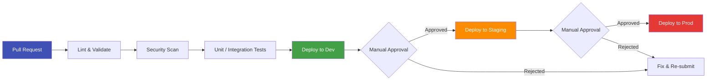
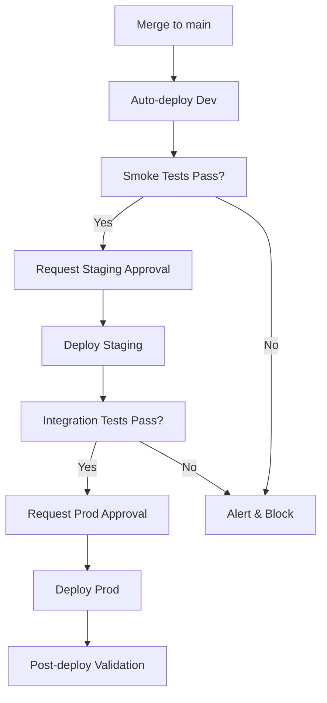

# Infrastructure as Code & CI/CD Best Practices

## Overview

CSA-in-a-Box uses **Azure Bicep** for infrastructure definitions and **GitHub Actions** for continuous integration and deployment. This combination provides type-safe, declarative infrastructure with automated validation, security scanning, and multi-environment promotion.

!!! info "Related Guide"
For foundational IaC/CI-CD concepts and project-specific conventions, see the [IaC-CICD-Best-Practices.md](../IaC-CICD-Best-Practices.md) guide.

This document covers module design, workflow patterns, policy enforcement, environment promotion, secrets management, supply chain security, and testing — all tailored to the CSA-in-a-Box architecture.

---

## CI/CD Pipeline Flow

The following diagram illustrates the end-to-end pipeline from pull request to production deployment.



---

## Bicep Module Design

### Module Structure

Organize modules by resource type under a `modules/` directory. Each module encapsulates a single Azure resource or a tightly coupled group.

```text
infra/
├── main.bicep                  # Orchestrator — composes modules
├── modules/
│   ├── network/
│   │   └── vnet.bicep
│   ├── compute/
│   │   └── appService.bicep
│   ├── data/
│   │   ├── sqlServer.bicep
│   │   └── storageAccount.bicep
│   ├── identity/
│   │   └── managedIdentity.bicep
│   └── monitoring/
│       └── logAnalytics.bicep
├── params.dev.bicepparam
├── params.staging.bicepparam
└── params.prod.bicepparam
```

### Parameter Files per Environment

Use `.bicepparam` files (or JSON parameter files) per environment. The **same templates** deploy to every environment — only parameters change.

| File                        | Purpose                               |
| --------------------------- | ------------------------------------- |
| `params.dev.bicepparam`     | Development — smallest SKUs, relaxed  |
| `params.staging.bicepparam` | Staging — mirrors prod sizing         |
| `params.prod.bicepparam`    | Production — full HA, strict policies |

### Naming Conventions

Follow a consistent naming pattern aligned with Azure Cloud Adoption Framework:

```
<resource-prefix>-<workload>-<environment>-<region>-<instance>
```

| Resource         | Prefix | Example                        |
| ---------------- | ------ | ------------------------------ |
| Resource Group   | `rg`   | `rg-csainabox-dev-eastus-001`  |
| App Service      | `app`  | `app-csainabox-dev-eastus-001` |
| SQL Server       | `sql`  | `sql-csainabox-dev-eastus-001` |
| Storage Account  | `st`   | `stcsainaboxdeveus001`         |
| Key Vault        | `kv`   | `kv-csainabox-dev-eus-001`     |
| Log Analytics    | `log`  | `log-csainabox-dev-eastus-001` |
| Managed Identity | `id`   | `id-csainabox-dev-eastus-001`  |

### Output Chaining Between Modules

Use module outputs to wire resources together without hard-coding IDs.

```bicep
// main.bicep — orchestrator
param environment string
param location string = resourceGroup().location
param workload string = 'csainabox'

// 1. Identity
module identity 'modules/identity/managedIdentity.bicep' = {
  name: 'deploy-identity'
  params: {
    name: 'id-${workload}-${environment}-${location}-001'
    location: location
  }
}

// 2. Storage — receives identity principal ID
module storage 'modules/data/storageAccount.bicep' = {
  name: 'deploy-storage'
  params: {
    name: 'st${workload}${environment}${take(location, 3)}001'
    location: location
    principalId: identity.outputs.principalId
  }
}

// 3. App Service — receives storage connection + identity
module app 'modules/compute/appService.bicep' = {
  name: 'deploy-app'
  params: {
    name: 'app-${workload}-${environment}-${location}-001'
    location: location
    storageAccountName: storage.outputs.name
    managedIdentityId: identity.outputs.id
  }
}
```

### What-If Deployments

Always run `what-if` before applying changes to catch unintended modifications.

```bash
az deployment group what-if \
  --resource-group rg-csainabox-dev-eastus-001 \
  --template-file infra/main.bicep \
  --parameters infra/params.dev.bicepparam
```

!!! warning "Review What-If Output"
Never skip the what-if step. Automated pipelines should surface what-if output in PR comments for reviewer visibility.

### Bicep Module Example

```bicep
// modules/data/storageAccount.bicep

@description('Storage account name (3-24 chars, lowercase alphanumeric)')
@minLength(3)
@maxLength(24)
param name string

@description('Azure region for the storage account')
param location string

@description('Principal ID to grant Storage Blob Data Contributor')
param principalId string

@allowed(['Standard_LRS', 'Standard_GRS', 'Standard_ZRS'])
param skuName string = 'Standard_LRS'

resource storageAccount 'Microsoft.Storage/storageAccounts@2023-05-01' = {
  name: name
  location: location
  kind: 'StorageV2'
  sku: {
    name: skuName
  }
  properties: {
    supportsHttpsTrafficOnly: true
    minimumTlsVersion: 'TLS1_2'
    allowBlobPublicAccess: false
    networkAcls: {
      defaultAction: 'Deny'
    }
  }
}

resource roleAssignment 'Microsoft.Authorization/roleAssignments@2022-04-01' = {
  name: guid(storageAccount.id, principalId, 'ba92f5b4-2d11-453d-a403-e96b0029c9fe')
  scope: storageAccount
  properties: {
    roleDefinitionId: subscriptionResourceId(
      'Microsoft.Authorization/roleDefinitions',
      'ba92f5b4-2d11-453d-a403-e96b0029c9fe' // Storage Blob Data Contributor
    )
    principalId: principalId
    principalType: 'ServicePrincipal'
  }
}

output name string = storageAccount.name
output id string = storageAccount.id
output primaryEndpoint string = storageAccount.properties.primaryEndpoints.blob
```

---

## GitHub Actions Workflows

### Workflow Structure

```text
.github/workflows/
├── infra-validate.yml      # PR checks: lint, scan, what-if
├── infra-deploy.yml        # Deploy on merge: dev → staging → prod
├── reusable-deploy.yml     # Reusable workflow called by infra-deploy
└── app-ci.yml              # Application build, test, package
```

### Reusable Workflows

Extract deployment logic into a reusable workflow to ensure consistency across environments.

### Environment Protection Rules

| Environment | Protection                                    |
| ----------- | --------------------------------------------- |
| `dev`       | None — auto-deploy on merge                   |
| `staging`   | Required reviewers (1 approver)               |
| `prod`      | Required reviewers (2 approvers) + wait timer |

### Workflow YAML Excerpt

```yaml
# .github/workflows/infra-deploy.yml
name: Deploy Infrastructure

on:
  push:
    branches: [main]
    paths: ['infra/**']

permissions:
  id-token: write   # OIDC
  contents: read

concurrency:
  group: infra-deploy-${{ github.ref }}
  cancel-in-progress: false   # never cancel in-flight deploys

jobs:
  deploy-dev:
    uses: ./.github/workflows/reusable-deploy.yml
    with:
      environment: dev
      resource-group: rg-csainabox-dev-eastus-001
      param-file: infra/params.dev.bicepparam
    secrets: inherit

  deploy-staging:
    needs: deploy-dev
    uses: ./.github/workflows/reusable-deploy.yml
    with:
      environment: staging
      resource-group: rg-csainabox-staging-eastus-001
      param-file: infra/params.staging.bicepparam
    secrets: inherit

  deploy-prod:
    needs: deploy-staging
    uses: ./.github/workflows/reusable-deploy.yml
    with:
      environment: prod
      resource-group: rg-csainabox-prod-eastus-001
      param-file: infra/params.prod.bicepparam
    secrets: inherit

# .github/workflows/reusable-deploy.yml
on:
  workflow_call:
    inputs:
      environment:
        required: true
        type: string
      resource-group:
        required: true
        type: string
      param-file:
        required: true
        type: string

jobs:
  deploy:
    runs-on: ubuntu-latest
    environment: ${{ inputs.environment }}
    steps:
      - uses: actions/checkout@v4

      - name: Azure Login (OIDC)
        uses: azure/login@v2
        with:
          client-id: ${{ secrets.AZURE_CLIENT_ID }}
          tenant-id: ${{ secrets.AZURE_TENANT_ID }}
          subscription-id: ${{ secrets.AZURE_SUBSCRIPTION_ID }}

      - name: What-If
        run: |
          az deployment group what-if \
            --resource-group ${{ inputs.resource-group }} \
            --template-file infra/main.bicep \
            --parameters ${{ inputs.param-file }}

      - name: Deploy
        run: |
          az deployment group create \
            --resource-group ${{ inputs.resource-group }} \
            --template-file infra/main.bicep \
            --parameters ${{ inputs.param-file }}
```

### OIDC Authentication

!!! tip "Federated Credentials Over Stored Secrets"
Use OIDC (workload identity federation) instead of storing service principal secrets in GitHub. This eliminates secret rotation and reduces blast radius.

### Matrix Strategy for Multi-Region

```yaml
strategy:
    matrix:
        region: [eastus, westus2]
    fail-fast: true
```

---

## Policy as Code

### PSRule for Azure

[PSRule for Azure](https://azure.github.io/PSRule.Rules.Azure/) validates Bicep templates against Azure Well-Architected Framework rules.

```yaml
# ps-rule.yaml (project root)
configuration:
    AZURE_BICEP_FILE_EXPANSION: true
    AZURE_DEPLOYMENT_NONSENSITIVE_PARAMETER_NAMES:
        - environment
        - location
        - workload

input:
    pathIgnore:
        - ".github/"
        - "docs/"

rule:
    includeLocal: true

output:
    culture: ["en-US"]
```

#### Custom PSRule Rule Example

```powershell
# .ps-rule/Org.CSA.Rule.ps1

# Enforce TLS 1.2 minimum on all storage accounts
Rule 'Org.CSA.Storage.MinTLS' `
  -Type 'Microsoft.Storage/storageAccounts' `
  -Tag @{ release = 'GA' } {
    $Assert.HasFieldValue($TargetObject, 'properties.minimumTlsVersion', 'TLS1_2')
}

# Enforce HTTPS-only on storage
Rule 'Org.CSA.Storage.HttpsOnly' `
  -Type 'Microsoft.Storage/storageAccounts' `
  -Tag @{ release = 'GA' } {
    $Assert.HasFieldValue($TargetObject, 'properties.supportsHttpsTrafficOnly', $true)
}
```

### Checkov for Security Scanning

```yaml
# In PR validation workflow
- name: Run Checkov
  uses: bridgecrewio/checkov-action@v12
  with:
      directory: infra/
      framework: bicep
      soft_fail: false
```

### Pre-Commit Hooks

```yaml
# .pre-commit-config.yaml
repos:
    - repo: local
      hooks:
          - id: bicep-build
            name: Bicep Build (Lint)
            entry: az bicep build --file
            language: system
            files: '\.bicep$'
            pass_filenames: true

    - repo: https://github.com/bridgecrewio/checkov
      rev: "3.2.0"
      hooks:
          - id: checkov
            args: ["--framework", "bicep"]
```

### Policy Gates in PR Checks

Configure branch protection to require PSRule and Checkov checks to pass before merge.

| Check       | Blocking? | Purpose                           |
| ----------- | --------- | --------------------------------- |
| PSRule      | ✅ Yes    | WAF alignment, org policies       |
| Checkov     | ✅ Yes    | Security misconfiguration         |
| Bicep Build | ✅ Yes    | Syntax and type validation        |
| What-If     | ❌ No     | Informational — posted as comment |

---

## Environment Promotion

### Dev → Staging → Prod Pattern



### Parameter-Driven Deployments

Same Bicep templates across all environments. Differences live exclusively in parameter files:

| Parameter       | Dev            | Staging        | Prod           |
| --------------- | -------------- | -------------- | -------------- |
| `skuName`       | `Standard_LRS` | `Standard_ZRS` | `Standard_ZRS` |
| `instanceCount` | 1              | 2              | 3              |
| `enableDiag`    | false          | true           | true           |
| `firewallRules` | Allow all      | Corp IPs       | Corp IPs + WAF |

### Feature Flags for Gradual Rollout

Use Azure App Configuration feature flags to decouple deployment from feature activation:

```bicep
resource featureFlag 'Microsoft.AppConfiguration/configurationStores/keyValues@2023-03-01' = {
  parent: appConfig
  name: '.appconfig.featureflag~2Fnew-dashboard'
  properties: {
    value: '{"id":"new-dashboard","enabled":false}'
    contentType: 'application/vnd.microsoft.appconfig.ff+json;charset=utf-8'
  }
}
```

### Rollback Strategies

1. **Re-deploy previous commit** — trigger pipeline on last-known-good SHA
2. **Azure deployment rollback** — `az deployment group cancel` for in-progress failures
3. **Feature flag kill switch** — disable the feature without redeploying

!!! info "Rollback Guide"
For detailed rollback procedures, see [ROLLBACK.md](../ROLLBACK.md).

---

## Secrets Management in CI/CD

### GitHub Secrets

Store environment-specific secrets at the **environment** level in GitHub, not at the repository level, to enforce least-privilege.

### OIDC Federation (Preferred)

```yaml
# No stored secrets needed for Azure auth
- uses: azure/login@v2
  with:
      client-id: ${{ secrets.AZURE_CLIENT_ID }}
      tenant-id: ${{ secrets.AZURE_TENANT_ID }}
      subscription-id: ${{ secrets.AZURE_SUBSCRIPTION_ID }}
```

### Key Vault References in Pipelines

```yaml
- name: Get secret from Key Vault
  run: |
      SECRET=$(az keyvault secret show \
        --vault-name kv-csainabox-${{ inputs.environment }}-eus-001 \
        --name my-secret \
        --query value -o tsv)
      echo "::add-mask::$SECRET"
      echo "MY_SECRET=$SECRET" >> "$GITHUB_ENV"
```

!!! danger "Never Log Secrets" - **Never** use `echo` to print secret values in workflow logs. - **Never** use Personal Access Tokens (PATs) in workflows — use OIDC or GitHub App tokens. - **Always** use `::add-mask::` before setting secrets as environment variables. - **Always** audit workflow logs for accidental secret exposure.

---

## Supply Chain Security

### Dependency Pinning

Pin all GitHub Actions by **full commit SHA**, not tags:

```yaml
# ✅ Do — hash-pinned
- uses: actions/checkout@11bd71901bbe5b1630ceea73d27597364c9af683 # v4.2.2

# ❌ Don't — tag-pinned (mutable)
- uses: actions/checkout@v4
```

### Dependabot / Renovate

```yaml
# .github/dependabot.yml
version: 2
updates:
    - package-ecosystem: github-actions
      directory: /
      schedule:
          interval: weekly
      groups:
          actions:
              patterns: ["*"]

    - package-ecosystem: pip
      directory: /
      schedule:
          interval: weekly
```

### SBOM Generation

```yaml
- name: Generate SBOM
  uses: anchore/sbom-action@v0
  with:
      format: spdx-json
      output-file: sbom.spdx.json
      artifact-name: sbom
```

!!! info "Supply Chain Guide"
For a full supply chain security strategy, see [SUPPLY_CHAIN.md](../SUPPLY_CHAIN.md).

---

## Testing in CI

### Bicep Linting & Validation

```yaml
- name: Bicep Build (Lint)
  run: az bicep build --file infra/main.bicep --stdout > /dev/null

- name: Validate Deployment
  run: |
      az deployment group validate \
        --resource-group ${{ inputs.resource-group }} \
        --template-file infra/main.bicep \
        --parameters ${{ inputs.param-file }}
```

### dbt Compile & Run

```yaml
- name: dbt compile
  run: dbt compile --project-dir transform/
- name: dbt test
  run: dbt test --project-dir transform/ --select state:modified+
```

### Python Linting & Type Checking

```yaml
- name: Ruff Lint
  run: ruff check . --output-format=github

- name: Mypy Type Check
  run: mypy src/ --ignore-missing-imports
```

### Integration Tests

```yaml
- name: Integration Tests
  run: pytest tests/integration/ -v --tb=short
  env:
      AZURE_SUBSCRIPTION_ID: ${{ secrets.AZURE_SUBSCRIPTION_ID }}
```

---

## Anti-Patterns

| ❌ Don't                                   | ✅ Do                                         |
| ------------------------------------------ | --------------------------------------------- |
| Hard-code resource names in templates      | Use parameters and naming conventions         |
| Store service principal secrets in GitHub  | Use OIDC workload identity federation         |
| Pin Actions by tag (`@v4`)                 | Pin by full SHA                               |
| Deploy directly from local machine         | Deploy exclusively through CI/CD              |
| Use a single parameter file for all envs   | Separate parameter files per environment      |
| Skip what-if before deploying              | Always run what-if and review changes         |
| Allow parallel deploys to same environment | Use concurrency groups                        |
| Copy-paste workflow jobs per environment   | Use reusable workflows                        |
| Commit `.env` or secret files              | Use Key Vault references + GitHub Secrets     |
| Skip policy scanning on PRs                | Enforce PSRule + Checkov as required checks   |
| Use inline scripts for complex logic       | Extract to shell scripts or composite actions |
| Deploy infra and app in the same pipeline  | Separate infra and app deployment pipelines   |

---

## Pre-Flight Checklist

Use this checklist before merging IaC changes:

- [ ] Bicep builds without errors (`az bicep build`)
- [ ] PSRule passes with no critical violations
- [ ] Checkov scan shows no high/critical findings
- [ ] What-if output reviewed — no unexpected deletions
- [ ] Parameter files exist for all target environments
- [ ] Secrets use OIDC or Key Vault — no hard-coded credentials
- [ ] GitHub Actions pinned by SHA
- [ ] Environment protection rules configured for staging/prod
- [ ] Concurrency group set to prevent parallel deploys
- [ ] Rollback procedure documented and tested
- [ ] SBOM generated for deployable artifacts
- [ ] PR description includes summary of infrastructure changes
