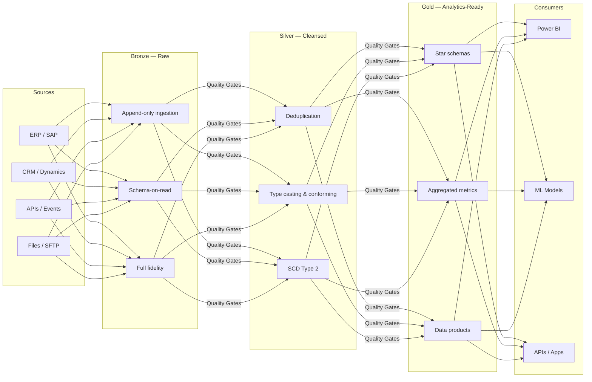
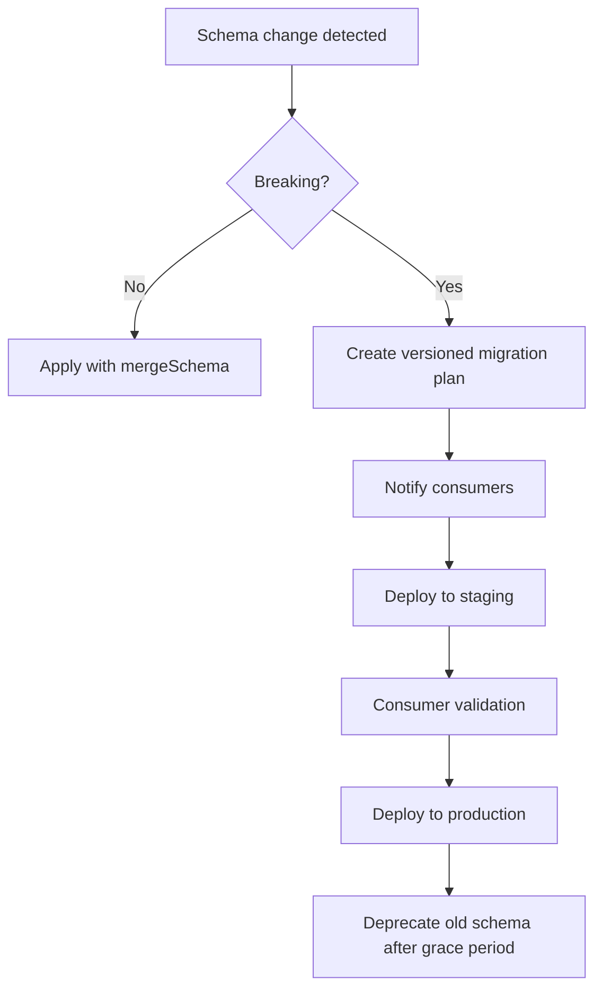

# Medallion Architecture Best Practices

## Overview

The **medallion architecture** (also called multi-hop architecture) organizes a lakehouse into three progressive layers of data quality: **Bronze** (raw), **Silver** (cleansed), and **Gold** (analytics-ready). Each layer serves a distinct purpose in transforming raw source data into trusted, governed data products.

**Why it matters for CSA-in-a-Box:**

- **Data quality** — errors are caught and corrected at well-defined boundaries
- **Governance** — lineage is traceable from source to consumption
- **Reusability** — Silver assets serve multiple Gold use cases
- **Auditability** — raw records are preserved for compliance and replay

---

## Architecture Diagram



---

## Bronze Layer Best Practices

The Bronze layer is the **landing zone** — an exact, append-only copy of source data with added ingestion metadata. It preserves full fidelity so upstream issues can always be replayed.

### Naming Convention

```
brz_{source}_{entity}

Examples:
  brz_sap_sales_orders
  brz_dynamics_contacts
  brz_api_weather_readings
```

### Core Principles

1. **Append-only ingestion** — never update or delete rows in Bronze.
2. **No transformations** — store data exactly as received.
3. **Schema-on-read** — use flexible types (`STRING`, `VARIANT`, `JSON`) when source schemas are unstable.
4. **Metadata columns** — every Bronze table includes `_metadata` columns for lineage.

### Required Metadata Columns

| Column           | Type        | Description                                   |
| ---------------- | ----------- | --------------------------------------------- |
| `_ingested_at`   | `TIMESTAMP` | UTC timestamp when the record was ingested    |
| `_source_file`   | `STRING`    | Source file path, API endpoint, or topic name |
| `_batch_id`      | `STRING`    | Unique identifier for the ingestion batch/run |
| `_ingested_date` | `DATE`      | Partition key derived from `_ingested_at`     |

### Partitioning

Partition Bronze tables by **`_ingested_date`**. This enables efficient time-travel queries and simplifies retention management.

### Retention Policy

!!! info "Compliance Requirement"
Retain raw Bronze data for a minimum of **7 years** to satisfy audit and regulatory obligations. Use lifecycle policies to move older partitions to cold/archive storage tiers.

### Do / Don't

| ✅ Do                                      | ❌ Don't                                   |
| ------------------------------------------ | ------------------------------------------ |
| Store data exactly as received from source | Apply business logic or filtering          |
| Add `_metadata` columns for lineage        | Modify source column names or types        |
| Partition by `_ingested_date`              | Partition by business keys                 |
| Use append-only writes                     | Overwrite or upsert rows                   |
| Keep raw data for 7+ years                 | Delete raw data after Silver processing    |
| Use schema-on-read for volatile sources    | Enforce strict schemas on unstable sources |

### Example: dbt Bronze Model

```sql
-- models/bronze/brz_sap_sales_orders.sql

{{ config(
    materialized='incremental',
    incremental_strategy='append',
    partition_by={
        "field": "_ingested_date",
        "data_type": "date",
        "granularity": "day"
    },
    tags=['bronze', 'sap']
) }}

SELECT
    -- Preserve all source columns as-is
    *,

    -- Metadata columns
    CURRENT_TIMESTAMP()                       AS _ingested_at,
    '{{ var("source_file", "unknown") }}'     AS _source_file,
    '{{ invocation_id }}'                     AS _batch_id,
    CURRENT_DATE()                            AS _ingested_date

FROM {{ source('sap_raw', 'sales_orders') }}


WHERE _loaded_at > (SELECT MAX(_ingested_at) FROM {{ this }})

```

---

## Silver Layer Best Practices

The Silver layer **cleanses, conforms, and deduplicates** Bronze data into an enterprise-aligned model. Silver tables are the **single source of truth** for a given entity.

### Naming Convention

```
slv_{domain}_{entity}

Examples:
  slv_sales_orders
  slv_customers_current
  slv_products_scd
```

### Core Principles

1. **Data cleansing** — handle nulls, trim strings, cast types, standardize formats.
2. **Deduplication** — resolve duplicates using deterministic keys and ordering.
3. **SCD Type 2** — track historical changes for slowly-changing dimensions.
4. **Conform to enterprise model** — align column names, data types, and reference data to organization-wide standards.
5. **Quality gates** — validate data between Bronze → Silver with automated tests.

### Data Cleansing Patterns

| Pattern              | Technique                                                        |
| -------------------- | ---------------------------------------------------------------- |
| Null handling        | `COALESCE(field, default_value)` or reject with test             |
| Deduplication        | `ROW_NUMBER() OVER (PARTITION BY pk ORDER BY _ingested_at DESC)` |
| Type casting         | Explicit `CAST()` / `SAFE_CAST()`                                |
| String normalization | `TRIM(UPPER(field))`                                             |
| Date standardization | Convert all dates to `UTC` / `ISO 8601`                          |

### SCD Type 2 Pattern

```
slv_{domain}_{entity}_scd

Columns:
  {natural_key}        -- business key
  {attributes}         -- tracked columns
  _valid_from          -- effective start (inclusive)
  _valid_to            -- effective end (exclusive), NULL = current
  _is_current          -- BOOLEAN flag for convenience
  _hash_diff           -- hash of tracked columns for change detection
```

### Quality Gates (Bronze → Silver)

Use **dbt tests** or **Great Expectations** to enforce quality before data enters Silver:

- `not_null` on primary keys
- `unique` on primary keys
- `accepted_values` on enumerations
- `relationships` for referential integrity
- Custom row-count variance checks (alert if delta > 20%)

### Do / Don't

| ✅ Do                                       | ❌ Don't                          |
| ------------------------------------------- | --------------------------------- |
| Deduplicate using deterministic logic       | Randomly pick one of N duplicates |
| Apply SCD Type 2 for dimensions that change | Overwrite dimension history       |
| Enforce data types explicitly               | Rely on implicit type coercion    |
| Align to enterprise naming standards        | Invent new naming per project     |
| Run quality tests before writing Silver     | Skip validation and "fix later"   |
| Document cleansing rules in dbt YAML        | Bury logic in undocumented SQL    |

### Example: dbt Silver Incremental Model with Dedup and SCD2

```sql
-- models/silver/slv_sales_orders.sql

{{ config(
    materialized='incremental',
    unique_key='order_id',
    incremental_strategy='merge',
    partition_by={
        "field": "order_date",
        "data_type": "date",
        "granularity": "month"
    },
    tags=['silver', 'sales']
) }}

WITH source AS (
    SELECT * FROM {{ ref('brz_sap_sales_orders') }}
    
    WHERE _ingested_at > (SELECT MAX(_ingested_at) FROM {{ this }})
    
),

deduplicated AS (
    SELECT
        *,
        ROW_NUMBER() OVER (
            PARTITION BY order_id
            ORDER BY _ingested_at DESC
        ) AS _rn
    FROM source
)

SELECT
    -- Business keys
    CAST(order_id AS INT64)                         AS order_id,
    CAST(customer_id AS INT64)                      AS customer_id,

    -- Cleansed attributes
    TRIM(UPPER(order_status))                       AS order_status,
    CAST(order_date AS DATE)                        AS order_date,
    COALESCE(CAST(order_total AS NUMERIC), 0)       AS order_total,
    COALESCE(CAST(currency_code AS STRING), 'USD')  AS currency_code,

    -- Lineage
    _ingested_at,
    _batch_id,
    CURRENT_TIMESTAMP()                             AS _transformed_at

FROM deduplicated
WHERE _rn = 1
```

```sql
-- models/silver/slv_customers_scd.sql

{{ config(
    materialized='incremental',
    unique_key='_surrogate_key',
    incremental_strategy='merge',
    tags=['silver', 'scd2', 'customers']
) }}

WITH incoming AS (
    SELECT
        customer_id,
        customer_name,
        customer_segment,
        region,
        {{ dbt_utils.generate_surrogate_key([
            'customer_id', 'customer_name', 'customer_segment', 'region'
        ]) }}                                           AS _hash_diff,
        _ingested_at
    FROM {{ ref('brz_dynamics_contacts') }}
    
    WHERE _ingested_at > (SELECT MAX(_ingested_at) FROM {{ this }} WHERE _is_current)
    
),


existing AS (
    SELECT * FROM {{ this }} WHERE _is_current = TRUE
),

changes AS (
    SELECT i.*
    FROM incoming i
    LEFT JOIN existing e ON i.customer_id = e.customer_id
    WHERE e.customer_id IS NULL       -- new record
       OR e._hash_diff != i._hash_diff -- changed record
)

changes AS (
    SELECT * FROM incoming
)


SELECT
    {{ dbt_utils.generate_surrogate_key([
        'customer_id', '_ingested_at'
    ]) }}                                               AS _surrogate_key,
    customer_id,
    customer_name,
    customer_segment,
    region,
    _hash_diff,
    _ingested_at                                        AS _valid_from,
    CAST(NULL AS TIMESTAMP)                             AS _valid_to,
    TRUE                                                AS _is_current
FROM changes
```

---

## Gold Layer Best Practices

The Gold layer delivers **analytics-ready data products** — star schemas, pre-aggregated metrics, and curated datasets designed for specific business domains.

### Naming Convention

```
gld_{domain}_{metric_or_entity}

Examples:
  gld_sales_revenue_daily
  gld_finance_gl_summary
  gld_customers_dim
  gld_sales_fact
```

### Core Principles

1. **Star schema / dimensional modeling** — follow Kimball methodology with fact and dimension tables.
2. **Pre-aggregated** — compute metrics at the grain consumers need; don't force BI tools to aggregate billions of rows.
3. **Data product contracts** — define schema, SLA, ownership, and freshness guarantees.
4. **Materialization decisions** — choose based on query patterns and freshness requirements.

### Data Product Contract

Every Gold table should have a documented contract:

```yaml
# models/gold/gld_sales_revenue_daily.yml
models:
    - name: gld_sales_revenue_daily
      description: "Daily aggregated sales revenue by region and product category"
      meta:
          owner: "data-engineering@company.com"
          sla_freshness: "< 4 hours"
          grain: "date × region × product_category"
          consumers: ["Power BI Sales Dashboard", "Finance Reporting"]
          classification: "internal"
      columns:
          - name: revenue_date
            description: "Calendar date of the revenue"
            tests: [not_null]
          - name: region
            tests:
                [
                    not_null,
                    accepted_values:
                        { values: ["NA", "EMEA", "APAC", "LATAM"] },
                ]
          - name: total_revenue
            description: "Sum of order_total in USD"
            tests: [not_null]
```

### Materialization Decision Guide

| Scenario                                   | Materialization                | Rationale                                               |
| ------------------------------------------ | ------------------------------ | ------------------------------------------------------- |
| Large fact tables refreshed daily          | `table`                        | Full rebuild is fast enough; query performance critical |
| Dimensions with SCD                        | `incremental` (merge)          | Avoid full rebuild on large dimension tables            |
| Real-time dashboards, small data           | `view` / `materialized view`   | Always-fresh, low compute for small datasets            |
| Expensive aggregations, low freshness need | `table` with scheduled rebuild | Pre-compute once, query many times                      |

### Do / Don't

| ✅ Do                                     | ❌ Don't                                       |
| ----------------------------------------- | ---------------------------------------------- |
| Model as star schema (facts + dimensions) | Create wide, denormalized "mega-tables"        |
| Document data contracts in YAML           | Publish tables without ownership or SLA        |
| Pre-aggregate at the grain consumers need | Force consumers to aggregate raw Silver data   |
| Use surrogate keys for dimensions         | Expose source-system natural keys to consumers |
| Version Gold schemas with contract tests  | Make breaking changes without notice           |
| Optimize for read performance             | Optimize for write performance                 |

### Example: dbt Gold Model

```sql
-- models/gold/gld_sales_revenue_daily.sql

{{ config(
    materialized='table',
    partition_by={
        "field": "revenue_date",
        "data_type": "date",
        "granularity": "month"
    },
    cluster_by=['region', 'product_category'],
    tags=['gold', 'sales', 'daily']
) }}

WITH orders AS (
    SELECT
        o.order_date                                AS revenue_date,
        c.region,
        p.product_category,
        o.order_total                               AS revenue_amount,
        o.currency_code
    FROM {{ ref('slv_sales_orders') }} o
    INNER JOIN {{ ref('slv_customers_scd') }} c
        ON o.customer_id = c.customer_id
        AND c._is_current = TRUE
    INNER JOIN {{ ref('slv_products') }} p
        ON o.product_id = p.product_id
)

SELECT
    revenue_date,
    region,
    product_category,
    COUNT(*)                                        AS order_count,
    SUM(revenue_amount)                             AS total_revenue,
    AVG(revenue_amount)                             AS avg_order_value,
    CURRENT_TIMESTAMP()                             AS _refreshed_at

FROM orders
GROUP BY 1, 2, 3
```

---

## Schema Evolution

Schema changes are inevitable. Handle them deliberately to avoid breaking downstream consumers.

### Non-Breaking Changes (Safe)

These can be applied automatically:

- **Adding a new column** with a default or nullable value
- **Widening a type** (e.g., `INT` → `BIGINT`, `VARCHAR(50)` → `VARCHAR(200)`)
- **Adding a new table**

### Breaking Changes (Require Coordination)

These require versioning and consumer communication:

- **Removing or renaming a column**
- **Changing a column's data type** (narrowing or incompatible)
- **Changing the grain** of a table
- **Altering primary keys**

### Delta / Spark Schema Evolution

```python
# Non-breaking: add new columns automatically
df.write.format("delta") \
    .option("mergeSchema", "true") \
    .mode("append") \
    .saveAsTable("bronze.brz_api_events")

# Breaking: overwrite schema entirely (use with caution)
df.write.format("delta") \
    .option("overwriteSchema", "true") \
    .mode("overwrite") \
    .saveAsTable("bronze.brz_api_events")
```

!!! warning "Schema Overwrite"
Only use `overwriteSchema` in Bronze where append-only semantics allow full reloads. Never use it on Silver or Gold tables without coordinating with downstream consumers.

### Schema Evolution Workflow



---

## Partitioning Strategies

Effective partitioning accelerates queries and reduces costs. Poor partitioning does the opposite.

### Recommended Partition Keys

| Layer  | Partition Key                                 | Rationale                                     |
| ------ | --------------------------------------------- | --------------------------------------------- |
| Bronze | `_ingested_date`                              | Supports time-travel and retention management |
| Silver | Business date (e.g., `order_date`)            | Aligns with how Silver is queried             |
| Gold   | Primary date dimension (e.g., `revenue_date`) | Matches dashboard date filters                |

### Partition Pruning Tips

- **Always filter on partition columns** in `WHERE` clauses.
- **Avoid functions on partition columns** — `WHERE YEAR(order_date) = 2024` won't prune; use `WHERE order_date BETWEEN '2024-01-01' AND '2024-12-31'`.
- **Use clustering** (BigQuery) or **Z-ordering** (Delta) for secondary sort columns within partitions.

### Over-Partitioning Anti-Pattern

!!! danger "Over-Partitioning Small Tables"
Partitioning a table with fewer than **1 GB** of data (or fewer than ~1 million rows) usually **hurts** performance. Each partition creates file overhead and metadata. For small tables, use `materialized='table'` without partitioning.

    **Rule of thumb:** Only partition when each partition contains at least **1 GB** of data.

---

## Cross-Layer Quality Gates

Quality gates are automated checkpoints between layers that prevent bad data from propagating downstream.

```mermaid
flowchart LR
    subgraph Bronze
        B[Raw data]
    end

    subgraph QG1["Quality Gate 1"]
        T1[not_null on PKs]
        T2[unique on PKs]
        T3[row count variance < 20%]
        T4[schema conformance]
    end

    subgraph Silver
        S[Cleansed data]
    end

    subgraph QG2["Quality Gate 2"]
        T5[referential integrity]
        T6[accepted_values on enums]
        T7[freshness < SLA]
        T8[aggregation balance checks]
    end

    subgraph Gold
        G[Analytics-ready data]
    end

    B --> QG1 --> S --> QG2 --> G
```



### Quality Gate Implementation

```yaml
# tests/quality_gates/qg_bronze_to_silver.yml
sources:
    - name: bronze
      freshness:
          warn_after: { count: 4, period: hour }
          error_after: { count: 8, period: hour }

models:
    - name: slv_sales_orders
      tests:
          - dbt_utils.equal_rowcount:
                compare_model: ref('brz_sap_sales_orders')
                # Allow 5% variance for dedup
                # Custom macro wraps this with tolerance
      columns:
          - name: order_id
            tests: [not_null, unique]
          - name: order_status
            tests:
                - accepted_values:
                      values:
                          [
                              "OPEN",
                              "SHIPPED",
                              "DELIVERED",
                              "CANCELLED",
                              "RETURNED",
                          ]
          - name: order_total
            tests:
                - dbt_utils.expression_is_true:
                      expression: ">= 0"
```

---

## Anti-Patterns

!!! danger "Skipping the Silver Layer"
**Problem:** Transforming directly from Bronze to Gold (`Bronze → Gold`).

    **Why it's harmful:**

    - Cleansing logic gets duplicated across every Gold model
    - No single source of truth for an entity
    - Changes to cleansing rules require updating multiple Gold models
    - Lineage becomes tangled and ungovernable

    **Fix:** Always route through Silver. Even if Silver and Gold logic seem simple today, the Silver layer provides a stable, reusable foundation as complexity grows.

!!! danger "Transforming Data in Bronze"
**Problem:** Applying business rules, filtering rows, or renaming columns in the Bronze layer.

    **Why it's harmful:**

    - Destroys the ability to replay from raw data
    - Makes debugging source issues impossible
    - Violates the "full fidelity" principle

    **Fix:** Bronze is append-only, no transformations. All cleansing and business logic belongs in Silver.

!!! danger "Gold Tables Without Data Contracts"
**Problem:** Publishing Gold tables without documented ownership, SLA, schema, or consumers.

    **Why it's harmful:**

    - No accountability when data is late or wrong
    - Breaking changes surprise consumers
    - "Shadow" Gold tables proliferate because nobody trusts the originals

    **Fix:** Every Gold table must have a YAML contract specifying `owner`, `sla_freshness`, `grain`, and `consumers`. Use `dbt model contracts` to enforce column types and constraints at build time.

!!! danger "Over-Partitioning Small Tables"
**Problem:** Partitioning dimension tables or low-volume tables by date.

    **Why it's harmful:**

    - Creates thousands of tiny files (small-file problem)
    - Increases metadata overhead and query planning time
    - Actually **slows down** queries instead of speeding them up

    **Fix:** Only partition tables where each partition contains ≥ 1 GB. For small tables, use clustering or no partitioning.

---

## Cross-References

- **Architecture Decision Records** — see [`docs/adr/`](../adr/README.md) for decisions on lakehouse platform, partitioning strategy, and SCD approach
- **Data Governance Best Practices** — see [`docs/best-practices/data-governance.md`](data-governance.md) for classification, access control, and lineage requirements
- **Data Engineering Guide** — see [`docs/best-practices/data-engineering.md`](data-engineering.md) for pipeline orchestration, idempotency, and monitoring patterns
- **dbt Style Guide** — see `docs/best-practices/dbt-style-guide.md` (planned) for SQL formatting, naming conventions, and project structure
