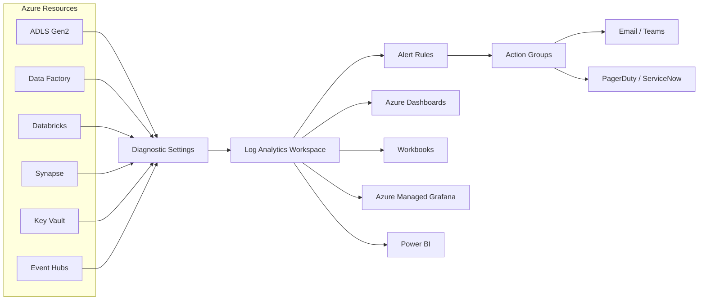
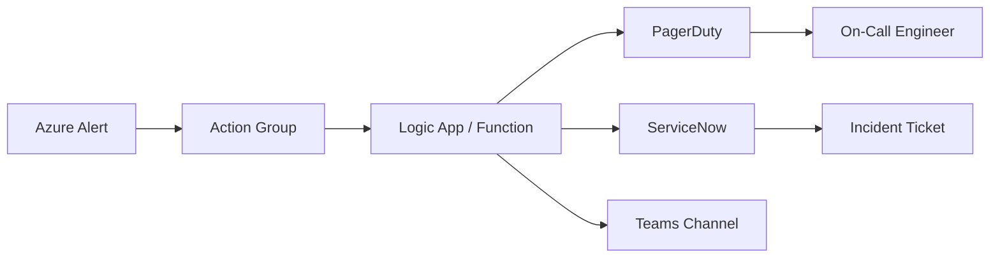

# Monitoring & Observability

## Overview

Effective observability for data platforms rests on three pillars: **metrics**, **logs**, and **traces**. Together they answer _what happened_, _why it happened_, and _how long it took_.

| Pillar  | Purpose                          | Azure Service            |
| ------- | -------------------------------- | ------------------------ |
| Metrics | Numerical health & performance   | Azure Monitor Metrics    |
| Logs    | Detailed event records           | Log Analytics / Sentinel |
| Traces  | End-to-end request/pipeline flow | Application Insights     |

!!! tip "Cross-reference"
For the canonical log event schema used across all CSA-in-a-Box pipelines, see [LOG_SCHEMA.md](../reference/LOG_SCHEMA.md).

---

## Observability Architecture



---

## Log Analytics Workspace Design

### Centralized vs. Per-Domain Workspace

| Approach        | Pros                                            | Cons                                          |
| --------------- | ----------------------------------------------- | --------------------------------------------- |
| **Centralized** | Single pane of glass, simpler RBAC, correlation | Noisy-neighbour risk, cost attribution harder |
| **Per-Domain**  | Cost isolation, blast radius, domain RBAC       | Cross-domain queries harder, more overhead    |

!!! success "Recommendation"
Use a **single centralized workspace** with **table-level RBAC** and **resource-context access** for most CSA-in-a-Box deployments. Split only when regulatory boundaries require it.

### Data Retention Policies

| Tier              | Retention     | Cost Posture | Use Case                      |
| ----------------- | ------------- | ------------ | ----------------------------- |
| Interactive (hot) | 30 days       | Higher       | Active troubleshooting        |
| Archive (cold)    | Up to 7 years | Low          | Compliance, audit, historical |

!!! warning
Archive data requires a restore operation (minutes to hours) before querying. Plan retention tiers during design, not after cost overruns.

### Table Plans

| Plan          | Query Perf | Ingestion Cost | Best For                           |
| ------------- | ---------- | -------------- | ---------------------------------- |
| **Analytics** | Full KQL   | Standard       | Security, pipeline monitoring      |
| **Basic**     | Limited    | ~60% cheaper   | High-volume verbose logs           |
| **Auxiliary** | Minimal    | Lowest         | Compliance archives, raw telemetry |

### Cost Management for High-Volume Logs

- Set **daily caps** per table to prevent runaway ingestion.
- Use **data collection rules (DCR)** to filter and transform before ingestion.
- Move verbose diagnostic logs (e.g., Databricks driver logs) to **Basic** tier.
- Review the **Usage** table monthly: `Usage | summarize sum(Quantity) by DataType | sort by sum_Quantity desc`.

### Workspace RBAC

| Role                      | Scope               | Access                           |
| ------------------------- | ------------------- | -------------------------------- |
| Log Analytics Reader      | Workspace           | Read all tables                  |
| Log Analytics Contributor | Workspace           | Manage settings + read/write     |
| Custom – Domain Reader    | Table / Resource    | Read only domain-specific tables |
| Custom – Security Analyst | SecurityEvent table | Read security logs only          |

---

## Diagnostic Settings

!!! danger "Non-Negotiable"
**Every deployed Azure resource MUST have Diagnostic Settings enabled.** This is enforced via Azure Policy in CSA-in-a-Box landing zones.

### What to Collect

| Resource     | Metrics | Logs (Categories)                               |
| ------------ | ------- | ----------------------------------------------- |
| ADLS Gen2    | ✅      | StorageRead, StorageWrite, StorageDelete        |
| Databricks   | ✅      | dbfs, clusters, jobs, notebook, secrets         |
| Synapse      | ✅      | SQLSecurityAuditEvents, IntegrationPipelineRuns |
| Data Factory | ✅      | PipelineRuns, TriggerRuns, ActivityRuns         |
| Key Vault    | ✅      | AuditEvent                                      |
| Event Hubs   | ✅      | ArchiveLogs, OperationalLogs, AutoScaleLogs     |

### Bicep Module — Diagnostic Settings

```bicep
@description('Diagnostic settings for any Azure resource.')
param resourceId string
param workspaceId string
param logsEnabled bool = true
param metricsEnabled bool = true

resource diagnostics 'Microsoft.Insights/diagnosticSettings@2021-05-01-preview' = {
  name: 'diag-to-law'
  scope: resourceId
  properties: {
    workspaceId: workspaceId
    logs: logsEnabled ? [
      {
        categoryGroup: 'allLogs'
        enabled: true
        retentionPolicy: {
          enabled: false
          days: 0
        }
      }
    ] : []
    metrics: metricsEnabled ? [
      {
        category: 'AllMetrics'
        enabled: true
        retentionPolicy: {
          enabled: false
          days: 0
        }
      }
    ] : []
  }
}
```

!!! note
Reference the shared `diagnosticSettings` module in `modules/monitoring/diagnostic-settings.bicep` when adding new resources to the landing zone.

---

## Custom Metrics & KPIs

### Data Pipeline Metrics

| Metric                   | Source       | Threshold              | Alert Action             |
| ------------------------ | ------------ | ---------------------- | ------------------------ |
| `pipeline.records_in`    | ADF / Spark  | Δ > 50 % from baseline | Warning → investigate    |
| `pipeline.records_out`   | ADF / Spark  | Δ > 50 % from baseline | Warning → investigate    |
| `pipeline.duration_sec`  | ADF Activity | > 2× p95               | Warning → review compute |
| `pipeline.failure_count` | ADF / dbt    | ≥ 1                    | Critical → on-call page  |
| `pipeline.freshness_lag` | Custom / dbt | > SLA window           | Critical → escalate      |

### Data Quality Metrics

| Metric                       | Source          | Threshold    | Alert Action          |
| ---------------------------- | --------------- | ------------ | --------------------- |
| `quality.test_pass_rate`     | dbt test        | < 100 %      | Warning → review      |
| `quality.null_pct`           | Custom check    | > column SLA | Warning → data owner  |
| `quality.schema_drift_count` | Schema registry | ≥ 1          | Warning → review PR   |
| `quality.duplicate_rate`     | Custom check    | > 0.1 %      | Warning → investigate |

### Platform Metrics

| Metric                       | Source     | Threshold        | Alert Action           |
| ---------------------------- | ---------- | ---------------- | ---------------------- |
| `platform.cluster_util_pct`  | Databricks | > 85 % sustained | Warning → scale review |
| `platform.storage_growth_gb` | ADLS       | > budget + 20 %  | Info → capacity plan   |
| `platform.query_latency_p95` | Synapse    | > 30 s           | Warning → tune query   |

---

## Alert Rules

### Alert Taxonomy

| Severity | Response Time | Example                              |
| -------- | ------------- | ------------------------------------ |
| Sev 0    | 15 min        | Production pipeline complete failure |
| Sev 1    | 1 hour        | Data freshness SLA breach            |
| Sev 2    | 4 hours       | Storage capacity > 80 %              |
| Sev 3    | Next business | Cost anomaly detected                |
| Sev 4    | Informational | Schema drift detected                |

### Pipeline Failure Alert — KQL

```kusto
ADFPipelineRun
| where Status == "Failed"
| where TimeGenerated > ago(15m)
| summarize FailureCount = count() by PipelineName, ResourceId
| where FailureCount >= 1
```

### Data Freshness SLA Breach — KQL

```kusto
let sla_hours = 4;
CustomMetrics_CL
| where MetricName_s == "pipeline.freshness_lag"
| where Value_d > (sla_hours * 3600)
| project TimeGenerated, Pipeline_s, LagSeconds = Value_d
```

### Storage Capacity Warning — KQL

```kusto
AzureMetrics
| where ResourceProvider == "MICROSOFT.STORAGE"
| where MetricName == "UsedCapacity"
| summarize CurrentBytes = max(Maximum) by ResourceId
| extend CurrentGB = CurrentBytes / (1024*1024*1024)
| extend ThresholdGB = 1024  // adjust per account
| where CurrentGB > ThresholdGB * 0.8
```

### Bicep — Scheduled Query Alert Rule

```bicep
resource pipelineFailureAlert 'Microsoft.Insights/scheduledQueryRules@2023-03-15-preview' = {
  name: 'alert-pipeline-failure'
  location: location
  properties: {
    displayName: 'Pipeline Failure Detected'
    description: 'Fires when any ADF pipeline fails in the last 15 minutes.'
    severity: 0
    enabled: true
    evaluationFrequency: 'PT5M'
    windowSize: 'PT15M'
    scopes: [ logAnalyticsWorkspaceId ]
    criteria: {
      allOf: [
        {
          query: '''
            ADFPipelineRun
            | where Status == "Failed"
            | summarize FailureCount = count() by PipelineName
            | where FailureCount >= 1
          '''
          timeAggregation: 'Count'
          operator: 'GreaterThanOrEqual'
          threshold: 1
        }
      ]
    }
    actions: {
      actionGroups: [ actionGroupId ]
    }
  }
}
```

### Azure CLI — Quick Alert Creation

```bash
az monitor scheduled-query create \
  --name "alert-freshness-sla" \
  --resource-group rg-monitoring \
  --scopes "/subscriptions/{sub}/resourceGroups/{rg}/providers/Microsoft.OperationalInsights/workspaces/{ws}" \
  --condition "count 'CustomMetrics_CL | where MetricName_s == \"pipeline.freshness_lag\" | where Value_d > 14400' > 0" \
  --severity 1 \
  --evaluation-frequency 5m \
  --window-size 15m \
  --action-groups "/subscriptions/{sub}/resourceGroups/{rg}/providers/Microsoft.Insights/actionGroups/ag-oncall"
```

---

## SLO / SLA Tracking

### Define SLOs Per Data Product

| Data Product  | Freshness SLO     | Availability SLO | Quality SLO          |
| ------------- | ----------------- | ---------------- | -------------------- |
| Finance Daily | ≤ 06:00 UTC daily | 99.5 %           | 100 % test pass rate |
| Clickstream   | ≤ 15 min latency  | 99.0 %           | < 0.5 % null in keys |
| Customer 360  | ≤ 1 hour latency  | 99.5 %           | 100 % test pass rate |

### Error Budgets

An error budget is `1 − SLO`. For a 99.5 % availability SLO over 30 days:

- **Budget:** 0.5 % × 30 days = **3.6 hours** of allowed downtime per month.
- Track burn rate: if > 2× normal, trigger review.

### SLO Dashboard Design

```
┌─────────────────────────────────────────────┐
│  Data Product SLO Summary                   │
├──────────────┬──────────┬──────────┬────────┤
│ Product      │ Fresh ✅ │ Avail ✅ │ Qual ⚠ │
│ Finance      │ 100 %    │ 99.8 %   │ 98.1 % │
│ Clickstream  │ 99.2 %   │ 99.5 %   │ 99.7 % │
│ Customer 360 │ 100 %    │ 99.9 %   │ 100 %  │
└──────────────┴──────────┴──────────┴────────┘
  ✅ Within SLO   ⚠ Budget < 50%   🔴 SLO breached
```

### Reporting Cadence

| Cadence   | Audience      | Content                           |
| --------- | ------------- | --------------------------------- |
| Real-time | Engineering   | Live SLO dashboards, alert feed   |
| Weekly    | Platform team | SLO compliance, error budget burn |
| Monthly   | Leadership    | Trend analysis, capacity forecast |
| Quarterly | Stakeholders  | SLA report, improvement roadmap   |

---

## Incident Response

### Runbook Integration

!!! info "Cross-reference"
Runbooks live in the `runbooks/` directory. Each alert rule should link to a specific runbook via the alert description or Action Group webhook payload.

### Integration Patterns



- **PagerDuty:** Use the Azure Monitor integration (Events API v2). Route by alert severity.
- **ServiceNow:** Use the Azure–ServiceNow connector or a Logic App to create incidents with populated CI and assignment group.
- **Teams:** Post adaptive cards via incoming webhook for Sev 2–4 alerts.

### Post-Incident Review Template

```markdown
## Post-Incident Review — [Title]

**Date:** YYYY-MM-DD
**Severity:** Sev X
**Duration:** HH:MM
**Impact:** [Users/pipelines affected]

### Timeline

| Time (UTC) | Event                 |
| ---------- | --------------------- |
| HH:MM      | Alert fired           |
| HH:MM      | Engineer paged        |
| HH:MM      | Root cause identified |
| HH:MM      | Mitigation applied    |
| HH:MM      | Resolved              |

### Root Cause

[Description]

### Contributing Factors

- [Factor 1]
- [Factor 2]

### Action Items

- [ ] [Preventive action] — Owner — Due date
- [ ] [Detective action] — Owner — Due date

### Lessons Learned

[What we will do differently]
```

### Escalation Matrix

| Severity | First Responder   | Escalation (30 min) | Escalation (1 hr) |
| -------- | ----------------- | ------------------- | ----------------- |
| Sev 0    | On-call engineer  | Platform lead       | Director of Eng   |
| Sev 1    | On-call engineer  | Platform lead       | —                 |
| Sev 2    | Assigned engineer | On-call engineer    | —                 |
| Sev 3–4  | Team backlog      | —                   | —                 |

---

## Dashboards

### Dashboard Strategy

| Dashboard             | Audience     | Tool                  | Refresh   |
| --------------------- | ------------ | --------------------- | --------- |
| Executive Overview    | Leadership   | Azure Dashboard       | 15 min    |
| Engineering Deep-Dive | Platform     | Azure Managed Grafana | 1 min     |
| Business Metrics      | Stakeholders | Power BI              | Scheduled |

### Key Layout Recommendations

!!! tip "Dashboard Design" - **Top row:** SLO status tiles (green/amber/red). - **Second row:** Pipeline run status (last 24 h), failure trend (7 d). - **Third row:** Resource utilization (CPU, memory, storage). - **Bottom row:** Cost trend (MTD vs. budget).

- Keep executive dashboards to **≤ 6 tiles**. One glance, one decision.
- Use Grafana variables to let engineers filter by workspace, pipeline, or date range.
- Power BI reports should connect via **Log Analytics data export** or **Azure Data Explorer** for large volumes — avoid direct KQL queries in Power BI for > 30 days of data.

---

## Operational Health Checks

### Daily Health Check — KQL Queries

```kusto
// 1. Failed pipelines in last 24 hours
ADFPipelineRun
| where TimeGenerated > ago(24h)
| where Status == "Failed"
| summarize Failures = count() by PipelineName
| order by Failures desc

// 2. Ingestion anomalies (volume drop > 50 %)
let baseline = toscalar(
    Usage
    | where TimeGenerated between (ago(8d) .. ago(1d))
    | where DataType == "ADFPipelineRun"
    | summarize avg(Quantity)
);
Usage
| where TimeGenerated > ago(1d)
| where DataType == "ADFPipelineRun"
| summarize TodayQty = sum(Quantity)
| where TodayQty < baseline * 0.5

// 3. Workspace ingestion by table (cost check)
Usage
| where TimeGenerated > ago(1d)
| summarize IngestedMB = sum(Quantity) by DataType
| order by IngestedMB desc
| take 10
```

### Weekly Capacity Review

- [ ] Review storage growth vs. forecast.
- [ ] Review Databricks cluster utilization and right-size.
- [ ] Check Log Analytics ingestion trend — any unexpected spikes?
- [ ] Validate alert rules fired correctly (no stale/silent alerts).

### Monthly Cost & Performance Review

- [ ] Compare actual Azure Monitor costs to budget.
- [ ] Identify top 3 cost drivers and optimization opportunities.
- [ ] Review SLO compliance across all data products.
- [ ] Evaluate if any tables should move between Analytics / Basic / Auxiliary plans.
- [ ] Rotate or archive old Workbooks and dashboards no longer in use.

---

## Anti-Patterns

| ❌ Don't                                                    | ✅ Do                                                  |
| ----------------------------------------------------------- | ------------------------------------------------------ |
| Deploy resources without diagnostic settings                | Enforce via Azure Policy — deny if missing             |
| Ingest all logs at Analytics tier                           | Use Basic/Auxiliary for verbose, low-query logs        |
| Create alerts with no linked runbook                        | Every alert → Action Group → Runbook link              |
| Set alert thresholds based on gut feel                      | Use p95/p99 baselines from 30 days of data             |
| Build one mega-dashboard for all audiences                  | Separate executive, engineering, and business views    |
| Ignore error budgets                                        | Track burn rate; freeze releases if budget exhausted   |
| Alert on every warning-level event                          | Aggregate and alert on trends, not individual events   |
| Store secrets in alert payloads                             | Reference Key Vault; never embed credentials in alerts |
| Skip post-incident reviews                                  | Conduct blameless review within 48 hours               |
| Query Log Analytics directly from Power BI for large ranges | Use data export → ADX or Synapse for historical BI     |

---

## Observability Readiness Checklist

- [ ] Log Analytics workspace provisioned with retention policies configured.
- [ ] Diagnostic settings enabled for **every** deployed resource.
- [ ] Table plans assigned (Analytics / Basic / Auxiliary) per log type.
- [ ] Daily ingestion cap and budget alerts configured.
- [ ] Workspace RBAC applied — least-privilege, table-level where needed.
- [ ] Custom pipeline metrics emitted (records, duration, freshness).
- [ ] Data quality metrics emitted (test pass rate, null %, schema drift).
- [ ] Alert rules created for Sev 0–2 scenarios with action groups.
- [ ] Every alert rule links to a runbook.
- [ ] SLOs defined per data product (freshness, availability, quality).
- [ ] Error budgets tracked and visible on dashboard.
- [ ] Executive dashboard deployed (≤ 6 tiles).
- [ ] Engineering dashboard deployed (Grafana with drill-down).
- [ ] Daily, weekly, and monthly health check cadence established.
- [ ] Incident response escalation matrix documented and communicated.
- [ ] Post-incident review template adopted by the team.
