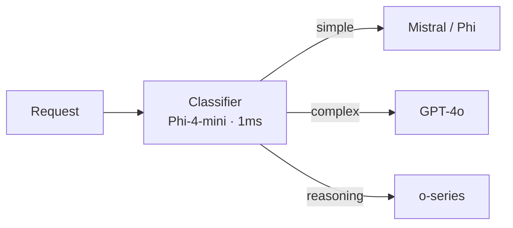
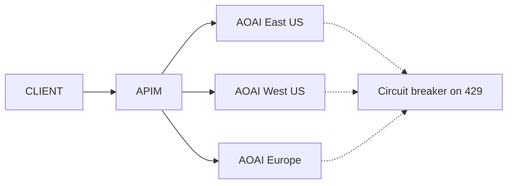
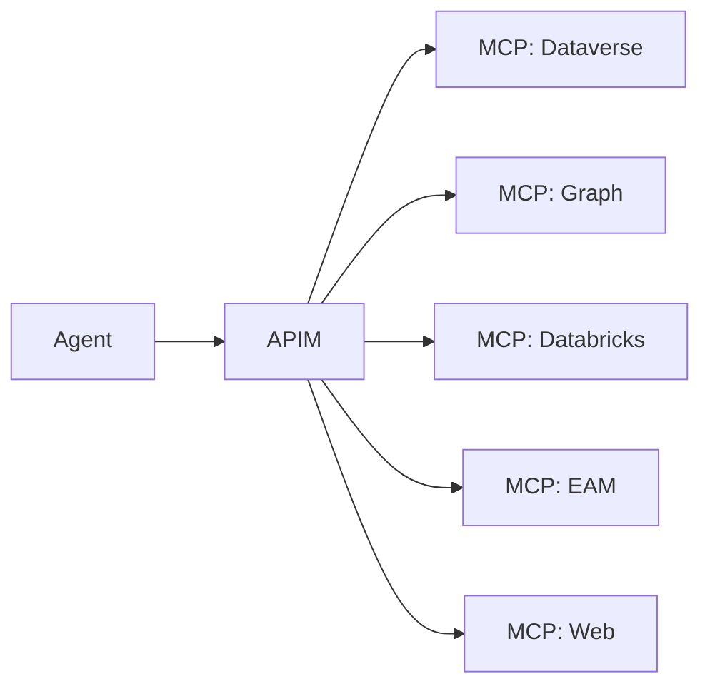

# Best Practice — Multi-Model AI Orchestration

## The principle

> **No single model wins every task. The platform decision is the model-routing layer, not the model. Build the routing layer on day one; pick models as commodities.**

Three years into the LLM era, frontier, open-weight, sovereign, and small task models all coexist in production. A serious enterprise architecture treats the model as a configurable backend, not a hardcoded dependency. This page is the opinionated playbook for orchestrating multiple models behind a single gateway on Azure.

---

## The model portfolio

Most production deployments end up with five tiers of models in parallel:

| Tier | Examples | Hosting | Typical use |
|---|---|---|---|
| **Frontier general** | GPT-4o, GPT-4.1, o-series, Claude (via Foundry MaaS where available) | Azure OpenAI / Foundry MaaS | Reasoning, broad NL, code, agentic |
| **Open-weight (cost / sovereign)** | Llama 3.x, Mistral Large, DeepSeek-V3, Phi-4 | Foundry MaaS | Cheaper inference, data-boundary sensitivity |
| **Small task-specific** | Phi-4-mini, distilled classifiers, embedding models | Foundry MaaS or containerized | High-volume cheap inference; edge |
| **Domain fine-tunes** | Custom-tuned models on enterprise data | Foundry custom-deployment | Specialized tasks (legal, scientific, mission) |
| **External / sovereign** | Bedrock-hosted, sovereign LLM gateways, partner-hosted | Brokered via APIM | Existing investments, sovereign accreditation |

Each tier has cost / latency / capability / boundary characteristics. Routing decisions select among them at runtime.

---

## The routing layer — APIM as multi-model gateway

The routing layer lives in APIM, not in application code. Reasons:

1. **One identity / governance / observability surface** across every model call
2. **Token budgets per consumer** apply across all backends — the consumer is bounded regardless of which model they hit
3. **Caching, content safety, and metric emission** apply at the gateway with no per-application code
4. **Model swap-outs** happen in policy, not in code — no redeployments to switch a workload from GPT-4o to Mistral

### Minimum policy set for a multi-model API

```xml
<policies>
  <inbound>
    <base />
    <validate-jwt header-name="Authorization" failed-validation-httpcode="401">
      <openid-config url="https://login.microsoftonline.com/{tenant}/v2.0/.well-known/openid-configuration" />
    </validate-jwt>
    <!-- Per-subscription token budget — protects against runaway agent loops -->
    <azure-openai-token-limit
        counter-key="@(context.Subscription.Id)"
        tokens-per-minute="100000"
        estimate-prompt-tokens="true"
        remaining-tokens-header-name="x-ratelimit-remaining-tokens" />
    <!-- Semantic cache — cuts cost 30-70% on repeated questions -->
    <azure-openai-semantic-cache-lookup
        score-threshold="0.85"
        embeddings-backend-id="aoai-embeddings"
        embeddings-deployment-id="text-embedding-3-large"
        ignore-system-messages="true" />
    <!-- Content safety inline -->
    <llm-content-safety backend-id="content-safety">
      <categories>
        <category name="Hate" threshold="4" />
        <category name="Violence" threshold="4" />
        <category name="SelfHarm" threshold="4" />
        <category name="Sexual" threshold="4" />
      </categories>
    </llm-content-safety>
    <!-- Backend pool selection by route -->
    <set-backend-service backend-id="aoai-pool" />
  </inbound>
  <backend><forward-request /></backend>
  <outbound>
    <base />
    <!-- Cache the response keyed by semantic similarity -->
    <azure-openai-semantic-cache-store duration="3600" />
    <!-- Emit token usage for chargeback -->
    <azure-openai-emit-token-metric>
      <dimension name="subscription-id" />
      <dimension name="model-id" />
      <dimension name="api-name" />
    </azure-openai-emit-token-metric>
  </outbound>
</policies>
```

This is the production-grade answer to four hard problems at once: cost control, latency control, content safety, and chargeback telemetry. **No equivalent exists on AWS API Gateway. No equivalent exists on MuleSoft.**

---

## Routing strategies

Pick one explicit strategy per API endpoint. Mixed strategies in one code path are a pathology.

### Strategy A — Static routing

One endpoint → one model. Simplest. Use for capability-bound workloads (e.g., a vision-capable endpoint that requires GPT-4o).

### Strategy B — Cost-aware tiered routing

Default to a cheaper model; escalate to frontier on signal:



Use when: workload has a wide cost / complexity distribution; latency tolerates an extra hop.

### Strategy C — Capability-bound routing

Choose model per declared capability requirement in the request:

```http
POST /v1/chat/completions
x-ms-model-class: vision-and-reasoning
```

APIM evaluates the header and routes to the matching backend.

### Strategy D — Multi-region fallback pool

One logical model, several regional deployments behind it. APIM backend pool with circuit breakers handles 429 / quota exhaustion automatically:



Use as the default for any production AOAI deployment.

### Strategy E — Tenant-bound routing

Different consumers route to different backends — for sovereign-data boundaries, partner-specific fine-tunes, or cost tiering by SLA.

```xml
<choose>
  <when condition="@(context.Subscription.Name == "tenant-sovereign")">
    <set-backend-service backend-id="aoai-sovereign-pool" />
  </when>
  <when condition="@(context.Subscription.Name == "tenant-cost-tier")">
    <set-backend-service backend-id="maas-mistral-pool" />
  </when>
  <otherwise>
    <set-backend-service backend-id="aoai-default-pool" />
  </otherwise>
</choose>
```

---

## Cost governance

### Token budgets

Every consuming subscription has a token-per-minute budget enforced at APIM. Tiers:

| Tier | Tokens/min | Tokens/month | Typical use |
|---|---|---|---|
| Sandbox | 10,000 | 5M | Developer exploration |
| Dev / test | 50,000 | 50M | Application QA |
| Production small | 100,000 | 500M | Standard production workload |
| Production large | 1,000,000 | Negotiated | Heavy production workload |

Budgets are enforced not requested. Consumers who blow past their budget get 429; FinOps reviews escalations.

### Semantic caching

For FAQ-style traffic and repeated agent prompts, semantic caching cuts cost 30–70%:

- `score-threshold` 0.85 is a sane default; 0.9 for higher safety, 0.8 for higher hit rate
- `ignore-system-messages` true — most prompt variation is in system role
- TTL — 1 hour for highly dynamic data, 24 hours for stable knowledge

Measure hit rate per API; tune threshold per workload.

### Chargeback

`azure-openai-emit-token-metric` with `subscription-id`, `model-id`, and `api-name` dimensions feeds a chargeback dashboard. Hook into FinOps monthly reporting:

| Dimension | What it shows |
|---|---|
| `subscription-id` | Which consuming application |
| `model-id` | Cost driver: frontier vs commodity |
| `api-name` | Which workload (chat, embeddings, etc.) |
| `tenant` (custom) | Per-tenant billing in multi-tenant scenarios |

---

## Content safety

Three layers, applied in order:

1. **Prompt-side guard** — APIM `llm-content-safety` policy on inbound request body
2. **Model-side guard** — Azure OpenAI / Foundry built-in content filters at model invocation
3. **Response-side guard** — APIM `llm-content-safety` on outbound response body

For agentic workloads, add **prompt-injection detection** via Azure AI Content Safety Prompt Shields on tool-call inputs and outputs.

For mission / regulated environments, the policy thresholds tighten:

| Category | Standard | Mission / regulated |
|---|---|---|
| Hate | 4 | 2 |
| Violence | 4 | 2 |
| Self-harm | 4 | 2 |
| Sexual | 4 | 2 |
| Prompt-injection | On | On with response blocking, not just annotation |

---

## Evaluation discipline

Models are commodity; prompts and tools are the differentiated asset. Treat them as code:

- Prompts versioned in source control
- Eval datasets versioned in source control
- Foundry Evaluations runs continuously in CI on prompt or model changes
- Regression on capability metrics blocks deployment
- A/B testing in production with shadow traffic before flipping route weights

The eval-on-every-prompt-change discipline catches the silent regressions that destroy agent workloads.

---

## Lifecycle management

Model versions, fine-tunes, prompt versions, and agent definitions all need lifecycle treatment:

| Artifact | Lifecycle |
|---|---|
| **Model deployment** | Version-pinned in APIM backend; rotation via new deployment + DNS swap |
| **Prompt** | Versioned in repo; deployed via CI; A/B tested |
| **Fine-tune** | Catalogued in Purview AI registry; eval results attached |
| **Agent** | Catalogued in Foundry Agent registry; tied to MCP tool definitions; lifecycle owner named |
| **MCP server** | Catalogued in APIM as an API; OpenAPI / tool manifest published |

Retirement is announced. Deprecated artifacts return 410 after sunset.

---

## The MCP layer

Model Context Protocol servers — exposing tools and resources to model clients — sit behind APIM in the recommended architecture:



APIM in front of MCP gives:

- Token budgets across all MCP tool calls per consumer
- Per-tool authorization via Entra scope mapping
- Observability per tool with App Insights dimensions
- Easy retirement / replacement of one MCP server without changing the agent
- Versioning of tool catalogs

See [the APIM + MCP guide](../guides/apim-mcp-layered-orchestration.md) for implementation.

---

## Anti-patterns to refuse

| Anti-pattern | Refuse because |
|---|---|
| Hardcoding a model SDK in the application | Wrong layer; the model should be configurable backend |
| Letting each app implement its own token budgeting | Re-implements platform capability; loses cross-app limits |
| Skipping semantic cache "until we measure cost" | The cost shows up when it's too late; semantic cache is cheap to enable and cheap to remove |
| Letting each app implement its own content safety | Inconsistent; an audit finding waiting to happen |
| Letting each app log its own token usage | Chargeback breaks at the moment you need it |
| Deploying a fine-tune without an eval baseline | Regression-prone; impossible to operate at scale |
| "We don't need MCP yet" | Build the gateway with MCP in mind; bolting it on later costs more |

---

## Related material

- [Best practice — API-first data strategy](./api-first-data-strategy.md)
- [Best practice — Zero-move data architecture](./zero-move-data-architecture.md)
- [Guide — APIM as the universal API gateway](../guides/apim-universal-gateway.md)
- [Guide — APIM + MCP layered orchestration](../guides/apim-mcp-layered-orchestration.md)
- [Pattern — LLMOps & Evaluation](../patterns/llmops-evaluation.md)
- [Decision — RAG vs Fine-Tune vs Agents](../decisions/rag-vs-finetune-vs-agents.md)
- [Whitepaper — API-first data strategy on Azure](../research/api-first-data-strategy-whitepaper.md)
