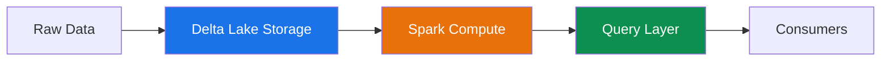

# Performance Tuning

## Overview

Performance tuning in CSA-in-a-Box spans multiple layers of the data platform: **storage** (Delta Lake), **compute** (Apache Spark), and **query** (SQL, KQL). Effective tuning requires understanding how these layers interact and where bottlenecks typically emerge.



The goal is to minimize I/O, reduce shuffle, and ensure queries touch only the data they need.

---

## Delta Lake Optimization

### OPTIMIZE — Compacting Small Files

Small files are the most common performance killer in Delta tables. Each small file adds overhead for file listing, metadata processing, and task scheduling.

**OPTIMIZE** compacts small files into larger ones (bin-packing), reducing the number of files Spark must read.

```sql
-- Basic OPTIMIZE
OPTIMIZE catalog.schema.my_table;

-- OPTIMIZE with Z-ORDER on frequently filtered columns
OPTIMIZE catalog.schema.my_table
ZORDER BY (customer_id, event_date);

-- OPTIMIZE a specific partition
OPTIMIZE catalog.schema.my_table
WHERE event_date >= '2026-01-01';
```

!!! tip "Schedule OPTIMIZE"
Run OPTIMIZE on a schedule (e.g., nightly or after large ingestion batches). Avoid running it after every micro-batch — the overhead outweighs the benefit.

### Z-ORDER — Co-locating Data

Z-ORDER reorders data within files so that rows with similar values in the Z-ORDER columns are stored together. This dramatically improves data skipping for filter queries.

**Choose Z-ORDER columns wisely:**

- Columns frequently used in `WHERE` clauses
- High-cardinality columns (e.g., `customer_id`, `device_id`)
- Limit to 2–4 columns — more columns dilute effectiveness

```sql
-- Good: frequently filtered, high-cardinality columns
OPTIMIZE events ZORDER BY (tenant_id, event_type);

-- Bad: too many columns, low-cardinality columns
OPTIMIZE events ZORDER BY (tenant_id, event_type, region, status, category, source);
```

### Liquid Clustering (Databricks)

Liquid Clustering replaces Z-ORDER and partitioning with adaptive, incremental clustering. It automatically reorganizes data as it arrives without full rewrites.

```sql
-- Enable liquid clustering on a new table
CREATE TABLE catalog.schema.events (
    event_id BIGINT,
    tenant_id STRING,
    event_date DATE,
    event_type STRING,
    payload STRING
)
CLUSTER BY (tenant_id, event_date);

-- Alter an existing table to use liquid clustering
ALTER TABLE catalog.schema.events
CLUSTER BY (tenant_id, event_date);

-- Trigger clustering (runs incrementally)
OPTIMIZE catalog.schema.events;
```

!!! info "Liquid Clustering vs Z-ORDER"
Liquid Clustering is **incremental** — it only reorganizes newly written data, whereas Z-ORDER rewrites entire files. For tables with continuous ingestion, Liquid Clustering is significantly cheaper and more effective.

### VACUUM — Removing Old Files

VACUUM deletes files no longer referenced by the Delta transaction log. This reclaims storage and reduces file listing overhead.

```sql
-- Remove files older than the default retention (7 days)
VACUUM catalog.schema.my_table;

-- Specify custom retention (in hours)
VACUUM catalog.schema.my_table RETAIN 168 HOURS;
```

!!! danger "Do Not Set Retention Too Low"
Setting retention below 7 days (168 hours) can break **time travel** and cause failures for **concurrent readers**. Long-running queries reading old snapshots will fail with `FileNotFoundException`. Only reduce retention if you fully understand the implications and have no concurrent readers.

    ```sql
    -- DANGEROUS: do NOT do this in production without understanding the risk
    SET spark.databricks.delta.retentionDurationCheck.enabled = false;
    VACUUM my_table RETAIN 0 HOURS;
    ```

### Auto Optimize

Auto Optimize combines two features that reduce the need for manual OPTIMIZE:

| Feature              | Description                                            |
| -------------------- | ------------------------------------------------------ |
| **Optimized Writes** | Coalesces small writes into larger files at write time |
| **Auto Compact**     | Automatically triggers compaction after writes         |

```sql
-- Enable on a table
ALTER TABLE catalog.schema.my_table
SET TBLPROPERTIES (
    'delta.autoOptimize.optimizeWrite' = 'true',
    'delta.autoOptimize.autoCompact' = 'true'
);
```

!!! tip
Optimized Writes add slight latency to each write but prevent the small-file problem. Enable on all streaming and append-heavy tables.

### File Size Tuning

Target **128 MB – 1 GB** per file. Smaller files increase overhead; larger files reduce parallelism.

```sql
-- Set target file size (default is 1 GB on Databricks)
ALTER TABLE catalog.schema.my_table
SET TBLPROPERTIES ('delta.targetFileSize' = '256mb');
```

### Bloom Filters

Bloom filters accelerate point lookups on high-cardinality columns by quickly eliminating files that don't contain the target value.

```sql
-- Create a bloom filter index
CREATE BLOOMFILTER INDEX ON TABLE catalog.schema.my_table
FOR COLUMNS (transaction_id OPTIONS (fpp = 0.01, numItems = 10000000));
```

### Delta Lake Do/Don't

| ✅ Do                                          | ❌ Don't                                         |
| ---------------------------------------------- | ------------------------------------------------ |
| Schedule regular OPTIMIZE runs                 | Let small files accumulate indefinitely          |
| Z-ORDER on 2–4 high-cardinality filter columns | Z-ORDER on 6+ columns or low-cardinality columns |
| Use Liquid Clustering for streaming tables     | Mix partitioning with Liquid Clustering          |
| Keep VACUUM retention ≥ 7 days                 | Set retention to 0 hours in production           |
| Enable Optimized Writes on append-heavy tables | Rely solely on manual OPTIMIZE for streaming     |
| Use bloom filters for point lookups            | Create bloom filters on every column             |
| Target 128 MB–1 GB file sizes                  | Leave default file sizes for all workloads       |

---

## Spark Configuration Tuning

### Memory Allocation

Proper memory allocation prevents out-of-memory errors and excessive garbage collection.

```properties
# Executor memory — main memory for task execution
spark.executor.memory = 8g

# Memory overhead — off-heap memory for internal metadata, buffers
spark.executor.memoryOverhead = 2g

# Driver memory — for collecting results and broadcast variables
spark.driver.memory = 4g
```

### Parallelism and Shuffle Partitions

The default `spark.sql.shuffle.partitions = 200` is rarely optimal. Tune based on data size.

**Rule of thumb:** target 128 MB – 256 MB per partition after shuffle.

### Adaptive Query Execution (AQE)

AQE dynamically adjusts query plans at runtime based on actual data statistics. **Always enable it.**

```properties
spark.sql.adaptive.enabled = true
spark.sql.adaptive.coalescePartitions.enabled = true
spark.sql.adaptive.skewJoin.enabled = true
```

### Dynamic Resource Allocation

Allows Spark to scale executors up and down based on workload demand.

```properties
spark.dynamicAllocation.enabled = true
spark.dynamicAllocation.minExecutors = 1
spark.dynamicAllocation.maxExecutors = 20
spark.dynamicAllocation.executorIdleTimeout = 60s
```

### Broadcast Join Threshold

Small tables should be broadcast to all executors to avoid shuffle joins.

```properties
# Default is 10 MB — increase for medium-sized dimension tables
spark.sql.autoBroadcastJoinThreshold = 100m
```

### Photon Acceleration

Photon is Databricks' native vectorized engine. It accelerates queries on Delta Lake but increases DBU cost.

!!! info "Photon Cost Tradeoff"
Photon typically provides 2–8× speedup for scan- and aggregation-heavy workloads. Enable it when **query speed matters more than compute cost**, especially for interactive dashboards and latency-sensitive pipelines.

### Configuration Reference Table

| Setting                                | Small (<10 GB) | Medium (10–500 GB) | Large (500 GB+) |
| -------------------------------------- | -------------- | ------------------ | --------------- |
| `spark.executor.memory`                | 4g             | 8g                 | 16g             |
| `spark.executor.cores`                 | 2              | 4                  | 4–8             |
| `spark.sql.shuffle.partitions`         | 20–50          | 100–200            | 400–2000        |
| `spark.sql.autoBroadcastJoinThreshold` | 50m            | 100m               | 200m            |
| `spark.sql.adaptive.enabled`           | true           | true               | true            |
| `spark.dynamicAllocation.maxExecutors` | 4              | 10                 | 20–50           |
| Photon                                 | Optional       | Recommended        | Recommended     |

### Example spark-defaults.conf

```properties
# -- Memory --
spark.executor.memory              8g
spark.executor.memoryOverhead      2g
spark.driver.memory                4g

# -- Parallelism --
spark.sql.shuffle.partitions       200
spark.default.parallelism          200

# -- AQE --
spark.sql.adaptive.enabled                       true
spark.sql.adaptive.coalescePartitions.enabled     true
spark.sql.adaptive.skewJoin.enabled               true

# -- Joins --
spark.sql.autoBroadcastJoinThreshold  100m

# -- Dynamic Allocation --
spark.dynamicAllocation.enabled           true
spark.dynamicAllocation.minExecutors      1
spark.dynamicAllocation.maxExecutors      20
```

---

## Query Tuning

### Partition Pruning

Ensure queries filter on partition columns so Spark reads only relevant partitions.

```sql
-- ✅ Good: filters on partition column (event_date)
SELECT * FROM events WHERE event_date = '2026-04-01';

-- ❌ Bad: no partition filter — full table scan
SELECT * FROM events WHERE event_type = 'click';
```

### Predicate Pushdown

Verify that predicates are pushed down to the storage layer using `EXPLAIN`.

```sql
EXPLAIN FORMATTED
SELECT customer_id, amount
FROM transactions
WHERE event_date = '2026-04-01'
  AND status = 'completed';
```

Look for `PushedFilters` in the physical plan — if your predicates appear there, pushdown is working.

### Column Pruning

Select only the columns you need. `SELECT *` reads every column from storage.

```sql
-- ✅ Before: reads all 50 columns
SELECT * FROM events WHERE tenant_id = 'acme';

-- ✅ After: reads only 3 columns — 10× less I/O
SELECT event_id, event_type, created_at
FROM events
WHERE tenant_id = 'acme';
```

### Join Optimization

| Join Strategy         | When to Use                                    |
| --------------------- | ---------------------------------------------- |
| **Broadcast Join**    | One side < 100 MB (configurable via threshold) |
| **Sort-Merge Join**   | Both sides are large, data is pre-sorted       |
| **Shuffle Hash Join** | One side is moderately smaller than the other  |
| **Cross Join**        | **Almost never** — produces cartesian product  |

```sql
-- Force broadcast join with a hint
SELECT /*+ BROADCAST(dim_customer) */
    f.amount, d.customer_name
FROM fact_sales f
JOIN dim_customer d ON f.customer_id = d.customer_id;
```

### EXPLAIN Plan Analysis

Use EXPLAIN to understand and optimize query execution.

```sql
-- Basic explain
EXPLAIN SELECT count(*) FROM events WHERE tenant_id = 'acme';

-- Extended explain with statistics
EXPLAIN EXTENDED
SELECT t.name, sum(e.amount)
FROM events e
JOIN tenants t ON e.tenant_id = t.id
WHERE e.event_date >= '2026-01-01'
GROUP BY t.name;

-- Cost-based explain
EXPLAIN COST
SELECT * FROM events WHERE tenant_id = 'acme' AND event_date = '2026-04-01';
```

**What to look for:**

- **FileScan** — number of files read and partition pruning
- **BroadcastHashJoin** vs **SortMergeJoin** — is the right strategy chosen?
- **Exchange** (shuffle) — minimize the number of shuffles
- **Filter** pushdown — are filters applied at the scan level?

### Before/After Query Optimization

```sql
-- ❌ BEFORE: full scan, no pushdown, SELECT *, cross join
SELECT *
FROM events e, customers c
WHERE e.customer_id = c.id
  AND YEAR(e.event_date) = 2026;

-- ✅ AFTER: partition pruning, column pruning, proper join, predicate pushdown
SELECT e.event_id, e.event_type, c.customer_name
FROM events e
JOIN customers c ON e.customer_id = c.id
WHERE e.event_date >= '2026-01-01'
  AND e.event_date < '2027-01-01';
```

---

## Caching Strategies

### Delta Caching vs Spark Caching

| Feature         | Delta Cache (SSD)                       | Spark Cache (Memory)                         |
| --------------- | --------------------------------------- | -------------------------------------------- |
| **Storage**     | Local SSD on worker nodes               | Executor JVM memory                          |
| **Persistence** | Survives across queries in same cluster | Lost when executor restarts                  |
| **Overhead**    | Automatic, no code changes              | Requires explicit `.cache()` / `CACHE TABLE` |
| **Best for**    | Repeated reads of Delta tables          | Iterative algorithms, ML training loops      |

### When to Cache

| ✅ Cache When                                 | ❌ Don't Cache When                     |
| --------------------------------------------- | --------------------------------------- |
| Same dataset is read multiple times in a job  | Dataset is read once (ETL pass-through) |
| Iterative ML training on the same features    | Dataset is larger than available memory |
| Interactive exploration of a filtered subset  | Data changes between reads              |
| Broadcast dimension tables used in many joins | Streaming micro-batches                 |

### Cache Invalidation

```python
# Cache a DataFrame
df_cached = df.cache()
df_cached.count()  # Materialize the cache

# Use the cached DataFrame multiple times
result1 = df_cached.groupBy("region").sum("amount")
result2 = df_cached.filter(col("status") == "active").count()

# Release cache when done
df_cached.unpersist()
```

### Materialized Views as Persistent Cache

Materialized views precompute and store query results, acting as a persistent cache that Databricks can refresh incrementally.

```sql
CREATE MATERIALIZED VIEW catalog.schema.daily_summary AS
SELECT
    tenant_id,
    event_date,
    event_type,
    COUNT(*) AS event_count,
    SUM(amount) AS total_amount
FROM catalog.schema.events
GROUP BY tenant_id, event_date, event_type;
```

---

## dbt Performance

### Incremental Models

Avoid full table scans by processing only new or changed data.

```sql
-- models/fact_events.sql
{{
    config(
        materialized='incremental',
        unique_key='event_id',
        incremental_strategy='merge',
        file_format='delta'
    )
}}

SELECT
    event_id,
    tenant_id,
    event_type,
    created_at
FROM {{ source('raw', 'events') }}


WHERE created_at > (SELECT max(created_at) FROM {{ this }})

```

### Model Selection for Partial Runs

Run only the models you need during development:

```bash
# Run a single model and its downstream dependencies
dbt run --select fact_events+

# Run only models that changed since last run
dbt run --select state:modified+

# Run a specific tag
dbt run --select tag:daily
```

### Thread Tuning

Set the `threads` parameter in `profiles.yml` to control concurrent model execution.

```yaml
# profiles.yml
my_project:
    target: prod
    outputs:
        prod:
            type: databricks
            threads: 8 # Run up to 8 models concurrently
```

!!! tip
Set threads to match the number of available cluster cores divided by cores-per-model. Start with 4–8 and increase if the cluster has headroom.

### Avoid Expensive Views

Materialized views and tables are cheaper than views for downstream consumers. Reserve views for simple column renaming or light filtering.

| Materialization | Use Case                                     |
| --------------- | -------------------------------------------- |
| `view`          | Lightweight transforms, staging layers       |
| `table`         | Heavy aggregations, widely consumed datasets |
| `incremental`   | Append-heavy fact tables, event streams      |
| `ephemeral`     | CTEs inlined into downstream models          |

---

## KQL Query Performance (ADX / Eventhouse)

### Ingestion-Time Partitioning

Configure the partitioning policy to align with common query patterns.

````kql
// Set partition policy based on Timestamp for time-range queries
.alter table Events policy partitioning ```
{
    "PartitionKeys": [
        {
            "ColumnName": "Timestamp",
            "Kind": "UniformRange",
            "Properties": {
                "Reference": "2020-01-01T00:00:00",
                "RangeSize": "1.00:00:00",
                "OverrideCreationTime": false
            }
        }
    ]
}```
````

### Extent Merge Policies

Control how data extents (shards) are merged for optimal query performance.

````kql
// Set merge policy — target fewer, larger extents
.alter table Events policy merge ```
{
    "MaxRangeInHours": 24,
    "Lookback": {
        "Kind": "Default"
    }
}```
````

### Materialized Views for Aggregations

Pre-aggregate frequently queried metrics to avoid repeated full scans.

```kql
// Create a materialized view for hourly event counts
.create materialized-view EventsHourlySummary on table Events {
    Events
    | summarize EventCount = count(), TotalAmount = sum(Amount)
      by TenantId, bin(Timestamp, 1h), EventType
}
```

### KQL Query Best Practices

```kql
// ✅ Good: filter early, limit columns, use summarize efficiently
Events
| where Timestamp > ago(1d)
| where TenantId == "acme"
| project EventType, Amount, Timestamp
| summarize TotalAmount = sum(Amount) by EventType

// ❌ Bad: no time filter, unnecessary columns, late filtering
Events
| extend FullName = strcat(FirstName, " ", LastName)
| where TenantId == "acme"
| summarize count() by EventType, FullName
```

**KQL performance rules:**

1. **Filter on time first** — always use a time range predicate
2. **Filter early** — place `where` clauses before `extend` or `project`
3. **Limit columns** — use `project` to select only needed columns
4. **Avoid `contains`** — use `has` for word-level matching (uses term index)
5. **Use `materialize()`** — for subquery results referenced multiple times

---

## Performance Testing

### Benchmarking Approach

1. **Establish baselines** — record query duration, bytes scanned, and shuffle size for key queries
2. **Change one variable** — modify one configuration or optimization at a time
3. **Compare metrics** — measure the same queries with the same data volume
4. **Document results** — track improvements in a benchmarking log

### Load Testing Patterns

```python
# Simple benchmark wrapper
import time

def benchmark_query(spark, query, iterations=3):
    """Run a query multiple times and report average duration."""
    durations = []
    for i in range(iterations):
        start = time.time()
        spark.sql(query).collect()
        durations.append(time.time() - start)

    avg = sum(durations) / len(durations)
    print(f"Average: {avg:.2f}s | Min: {min(durations):.2f}s | Max: {max(durations):.2f}s")
    return avg
```

### Performance Regression Detection in CI

Add query duration assertions to your CI pipeline:

```yaml
# .github/workflows/performance.yml (conceptual)
- name: Run performance benchmarks
  run: |
      python benchmarks/run_benchmarks.py --output results.json

- name: Check for regressions
  run: |
      python benchmarks/check_regressions.py \
        --baseline benchmarks/baseline.json \
        --current results.json \
        --threshold 1.2  # Fail if any query is 20% slower
```

---

## Performance Anti-Patterns

!!! danger "Anti-Pattern: SELECT _ in Production Queries"
`SELECT _` reads every column from storage, wasting I/O and memory. Always specify only the columns you need. This is the single most impactful query-level optimization.

!!! danger "Anti-Pattern: No OPTIMIZE Schedule"
Delta tables without regular OPTIMIZE accumulate thousands of small files. File listing alone can take longer than the actual query. Schedule OPTIMIZE at minimum weekly, daily for high-ingest tables.

!!! danger "Anti-Pattern: Default Shuffle Partitions for All Jobs"
`spark.sql.shuffle.partitions = 200` is too many for small jobs (wasted overhead) and too few for large jobs (OOM or spill). Always tune to data size, or rely on AQE to auto-coalesce.

!!! danger "Anti-Pattern: Caching Entire Large Tables"
Caching a 500 GB table into memory causes executor OOM and excessive GC. Cache only filtered subsets or use Delta caching (SSD-backed, automatic) instead.

!!! danger "Anti-Pattern: Skipping Partition Pruning"
Writing queries that don't filter on partition columns forces full table scans. If your table is partitioned by `event_date`, **every query should include an `event_date` filter**.

---

## Performance Tuning Checklist

Use this checklist when optimizing a workload:

### Storage (Delta Lake)

- [ ] OPTIMIZE is scheduled (daily or weekly depending on ingest volume)
- [ ] Z-ORDER or Liquid Clustering is configured on high-value filter columns
- [ ] VACUUM is scheduled with retention ≥ 7 days
- [ ] Auto Optimize (optimized writes + auto compact) is enabled on streaming tables
- [ ] Target file size is configured (128 MB – 1 GB)
- [ ] Bloom filters are set up for point-lookup columns

### Compute (Spark)

- [ ] Executor memory is tuned to workload size
- [ ] Shuffle partitions are tuned (not left at default 200 for all jobs)
- [ ] AQE is enabled (`spark.sql.adaptive.enabled = true`)
- [ ] Broadcast join threshold is configured for dimension table sizes
- [ ] Dynamic resource allocation is enabled for variable workloads
- [ ] Photon is evaluated for scan-heavy workloads

### Queries

- [ ] All queries filter on partition columns (partition pruning)
- [ ] `SELECT *` is eliminated from production queries
- [ ] EXPLAIN plans show predicate pushdown is active
- [ ] Joins use appropriate strategy (broadcast for small tables)
- [ ] No unnecessary cross joins or cartesian products

### Caching

- [ ] Only frequently re-read datasets are cached
- [ ] Cached DataFrames are unpersisted when no longer needed
- [ ] Materialized views are used for commonly aggregated data

### dbt

- [ ] Fact tables use incremental materialization
- [ ] Thread count is tuned to cluster capacity
- [ ] Heavy transforms use `table` materialization, not `view`

### KQL

- [ ] All queries include a time range filter
- [ ] `where` clauses appear before `extend` or `project`
- [ ] Materialized views cover common aggregation patterns
- [ ] `has` is used instead of `contains` for string matching
