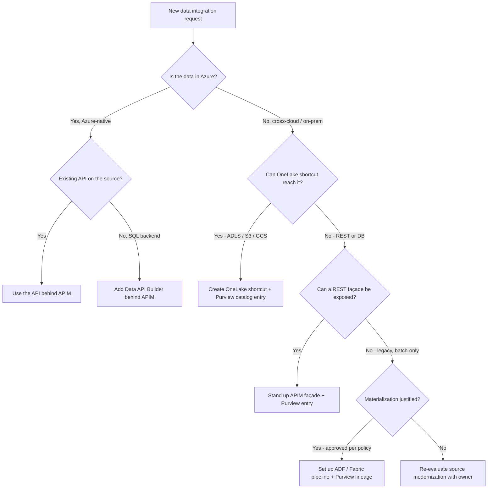

# Best Practice — Zero-Move Data Architecture

## The principle

> **Compute travels to the data. Data does not travel to the compute. Materialize only when freshness, governance, and cost analysis justify it — not by default.**

Zero-move is no longer an academic preference. Data residency regulations, sovereign cloud mandates, classified data handling rules, the cost of moving petabytes, and the freshness cost of batch pipelines have made zero-move the architectural default. This page is the opinionated playbook for executing zero-move on Azure.

---

## When to virtualize vs materialize

The single most important decision in a zero-move strategy is when to break the rule. The decision table:

| Signal | Virtualize | Materialize |
|---|---|---|
| Query latency need | Sub-minute reads OK | Sub-second reads required |
| Query freshness need | Real-time | Daily / hourly tolerable |
| Query frequency | Low-medium | Very high, repetitive |
| Data size | Any | Any |
| Compliance posture | Movement restricted | Movement permitted |
| Backend load | Low | High concern |
| Egress cost | High (cross-cloud) | Acceptable for one-time move |
| Schema stability | Stable | Stable |
| Aggregation | Light | Heavy / pre-aggregated |
| Joins across systems | Required | Pre-computed materialized |

Default to virtualize. Reach for materialization with documented justification. Materialize the **aggregated** result, not the source.

---

## The Azure zero-move toolkit

### 1. OneLake Shortcuts

OneLake shortcuts create **read-only logical references** to data in S3, GCS, ADLS Gen2, or other OneLake workspaces. The data appears in OneLake as if local but is queried in place.

| Capability | Notes |
|---|---|
| Sources supported | ADLS Gen2, S3, GCS, OneLake, AWS S3-compatible, Dataverse, on-prem via SHIR |
| Direction | Read-only |
| Engines that consume | Fabric Spark, Fabric Warehouse, Fabric KQL, Power BI Direct Lake, Synapse, Databricks |
| Authentication | Managed identity, service principal, workspace identity |
| Caching | OneLake caches files for the local region on first access |

Use when: cross-cloud data needs to participate in a Fabric / lakehouse query without movement.

### 2. APIM Façades

APIM in front of a non-Azure data source (REST, SQL via DAB, Dataverse Web API, on-prem mainframe with a REST adapter) gives the source the same API surface as any first-party Azure data source.

Use when: the data source has a transactional API; consumers want REST / OData; rate limiting and audit needed.

### 3. Synapse Serverless SQL via OPENROWSET

T-SQL queries directly against Parquet / Delta / CSV files in any storage account or S3-compatible store, no movement, pay per TB scanned.

```sql
SELECT TOP 100 *
FROM OPENROWSET(
    BULK 'https://datasource.blob.core.windows.net/path/*.parquet',
    FORMAT='PARQUET'
) AS rows
WHERE rows.region = 'NW';
```

Use when: ad-hoc T-SQL access to lake data; serving layer for Power BI Composite Models; cost-bounded ad-hoc analytics.

### 4. Power BI DirectQuery and Composite Models

DirectQuery runs report visuals as queries against the source — no import. Composite Models combine DirectQuery sources with imported tables in one semantic model.

Use when: real-time dashboards on transactional sources; cross-source joins in a report without ETL.

### 5. Databricks Delta Sharing

Delta Sharing is the open protocol for sharing Delta tables across organizations and clouds. The receiver queries without copying.

Use when: cross-organization data sharing inside the Databricks ecosystem; partner / vendor data exchange.

### 6. Dataverse Web API

Dataverse data is queryable in place via the OData v4 Web API. See [the Dataverse use case](../use-cases/dataverse-api-integration.md). No replication required.

### 7. Microsoft Graph API

M365 content (mail, files, sites, Teams, calendar) is queryable in place via the Graph API. No replication required.

### 8. Data API Builder (DAB)

DAB wraps Azure SQL, Cosmos DB, or PostgreSQL with a REST + GraphQL surface — exposing the database as an API without writing code.

Use when: a SQL backend needs to be a first-class API; combine with APIM for full gateway features.

---

## The decision tree



The defaults in this tree push every request toward virtualization. Materialization is the explicit exception, with documented justification.

---

## Operational guardrails

Zero-move without guardrails becomes zero-performance. Five rules:

### Rule 1 — Cache aggressively at the gateway

APIM cache policies for read-heavy queries:

```xml
<cache-lookup vary-by-developer="false" vary-by-developer-groups="false">
  <vary-by-header>Authorization</vary-by-header>
  <vary-by-query-parameter>$select</vary-by-query-parameter>
  <vary-by-query-parameter>$filter</vary-by-query-parameter>
</cache-lookup>
<!-- ... backend call ... -->
<cache-store duration="300" />
```

Tune duration per data product. A 5-minute cache on read-heavy dashboards routinely cuts backend load 70–90%.

### Rule 2 — Pre-aggregate when query frequency justifies

If 80% of queries against a virtualized source are the same aggregation, pre-compute it. Either:

- Use a Fabric materialized view backed by OneLake
- Use a Databricks Delta table refreshed on a schedule
- Use a Power BI semantic model with aggregation tables

The principle is the same: **materialize the aggregate, not the source**.

### Rule 3 — Watch backend load

Zero-move shifts query load to the source system. Instrument the source. If you see:

- Sustained CPU > 70% on the operational store
- Connection pool exhaustion
- Source-side rate limit triggering

…then push the work upstream — cache more aggressively, pre-aggregate, or materialize a Delta replica refreshed on schedule.

### Rule 4 — Egress is the silent cost

Cross-cloud virtualization can produce surprising egress bills. Mitigations:

- Filter and project at the source (`$select`, `$filter`) — never `SELECT *` across clouds
- Use OneLake shortcuts with regional caching to amortize
- Compress payloads (GZIP at APIM)
- For high-volume sources, materialize daily and virtualize only for fresh-window queries

### Rule 5 — Lineage is mandatory

Every virtualized source has a Purview lineage entry. Every consumer is tracked. Every join is documented. Without lineage, the architecture rots into ungovernable spaghetti within 18 months.

---

## Federal posture

Zero-move is especially valuable in regulated and sovereign environments:

| Constraint | Zero-move advantage |
|---|---|
| ITAR data | Data never crosses authorized boundary |
| FedRAMP High reciprocity on partner products | APIM brokers without re-credentialing |
| Cross-agency sharing | Delta Sharing or shortcuts let partner agencies query without copying |
| Classified data segregation | Compute can run in the higher boundary; lower-boundary data is reached through controlled façades |
| Data residency by region | Data stays in region; reports federate across regions through APIM |

The Microsoft architecture composes across boundaries cleanly because APIM, Entra, Purview, and OneLake are all FedRAMP High accredited and have IL5 / IL6 paths.

---

## Anti-patterns to refuse

| Anti-pattern | Refuse because |
|---|---|
| "Let's just copy it to ADLS to make it easier" | Easier today, more expensive forever; creates a governance liability |
| "We'll cache it in our app, no need for APIM cache" | Caching belongs at the platform, not the app — applies once, governed once |
| "We don't need lineage for this one" | The one without lineage is the one that breaks an audit |
| "Materialization is faster, let's just materialize everything" | True for one query; false for the estate; cost compounds linearly |
| "We can't virtualize because the source is too slow" | Then the source needs to be fixed or augmented — not duplicated |
| "Egress is fine — it's only a few TB / month" | Egress is the cost line item that surprises every steady-state customer |

---

## Related material

- [Best practice — API-first data strategy](./api-first-data-strategy.md)
- [Best practice — Multi-model AI orchestration](./multi-model-ai-orchestration.md)
- [Use case — Multi-cloud data virtualization](../use-cases/multi-cloud-data-virtualization.md)
- [Decision — Materialize vs Virtualize](../decisions/materialize-vs-virtualize.md)
- [Whitepaper — API-first data strategy on Azure](../research/api-first-data-strategy-whitepaper.md)
