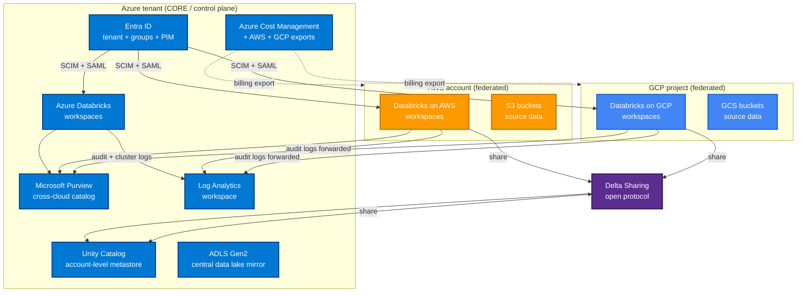
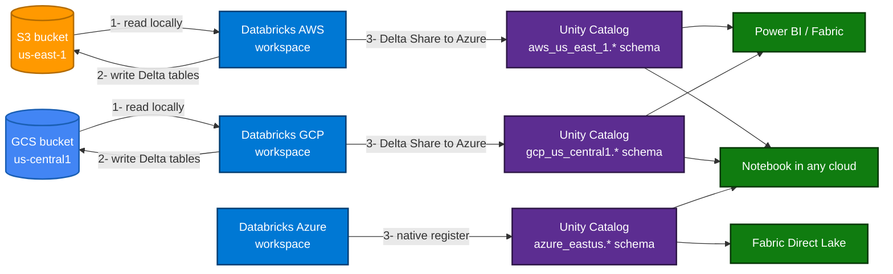
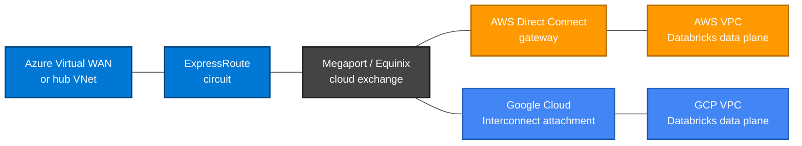

# Multi-Cloud Databricks Deployment with Azure as the Core Cloud

> **Comparative positioning note.** This document is written from the
> perspective of Microsoft Azure, Cloud Scale Analytics, and CSA Loom. Any
> description of third-party or competing products, services, pricing, or
> capabilities is derived from **publicly available documentation and sources**
> believed accurate at the time of writing, and is provided for **general
> comparison only**. We do not claim expertise in, or authority over, any
> non-Microsoft product or service; the respective vendor's official
> documentation is the authoritative source for their offerings, which may
> change over time. Nothing here is intended to disparage any vendor — where a
> competing product has genuine advantages, we aim to note them honestly.
> Verify all third-party details against the vendor's current official
> documentation before making decisions.


> A Databricks footprint that spans Azure, AWS, and Google Cloud only works when one
> cloud acts as the spine. This guide treats Azure as that spine — identity, network,
> governance, and cost converge there, while AWS and GCP host workspaces close to
> source data that cannot or should not move.

## 1. Overview — why multi-cloud Databricks with Azure as the core

Running Databricks in more than one cloud is rarely a choice; it is a consequence of
where data already lives. Acquisitions, regulator-mandated residency, vendor lock-in
exit clauses, and partner integrations all push workloads into clouds the central
platform team did not pick. The wrong response is to let each cloud run its own
Databricks tenancy with its own identity provider, its own catalog, and its own
billing. That model produces three disjoint analytics estates that share a name and
nothing else.

The right response is to designate a **core cloud** that owns the cross-cutting
concerns and let the other clouds participate as federated members. Azure is the
strongest candidate for that role for four reasons:

- **Identity hub centralized in Entra ID.** Entra ID is already the corporate IdP for
  most enterprises running Microsoft 365, so federating AWS and GCP Databricks
  accounts back into Entra ID consolidates user lifecycle, conditional access,
  privileged identity management, and audit into a system the security team already
  operates.
- **Unity Catalog as the single source of truth across clouds.** Unity Catalog is an
  account-level construct, not a workspace-level one. With an Azure Databricks
  account as the metastore anchor and Delta Sharing as the cross-account fabric, the
  catalog graph for the whole estate can be read from one pane.
- **Network spine via Azure ExpressRoute.** ExpressRoute, paired with Megaport or
  Equinix Cloud Exchange, peers cleanly into AWS Direct Connect and Google Cloud
  Interconnect. That gives the platform a single private-network backbone instead of
  three independent ones lashed together with site-to-site VPN.
- **Cost and governance unification.** Azure Cost Management can ingest AWS and GCP
  billing exports, and Microsoft Purview can catalog assets that live in S3 and GCS.
  The same Bicep / Terraform / GitHub Actions pipeline that deploys Azure landing
  zones can extend to the foreign clouds with provider blocks.

The trade-off worth naming up front: making Azure the core means accepting that an
Entra ID outage degrades login to AWS and GCP Databricks workspaces. Mitigate this
with break-glass local accounts in each cloud (documented in Section 3) and with
geo-redundant Entra ID configuration. This is the same trade-off every centralized
identity model accepts; multi-cloud does not change the calculus.

## 2. Reference architecture

### 2.1 Control plane and identity hub



Three things deserve attention in this diagram. First, Entra ID is the only IdP that
talks to all three Databricks accounts; nothing else in the architecture authenticates
users. Second, Unity Catalog in Azure is the only metastore that holds canonical
catalog metadata — the AWS and GCP accounts each run their own metastores but
publish their tables to the Azure metastore via Delta Sharing. Third, audit and cost
both flow into Azure-side sinks so a single SIEM and a single FinOps view cover the
whole estate.

### 2.2 Data-flow pattern (read-from-source-cloud, register-in-Unity-Catalog, query-from-anywhere)



The rule encoded by this diagram is simple: **data is processed where it lives, but
discovered where the catalog lives.** A notebook running in any workspace can query
any registered table because Unity Catalog resolves the share automatically; the bytes
themselves stay on the cloud they were born in unless the query plan explicitly
materializes a cross-cloud copy.

## 3. Identity federation pattern

### 3.1 Entra ID as the IdP for Databricks on AWS

Databricks on AWS supports SCIM 2.0 for user and group provisioning and SAML 2.0 for
single sign-on. Both are configured at the **account console** level (`accounts.cloud.databricks.com`),
not per workspace.

The configuration is documented at:

- SCIM provisioning from Entra ID:
  <https://learn.microsoft.com/azure/active-directory/saas-apps/databricks-provisioning-tutorial>
- SSO with Entra ID for Databricks accounts:
  <https://docs.databricks.com/aws/en/admin/users-groups/scim/aad>

The steps, in order:

1. **Register Databricks as an Enterprise Application in Entra ID.** Use the
   "Azure Databricks SCIM Provisioning Connector" gallery app. Despite the name it
   works for AWS- and GCP-hosted Databricks accounts; the SCIM endpoint is
   account-host-agnostic.
2. **Capture the SCIM endpoint URL and PAT from the Databricks account console.**
   The endpoint is `https://accounts.cloud.databricks.com/api/2.0/accounts/<account-id>/scim/v2`.
   The PAT must belong to an account admin.
3. **Configure SCIM in the Entra ID enterprise app.** Set Tenant URL and Secret Token
   from step 2, then map the attribute schema. Critical mappings: `userPrincipalName → userName`,
   `objectId → externalId`, and the group `displayName → displayName` with member
   linking via `objectId`.
4. **Enable SAML SSO on the same enterprise app.** The reply URL is
   `https://accounts.cloud.databricks.com/saml/consume`. Upload the federation
   metadata XML on the Databricks side under **Account Console → Settings → Authentication**.
5. **Repeat the SAML step at the workspace level if your account is on the legacy
   workspace-SSO model.** New accounts can rely on account-level SSO and skip this.

The same gallery app and the same SCIM mapping are used for **Databricks on GCP**;
only the reply URL differs (`https://accounts.gcp.databricks.com/saml/consume`). See
<https://docs.gcp.databricks.com/en/admin/users-groups/scim/aad.html>.

### 3.2 Unified user and group model

Every persona in the estate exists exactly once — as an Entra ID user — and joins one
or more Entra ID security groups. Those groups are projected into all three Databricks
accounts via SCIM, where they become the only principals used to grant Unity Catalog
permissions. No local Databricks users, no local Databricks groups, no workspace-local
ACL rules.

A typical group naming convention:

| Entra ID group                          | Purpose                                                                    |
| --------------------------------------- | -------------------------------------------------------------------------- |
| `dbx-platform-admins`                   | Account admins across all three clouds                                     |
| `dbx-workspace-admins-azure-eastus`     | Workspace admins for a specific region                                     |
| `dbx-data-engineers-<domain>`           | Read/write on bronze + silver for one domain                               |
| `dbx-data-analysts-<domain>`            | Read-only on gold for one domain                                           |
| `dbx-ml-engineers-<project>`            | Model registry + feature store access for one MLflow project               |
| `dbx-breakglass-<cloud>`                | Local admin fallback if Entra ID is unreachable; access requires PIM       |

The `dbx-breakglass-*` groups are the answer to the Entra-ID-outage trade-off named
in Section 1. Each one resolves to a single local Databricks account admin whose
credentials are stored in the corporate password vault under a four-eyes seal.

### 3.3 Service principal pattern for cross-cloud automation

Databricks automation — Terraform, dbt, CI/CD runners, scheduled jobs that touch
multiple workspaces — needs a non-human identity. The right pattern is one Entra ID
**service principal** per automation system, projected via SCIM into the same three
Databricks accounts.

- In Azure Databricks the SP authenticates with **Federated Workload Identity**
  (no client secret) when running in an Azure-hosted CI runner. See
  <https://learn.microsoft.com/azure/databricks/dev-tools/auth/oauth-m2m>.
- In Databricks on AWS the same SP authenticates by exchanging an Entra ID OIDC
  token for a Databricks OAuth token via SCIM-provisioned identity. Token exchange
  is documented at <https://docs.databricks.com/aws/en/dev-tools/auth/oauth-m2m.html>.
- In Databricks on GCP the same exchange works via OIDC federation; see
  <https://docs.gcp.databricks.com/en/dev-tools/auth/oauth-m2m.html>.

The result is that the same `pipelines-sp` identity can run a multi-workspace job
without any cloud holding a long-lived secret. Rotation is handled by Entra ID and
applies everywhere automatically.

## 4. Unity Catalog multi-region / multi-cloud

### 4.1 One metastore per Databricks account

Unity Catalog enforces a hard rule that has shaped every architecture in this guide:
**a Databricks account can have at most one metastore per region.** That is why each
cloud runs its own metastores; they are not optional. The Azure account, the AWS
account, and the GCP account each maintain a metastore per region they operate in.

What ties them together is Delta Sharing. Each foreign metastore designates Azure's
metastore as a *recipient*, then `CREATE SHARE` and `ALTER SHARE ... ADD TABLE` are
used to publish tables outward. On the Azure side those shares appear as catalogs
prefixed by the source cloud and region, e.g. `aws_us_east_1`, `gcp_us_central1`.

```sql
-- On the AWS Databricks workspace (us-east-1 metastore)
CREATE SHARE aws_us_east_1_sales;
ALTER SHARE aws_us_east_1_sales
  ADD TABLE sales.bronze.orders;
ALTER SHARE aws_us_east_1_sales
  ADD TABLE sales.silver.order_lines;
CREATE RECIPIENT azure_core
  USING ID 'azure:eastus:<azure-metastore-uuid>';
GRANT SELECT ON SHARE aws_us_east_1_sales TO RECIPIENT azure_core;

-- On the Azure Databricks workspace (eastus metastore)
CREATE CATALOG aws_us_east_1
  USING SHARE '<provider-share-name>.aws_us_east_1_sales';
```

### 4.2 Catalog hierarchy

The recommended three-level layout is:

| Level    | Convention                           | Example                                |
| -------- | ------------------------------------ | -------------------------------------- |
| Catalog  | `<cloud>_<region>` or `<environment>`| `aws_us_east_1`, `prod`, `dev`         |
| Schema   | `<domain>_<medallion-tier>`          | `sales_silver`, `finance_gold`         |
| Table    | `<entity>` (lowercase, snake_case)   | `orders`, `customer_dim`               |

For Azure-native data (the "home" cloud) catalogs may use environment names instead
of cloud prefixes — `prod.sales_silver.orders` is more natural than
`azure_eastus.sales_silver.orders`. The trade-off is that the moment you mirror that
catalog to AWS or GCP via Delta Sharing the absence of a cloud prefix becomes
ambiguous, so pick a convention and stick to it across the estate.

### 4.3 Recommended layout: per-cloud-region catalogs, shared via Delta Sharing

For an enterprise running three clouds and two regions per cloud, the catalog graph
looks like:

- `prod` (Azure eastus, native — the canonical gold-tier home)
- `aws_us_east_1` (read-only mirror from AWS via Delta Share)
- `aws_eu_west_1` (read-only mirror from AWS via Delta Share)
- `gcp_us_central1` (read-only mirror from GCP via Delta Share)
- `gcp_europe_west4` (read-only mirror from GCP via Delta Share)

Cross-cloud joins are expressed as ordinary SQL — Unity Catalog hides the share
protocol from the query author:

```sql
SELECT
    a.order_id,
    a.order_total_usd,
    g.shipment_status
FROM aws_us_east_1.sales_silver.orders   AS a
JOIN gcp_us_central1.logistics_silver.shipments AS g
  ON a.order_id = g.order_id
WHERE a.order_date >= current_date - INTERVAL 7 DAYS;
```

### 4.4 Lineage and audit log centralization

Unity Catalog captures column-level lineage automatically for Spark and SQL workloads,
and Databricks emits an `account.lineage` system table that can be queried like any
Delta table. The system tables also include `account.access`, `account.billing.usage`,
and `account.cluster_logs`.

The pattern to centralize all of this in Azure Log Analytics is:

1. On each foreign Databricks account, enable system tables (`SYSTEM SCHEMA enable`).
2. Schedule a small notebook on each foreign workspace that reads the new rows from
   `system.access.audit` since the last watermark and writes them to a Delta table.
3. Use Azure Event Hubs as the buffer: the notebook publishes to an Event Hub in the
   Azure tenant with a SAS or AAD token, and Diagnostic Settings on the Event Hub
   forward to Log Analytics.
4. In the Azure-native workspace the same source — `system.access.audit` — is read
   directly with a workspace diagnostic setting that streams straight to Log
   Analytics.

The same pattern works for `system.billing.usage`, producing one cross-cloud usage
Kusto table.

## 5. Network architecture

### 5.1 ExpressRoute as the spine

ExpressRoute terminates at a Microsoft Enterprise Edge router; on the customer side it
peers into an on-premises router or, more usefully for multi-cloud, into a colocation
provider (Megaport, Equinix, PacketFabric) that offers cloud-cloud routing as a
service.



ExpressRoute Global Reach is not the right tool here because it only links two Azure
ExpressRoute circuits in the same Microsoft global network. Cross-cloud routing
requires the cloud exchange to BGP-peer between the AWS, Azure, and GCP underlays.

### 5.2 Private endpoints

Each Databricks workspace exposes a control plane and a data plane. The data plane
runs in the customer's VNet (Azure), VPC (AWS), or VPC (GCP); the control plane runs
in Databricks' own subscription. Private connectivity is configured separately on
both planes:

- **Azure** — Use Databricks Private Link for both back-end (control-plane to data-plane)
  and front-end (user-to-workspace) traffic.
  See <https://learn.microsoft.com/azure/databricks/security/network/private-link>.
- **AWS** — Use Databricks PrivateLink endpoints (VPCE) and front-end PrivateLink for
  the workspace URL. See <https://docs.databricks.com/aws/en/security/network/classic/privatelink.html>.
- **GCP** — Use Databricks Private Service Connect (PSC) for the workspace URL and
  back-end. See <https://docs.gcp.databricks.com/en/security/network/psc.html>.

The pattern that ties them together: all three private endpoints terminate inside
networks that route back to the Azure hub via the cloud exchange. A data engineer
sitting at an on-prem desk uses the same Azure ExpressRoute circuit to reach the
AWS and GCP workspaces as they use to reach the Azure workspace; no public DNS or
public IP is involved.

### 5.3 DNS forwarding patterns

Databricks workspaces are reached via cloud-specific DNS names that resolve to
private IPs only when queried from within an associated private endpoint zone. To make
those names resolvable everywhere in the enterprise:

1. Stand up an **Azure DNS Private Resolver** in the hub VNet.
2. Create conditional forwarders on the resolver for the Databricks zones:
    - `*.azuredatabricks.net` (Azure)
    - `*.cloud.databricks.com` (AWS)
    - `*.gcp.databricks.com` (GCP)
3. Forward each conditional zone to the DNS resolver in the foreign cloud
   (Route 53 Resolver Inbound Endpoint for AWS; Cloud DNS server policy with inbound
   forwarding for GCP).
4. Peer the on-prem DNS to the Azure resolver so corporate workstations can
   resolve all three.

The reverse paths must also be set up so that AWS-resident notebooks can resolve
`*.azuredatabricks.net` privately if they need to reach Azure-side storage.

## 6. Data residency and governance

### 6.1 Per-cloud-region residency enforcement via Unity Catalog policies

Unity Catalog enforces residency at the **storage credential** and **external location**
level. A storage credential is bound to one cloud's IAM principal (Azure Managed
Identity, AWS IAM role, GCP service account); an external location is bound to a
specific bucket / container in one region. Tables created against that external
location inherit the residency.

For workloads with hard residency rules — GDPR personal data must stay in EU,
ITAR data must stay in US — the enforcement pattern is:

1. Create catalogs scoped to the residency boundary (e.g. `eu_gdpr`, `us_itar`).
2. Bind every external location under that catalog to storage in the matching region.
3. Use **catalog-level isolation** to deny cross-region access:
   `ALTER CATALOG eu_gdpr SET WORKSPACE BINDING <eu-workspace-id>`.
4. Layer **row filters** and **column masks** on top for finer-grain rules.

Documented at <https://learn.microsoft.com/azure/databricks/data-governance/unity-catalog/catalog-binding>.

### 6.2 Tagging strategy that survives cross-cloud sharing

Unity Catalog supports tags on catalogs, schemas, tables, and columns. Critically,
**tags propagate through Delta Sharing** — a `pii=true` tag set on a table in AWS is
visible on the Azure side after the share is mounted as a catalog. This is the
mechanism that makes governance work across clouds.

The minimum tag set every table in the estate carries:

| Tag                    | Allowed values                                       | Purpose                                       |
| ---------------------- | ---------------------------------------------------- | --------------------------------------------- |
| `data_classification`  | `public`, `internal`, `confidential`, `restricted`   | Drives access policy and audit retention      |
| `pii`                  | `true`, `false`                                      | Drives DSAR (subject-access) tooling          |
| `residency`            | `us`, `eu`, `apac`, `gov`                            | Drives catalog binding rules                  |
| `domain`               | `sales`, `finance`, `logistics`, ...                 | Drives ownership and on-call routing          |
| `owner`                | Entra ID group name                                  | Drives stewardship                            |
| `cost_center`          | Corporate cost-center code                           | Drives FinOps                                 |
| `env`                  | `dev`, `staging`, `prod`                             | Drives promotion and DR scope                 |

### 6.3 Purview cross-cloud catalog federation

Microsoft Purview scans Databricks workspaces in all three clouds through native
connectors:

- Azure Databricks (Hive metastore + Unity Catalog): GA.
- Databricks on AWS via Unity Catalog: GA.
- Databricks on GCP via Unity Catalog: in preview as of 2026 Q1; check
  <https://learn.microsoft.com/purview/scan-data-source-multicloud> for current status.

The pattern: Purview is provisioned in the Azure tenant, with managed identities or
secret-backed connections to each foreign Databricks account. Scans run on a daily
schedule; classifications, glossary terms, and lineage land in the Purview Data Map
where they are visible alongside Azure-native assets in ADLS Gen2 and Synapse.

Two limitations to plan around:

- Cross-cloud lineage is reconstructed from query history, not pushed live. A
  Databricks notebook in AWS that writes to an S3 bucket and then publishes via
  Delta Share will not appear as a single connected lineage node in Purview until
  the next scan cycle.
- Purview's Data Catalog APIs (the ones backing the search UI) are rate-limited per
  tenant; very large multi-cloud estates may need to throttle scan frequency.

## 7. Cost management

### 7.1 Centralized cost view

The three cost sources to unify:

| Source                     | Mechanism                                                                                 |
| -------------------------- | ----------------------------------------------------------------------------------------- |
| Azure subscriptions        | Native ingest into Azure Cost Management                                                  |
| AWS accounts               | AWS Cost & Usage Report (CUR) export to S3, then Cost Management connector to Azure       |
| GCP projects               | BigQuery billing export, then Cost Management connector via the GCP integration           |
| Databricks DBU consumption | `system.billing.usage` system table in each Databricks account                            |

The Azure Cost Management AWS and GCP connectors are documented at
<https://learn.microsoft.com/azure/cost-management-billing/costs/aws-integration-set-up-configure>
and <https://learn.microsoft.com/azure/cost-management-billing/costs/google-integration-set-up>.
Both produce a unified cost view that respects the corporate tag standard, provided
the same tags exist on the foreign-cloud resources.

### 7.2 Tag standard applied uniformly

The same seven tags from Section 6.2 are applied to the cloud resources themselves
— VMs, storage accounts, EC2 instances, GCE instances, S3 buckets, GCS buckets — via
Azure Policy, AWS Service Control Policies, and GCP Organization Policies. Resources
without the full tag set are denied at creation time. This is the single most
important governance control in a multi-cloud Databricks estate; without it, FinOps
reconciliation is impossible.

### 7.3 DBU consumption analytics via system tables

`system.billing.usage` is identical schema across all three clouds:

```sql
SELECT
    workspace_id,
    sku_name,
    cloud,
    usage_date,
    SUM(usage_quantity)        AS dbus,
    SUM(usage_quantity * 0.55) AS estimated_cost_usd
FROM system.billing.usage
WHERE usage_date >= current_date - INTERVAL 30 DAYS
GROUP BY workspace_id, sku_name, cloud, usage_date
ORDER BY usage_date DESC, dbus DESC;
```

Unioning the three accounts' system tables via Delta Sharing produces a single
estate-wide DBU consumption dataset. Pair it with Power BI or Fabric Direct Lake for
self-service FinOps dashboards.

## 8. Disaster recovery

### 8.1 Per-cloud HA within region

Each Databricks workspace runs across multiple availability zones natively; clusters
self-heal across AZ failure. The first DR layer is just configuring workspaces in
zone-redundant mode:

- Azure: Use availability zone–aware VM SKUs in cluster policies; ADLS Gen2 with
  Zone-Redundant Storage (ZRS).
- AWS: Multi-AZ subnets in the workspace VPC; S3 by default replicates within a
  region.
- GCP: Multi-zone subnets and regional Cloud Storage buckets.

### 8.2 Cross-cloud DR pattern: Delta Sharing read replicas

The pattern of last resort, used when a region or an entire cloud is unavailable,
is to keep a **read replica catalog** in a sibling cloud. Delta Sharing is the
replication mechanism. The replica is read-only by design — write traffic does not
fail over automatically.

Concretely: the canonical gold-tier sales data lives in `prod.sales_gold.orders` in
Azure eastus. A scheduled job in Azure publishes the catalog as a Delta Share to a
recipient in `aws_us_east_1` and a recipient in `gcp_us_central1`. If Azure eastus is
unavailable, dashboards re-point to one of the replicas. Writers cut over manually
through a documented runbook because Delta Sharing recipients cannot accept writes.

### 8.3 RTO / RPO targets per scenario

| Scenario                                    | RTO        | RPO        | Mechanism                                                  |
| ------------------------------------------- | ---------- | ---------- | ---------------------------------------------------------- |
| AZ failure within a region                  | < 5 min    | 0          | Multi-AZ cluster + ZRS storage                             |
| Single region failure (Azure paired region) | < 1 hour   | < 15 min   | Paired-region replication via Azure-native geo redundancy  |
| Single region failure (no paired region)    | < 4 hours  | < 1 hour   | Delta Sharing replica in sibling cloud + dashboard re-point |
| Whole-cloud outage                          | < 24 hours | < 4 hours  | Manual failover to a sibling-cloud read replica            |
| Catastrophic Entra ID outage                | < 2 hours  | n/a        | Local break-glass admins per cloud                         |

### 8.4 Failover runbook outline

A production-grade runbook covers four phases:

1. **Detect.** Azure Monitor alert on workspace health probe + synthetic notebook
   that runs every 5 minutes from the BI tier.
2. **Decide.** A documented severity ladder. Sev-1 (whole region down) triggers
   automatic dashboard re-pointing. Sev-2 (degraded latency) requires human approval.
3. **Failover.** Update the Power BI / Fabric semantic model's source catalog from
   `prod.sales_gold` to `dr_replica.sales_gold`. Notify users via the in-app banner.
4. **Failback.** When the primary region recovers, re-sync the replica from primary
   using `MERGE` on a Delta Sharing watermark, validate row counts, then revert the
   semantic-model source.

The runbook lives in source control next to the Bicep that deploys the workspaces.
Treat it as code; rehearse it quarterly.

## 9. Best practices checklist

Production-readiness gate. Every multi-cloud Databricks deployment should pass all
fifteen items before going live.

- [ ] Entra ID is the only IdP configured on all three Databricks accounts; no local users exist except documented break-glass admins.
- [ ] SCIM provisioning runs every 40 minutes and is monitored for failure.
- [ ] Service principals for automation use OIDC federation; no long-lived secrets are stored.
- [ ] Every catalog in every cloud has a `data_classification` tag; queries that touch `restricted` data are audited to Log Analytics.
- [ ] The corporate tag standard (`data_classification`, `pii`, `residency`, `domain`, `owner`, `cost_center`, `env`) is enforced by Azure Policy + AWS SCP + GCP Org Policy.
- [ ] ExpressRoute or equivalent private connectivity exists between Azure and every foreign cloud running Databricks; no production traffic crosses the public internet.
- [ ] DNS conditional forwarding works in both directions for all three Databricks DNS zones.
- [ ] Unity Catalog system tables (`access.audit`, `billing.usage`, `lineage`) are enabled on every account.
- [ ] Audit logs from all three clouds land in a single Log Analytics workspace.
- [ ] Microsoft Purview scans every Databricks workspace at least daily.
- [ ] Azure Cost Management has AWS CUR and GCP billing-export connectors configured.
- [ ] Delta Sharing read replicas exist in a sibling cloud for every gold-tier catalog.
- [ ] Disaster-recovery runbook is in source control and rehearsed quarterly.
- [ ] Break-glass admin credentials in each cloud are sealed in the corporate vault under four-eyes control.
- [ ] Bicep/Terraform pipelines deploy all three clouds from one repository; drift is detected nightly.

## 10. Reference deployments

### Databricks Terraform provider — one config across three clouds

The Databricks Terraform provider is cloud-agnostic; the same module can target
Azure, AWS, and GCP by changing the provider configuration. The pattern uses one
shared module per workspace shape and three provider stanzas:

```hcl
terraform {
  required_providers {
    azurerm    = { source = "hashicorp/azurerm",   version = "~> 4.0" }
    aws        = { source = "hashicorp/aws",       version = "~> 5.0" }
    google     = { source = "hashicorp/google",    version = "~> 5.0" }
    databricks = { source = "databricks/databricks", version = "~> 1.50" }
  }
}

provider "databricks" {
  alias              = "azure"
  host               = module.workspace_azure.workspace_url
  azure_workspace_resource_id = module.workspace_azure.id
}

provider "databricks" {
  alias    = "aws"
  host     = module.workspace_aws.workspace_url
  account_id = var.databricks_aws_account_id
}

provider "databricks" {
  alias    = "gcp"
  host     = module.workspace_gcp.workspace_url
  account_id = var.databricks_gcp_account_id
}
```

The full provider reference is at
<https://registry.terraform.io/providers/databricks/databricks/latest/docs>.

### Official reference architectures

- Databricks public reference architectures (cloud-by-cloud, including hub-and-spoke):
  <https://www.databricks.com/solutions/reference-architectures>
- Databricks multi-cloud guide (vendor-published):
  <https://www.databricks.com/blog/multi-cloud-data-platform-databricks>
- Microsoft Learn: Azure Databricks reference architecture set:
  <https://learn.microsoft.com/azure/architecture/databricks-monitoring/>
- Microsoft Cloud Adoption Framework — multi-cloud governance:
  <https://learn.microsoft.com/azure/cloud-adoption-framework/scenarios/multi-cloud/>

### Related guides in this site

- [Databricks Unity Catalog](../../../guides/databricks-unity-catalog.md) — the
  governance primitives this guide builds on
- [Databricks Best Practices](../../../guides/databricks-best-practices.md) —
  single-cloud baselines that still apply
- [Microsoft Purview](../../../guides/purview.md) — cross-cloud catalog federation
- [Multi-Cloud Data Virtualization](../../../use-cases/multi-cloud-data-virtualization.md)
  — the complementary "query without moving" pattern
