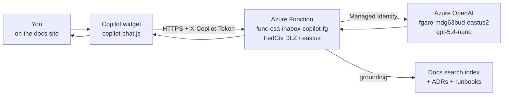

# AI Copilot — Chat with the Docs

Every page on this site has a **Copilot chat widget** in the bottom-right corner. It's grounded in this entire documentation site (search index + Azure OpenAI) and answers questions about the platform — architecture, deployment, code, ADRs, runbooks.

## How it works

## What it can answer well

✅ **Good fits**
- "How do I deploy the foundation platform to Azure Government?"
- "Why did you choose Bicep over Terraform?" (cites ADR 0004)
- "What's the difference between the two rate limiters?" (cites ADR 0021)
- "Show me the read-only SQL guard from the Fabric Data Agent example"
- "Which compliance frameworks are mapped?"

❌ **Bad fits** (use a real chat completion or open an issue)
- Anything stateful across pages (each prompt is independent)
- Code generation outside the platform
- Real-time Azure status (call the Azure Status API)
- Anything that requires writing to your tenant

## Privacy and data handling

| Data | Where it goes |
|------|---------------|
| Your prompt | Azure Function in our **FedCiv DLZ** subscription → Azure OpenAI in the same subscription. Logged for 90 days for abuse prevention. |
| Your IP / origin | CORS-restricted to `fgarofalo56.github.io` and `localhost`. Logged for rate limiting only. |
| Auth | Anonymous. A short-lived `X-Copilot-Token` derived from a 30-second window prevents trivial scraping but is **not** authentication. |
| Training | We do **not** use your prompts to train any model. Azure OpenAI is configured with `data_collection: opt-out`. |

For the full deployment posture, see [`azure-functions/copilot-chat/DEPLOYMENT.md`](https://github.com/fgarofalo56/csa-inabox/blob/main/azure-functions/copilot-chat/DEPLOYMENT.md).

## How it's built

| Layer | Tech | Decision |
|-------|------|----------|
| Frontend | Plain JS widget injected by mkdocs-material | [`docs/javascripts/copilot-chat.js`](https://github.com/fgarofalo56/csa-inabox/blob/main/docs/javascripts/copilot-chat.js) |
| Backend | Azure Functions Python isolated worker | [`azure-functions/copilot-chat/`](https://github.com/fgarofalo56/csa-inabox/blob/main/azure-functions/copilot-chat) |
| LLM | Azure OpenAI `gpt-5.4-nano` | [ADR 0007](adr/0007-azure-openai-over-self-hosted-llm.md) |
| Auth between widget and backend | `X-Copilot-Token` (sliding 30s window, sha256 of secret) | Documented in [`DEPLOYMENT.md`](https://github.com/fgarofalo56/csa-inabox/blob/main/azure-functions/copilot-chat/DEPLOYMENT.md) |
| Grounding | mkdocs search index over docs/ tree | Same index used by the page-level search |
| Architectural separation from app-Copilot | [ADR 0022](adr/0022-copilot-surfaces-vs-docs-widget.md) explains why the docs widget is **deliberately separate** from `apps/copilot/` |

## If the widget is broken

1. **Open browser DevTools → Network tab**, send a message, and check the request to `func-csa-inabox-copilot-fg.azurewebsites.net/api/chat`
2. If you see `403`: token mismatch, refresh the page (token rotates every 30s — clock skew can cause one window of failures)
3. If you see `429`: rate limited, wait 60s
4. If you see `5xx`: open an issue with the request ID from the response header `X-Request-Id`
5. If the widget is missing: the `copilot-chat.js` script may be blocked by your browser's content blocker — try an incognito window

## Roadmap

- [ ] Citations rendered as inline footnote-style links
- [ ] Streaming responses (currently full-buffer)
- [ ] Per-user conversation history (anonymous, browser-local only)
- [ ] Promote `AZURE_OPENAI_KEY` from app setting to Key Vault reference (system MI is already wired)

Tracked in [`azure-functions/copilot-chat/DEPLOYMENT.md`](https://github.com/fgarofalo56/csa-inabox/blob/main/azure-functions/copilot-chat/DEPLOYMENT.md) §Known follow-ups.
