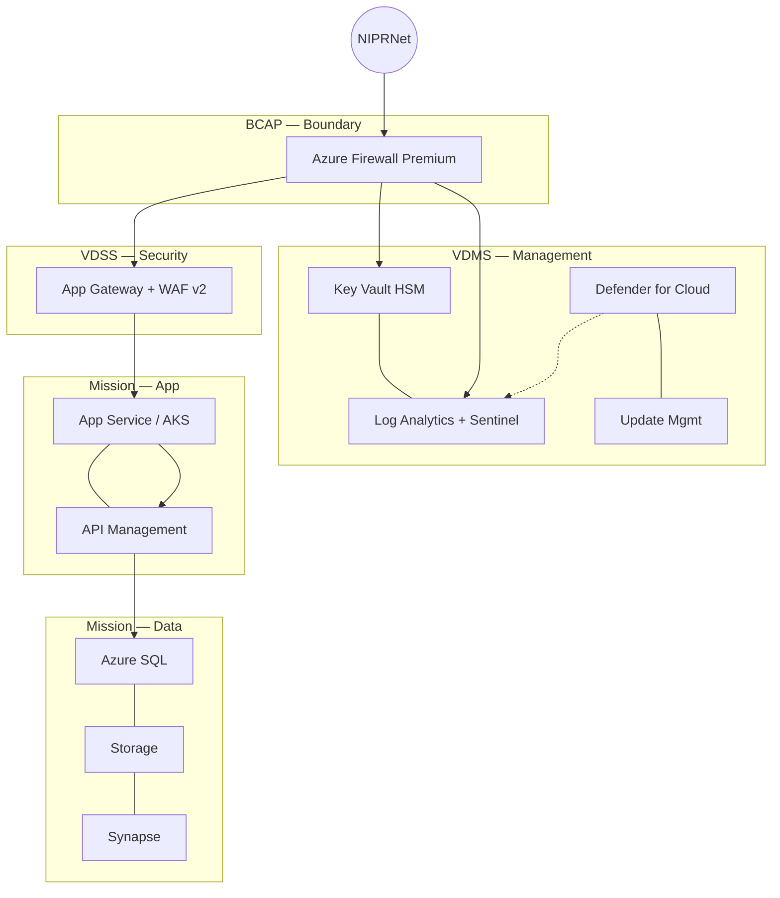

# Compliance — DoD Impact Level 4 / Impact Level 5

--8<-- "_includes/compliance-disclaimer.md"

> **Scope:** Department of Defense cloud deployments at **Impact Level 4** (Controlled Unclassified Information) and **Impact Level 5** (CUI + mission-critical / National Security Systems). This guide covers the DISA Cloud Computing SRG requirements and how CSA-in-a-Box maps to them on Azure Government.

---

## Overview

The **Defense Information Systems Agency (DISA) Cloud Computing Security Requirements Guide (CC SRG)** defines six Impact Levels that govern where DoD data can reside in the cloud:

| Impact Level | Data classification                               | Typical CSP                               |
| ------------ | ------------------------------------------------- | ----------------------------------------- |
| **IL2**      | Public / non-CUI unclassified                     | Azure Commercial (FedRAMP Moderate)       |
| **IL4**      | CUI, export-controlled, PII, PHI, FOUO            | Azure Government (FedRAMP High + SRG IL4) |
| **IL5**      | CUI + mission-critical, National Security Systems | Azure Government (dedicated IL5 enclave)  |
| **IL6**      | Classified — SECRET                               | Azure Government Secret (air-gapped)      |

CSA-in-a-Box targets **IL4 and IL5** deployments. The CC SRG builds on **NIST SP 800-53 Rev 5** and layers DoD-specific overlays for network isolation, personnel vetting, physical location, and encryption. A valid **FedRAMP High** Provisional Authorization (PA) is a prerequisite for IL4; IL5 adds further isolation and key-management requirements.

---

## IL4 vs IL5 comparison

| Requirement               | IL4                                        | IL5                                                               |
| ------------------------- | ------------------------------------------ | ----------------------------------------------------------------- |
| **Data types**            | CUI, PII, PHI, FOUO, export-controlled     | All IL4 types + mission-critical, National Security Systems (NSS) |
| **CSP authorization**     | FedRAMP High PA + DISA IL4 PA              | FedRAMP High PA + DISA IL5 PA                                     |
| **Network isolation**     | Logical separation from commercial tenants | Physical or cryptographic separation from IL4 and below           |
| **Personnel**             | US persons (favorable adjudication)        | US persons with NDA + favorable adjudication; CNSS 1253 overlay   |
| **Physical location**     | CONUS or OCONUS with SOFA agreement        | CONUS only (no OCONUS exceptions)                                 |
| **Encryption at rest**    | FIPS 140-2 Level 1+                        | FIPS 140-2 Level 2+ with key separation from lower ILs            |
| **Encryption in transit** | FIPS 140-2 validated TLS 1.2+              | FIPS 140-2 validated TLS 1.2+, NSA-approved for NSS               |
| **Key management**        | CSP-managed or customer-managed keys       | Customer-managed keys in dedicated HSM, isolated from IL4         |
| **Port & protocol**       | DISA PPSM compliance                       | DISA PPSM + mission-owner-approved protocols only                 |

!!! danger "IL5 key separation is non-negotiable"
IL5 encryption keys **must** be isolated from IL4 infrastructure. Azure Government meets this via dedicated IL5 compute stamps, but your Key Vault deployment must also use a separate subscription and HSM pool from any IL4 workloads.

---

## Azure deployment targets

### IL4 — Azure Government

| Region          | Designation                        |
| --------------- | ---------------------------------- |
| US Gov Virginia | Primary (paired with US Gov Texas) |
| US Gov Texas    | Secondary                          |
| US Gov Arizona  | DR / tertiary                      |

Azure Government holds FedRAMP High and DISA IL4 PA for these regions. Deploy CSA-in-a-Box using the Gov Bicep variant at `deploy/bicep/gov/`.

### IL5 — Azure Government (dedicated infrastructure)

IL5 workloads run on **dedicated Azure Government infrastructure** physically separated from IL4 compute, in the **US DoD Central** and **US DoD East** regions.

### IL6 — Azure Government Secret (air-gapped)

IL6 is out of scope for CSA-in-a-Box. It requires air-gapped networks, SECRET clearances, and SCIF-level physical security.

---

## CSA-in-a-Box IL4 / IL5 configuration

### Landing zone

Deploy into an **Azure Government subscription** with the Gov Bicep modules (`deploy/bicep/gov/`). The landing zone implements isolated VNets per workload tier, SCCA-compliant network architecture, dedicated resource groups with DoD tagging, and Azure Policy for the CC SRG baseline.

### SCCA — Secure Cloud Computing Architecture

DISA's SCCA mandates three boundary-protection components (`Internet -> BCAP -> VDSS -> VDMS -> Mission VNets`):

| Component | Purpose                                                        | CSA-in-a-Box mapping                                          |
| --------- | -------------------------------------------------------------- | ------------------------------------------------------------- |
| **BCAP**  | Boundary Cloud Access Point — traffic inspection at cloud edge | Azure Firewall Premium with IDPS + TLS inspection             |
| **VDSS**  | Virtual Datacenter Security Stack — IDS/IPS, reverse proxy     | Azure Firewall Premium + WAF on Application Gateway           |
| **VDMS**  | Virtual Datacenter Managed Services — patching, scanning, SIEM | Defender for Cloud + Sentinel + Update Management + Key Vault |

The [Hub-Spoke Topology](../reference-architecture/hub-spoke-topology.md) maps directly to the SCCA model: the hub VNet hosts BCAP/VDSS/VDMS, and spoke VNets host mission workloads.

### Identity

- **Entra ID Government** (US Gov cloud instance) for all authentication
- **CAC/PIV** via Entra certificate-based authentication (CBA); **Conditional Access** enforcing CAC/PIV for privileged ops
- **PIM** for just-in-time role activation

!!! tip "CAC/PIV with Entra CBA"
Configure Entra ID certificate-based authentication to accept DoD PKI root CAs. Map the certificate `SAN:RFC822Name` or `Subject` fields to Entra user attributes for seamless CAC login.

### Encryption

- **FIPS 140-2 Level 2** minimum; **CMK** via Key Vault Premium (HSM-backed) for Storage, SQL, Cosmos, Synapse
- **Double encryption** on storage (`requireInfrastructureEncryption: true`)
- **IL5 key isolation** — separate Key Vault subscription from IL4 workloads

### Logging and monitoring

- All diagnostic logs to **Azure Monitor** (Log Analytics in Gov region); **Sentinel** for SIEM/SOAR
- **Retention**: 1-year hot + 6-year cold archive in immutable blob storage
- STIG-aligned audit events per [LOG_SCHEMA.md](../LOG_SCHEMA.md)

### Network

- **Private endpoints** everywhere; **Azure Firewall Premium** with IDPS; **no public IPs** on data plane
- NSG flow logs retained 1 year with Traffic Analytics; no internet egress without explicit rule

---

## Architecture — SCCA boundary model



---

## STIGs — Security Technical Implementation Guides

DISA STIGs apply to every component in the authorization boundary:

| STIG                         | Applies to                 | CSA-in-a-Box coverage                             |
| ---------------------------- | -------------------------- | ------------------------------------------------- |
| Azure SQL Database STIG      | Azure SQL instances        | Bicep enforces TDE, AAD-only auth, auditing       |
| Windows Server 2022 STIG     | IaaS VMs (jumpbox, agents) | Defender for Cloud guest configuration baseline   |
| Azure Key Vault STIG (draft) | Key Vault Premium          | Purge protection, soft-delete, RBAC, network ACLs |
| Web Server STIG (IIS/nginx)  | App Service containers     | Security headers middleware, TLS-only             |
| Microsoft Entra STIG         | Entra ID tenant            | CBA, MFA, PIM, Conditional Access                 |
| Network Firewall STIG        | Azure Firewall Premium     | Deny-by-default, IDPS signatures, TLS inspection  |

### Azure Policy for STIG compliance

Assign the built-in **DoD DISA STIG** policy initiative at subscription scope:

```bicep
resource stigAssignment 'Microsoft.Authorization/policyAssignments@2024-04-01' = {
  name: 'dod-disa-stig'
  properties: {
    policyDefinitionId: '/providers/Microsoft.Authorization/policySetDefinitions/d379c8d7-4e0e-4e4a-a914-1a2de9a67c6b'
    displayName: 'DoD DISA STIG - Azure Government'
  }
}
```

!!! tip "Automated STIG scanning"
Enable **Defender for Cloud regulatory compliance** with the DISA STIG initiative. This provides continuous assessment with a compliance score and per-resource remediation guidance viewable in the Azure Government portal.

---

## Authorization process

DoD cloud authorization follows the **Risk Management Framework (RMF)** per DoDI 8510.01:

1. **Categorize** — System categorization using CNSSI 1253 (maps to FIPS 199)
2. **Select** — Apply CC SRG baseline controls for the target IL + NIST 800-53 overlay
3. **Implement** — Deploy CSA-in-a-Box with Gov Bicep modules; document in SSP
4. **Assess** — DISA or authorized 3PAO performs Security Assessment Report (SAR)
5. **Authorize** — Authorizing Official issues Provisional Authorization at target IL
6. **Monitor** — Continuous monitoring per DISA ConMon (monthly scans, POA&M, annual reassessment)

The CSP (Microsoft Azure Government) holds the infrastructure PA. Your system inherits that PA and must obtain its own **system-level ATO** from the sponsoring DoD component.

---

## Common gaps and mitigations

| Typical finding                   | Impact | CSA-in-a-Box mitigation                                                  |
| --------------------------------- | ------ | ------------------------------------------------------------------------ |
| Public endpoints on PaaS services | High   | All Bicep modules: `publicNetworkAccess: 'Disabled'` + Private Endpoints |
| Missing FIPS 140-2 key management | High   | Key Vault Premium (HSM-backed, FIPS 140-2 L2) with purge protection      |
| No CAC/PIV enforcement            | High   | Entra ID CBA + Conditional Access policy templates                       |
| Insufficient audit log retention  | Medium | 1-year hot + 6-year immutable cold retention policy                      |
| No SCCA boundary architecture     | High   | Hub-spoke maps to BCAP/VDSS/VDMS; Firewall Premium + IDPS                |
| Missing STIG baselines            | Medium | Azure Policy DISA STIG initiative at subscription scope                  |
| Shared encryption keys across ILs | High   | Separate Key Vault subscriptions per IL                                  |
| No continuous monitoring          | Medium | Defender for Cloud + Sentinel with DoD analytic rules                    |

---

## Related

- [NIST 800-53 Rev 5](nist-800-53-rev5.md) — underlying control framework
- [CMMC 2.0 Level 2](cmmc-2.0-l2.md) — DoD contractor CUI requirements
- [FedRAMP Moderate](fedramp-moderate.md) — prerequisite authorization baseline
- [Hub-Spoke Topology](../reference-architecture/hub-spoke-topology.md) — SCCA network mapping
- [Identity & Secrets Flow](../reference-architecture/identity-secrets-flow.md) — Entra ID + PIM + CBA
- [Security & Compliance](../best-practices/security-compliance.md)
- [Government Service Matrix](../GOV_SERVICE_MATRIX.md) — service availability per Gov region
- DISA CC SRG: https://public.cyber.mil/dccs/
- Azure Government: https://learn.microsoft.com/azure/azure-government/compliance/azure-services-in-fedramp-auditscope
