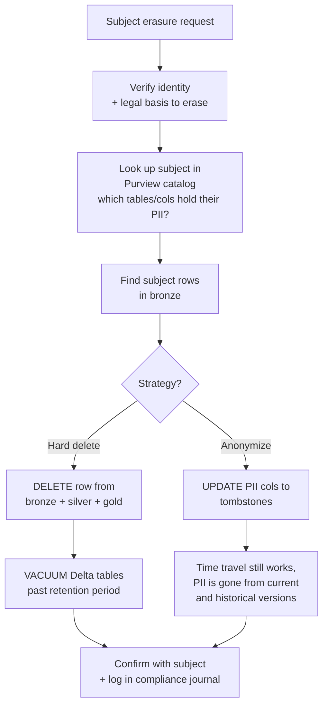

# Compliance — GDPR & EU Data Boundary

> **Status:** Implementation guidance for **GDPR** (Regulation (EU) 2016/679) and **EU Data Boundary** for cloud services. Applies to any workload processing personal data of EU/EEA/UK residents — _regardless of where your company is located_.

## What is GDPR?

The General Data Protection Regulation governs how organizations process **personal data** of natural persons in the EU/EEA/UK. Key principles:

- **Lawfulness, fairness, transparency** — you have a legal basis and people know what you do
- **Purpose limitation** — data collected for one purpose isn't used for another
- **Data minimization** — only collect what you need
- **Accuracy** — keep it correct
- **Storage limitation** — delete when no longer needed
- **Integrity and confidentiality** — keep it secure
- **Accountability** — prove you do all of the above

Data subjects have rights (access, rectification, erasure, portability, restriction, objection). You must respond to subject requests within 30 days.

**Penalties**: up to €20M or 4% of global annual revenue, whichever is higher.

## EU Data Boundary

Microsoft's **EU Data Boundary** ([learn.microsoft.com/privacy/eudb/eu-data-boundary-learn](https://learn.microsoft.com/privacy/eudb/eu-data-boundary-learn)) commits that **customer data and personal data** for Azure / Microsoft 365 / Dynamics 365 / Power Platform are **stored and processed in the EU/EEA** for EU customers — including support data and professional services data (as of Phase 3, 2025).

To use it, deploy to **EU regions** and configure data-residency settings:

| Service              | EU residency setting                                                                                                                                                                                |
| -------------------- | --------------------------------------------------------------------------------------------------------------------------------------------------------------------------------------------------- |
| Storage Account      | Region = EU region (West Europe, North Europe, Sweden Central, etc.)                                                                                                                                |
| Synapse / Databricks | Region = EU region                                                                                                                                                                                  |
| Azure OpenAI         | Region = EU (Sweden Central, France Central, Switzerland North) — **deploy region matters; some models route inference outside the deploy region by default** — set `data residency: EU` explicitly |
| Microsoft Fabric     | Tenant region setting + workspace region                                                                                                                                                            |
| Application Insights | Region = EU region                                                                                                                                                                                  |
| Microsoft Sentinel   | Workspace region = EU region                                                                                                                                                                        |
| Microsoft Purview    | Region = EU region                                                                                                                                                                                  |

## How CSA-in-a-Box helps

Most GDPR controls are **process and policy** rather than technical, but the platform implements technical controls that support compliance.

## Article crosswalk

| Article                                         | Topic                                    | Where in CSA-in-a-Box                                                                                                         |
| ----------------------------------------------- | ---------------------------------------- | ----------------------------------------------------------------------------------------------------------------------------- |
| **Art. 5** Principles                           | Lawfulness, minimization, accuracy, etc. | Data product contracts (`pii: true`, `purpose:`, `retention:`); Purview classifications                                       |
| **Art. 6** Lawful basis                         | Document the basis                       | Out of scope — your privacy program                                                                                           |
| **Art. 7** Consent                              | Records of consent                       | Out of scope — your CRM / consent management                                                                                  |
| **Art. 12-22** Data subject rights              | Access, erasure, portability, etc.       | Pattern below for "right to be forgotten"                                                                                     |
| **Art. 25** Data protection by design + default | Privacy in architecture                  | [Identity & Secrets Flow](../reference-architecture/identity-secrets-flow.md), Purview classification, contract-driven design |
| **Art. 28** Processor obligations               | If you process for others                | Out of scope — your DPA contracts                                                                                             |
| **Art. 30** Records of processing activities    | RoPA                                     | Purview catalog auto-generates much of this                                                                                   |
| **Art. 32** Security of processing              | Pseudonymization, encryption, etc.       | Storage CMK, TLS 1.2+, Defender for Cloud, [Best Practices — Security](../best-practices/security-compliance.md)              |
| **Art. 33-34** Breach notification              | Notify within 72h                        | [Runbook — Security Incident](../runbooks/security-incident.md)                                                               |
| **Art. 35** DPIA                                | Data Protection Impact Assessment        | Template referenced below                                                                                                     |
| **Art. 44-50** International transfers          | SCCs, BCRs, adequacy decisions           | EU Data Boundary deployment removes most of this concern                                                                      |

## Implementing the right to erasure ("right to be forgotten")

Article 17 — data subjects can request erasure. In a Delta Lake medallion architecture, **erasure is harder than it looks** because Delta keeps versions for time-travel.

### The pattern

**Recommended pattern**: anonymize rather than hard-delete in bronze (preserves analytics) but ensure the PII columns become tombstones in **all historical Delta versions** by either:

1. Running `OVERWRITE` on the affected partitions and `VACUUM` past the retention window (~7 days default for Delta — set to 0 days _for the erasure operation only_), OR
2. Using **Delta Lake's row-level deletion** (`DELETE`) and then vacuum

The platform provides the [governance/data_quality](https://github.com/fgarofalo56/csa-inabox/tree/main/csa_platform/governance) helpers to scan tables for a subject identifier and execute coordinated deletion across bronze/silver/gold.

### Important caveats

- **Vacuum permanently destroys time-travel history** — coordinate with audit/legal first
- **Backups separately** — Delta vacuum doesn't reach Azure Backup snapshots
- **Logs separately** — Log Analytics retention is independent; PII in logs needs purging via Log Analytics' [Restricted Tables](https://learn.microsoft.com/azure/azure-monitor/logs/personal-data-mgmt) feature
- **Streaming** — past stream events in Event Hub Capture also need attention; lifecycle policy + targeted blob deletion

## DPIA (Article 35) — when required

You must conduct a Data Protection Impact Assessment when processing is likely to result in **high risk to rights and freedoms**. For analytics platforms, this typically applies when:

- Profiling or automated decision-making
- Large-scale processing of special categories (health, biometric, genetic, ethnic, etc.)
- Systematic monitoring of public areas
- Combining datasets from multiple sources
- Processing data of vulnerable populations (children, employees in monitoring contexts)

Use the [EDPB DPIA template](https://edpb.europa.eu/our-work-tools/our-documents/topic/data-protection-impact-assessment-dpia_en) or your DPA's recommended template.

## Records of Processing Activities (Art. 30)

Microsoft Purview can automate substantial parts of the RoPA:

| RoPA field                   | Source                                                                      |
| ---------------------------- | --------------------------------------------------------------------------- |
| Categories of data subjects  | Purview classification labels                                               |
| Categories of personal data  | Purview column-level classifications + data product contracts (`pii: true`) |
| Recipients                   | Data sharing graph + contract `consumers:` field                            |
| Transfers to third countries | Purview lineage + region of resources                                       |
| Retention                    | Data product contract `retention:` field + lifecycle policies               |
| Security measures            | This compliance docs section                                                |

Set up a quarterly job that exports Purview metadata + Bicep config → RoPA spreadsheet automatically. Reduces hand-maintenance of the RoPA from days/quarter to minutes/quarter.

## Pseudonymization patterns

GDPR encourages pseudonymization (Art. 32, Recital 28). In CSA-in-a-Box:

| Layer       | Pattern                                                                            |
| ----------- | ---------------------------------------------------------------------------------- |
| **Bronze**  | Keep raw PII (legitimate processing); restrict access via RBAC                     |
| **Silver**  | Generate pseudonymous IDs; keep PII columns but tag and restrict                   |
| **Gold**    | **Pseudonymous IDs only** by default; PII access requires elevated RBAC            |
| **Serving** | Default to pseudonymous; PII reidentification through audited reverse-lookup table |

The **pseudonymization key** lives in Key Vault Managed HSM and is rotated annually. Reidentification is logged with subject + requester + reason.

## Cross-border transfers (Art. 44-50)

If your platform stays **fully within EU regions** + EU Data Boundary, most transfer issues vanish. If you must transfer:

| Transfer                       | Mechanism                                                                   |
| ------------------------------ | --------------------------------------------------------------------------- |
| EU → US (Microsoft processing) | EU-US Data Privacy Framework (DPF) — Microsoft is certified                 |
| EU → US (your own systems)     | Standard Contractual Clauses (SCCs) + Transfer Impact Assessment            |
| EU → adequate countries        | UK, Switzerland, Japan, etc. — adequacy decision suffices                   |
| EU → other                     | SCCs + supplementary measures (encryption with EU-held keys often required) |

## Documentation deliverables checklist

- [ ] Privacy Policy (public-facing)
- [ ] Data Protection Policy (internal)
- [ ] Records of Processing Activities (Art. 30)
- [ ] DPIA for high-risk processing (Art. 35)
- [ ] Data subject request handling procedure
- [ ] Breach response plan ← reference [Runbook — Security Incident](../runbooks/security-incident.md), Art. 33 72-hour notification
- [ ] Data Processing Agreements with vendors / sub-processors
- [ ] Standard Contractual Clauses for any non-adequate transfers
- [ ] Appointment of DPO (if required — Art. 37)
- [ ] Training records for staff handling personal data
- [ ] Vendor risk assessments for any sub-processor

## Trade-offs

✅ **Why deploying to EU Data Boundary helps a lot**

- Removes most cross-border transfer complexity
- Microsoft handles the support-data residency story
- Clear regional boundary = easier audit story

⚠️ **What you still own**

- All policy + program work
- DPO designation + role
- Subject request handling SLAs
- Vendor management
- Pseudonymization key management
- Breach notification (within 72 hours to supervisory authority)

## Related

- [Compliance — SOC 2 Type II](soc2-type2.md) — overlapping security controls
- [Compliance — NIST 800-53 r5](nist-800-53-rev5.md) — many overlapping controls
- [Identity & Secrets Flow](../reference-architecture/identity-secrets-flow.md)
- [Best Practices — Data Governance](../best-practices/data-governance.md)
- [Best Practices — Security & Compliance](../best-practices/security-compliance.md)
- [Runbook — Security Incident](../runbooks/security-incident.md)
- Microsoft GDPR resources: https://learn.microsoft.com/compliance/regulatory/gdpr
- Microsoft EU Data Boundary: https://learn.microsoft.com/privacy/eudb/eu-data-boundary-learn
