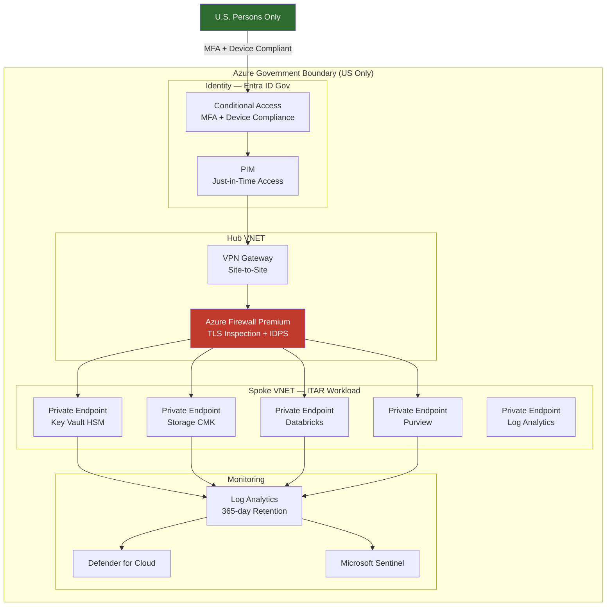

# Compliance — ITAR (International Traffic in Arms Regulations)

--8<-- "_includes/compliance-disclaimer.md"

> **Scope:** ITAR compliance guidance for organizations handling defense articles, technical data, or defense services on the CSA-in-a-Box platform deployed to Azure Government. ITAR violations carry severe civil and criminal penalties — treat every requirement as mandatory.

## What is ITAR?

The **International Traffic in Arms Regulations (ITAR)**, codified in 22 CFR Parts 120–130, controls the export and temporary import of defense articles and defense services listed on the **United States Munitions List (USML)**. ITAR is administered by the **Directorate of Defense Trade Controls (DDTC)** within the U.S. Department of State.

ITAR is distinct from the **Export Administration Regulations (EAR)**, which covers dual-use commercial/military items under the Commerce Department. The key difference: ITAR applies to items **designed or modified for military application**, while EAR covers broader commercial technologies with potential military use. If an item is on the USML, ITAR governs — period.

**Who must comply:**

- Defense contractors and subcontractors at any tier
- Aerospace manufacturers
- Universities and research institutions performing defense-related research
- Any organization that manufactures, exports, or brokers defense articles or technical data
- Cloud service providers hosting ITAR-controlled technical data

**Penalties for violation:**

- **Civil:** Up to $1,213,644 per violation (adjusted annually)
- **Criminal:** Up to $1,000,000 and 20 years imprisonment per violation
- **Debarment:** Prohibition from future defense contracts

!!! danger
ITAR violations are **strict liability** — intent is not required. Inadvertent disclosure of controlled technical data to a foreign person (including a foreign national employee within the U.S.) constitutes a violation. Cloud misconfigurations that expose ITAR data to non-U.S. persons or store data outside U.S. borders are export violations.

## Key requirements

### U.S. person requirement

All personnel with access to ITAR-controlled technical data must be **U.S. persons** as defined by 22 CFR 120.62:

- U.S. citizens
- Lawful permanent residents (green card holders)
- Protected persons (refugees, asylees granted status)

This requirement extends to cloud provider personnel who may have logical or physical access to the data. Azure Government satisfies this through Microsoft's screened U.S. person operations staff.

### Data sovereignty

ITAR-controlled data must **remain within the United States** at all times. This means:

- No data replication to non-U.S. regions
- No CDN edge nodes outside the U.S.
- No backup or DR to non-U.S. datacenters
- No support operations from non-U.S. locations

Azure Government datacenters are located exclusively in the continental United States and operated exclusively by screened U.S. persons.

### Access control

ITAR requires **need-to-know** access combined with U.S. person verification:

- Every user granted access must be verified as a U.S. person before provisioning
- Access must be limited to the minimum necessary for job function
- Access reviews must occur regularly
- All access must be logged and auditable

### Physical and logical security

Facilities and systems handling ITAR data must implement security controls commensurate with the sensitivity of the data. For cloud deployments, logical security controls — network isolation, encryption, access control, monitoring — must compensate for the shared infrastructure model.

## Azure for ITAR

### Azure Government — the deployment target

**Azure Government** is the only appropriate Azure environment for ITAR workloads. Azure Commercial regions — even those in the United States — do not meet ITAR requirements because Microsoft does not restrict operations staff to U.S. persons in Commercial regions.

| Requirement            | Azure Government                                | Azure Commercial                      |
| ---------------------- | ----------------------------------------------- | ------------------------------------- |
| U.S. person operations | All operations staff are screened U.S. persons  | No U.S. person restriction            |
| Data residency         | US-only datacenters, guaranteed                 | US regions available but not isolated |
| Background checks      | Federal background investigation (NACI minimum) | Standard employment screening         |
| Network isolation      | Physically separated network from Commercial    | Shared global network                 |
| ITAR suitability       | **Yes** — recommended deployment target         | **No** — does not meet requirements   |

### Azure Government regions

| Region          | Purpose                                        |
| --------------- | ---------------------------------------------- |
| US Gov Virginia | Primary region — broadest service availability |
| US Gov Texas    | Secondary region — DR and geo-redundancy       |
| US Gov Arizona  | Tertiary region — additional redundancy        |
| US DoD Central  | DoD Impact Level 5 workloads (dedicated)       |
| US DoD East     | DoD Impact Level 5 workloads (dedicated)       |

!!! tip
For most ITAR workloads, **US Gov Virginia** as primary and **US Gov Texas** as DR provides the best combination of service availability and geographic separation. Check the [Government Service Matrix](../GOV_SERVICE_MATRIX.md) for service availability per region.

## CSA-in-a-Box ITAR deployment

### Landing zone configuration for Azure Gov

The platform includes a Government-specific Bicep variant at `deploy/bicep/gov/` that targets Azure Government endpoints and enforces Gov-only region constraints.

```bicep
// deploy/bicep/gov/main.bicep — Azure Government landing zone
// All resources deploy to US Gov regions only
param location string = 'usgovvirginia'
param allowedLocations array = [
  'usgovvirginia'
  'usgovtexas'
  'usgovarizona'
]
```

Key Gov modules in `deploy/bicep/gov/modules/`:

- **`keyVault.bicep`** — Premium SKU with HSM-backed keys, purge protection, RBAC-only authorization
- **`storage.bicep`** — GRS within Gov regions, infrastructure encryption, CMK, private endpoints
- **`databricks.bicep`** — Deployed to Gov VNET-injected workspace, no public access
- **`purview.bicep`** — Data classification and catalog within Gov boundary
- **`logAnalytics.bicep`** — Centralized logging with extended retention

### Network isolation

ITAR workloads require strict network boundaries. The platform enforces:

- **No direct internet egress** — all outbound traffic routes through Azure Firewall with TLS inspection
- **Private Endpoints** on every PaaS service — no public IP exposure on the data plane
- **NSG deny-all default** with explicit allow rules for authorized traffic flows
- **Azure Firewall Premium** with IDPS for network threat detection
- **DNS private zones** for all PaaS service resolution within the VNET

```bicep
// Enforce no public access on storage — deploy/bicep/gov/modules/storage.bicep
resource storageAccount 'Microsoft.Storage/storageAccounts@2023-05-01' = {
  properties: {
    publicNetworkAccess: 'Disabled'
    networkAcls: {
      defaultAction: 'Deny'
    }
    allowSharedKeyAccess: false
    minimumTlsVersion: 'TLS1_2'
    supportsHttpsTrafficOnly: true
  }
}
```

### Entra ID Gov tenant

ITAR deployments should use an **Entra ID Government** tenant (login.microsoftonline.us), not the Commercial Entra ID endpoint. This ensures directory data and authentication traffic remain within the Azure Government boundary.

### Key Vault with HSM-backed keys

The Gov Key Vault module deploys Premium SKU with HSM-backed keys validated to FIPS 140-2 Level 2. For ITAR workloads requiring FIPS 140-2 Level 3, use **Azure Managed HSM** or **Azure Dedicated HSM**.

### Purview for data classification

Microsoft Purview in Azure Government provides automated classification and labeling of controlled technical data. Configure custom sensitivity labels for ITAR categories:

- ITAR Controlled Technical Data
- ITAR Restricted — USML Category [X]
- ITAR — Distribution Statement [A–F]

### Export control classification tagging

Integrate Purview sensitivity labels with the data catalog to tag datasets with their export control classification. This provides auditable evidence of data classification and supports access control decisions based on data sensitivity.

## Architecture considerations

The following diagram illustrates the ITAR-compliant deployment boundary within Azure Government.



!!! tip
The Hub-Spoke model described in [Hub-Spoke Topology](../reference-architecture/hub-spoke-topology.md) applies directly to ITAR deployments. The Gov Bicep variant enforces the same topology with Gov-specific region and endpoint constraints.

## Common ITAR violations to avoid

Cloud misconfigurations that could constitute ITAR export violations:

| Misconfiguration                                | Risk                                                  | CSA-in-a-Box Prevention                                                           |
| ----------------------------------------------- | ----------------------------------------------------- | --------------------------------------------------------------------------------- |
| Deploying to Azure Commercial instead of Gov    | Data accessible by non-U.S. persons                   | Gov Bicep variant restricts `allowedLocations` to Gov regions                     |
| Storage account with public blob access         | Controlled data exposed to internet                   | `publicNetworkAccess: Disabled` enforced in Bicep + Azure Policy                  |
| Geo-replication to non-US region                | Data leaves U.S. territory                            | GRS configured within Gov region pairs only                                       |
| Shared admin accounts without U.S. person check | Non-U.S. person gains access to technical data        | Entra ID individual accounts; PIM requires verified identity                      |
| Unencrypted data at rest                        | Potential exposure during physical media decommission | AES-256 + CMK + infrastructure double encryption by default                       |
| CDN or caching layer with global edge nodes     | Data cached outside U.S.                              | No CDN in Gov topology; all traffic routes through Gov-only Firewall              |
| Support ticket with ITAR data in description    | Disclosure to potentially non-U.S. support staff      | Azure Gov support handled by screened U.S. persons; train staff on ticket hygiene |
| DNS resolution through public resolvers         | Metadata leakage about ITAR systems                   | Private DNS zones for all PaaS services                                           |

!!! danger
**Voluntary self-disclosure:** If you discover a potential ITAR violation (including a cloud misconfiguration that may have exposed controlled data), you should consult legal counsel regarding filing a voluntary self-disclosure with DDTC. Voluntary disclosures are treated more favorably than violations discovered through other means.

## Related

- [Compliance — FedRAMP Moderate](fedramp-moderate.md) — overlapping control requirements
- [Compliance — CMMC 2.0 Level 2](cmmc-2.0-l2.md) — DoD contractor requirements (often co-applicable)
- [Compliance — NIST 800-53 Rev 5](nist-800-53-rev5.md) — underlying control framework
- [Best Practices — Security & Compliance](../best-practices/security-compliance.md)
- [Government Service Matrix](../GOV_SERVICE_MATRIX.md) — Azure Gov service availability
- [Hub-Spoke Topology](../reference-architecture/hub-spoke-topology.md) — network architecture
- DDTC ITAR: https://www.pmddtc.state.gov/ddtc_public
- Microsoft ITAR: https://learn.microsoft.com/azure/compliance/offerings/offering-itar
