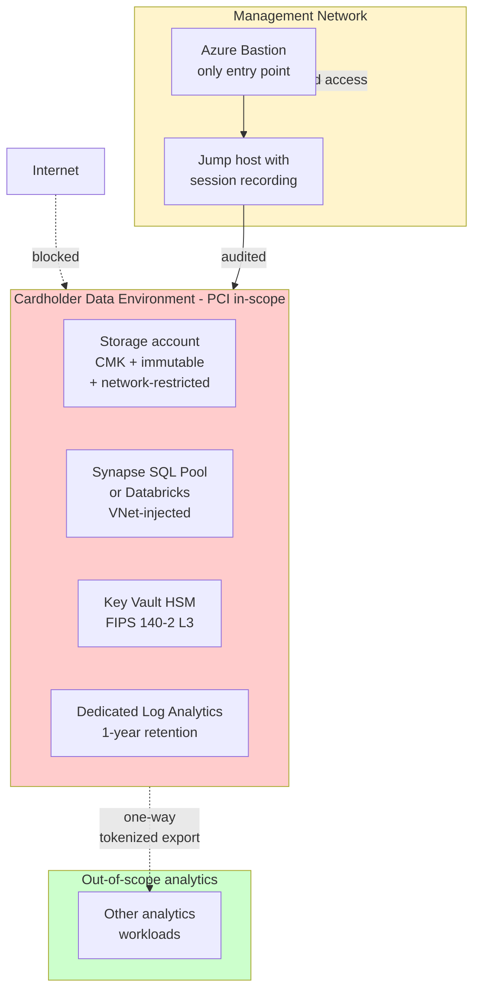

# Compliance — PCI-DSS v4.0

> **Status:** Implementation guidance for **PCI-DSS v4.0** (mandatory March 2025) for analytics workloads that store, process, or transmit cardholder data (CHD). The strongest pattern is **never bring CHD into the analytics platform** — but if you must, this is how.

## What is PCI-DSS v4.0?

The **Payment Card Industry Data Security Standard** governs any system that handles **cardholder data**. v4.0 introduced major changes vs v3.2.1: more flexibility (customized approach), more rigor (continuous validation), targeted-risk analysis required, MFA expanded.

**12 high-level requirements**, ~64 sub-requirements, hundreds of testing procedures.

## The strongest pattern: minimize scope

The most-rewarded PCI strategy is to **never bring full PAN into your analytics environment**:

| Pattern | What you analyze | PCI scope impact |
|---------|------------------|------------------|
| **Tokenization at the edge** (best) | Tokens that map to PAN externally | Your analytics is **out of scope** |
| **Hash-only** | One-way hash of PAN | Analytics is out of scope (with documented hash strength + salt) |
| **Truncated PAN only** (first 6 + last 4) | Truncated PAN | Analytics is out of scope (per PCI Council guidance) |
| **Encrypted PAN with separate key custody** | Encrypted PAN, key in a separate environment | Reduced scope (CHE — Cardholder Data Environment) |
| **Full PAN in the lakehouse** (avoid) | Raw PAN | Full PCI scope across the entire lakehouse |

**Always use tokenization at the edge** if your business model allows. Engage a tokenization provider (e.g., Azure Confidential Ledger + a token vault, or a third-party like Bluefin/Spreedly) and your analytics platform sees only tokens.

## When you must bring CHD into the lakehouse

If your use case genuinely requires PAN in analytics (rare — usually fraud detection where last-4 won't suffice), the platform must implement these controls:

### Architecture for in-scope CHD

## 12 requirements crosswalk

| Req | Description | Where in CSA-in-a-Box |
|-----|-------------|----------------------|
| **1** Network security controls | Firewalls + segmentation | [Hub-Spoke Topology](../reference-architecture/hub-spoke-topology.md), Azure Firewall Premium with PCI-specific allow-list, NSG segmentation, no public IPs on CDE |
| **2** Secure configurations | Hardened baselines | Bicep IaC + Azure Policy enforcing CIS benchmarks |
| **3** Protect stored CHD | Encryption + key management | Storage CMK with Key Vault HSM, column-level encryption on PAN, retention limited |
| **4** Encrypt CHD in transit | TLS 1.2+ everywhere | All Azure services TLS 1.2 enforced; mTLS on internal APIs |
| **5** Anti-malware | EDR | Defender for Servers + Defender for Cloud |
| **6** Develop secure systems | SDLC + change mgmt | Bicep PR review, GitHub branch protection, SAST (CodeQL), SCA (Trivy + Dependabot), [SUPPLY_CHAIN.md](../SUPPLY_CHAIN.md) |
| **7** Restrict access by need-to-know | RBAC | Entra RBAC + PIM, dedicated CDE security groups, no standing access |
| **8** User identification + auth | Per-user accounts + MFA | Entra ID + MFA mandatory for CDE access, no shared accounts |
| **9** Restrict physical access | Datacenter physical | Inherited from Azure CSP (PCI-DSS attested) |
| **10** Log + monitor access | Log everything, review daily | Diagnostic Settings → dedicated Log Analytics workspace, 1-year retention, daily Workbook review |
| **11** Test security of systems | Vuln scans + pen tests | Defender Vulnerability Management quarterly, third-party pen test annually |
| **12** Information security policy | Policy + program | Out of scope — your security program |

## Specific controls worth highlighting

### Req 3.5 — Cryptographic key management
- **Implemented**: Key Vault Managed HSM (FIPS 140-2 L3), per-environment keys, CMK on Storage / SQL / Cosmos
- **Evidence**: Key rotation logs, HSM access logs, [Runbook — Key Rotation](../runbooks/key-rotation.md)

### Req 7.2 — Least-privilege access
- **Implemented**: Dedicated `pci-cde-readers`, `pci-cde-operators`, `pci-cde-admins` Entra groups with PIM-eligible roles
- **Evidence**: Group membership exports, PIM activation logs

### Req 8.4 — MFA for all access into CDE
- **Implemented**: Conditional Access policy on the CDE resource group requiring MFA + compliant device + trusted location
- **Evidence**: Conditional Access policy export, Sign-in logs filtered by MFA result

### Req 10.5 — Audit log security + retention
- **Implemented**: Dedicated Log Analytics workspace for CDE, 1-year hot + 7-year archive in immutable Storage with WORM (Worm Once Read Many) policy
- **Evidence**: Workspace retention config, Storage immutability policy

### Req 11.3 — Vulnerability scanning
- **Implemented**: Defender Vulnerability Management (continuous), Trivy in CI on every container build, third-party pen test annually
- **Evidence**: Defender VM dashboard, Trivy CI logs, pen test report

### Req 12.10 — Incident response
- **Implemented**: [Runbook — Security Incident](../runbooks/security-incident.md), tested quarterly, on-call rotation, IR retainer with a third party
- **Evidence**: Runbook, exercise reports, IR retainer contract

## What's PCI-different from FedRAMP / SOC 2

| Aspect | PCI-DSS specific |
|--------|------------------|
| **Quarterly external scans** by an Approved Scanning Vendor (ASV) | Even if you have Defender, you need a PCI-listed ASV |
| **Annual penetration test** by qualified third party | Internal team is not enough |
| **Targeted Risk Analysis (TRA)** for any v4.0 customized approach | New in v4.0; document explicitly |
| **CHD discovery** quarterly | Scan storage for unintended PAN — Microsoft Purview can help |
| **Anti-skimming on all consumer-facing pages** (Req 6.4.3 / 11.6.1) | Even if your analytics is internal, your *checkout* UI matters — usually a SaaS dependency |
| **Compensating controls** must be documented + risk-assessed annually | More structured than SOC 2 |

## Documentation deliverables checklist

- [ ] Network diagram showing CDE boundaries — start from [Hub-Spoke Topology](../reference-architecture/hub-spoke-topology.md)
- [ ] Data flow diagram for CHD — start from [Data Flow (Medallion)](../reference-architecture/data-flow-medallion.md), highlight CHD path
- [ ] Inventory of system components in CDE
- [ ] Inventory of in-scope account types
- [ ] Roles + responsibilities for each requirement
- [ ] Risk assessment + Targeted Risk Analyses
- [ ] Information security policy + supporting policies (12.x family)
- [ ] Incident response plan ← reference [Runbook — Security Incident](../runbooks/security-incident.md)
- [ ] Pen test report + ASV scan reports
- [ ] Self-Assessment Questionnaire (SAQ) or Report on Compliance (ROC) by a QSA

## Trade-offs

✅ **Why minimize CHD scope (the recommended path)**
- Your analytics platform stays out of PCI scope entirely
- ROC scope is limited to the tokenization edge
- You can innovate freely in the lakehouse without dragging the whole platform into PCI

⚠️ **What it costs to keep CHD in the lakehouse**
- Entire lakehouse is in PCI scope
- All operators need PCI training + background checks
- All connected systems are scope-adjacent
- ROC fieldwork is significantly more expensive
- Innovation speed drops (every change touches the CDE)

If you can't avoid CHD in analytics, **isolate it** in a dedicated subscription (separate DLZ, separate everything) and treat all other workloads as out-of-scope.

## Related

- [Compliance — NIST 800-53 r5](nist-800-53-rev5.md) — many overlapping controls
- [Compliance — SOC 2 Type II](soc2-type2.md) — overlapping CC6/CC7
- [Identity & Secrets Flow](../reference-architecture/identity-secrets-flow.md)
- [Best Practices — Security & Compliance](../best-practices/security-compliance.md)
- [Runbook — Key Rotation](../runbooks/key-rotation.md)
- [SUPPLY_CHAIN.md](../SUPPLY_CHAIN.md)
- PCI Security Standards Council: https://www.pcisecuritystandards.org/
- Microsoft PCI offerings: https://learn.microsoft.com/azure/compliance/offerings/offering-pci-dss
