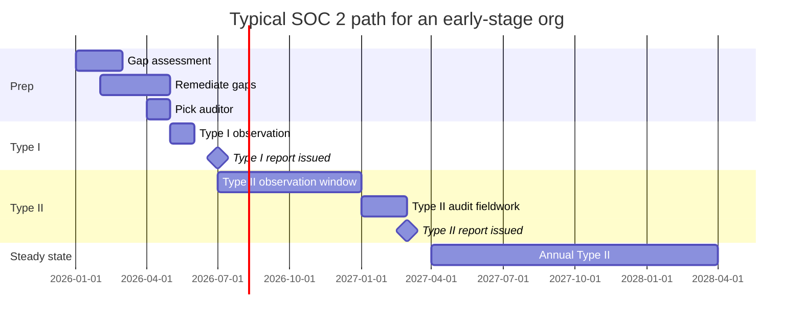

# Compliance — SOC 2 Type II

> **Status:** Implementation guidance and Trust Services Criteria (TSC) crosswalk for **SOC 2 Type II** reports. This is the most-requested commercial-sector compliance framework and is required for selling to most enterprises.

## What is SOC 2 Type II?

**SOC 2** (System and Organization Controls 2) is an attestation framework from the AICPA that evaluates an organization's controls over the **Trust Services Criteria (TSC)**:

- **Security** (always required)
- **Availability** (optional, recommended)
- **Processing Integrity** (optional, for transaction-heavy workloads)
- **Confidentiality** (optional, recommended for B2B)
- **Privacy** (optional, often replaced by GDPR/CCPA frameworks)

A **Type I** report attests that controls are *designed* appropriately at a point in time. A **Type II** report attests that controls are *operating effectively* over a period (typically 6–12 months) — this is what enterprise buyers require.

A SOC 2 audit is performed by a **licensed CPA firm** (not just any auditor). The output is an attestation report you share under NDA with prospects/customers.

## How CSA-in-a-Box helps

The platform implements many **Common Criteria (CC) controls** out-of-box and provides documentation patterns for the rest. You still need:

- An auditor (CPA firm) — Microsoft can suggest partners
- A 6–12 month observation window with evidence
- Your own policies (Information Security Policy, Acceptable Use, etc.)
- Operational evidence (logs, ticket exports, change records)

## TSC crosswalk

### Common Criteria (CC) — applies to all SOC 2 reports

| CC | Description | Where in CSA-in-a-Box |
|----|-------------|----------------------|
| **CC1** Control Environment | Org structure, ethics, board oversight | Out of scope — your org policies |
| **CC2** Communication & Information | Internal/external comms about objectives | Out of scope — your policies |
| **CC3** Risk Assessment | Risk identification + mitigation | Defender for Cloud + Defender Vulnerability Management → risk register; [Best Practices — Security](../best-practices/security-compliance.md) |
| **CC4** Monitoring Activities | Ongoing evaluations + remediation | Defender for Cloud Secure Score, Sentinel, monthly compliance reviews |
| **CC5** Control Activities | Implementation of policies | This entire repo |
| **CC6** Logical & Physical Access | Access controls + restriction | [Identity & Secrets Flow](../reference-architecture/identity-secrets-flow.md), Entra + PIM + Conditional Access; physical inherited from Azure CSP |
| **CC6.1** Logical access security | Authentication + authorization | Entra ID + MFA + RBAC + PIM |
| **CC6.2** New access provisioned | Access reviews on hire | [Runbook — Tenant Onboarding](../runbooks/tenant-onboarding.md) |
| **CC6.3** Access removed | Deprovisioning | Entra Lifecycle Workflows + access reviews |
| **CC6.6** Encryption in transit | TLS 1.2+ | All Azure services TLS 1.2 enforced; Bicep modules set `minTLSVersion: '1.2'` |
| **CC6.7** Encryption at rest | At-rest encryption | All Azure storage encrypted by default; CMK with Key Vault on sensitive workloads |
| **CC6.8** Malicious software | AV/EDR | Defender for Servers + Defender for Containers (if AKS) |
| **CC7** System Operations | Detection + response to anomalies | Defender for Cloud + Sentinel + [Runbook — Security Incident](../runbooks/security-incident.md) |
| **CC7.1** Vulnerability management | Vuln scanning + patching | Defender Vulnerability Management + Trivy in CI + Update Management |
| **CC7.2** Monitoring of system components | Log collection + analysis | Log Analytics + Diagnostic Settings + [LOG_SCHEMA.md](../LOG_SCHEMA.md) |
| **CC7.3** Anomaly detection | Behavioral analytics | Sentinel UEBA, Defender for Cloud alerts |
| **CC7.4** Incident response | Documented IR process | [Runbook — Security Incident](../runbooks/security-incident.md), [Runbook — Break-Glass](../runbooks/break-glass-access.md) |
| **CC7.5** Recovery | DR + backup | [DR.md](../DR.md), [Runbook — DR Drill](../runbooks/dr-drill.md) |
| **CC8** Change Management | Authorized + tested changes | Bicep IaC + GitHub PR reviews + branch protection + `az deployment what-if` |
| **CC8.1** Change authorization | Approvals before deploy | GitHub required reviewers, environment protection rules |
| **CC9** Risk Mitigation | Vendor + business continuity | [SUPPLY_CHAIN.md](../SUPPLY_CHAIN.md), DR.md |

### Availability (A) — optional but recommended

| Criterion | Where |
|-----------|-------|
| **A1.1** Capacity planning | [Best Practices — Performance Tuning](../best-practices/performance-tuning.md), Azure Monitor capacity alerts |
| **A1.2** Environmental protections | Inherited from Azure CSP |
| **A1.3** Recovery + redundancy | [DR.md](../DR.md), zone-redundant storage, geo-replication, Bicep multi-region module |

### Confidentiality (C) — optional but common

| Criterion | Where |
|-----------|-------|
| **C1.1** Confidential information identified | Purview classification + data product contracts (`classification: confidential`) |
| **C1.2** Disposal of confidential information | Lifecycle policies on Storage, soft-delete on Key Vault, retention policies |

### Processing Integrity (PI) — optional, for transaction systems

| Criterion | Where |
|-----------|-------|
| **PI1.1** Inputs validated | Data product contracts validate schema; dbt tests + Great Expectations on silver |
| **PI1.2** Processing complete + accurate | dbt tests, ADF pipeline monitoring, dead-letter queues ([Runbook](../runbooks/dead-letter.md)) |
| **PI1.3** Outputs accurate | Gold-tier dbt tests + reconciliation queries |

## Specific implementations worth highlighting

### CC6.1 + CC6.2 — Logical access (the auditor's #1 focus)
- **Implemented**:
  - Entra ID is the only identity provider; no local accounts on data resources
  - MFA enforced via Conditional Access for all users, all admin actions
  - PIM-eligible (not active) for any role with `*/write`
  - Federated CI/CD identities (no client secrets) — see [Identity & Secrets Flow](../reference-architecture/identity-secrets-flow.md)
  - Quarterly access reviews via Entra Access Reviews
- **Evidence**:
  - Conditional Access policy export
  - PIM activation logs
  - Access review completion records
  - GitHub federated credential trust config

### CC7.2 — Monitoring (the auditor's #2 focus)
- **Implemented**:
  - Diagnostic Settings on every resource → Log Analytics workspace
  - 90-day retention hot, multi-year archive in Storage with immutability
  - [LOG_SCHEMA.md](../LOG_SCHEMA.md) standardizes log formats
  - Workbooks for daily security review
  - Alerts on Defender for Cloud high/critical
- **Evidence**:
  - KQL query exports showing log coverage
  - Retention policy export
  - Sample alert + acknowledgement chain

### CC8.1 — Change management
- **Implemented**:
  - Every infrastructure change is a Bicep PR with required review
  - GitHub branch protection on `main` (required PR review, required CI checks)
  - Environment protection rules require approver for production deploys
  - `az deployment what-if` runs in CI on every PR
- **Evidence**:
  - GitHub branch protection settings export
  - Sample PR with reviews + what-if results
  - Deploy history correlated to PR merge events

## Auditor-friendly evidence collection

Set up a **dedicated Log Analytics workspace** for compliance evidence with:

```kusto
// Daily evidence pack: who changed what
AzureActivity
| where TimeGenerated > ago(1d)
| where OperationNameValue contains "/write" or OperationNameValue contains "/delete"
| project TimeGenerated, Caller, OperationNameValue, ResourceId, ActivityStatusValue
| order by TimeGenerated desc
```

```kusto
// Quarterly access review evidence
SigninLogs
| where TimeGenerated > ago(90d)
| summarize SignInCount = count() by UserPrincipalName, AppDisplayName
| order by SignInCount desc
```

Save these as Workbooks. Auditors love Workbook screenshots.

## Documentation deliverables checklist

For your SOC 2 Type II report you'll need:

- [ ] System Description (the formal narrative the auditor publishes)
- [ ] Information Security Policy
- [ ] Acceptable Use Policy
- [ ] Access Control Policy
- [ ] Change Management Policy
- [ ] Incident Response Plan ← reference [Runbook — Security Incident](../runbooks/security-incident.md)
- [ ] Business Continuity / DR Plan ← reference [DR.md](../DR.md)
- [ ] Vendor Management policy + register
- [ ] Risk Assessment (annual, with output)
- [ ] Vulnerability Management Policy
- [ ] Asset Inventory (Azure Resource Graph queries can auto-generate)
- [ ] Data Classification policy
- [ ] Encryption Policy
- [ ] Logging & Monitoring Policy
- [ ] Backup Policy
- [ ] Personnel Security (background checks, training)

## Type I vs Type II — sequencing



## Trade-offs

✅ **Why this is a strong starting point**
- Most CC6/CC7/CC8 controls are platform-implemented
- Bicep IaC + git history = automated change evidence
- Azure Diagnostic Settings = automated monitoring evidence
- Defender for Cloud = automated security posture evidence

⚠️ **What this does not give you**
- An attestation report (you must engage a CPA firm)
- Org-level policies (your CISO/legal)
- Personnel controls (your HR)
- Customer comms for control deviations (your account team)

## Related

- [Compliance — NIST 800-53 r5](nist-800-53-rev5.md) — many overlapping controls
- [Compliance — FedRAMP Moderate](fedramp-moderate.md) — for federal customers
- [Best Practices — Security & Compliance](../best-practices/security-compliance.md)
- [Identity & Secrets Flow](../reference-architecture/identity-secrets-flow.md)
- AICPA SOC 2 official: https://www.aicpa-cima.com/topic/audit-assurance/audit-and-assurance-greater-than-soc-2
- Microsoft SOC offerings: https://learn.microsoft.com/azure/compliance/offerings/offering-soc-2
