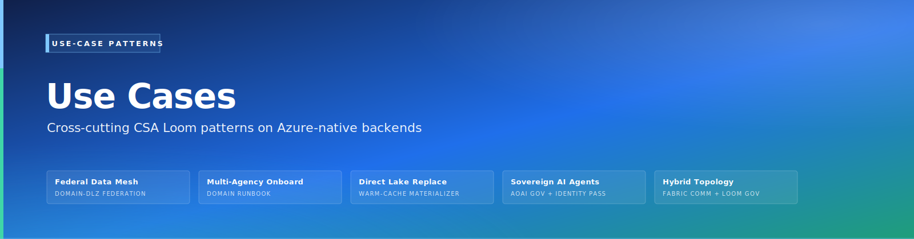

# CSA Loom Learning Hub

{ .architecture-hero loading="eager" }

The Learning Hub is the single landing page for everything you can learn about
CSA Loom. It mirrors the in-product **Learn portal** (`/learn` in the Console),
which groups every topic into five sections: **Tutorials**, **Use cases**,
**Editor guides**, **Service guides**, and **Reference**.

Every link below is a per-topic deep link to its own walkthrough — not a shared
index. Where a real, installable content-bundle app backs a use case, the in-product
card also surfaces an **Install live example** button that runs the real
`POST /api/apps/{appId}/install` → provision → seed flow and an **Install app**
link to the in-Console `/apps/<appId>` route. The **Install live example** cells
below name that app id; open it from the Console at `/apps/<appId>`.

!!! info "Azure-native, never Fabric"
    Loom achieves Fabric-equivalent outcomes on **Azure-native + OSS backends** —
    there is no hard dependency on a real Microsoft Fabric capacity or workspace.
    The streaming use cases below, for example, map to **Azure Event Hubs →
    Azure Data Explorer (ADX) → Azure Logic Apps / Azure Monitor alerts** —
    the Azure-native equivalent of Fabric Real-Time Intelligence + Activator.
    See [No hard dependency on real Fabric](fiab/what-is-csa-loom.md).

---

## How to use this hub

| If you want to… | Start here |
|---|---|
| Go from an empty workspace to a working scenario | [Tutorials](#tutorials) |
| Find a real-world reference scenario for your domain | [Use cases](#use-cases) |
| Learn one editor / item type in depth | [Editor guides](learn/index.md) |
| Understand how a Loom engine works under the hood | [Service guides](#service-guides) |
| Read the architecture / parity / orientation docs | [Reference](#reference) |

Prefer the interactive experience? Open **`/learn`** in the Console to search,
filter, and sort every topic, and to install the live examples in one click.

---

## Tutorials

End-to-end walkthroughs that take you from an empty workspace to a working
scenario.

1. [Your first workspace](fiab/tutorials/01-first-workspace.md)
2. [First Lakehouse + Delta tables](fiab/tutorials/02-first-lakehouse.md)
3. [Direct Lake parity](fiab/tutorials/03-direct-lake-parity.md)
4. [Activator rules over an IoT stream](fiab/tutorials/04-activator-rules.md)
5. [Data Agent over a Lakehouse](fiab/tutorials/05-data-agent.md)
6. [Mirror Cosmos DB to a Lakehouse](fiab/tutorials/06-mirroring-cosmos.md)
7. [Publish a marketplace data product](fiab/tutorials/07-marketplace-data-product.md)
8. [Forward-migrate a Lakehouse to Fabric](fiab/tutorials/08-forward-migrate-to-fabric.md)

---

## Use cases

Real-world reference scenarios — every one is a deep link to its **own**
step-by-step walkthrough doc with architecture visuals, built on CSA Loom
(Azure-native). The **Install live example** column names the matching
one-click content-bundle app where one exists; otherwise the walkthrough is the
built guide.

### Government & federal-agency analytics

| Use case | Walkthrough | Install live example |
|---|---|---|
| DOJ Antitrust Analytics | [Open](use-cases/doj-antitrust-deep-dive.md) | — |
| Government Data Analytics | [Open](use-cases/government-data-analytics.md) | — |
| DOT Transportation Analytics | [Open](use-cases/dot-transportation-analytics.md) | — |
| FAA Aviation Analytics | [Open](use-cases/faa-aviation-analytics.md) | — |
| EPA Environmental Analytics | [Open](use-cases/epa-environmental-analytics.md) | — |
| NOAA Climate & Ocean Analytics | [Open](use-cases/noaa-climate-analytics.md) | — |
| NASA Earth Science Analytics | [Open](use-cases/nasa-earth-science-analytics.md) | — |
| Interior Natural Resources | [Open](use-cases/interior-natural-resources-analytics.md) | — |
| USDA Agricultural Analytics | [Open](use-cases/usda-agriculture-analytics.md) | — |
| USPS Postal Operations | [Open](use-cases/usps-postal-analytics.md) | — |
| Commerce Economic Analytics | [Open](use-cases/commerce-economic-analytics.md) | — |
| Federal Cybersecurity & Threat Analytics | [Open](use-cases/cybersecurity-threat-analytics.md) | — |
| Antitrust Market Analytics | [Open](use-cases/antitrust-analytics.md) | — |

### Healthcare, gaming & real-time

| Use case | Walkthrough | Install live example |
|---|---|---|
| IHS & Tribal Health Analytics | [Open](use-cases/tribal-health-analytics.md) | `app-healthcare-popmgt` |
| Real-Time Anomaly Detection | [Open](use-cases/realtime-intelligence-anomaly-detection.md) | `app-iot-realtime` |
| Casino & Gaming Analytics | [Open](use-cases/casino-gaming-analytics.md) | `app-casino-analytics` |

### Platform, multi-cloud & API-first

| Use case | Walkthrough | Install live example |
|---|---|---|
| Unified Analytics | [Open](use-cases/fabric-unified-analytics.md) | — |
| Data Virtualization | [Open](use-cases/multi-cloud-data-virtualization.md) | — |
| API-First Multi-Model AI Ecosystem | [Open](use-cases/api-first-multi-model-ai-ecosystem.md) | — |
| Dataverse API Integration | [Open](use-cases/dataverse-api-integration.md) | — |
| Enterprise Asset Management via APIM | [Open](use-cases/enterprise-asset-management-apim.md) | — |
| Cross-Platform Integration | [Open](use-cases/cross-platform-integration-fabric.md) | — |
| AI Document Analytics & eDiscovery | [Open](use-cases/ai-document-analytics-ediscovery.md) | — |

### Sovereign / Gov-cloud

Air-gapped scenarios — these walkthroughs cite only sovereign-region Azure-native
services (ADX, Event Hubs, Logic Apps, AI Foundry), never Fabric. In a sovereign
deployment, set `NEXT_PUBLIC_LOOM_DOCS_BASE` to the internal docs mirror so these
deep links stay inside the boundary.

| Use case | Walkthrough | Install live example |
|---|---|---|
| Federal Data Mesh | [Open](fiab/use-cases/federal-data-mesh.md) | `app-federal-data-mesh` |
| Multi-Agency Onboarding | [Open](fiab/use-cases/multi-agency-onboarding.md) | `app-multi-agency-onboarding` |
| Direct Lake Replacement | [Open](fiab/use-cases/direct-lake-replacement.md) | `app-direct-lake-replacement` |
| Sovereign AI Agents | [Open](fiab/use-cases/sovereign-ai-agents.md) | `app-sovereign-ai-agents` |
| Hybrid Topology | [Open](fiab/use-cases/hybrid-topology.md) | `app-hybrid-topology` |

### Solution accelerators

| Use case | Walkthrough | Install live example |
|---|---|---|
| Azure Real-Time Analytics Accelerator | [Open](learn/08-solutions/azure-realtime-analytics/README.md) | `app-azure-realtime-analytics` |
| Change Feed Processor | [Open](learn/08-solutions/change-feed-processor/README.md) | `app-change-feed-processor` |
| Data Governance & Lineage | [Open](learn/08-solutions/data-governance/lineage.md) | `app-data-governance` |
| Logic Apps Integration | [Open](learn/08-solutions/logic-apps-integration/README.md) | `app-logic-apps-integration` |
| ML Pipeline Accelerator | [Open](learn/08-solutions/ml-pipeline/README.md) | `app-ml-pipeline` |
| Real-Time Dashboards | [Open](learn/08-solutions/real-time-dashboards/README.md) | `app-real-time-dashboards` |

### Industry blueprints

| Use case | Walkthrough | Install live example |
|---|---|---|
| Financial Services Blueprint | [Open](industries/financial-services.md) | — |
| Manufacturing Blueprint | [Open](industries/manufacturing.md) | — |
| Retail & CPG Blueprint | [Open](industries/retail-cpg.md) | — |
| Energy & Utilities Blueprint | [Open](industries/energy-utilities.md) | — |
| Telecommunications Blueprint | [Open](industries/telco.md) | — |
| Life Sciences & Genomics Blueprint | [Open](industries/life-sciences.md) | — |

> 42 use-case walkthroughs in total. Each renders as its own card in the
> Console's `/learn` **Use cases** section, with a **Walkthrough** deep link and
> — where a registered content bundle exists — an **Install live example** /
> **Install app** action.

---

## Editor guides

One guide per item type — every Azure / Fabric editor Loom builds, with full
feature parity on the Azure-native backend. Browse them all in the
[Learn index](learn/index.md) or in the Console's `/learn` **Editor guides**
section.

---

## Service guides

How the Loom engines work under the hood — the Azure-native replacements for
Fabric Reflex, Mirroring, and Direct Lake.

- [Activator engine](fiab/services/activator-engine.md) — evaluates Activator
  rules and dispatches actions via Azure Monitor / Logic Apps (no Fabric Reflex).
- [Mirroring engine](fiab/services/mirroring-engine.md) — the change-feed
  replicator that keeps OneLake-equivalent ADLS mirrors in sync with their source.
- [Direct-Lake shim](fiab/services/direct-lake-shim.md) — the warm-cache
  materializer that gives Power BI sub-second Direct Lake-equivalent reads.

---

## Reference

Architecture, parity, and orientation docs for the platform as a whole.

- [What is CSA Loom?](fiab/what-is-csa-loom.md)
- [Reference architecture](fiab/architecture.md)
- [Portal architecture](fiab/portal-architecture.md)
- [Parity matrix](fiab/parity-matrix.md)

---

## See also

- [Learn portal (in-product)](learn/index.md) — the interactive, searchable
  version of this hub.
- Apps catalog (in-product) — every installable content-bundle app, at the
  Console `/apps` route.
- [Getting Started (30-min tour)](GETTING_STARTED.md)
