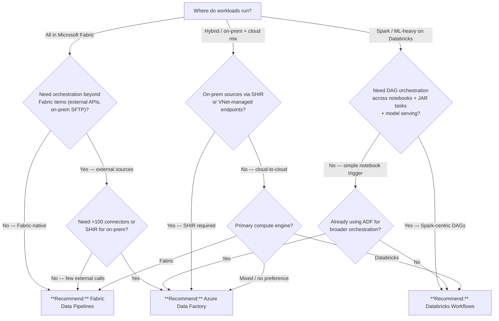

# ADF vs Databricks Workflows vs Fabric Data Pipelines

> **Comparative positioning note.** This document is written from the
> perspective of Microsoft Azure, Cloud Scale Analytics, and CSA Loom. Any
> description of third-party or competing products, services, pricing, or
> capabilities is derived from **publicly available documentation and sources**
> believed accurate at the time of writing, and is provided for **general
> comparison only**. We do not claim expertise in, or authority over, any
> non-Microsoft product or service; the respective vendor's official
> documentation is the authoritative source for their offerings, which may
> change over time. Nothing here is intended to disparage any vendor — where a
> competing product has genuine advantages, we aim to note them honestly.
> Verify all third-party details against the vendor's current official
> documentation before making decisions.

## TL;DR

Azure Data Factory for hybrid/enterprise orchestration with 100+ connectors, Databricks Workflows for Spark-centric DAGs and ML pipelines, Fabric Data Pipelines for Fabric-native workloads with OneLake-first simplicity.

## When this question comes up

- A data platform needs an orchestration layer and the team is choosing between native Azure, Databricks, or Fabric tooling.
- Existing ADF pipelines are being evaluated for migration to Fabric or Databricks.
- The workload mixes on-prem/hybrid sources with cloud-native Spark transformations.
- Cost or licensing consolidation is driving a "one orchestrator" decision.

## Decision tree

## Per-recommendation detail

### Recommend: Azure Data Factory

**When:** Hybrid/enterprise orchestration spanning on-prem, multi-cloud, and Azure-native services; need for 100+ built-in connectors, Self-Hosted Integration Runtime (SHIR), or Mapping Data Flows.
**Why:** Broadest connector catalog on Azure; SHIR bridges on-prem SQL Server, Oracle, SAP, and file shares; mature CI/CD via ARM/Bicep export; integrates with Databricks and Fabric as downstream compute.
**Tradeoffs:** Cost — per-activity-run + DIU-hours for copy activities; Latency — minutes for pipeline triggers, seconds for activity dispatch; Compliance — FedRAMP High, IL5 in Azure Gov; Skill — low-code authoring in portal, JSON pipeline definitions.
**Anti-patterns:**

- Pure Spark/notebook DAGs with no external sources — Databricks Workflows is more native and avoids ADF overhead.
- All-Fabric estate with no hybrid needs — Fabric Data Pipelines is simpler and included in capacity.

**Linked example:** [ADF Setup Guide](../ADF_SETUP.md) | [ADR-0001: ADF + dbt over Airflow](../adr/0001-adf-dbt-over-airflow.md)

### Recommend: Databricks Workflows

**When:** Spark-centric DAGs orchestrating notebooks, Python/JAR tasks, Delta Live Tables, and ML model training/serving within Databricks.
**Why:** Native task orchestration inside Databricks with job clusters that spin up/down per run; supports multi-task DAGs with dependencies, retries, and conditional logic; integrates with MLflow for experiment tracking and model registry.
**Tradeoffs:** Cost — DBU-based per job cluster; Latency — cluster cold-start 2-5 min (mitigated with pools); Compliance — FedRAMP High, IL4/IL5 with qualifying SKUs; Skill — Spark + Python, Databricks workspace familiarity.
**Anti-patterns:**

- Orchestrating non-Databricks services (Azure SQL, Blob copy, SFTP) as primary pattern — ADF has better connectors.
- Cost-sensitive workloads with simple scheduling needs — Fabric Pipelines or ADF Mapping Data Flows may be cheaper.

**Linked example:** [Databricks Guide](../DATABRICKS_GUIDE.md)

### Recommend: Fabric Data Pipelines

**When:** All workloads live inside Microsoft Fabric (lakehouses, warehouses, notebooks, dataflows); need simple orchestration without leaving the Fabric control plane.
**Why:** Included in Fabric capacity (no per-pipeline billing); familiar ADF-like authoring UX; native OneLake integration eliminates copy-activity overhead for Fabric-to-Fabric moves; Copy job for high-scale ingestion.
**Tradeoffs:** Cost — consumed from F-SKU capacity (no separate billing); Latency — comparable to ADF for copy/notebook activities; Compliance — Commercial GA only (Azure Gov pending); Skill — low (ADF experience transfers directly).
**Anti-patterns:**

- Hybrid on-prem sources requiring SHIR — Fabric Pipelines lacks SHIR support today; use ADF.
- Complex multi-cloud orchestration with 50+ diverse connectors — ADF connector catalog is broader.
- Azure Government workloads — Fabric is not yet GA in Gov (2026-Q2).

**Linked example:** [Fabric vs. Databricks vs. Synapse](fabric-vs-databricks-vs-synapse.md) | [ADR-0001: ADF + dbt over Airflow](../adr/0001-adf-dbt-over-airflow.md)

## Related

- Guide: [ADF Setup](../ADF_SETUP.md)
- Guide: [Databricks Guide](../DATABRICKS_GUIDE.md)
- Guide: [Microsoft Fabric Platform Guide](../guides/microsoft-fabric.md)
- Decision: [Fabric vs. Databricks vs. Synapse](fabric-vs-databricks-vs-synapse.md)
- ADR: [0001 - ADF + dbt over Airflow](../adr/0001-adf-dbt-over-airflow.md)
- Companion: [Supercharge Microsoft Fabric — Data Pipelines](https://fgarofalo56.github.io/Suppercharge_Microsoft_Fabric/tutorials/06-data-pipelines/) — hands-on Fabric Data Pipelines tutorial
- Companion: [Supercharge Microsoft Fabric — Metadata-Driven Pipelines](https://fgarofalo56.github.io/Suppercharge_Microsoft_Fabric/best-practices/04_METADATA_DRIVEN_PIPELINES/) — production metadata-driven patterns
