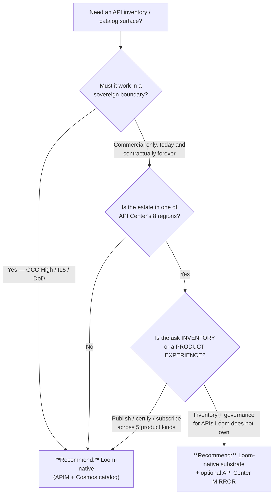

# Azure API Center vs. the Loom-native API Marketplace

**Status:** Decided — **REJECTED as the substrate**, adopted as an optional
Commercial-only *mirror* only if a customer asks for it.
**Last Updated:** 2026-08-29 · **Closes:** [#3353](https://github.com/fgarofalo56/csa-inabox/issues/3353)

## TL;DR

**Keep the Loom-native marketplace as the substrate in every boundary.** Azure
API Center is **not available in any sovereign region** — its published region
list is eight Commercial regions and contains no Azure Government, GCC-High,
IL5 or DoD region — so adopting it as *the* substrate would make the API
Marketplace a Commercial-only capability. `cloud-parity.md` calls that
INCOMPLETE, not "Commercial-first".

This is the same reasoning `no-fabric-dependency.md` applies to Fabric,
generalised: a managed service may be an **opt-in alternative**, never the
default path, when the default path has to work in every boundary Loom claims
to support.

## When this question comes up

- Someone notices that "inventory + govern your APIs" is a named Azure service
  and asks why Loom rebuilt it.
- A Commercial-only customer wants their API Center inventory to show Loom's
  published products (or the reverse).
- A reviewer asks whether the marketplace's catalog store should be Cosmos.

## The measurement this decision rests on

Grounded in Microsoft Learn, not memory — read 2026-08-29:

| Question | Measured answer | Source |
|---|---|---|
| Which regions is API Center in? | Australia East, Canada Central, Central India, East US, France Central, Sweden Central, UK South, West Europe — **8, all Commercial** | [What is Azure API Center? § Available regions](https://learn.microsoft.com/azure/api-center/overview#api-center-plans-and-features) |
| Any Azure Government region? | **No.** Not usgovvirginia, usgovtexas, usgovarizona, usdodcentral or usdodeast | same list, cross-checked against [Azure Government regions](https://learn.microsoft.com/azure/azure-government/documentation-government-welcome#list-of-regions) |
| Cross-region failover? | **None** — single-region only, no customer-enabled failover | [Reliability in Azure API Center](https://learn.microsoft.com/azure/reliability/reliability-api-center) |
| Support on the Free plan? | **None.** Microsoft closes Free-plan support cases uninvestigated | [API Center plans and features](https://learn.microsoft.com/azure/api-center/overview#api-center-plans-and-features) |

The sovereign gap is the decisive row. The other three are why even the
Commercial case is weaker than it first looks.

## What "the Loom-native marketplace" already is

Measured in this repo, so the comparison is against what exists rather than a
sketch:

- The standalone `/api-marketplace` page is a **redirect** — APIs merged into
  the unified `/marketplace` surface alongside data products and Delta Sharing
  shares (`apps/fiab-console/app/api-marketplace/page.tsx`).
- The catalog is **Cosmos-only**, PK `/tenantId`, across five product kinds
  (`data | agent | mcp | app | ontology`), with publish/certify/subscribe BFF
  routes under `app/api/marketplace/**`. Its own header records the constraint
  this decision restates: *"No Fabric/Power BI dependency — Gov-safe."*
- Certification is **real**, not a badge: `POST /api/marketplace/products` runs
  the gate registry as auto-certification and persists the resulting state
  (`lib/marketplace/certification.ts`).
- The **API** half already sits on a real Azure control plane — Azure API
  Management — behind an honest gate that names `LOOM_APIM_NAME` /
  `LOOM_APIM_SUB` and the bicep module that deploys it
  (`app/api/marketplace/_gate.ts`, `platform/fiab/bicep/modules/admin-plane/apim.bicep`).

So the choice is not "Azure service vs. hand-rolled". It is "API Center as a
second inventory plane" vs. "APIM as the gateway plus Cosmos as the catalog" —
and APIM **is** in Azure Government, with only Azure AD B2C integration missing
([Compare Azure Government and global Azure § Web](https://learn.microsoft.com/azure/azure-government/compare-azure-government-global-azure#web)).

## Decision tree

## Per-recommendation detail

### Recommend: Loom-native (the default, every boundary)

**When:** Always, unless a customer explicitly asks for an API Center mirror
and runs Commercial in one of the eight regions.

**Why:** It is the only option that satisfies `cloud-parity.md`. It also already
carries the things API Center does not give us for free: the five product kinds,
the certification run, the subscription/LCU model, and one surface shared with
data products and Delta Sharing.

**Tradeoffs:**
- **Cost** — Cosmos RU on the `marketplace` container; APIM is charged whether
  or not the marketplace exists, so the marginal cost is the catalog only.
- **Latency** — a single Cosmos partition read per tenant; no cross-service hop.
- **Compliance** — works in every boundary Loom supports; data stays in the
  estate's own Cosmos account.
- **Skill match** — the same TypeScript BFF + Cosmos pattern as every other
  Loom catalog surface; no second inventory model to learn.

**Anti-patterns:**
- Treating "Azure has a service for this" as sufficient reason to adopt it
  without checking the boundary list first. That check is the whole decision here.
- Letting the API tab drift into an APIM admin console. The gateway is APIM's
  job; the marketplace is a *consumer* surface over it.

### Recommend: Loom-native substrate + optional API Center mirror

**When:** A Commercial customer in a supported region already runs API Center as
their organisation-wide API inventory and wants Loom's published APIs to appear
there.

**Why:** Mirroring is additive and reversible. The catalog of record stays in
Cosmos, so nothing regresses in Gov, and the mirror is a publish-time
side-effect that can fail without taking the surface down.

**Shape, if it is ever built:** an opt-in `LOOM_API_CENTER_*` binding, deployed
by bicep per `auto-bind-by-default.md` §5 — never a "go create an API Center"
message — and OFF by default so no sovereign estate ever evaluates that branch.
It is **not built today**; this row records the shape so a future request does
not get answered by re-litigating the substrate.

**Tradeoffs:**
- **Cost** — API Center Standard, or Free with **no Microsoft support**; free
  when an eligible APIM tier (Standard/Standard v2/Premium/Premium v2) is linked.
- **Latency** — irrelevant; the mirror is asynchronous and off the read path.
- **Compliance** — Commercial only. A sovereign estate must never take this branch.
- **Skill match** — one more ARM surface to keep pinned and version-tracked.

**Anti-patterns:**
- Making the mirror the source of truth. The moment a read path depends on it,
  the surface becomes Commercial-only and this decision is undone.
- Shipping it without a Gov receipt proving the branch is inert there.

## Rejected: API Center as the substrate

Recorded explicitly so it is not re-litigated, which is acceptance criterion 3
on #3353:

1. **It does not exist in any sovereign boundary.** Eight Commercial regions,
   none of them Gov. A substrate that cannot be deployed in GCC-High is not a
   substrate.
2. **Its scope is narrower than the surface.** Loom's marketplace publishes and
   certifies five product kinds. API Center inventories APIs. Adopting it would
   mean keeping the Cosmos catalog anyway for the other four kinds — two stores,
   one of which is boundary-limited.
3. **Single-region, no failover.** For a catalog that gates access to data
   products, a regional outage with no customer-enabled failover is a worse
   availability posture than the Cosmos account the estate already runs.
4. **It replaces nothing.** The API tab's gateway is APIM, which is in Gov and
   already deployed by `apim.bicep`. API Center would sit beside that, not
   instead of it.

## Verification status — stated, not implied

- **Commercial: not verified.** No API Center resource was deployed and no
  mirror exists to test. This decision is a design record, not a receipt.
- **Gov / GCC-High / IL5 / DoD: not applicable and not tested.** The service is
  absent from those boundaries, which is the finding; nothing was run there.
- The Loom-native surface's own live verification is tracked with that surface,
  not here.
- **Not done in this change:** the catalog row in
  [`docs/decisions/README.md`](README.md) and the machine-readable twin under
  `decision-trees/`. Both files sit outside this change's ownership; adding the
  row is a one-line follow-up and the conventions section of that README is the
  contract it must satisfy.

## Related

- `.claude/rules/cloud-parity.md` — the rule this decision is an application of.
- `.claude/rules/no-fabric-dependency.md` — the same shape, for Fabric.
- `.claude/rules/auto-bind-by-default.md` §5 — why a mirror would be deployed,
  never requested.
- `apps/fiab-console/app/api/marketplace/_gate.ts` — the honest APIM gate.
- `platform/fiab/bicep/modules/admin-plane/apim.bicep` — what deploys the gateway.
