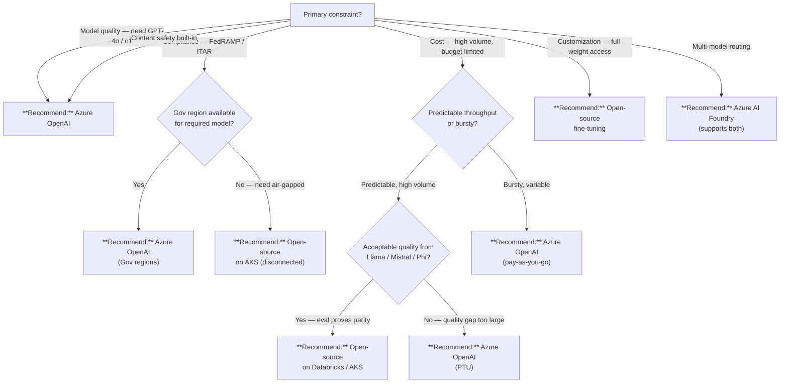

# Azure OpenAI vs Open-Source Models

## TL;DR

**Azure OpenAI** for enterprise compliance, built-in content safety, and GPT-4o / o1 quality. **Open-source models** (Llama, Mistral, Phi) for cost control at high volume, data sovereignty, or when full model customization is required. **Azure AI Foundry** when you need multi-model routing across both.

## When this question comes up

- Choosing an LLM backend for a new AI feature or copilot experience.
- Evaluating cost at scale (millions of tokens per day).
- Meeting FedRAMP High, ITAR, or IL4+ compliance requirements.
- Deciding whether to fine-tune a foundation model or bring your own weights.
- Architecting a multi-model strategy with fallback or routing.

## Decision tree

## Per-recommendation detail

### Recommend: Azure OpenAI (PTU)

**When:** Predictable, high-throughput production workloads that need GPT-4o / o1 quality with guaranteed latency.
**Why:** Provisioned throughput units (PTU) reserve dedicated capacity; no throttling; SLA-backed latency.
**Tradeoffs:** Cost -- PTU is capacity-reserved ($$$$), must right-size or waste spend; model selection limited to OpenAI family; data processed within Azure trust boundary.
**Anti-patterns:**

- Using PTU for bursty or experimental workloads -- pay-as-you-go is cheaper until utilization exceeds ~60%.
- Reserving PTU without load-testing actual token throughput first.

**Linked example:** [AI / ML Architecture](../reference-architecture/ai-ml-architecture.md)

### Recommend: Azure OpenAI (pay-as-you-go)

**When:** Variable or bursty workloads, prototyping, or moderate production traffic where PTU commitment is premature.
**Why:** No upfront commitment; scales to zero; content safety and RBAC included; fastest path to production.
**Tradeoffs:** Cost -- per-million-token pricing, can spike with volume; latency -- shared capacity, subject to throttling under load; compliance -- Commercial and Gov regions available.
**Anti-patterns:**

- Running sustained high-volume inference without evaluating PTU break-even.
- Ignoring rate limits and retry logic in production code.

**Linked example:** [Azure AI Foundry Guide](../guides/azure-ai-foundry.md)

### Recommend: Open-source on Databricks Model Serving

**When:** Team already uses Databricks; needs Llama / Mistral / custom models with MLflow lifecycle and Unity Catalog governance.
**Why:** Integrated with existing lakehouse; MLflow tracks experiments and model versions; serverless or provisioned endpoints.
**Tradeoffs:** Cost -- GPU compute ($$-$$$) plus DBU; latency -- depends on SKU and model size; compliance -- inherits Databricks Gov posture (FedRAMP High, IL4); skill -- requires ML engineering capability.
**Anti-patterns:**

- Serving a model you have not evaluated against Azure OpenAI baselines.
- Ignoring content safety -- open-source models have no built-in moderation; add Azure AI Content Safety or custom guardrails.

**Linked example:** [RAG vs Fine-tune vs Agents](../decisions/rag-vs-finetune-vs-agents.md)

### Recommend: Open-source on AKS (vLLM / TGI)

**When:** Full infrastructure control needed; air-gapped or disconnected environments; custom serving stack.
**Why:** Maximum flexibility -- any model, any quantization, any hardware (A100, H100, MI300X); works in disconnected enclaves.
**Tradeoffs:** Cost -- GPU node pools ($$$$) plus operational overhead; latency -- sub-second with proper batching; compliance -- you own the full stack (patching, logging, encryption); skill -- highest ramp (Kubernetes + GPU scheduling + model ops).
**Anti-patterns:**

- Over-provisioning GPU clusters for intermittent workloads -- use KEDA or cluster autoscaler.
- Skipping health checks and model-readiness probes on serving pods.
- Running without content safety middleware in user-facing scenarios.

**Linked example:** [AI / ML Architecture](../reference-architecture/ai-ml-architecture.md)

### Recommend: Azure AI Foundry MaaS (Llama, Mistral)

**When:** Want open-source model quality with Azure-managed infrastructure; multi-model routing or A/B testing across vendors.
**Why:** Serverless endpoints for open-source models; pay-per-token; no GPU management; integrates with Azure AI Content Safety.
**Tradeoffs:** Cost -- per-million-token pricing varies by model; latency -- shared infrastructure, similar to Azure OpenAI paygo; compliance -- limited Gov availability (check current model catalog); model selection -- subset of HuggingFace catalog.
**Anti-patterns:**

- Assuming all models are available in all regions -- check the model catalog per region.
- Using MaaS for workloads that need custom quantization or LoRA adapters (use AKS instead).

**Linked example:** [Azure AI Foundry Guide](../guides/azure-ai-foundry.md)

## Related

- Guide: [Azure AI Foundry](../guides/azure-ai-foundry.md)
- Decision: [RAG vs Fine-tune vs Agents](../decisions/rag-vs-finetune-vs-agents.md)
- Architecture: [AI / ML Architecture](../reference-architecture/ai-ml-architecture.md)
- ADR: [Azure OpenAI over Self-Hosted LLM](../adr/0007-azure-openai-over-self-hosted-llm.md)
