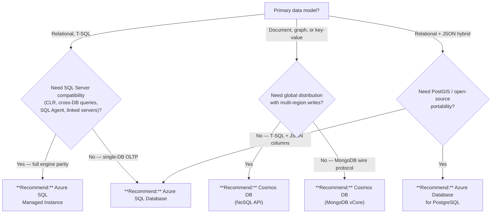

# Azure SQL vs Cosmos DB vs PostgreSQL

## TL;DR

Azure SQL for relational OLTP with T-SQL and SQL Server compatibility, Cosmos DB for globally distributed NoSQL or multi-model workloads, PostgreSQL Flexible Server for open-source compatibility and PostGIS spatial queries.

## When this question comes up

- A new workload needs a managed database and the team is choosing between relational and NoSQL.
- An existing SQL Server or PostgreSQL estate is migrating to Azure and must pick a target PaaS service.
- The application requires global distribution, document/graph models, or guaranteed single-digit-ms latency at any scale.
- The team values open-source portability or needs spatial (PostGIS) capabilities.

## Decision tree

## Per-recommendation detail

### Recommend: Azure SQL Database

**When:** Single-database relational OLTP, serverless or provisioned tiers, no need for full SQL Server engine features.
**Why:** Fully managed, auto-tuning, built-in HA with 99.995 % SLA on Business Critical; elastic pools for multi-tenant cost sharing.
**Tradeoffs:** Cost — DTU or vCore billing; Latency — sub-ms on Business Critical; Compliance — FedRAMP High, IL5 in Azure Gov; Skill — T-SQL, familiar to SQL Server teams.
**Anti-patterns:**

- Need for CLR assemblies, cross-database queries, or SQL Agent jobs — use Managed Instance.
- Document-centric or schema-less workloads — use Cosmos DB or PostgreSQL JSONB.

**Linked example:** [Azure SQL Guide](../guides/azure-sql.md)

### Recommend: Azure SQL Managed Instance

**When:** Lift-and-shift of existing SQL Server workloads requiring near-100 % engine compatibility (CLR, linked servers, Service Broker, SQL Agent).
**Why:** Same managed PaaS benefits with full SQL Server surface area; native VNet integration for hybrid connectivity.
**Tradeoffs:** Cost — higher baseline than SQL Database; Latency — comparable; Compliance — FedRAMP High, IL4/IL5; Skill — SQL Server DBA expertise maps directly.
**Anti-patterns:**

- Greenfield single-database apps with no SQL Server dependencies — SQL Database is simpler and cheaper.
- Workloads requiring global multi-region writes — use Cosmos DB.

**Linked example:** [Azure SQL Guide](../guides/azure-sql.md)

### Recommend: Cosmos DB (NoSQL API)

**When:** Globally distributed applications needing single-digit-ms reads/writes at any scale, multi-region active-active, or document/graph/key-value data models.
**Why:** Turnkey global distribution with five consistency levels; guaranteed <10 ms reads at p99; autoscale RU/s eliminates capacity planning.
**Tradeoffs:** Cost — RU-based pricing can be expensive at high throughput; Latency — single-digit ms globally; Compliance — FedRAMP High, IL5; Skill — requires partition-key design and RU cost modeling.
**Anti-patterns:**

- Complex relational joins and referential integrity — use Azure SQL or PostgreSQL.
- Small single-region apps with low throughput — Cosmos DB minimum cost is high relative to SQL/PG.

**Linked example:** [Cosmos DB Guide](../guides/cosmos-db.md) | [Cosmos DB Patterns](../patterns/cosmos-db-patterns.md)

### Recommend: Cosmos DB (MongoDB vCore)

**When:** Existing MongoDB workloads migrating to Azure, or teams with MongoDB driver and query expertise wanting a managed vCore-based cluster.
**Why:** Native MongoDB wire-protocol compatibility with familiar tooling (mongosh, Compass); vCore pricing is predictable versus RU-based billing.
**Tradeoffs:** Cost — vCore cluster pricing, no serverless option; Latency — single-region ms-level; Compliance — FedRAMP High; Skill — MongoDB expertise transfers directly.
**Anti-patterns:**

- Need for global multi-region writes with tunable consistency — use Cosmos DB NoSQL API instead.
- Workloads that are purely relational — use Azure SQL or PostgreSQL.

**Linked example:** [Cosmos DB Guide](../guides/cosmos-db.md)

### Recommend: Azure Database for PostgreSQL

**When:** Open-source portability, PostGIS spatial queries, JSONB hybrid relational+document workloads, or existing PostgreSQL estates migrating to Azure.
**Why:** Fully managed Flexible Server with built-in HA, pgvector for AI embeddings, PostGIS for geospatial, and no vendor lock-in on the wire protocol.
**Tradeoffs:** Cost — vCore-based, competitive; Latency — sub-ms on Memory Optimized tiers; Compliance — FedRAMP High, IL5 in Azure Gov; Skill — PostgreSQL DBA / pgAdmin tooling.
**Anti-patterns:**

- Teams with deep T-SQL expertise and no PostgreSQL experience on a tight deadline — use Azure SQL.
- Need for turnkey global distribution — use Cosmos DB.

**Linked example:** [PostgreSQL Migration](../migrations/oracle-to-azure/postgresql-migration.md)

## Related

- Guide: [Azure SQL](../guides/azure-sql.md)
- Guide: [Cosmos DB](../guides/cosmos-db.md)
- Pattern: [Cosmos DB Patterns](../patterns/cosmos-db-patterns.md)
- Decision: [Fabric vs. Databricks vs. Synapse](fabric-vs-databricks-vs-synapse.md)
